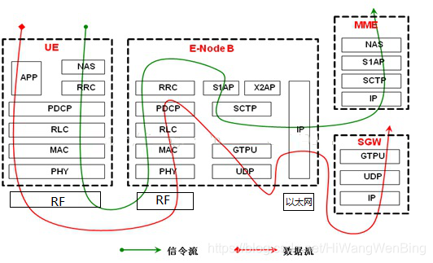
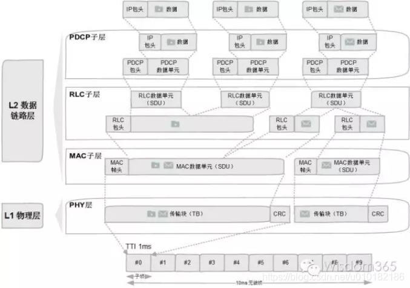

## 术语和缩写词汇表

为了帮助读者更好地理解4G技术，以下按类别整理了本文中涉及的主要术语和缩写：

### 基础通信技术术语

#### 多址技术

- **FDMA (Frequency Division Multiple Access)**：频分多址 - 不同用户使用不同频率进行通信
- **TDMA (Time Division Multiple Access)**：时分多址 - 不同用户在不同时间片内使用同一频率
- **CDMA (Code Division Multiple Access)**：码分多址 - 不同用户使用不同的扩频码
- **OFDMA (Orthogonal Frequency Division Multiple Access)**：正交频分多址 - 4G的核心多址技术
- **SC-FDMA (Single Carrier FDMA)**：单载波频分多址 - 4G上行使用的多址技术

#### 调制与编码技术

- **OFDM (Orthogonal Frequency Division Multiplexing)**：正交频分复用 - 将数据分成多个子载波传输
- **QAM (Quadrature Amplitude Modulation)**：正交振幅调制 - 同时调制信号的幅度和相位
- **QPSK (Quadrature Phase Shift Keying)**：四相移键控 - 基础数字调制方式
- **16QAM/64QAM/256QAM**：16/64/256正交振幅调制 - 不同阶数的调制方式，数字越大传输效率越高
- **Turbo码**：一种高效的信道编码技术，用于纠错

#### 天线与信号处理技术

- **MIMO (Multiple Input Multiple Output)**：多输入多输出 - 使用多根天线提高传输速率和可靠性
- **波束成形 (Beamforming)**：将信号能量集中到特定方向，提高信号强度
- **分集 (Diversity)**：利用多个独立的信号路径提高接收可靠性
- **载波聚合 (Carrier Aggregation, CA)**：将多个载波频段组合使用，提高传输带宽
- **CoMP (Coordinated Multi-Point)**：协作多点传输 - 多个基站协调工作

### 4G网络架构术语

#### 核心网（Core Network）

- **EPC (Evolved Packet Core)**：演进分组核心网 - 4G的核心网络架构
- **MME (Mobility Management Entity)**：移动管理实体 - 负责用户认证、位置管理等控制功能
- **S-GW (Serving Gateway)**：服务网关 - 用户数据转发的本地锚点
- **P-GW (PDN Gateway)**：PDN网关 - 连接外部数据网络（如互联网）的网关
- **HSS (Home Subscriber Server)**：归属签约用户服务器 - 存储用户签约信息和认证数据
- **PCRF (Policy Control and Charging Rules Function)**：策略控制和计费规则功能 - 控制QoS策略

#### 无线接入网（Radio Access Network）

- **eNodeB (evolved NodeB)**：演进基站 - 4G基站，负责无线信号的发射和接收
- **UE (User Equipment)**：用户设备 - 手机、平板等终端设备
- **小区 (Cell)**：基站覆盖的服务区域
- **宏蜂窝/微蜂窝/皮蜂窝/飞蜂窝**：不同规模的蜂窝网络，覆盖范围从大到小

### 协议栈术语

#### 无线协议层

- **PHY (Physical Layer)**：物理层 - 负责无线信号的调制、编码、发射和接收
- **MAC (Medium Access Control)**：媒体接入控制层 - 负责资源调度和多用户接入控制
- **RLC (Radio Link Control)**：无线链路控制层 - 负责数据分段、重传等
- **PDCP (Packet Data Convergence Protocol)**：分组数据汇聚协议层 - 负责数据压缩和加密
- **RRC (Radio Resource Control)**：无线资源控制 - 控制面协议，管理连接和资源

#### 核心网协议

- **NAS (Non-Access Stratum)**：非接入层 - UE和核心网之间的控制协议
- **GTP (GPRS Tunneling Protocol)**：GPRS隧道协议 - 核心网内部数据传输协议
- **S1-AP**：S1接口应用协议 - eNodeB与MME之间的控制面协议
- **X2-AP**：X2接口应用协议 - eNodeB之间的协议

### 技术特性术语

#### 传输技术

- **HARQ (Hybrid Automatic Repeat Request)**：混合自动重传请求 - 快速纠错重传机制
- **ARQ (Automatic Repeat Request)**：自动重传请求 - 基本重传机制
- **CQI (Channel Quality Indicator)**：信道质量指示 - 反馈信道状态信息
- **AMC (Adaptive Modulation and Coding)**：自适应调制编码 - 根据信道质量调整传输参数

#### 干扰管理

- **ICIC (Inter-Cell Interference Coordination)**：小区间干扰协调
- **eICIC (enhanced ICIC)**：增强型小区间干扰协调
- **功率控制 (Power Control)**：调节发射功率以优化网络性能
- **频率复用 (Frequency Reuse)**：多个小区共享频率资源的方式

#### 移动性管理

- **切换 (Handover)**：用户从一个基站转移到另一个基站的过程
- **寻呼 (Paging)**：网络寻找用户的过程
- **位置更新 (Location Update)**：用户向网络报告位置变化
- **漫游 (Roaming)**：用户在不同网络间移动使用服务

### 安全术语

#### 认证与加密

- **AKA (Authentication and Key Agreement)**：认证与密钥协商 - 4G的安全认证机制
- **USIM (Universal Subscriber Identity Module)**：通用用户识别模块 - 4G版本的SIM卡
- **EEA (EPS Encryption Algorithm)**：EPS加密算法 - 用户数据加密
- **EIA (EPS Integrity Algorithm)**：EPS完整性算法 - 数据完整性保护
- **SNOW 3G, AES, ZUC**：三种主要的加密算法标准

### 性能指标术语

#### 速率与延迟

- **峰值速率 (Peak Data Rate)**：理论最大传输速度
- **频谱效率 (Spectral Efficiency)**：单位带宽内的数据传输效率，单位：bps/Hz
- **延迟 (Latency)**：数据传输的时间延迟
- **吞吐量 (Throughput)**：实际的数据传输速度

#### 服务质量

- **QoS (Quality of Service)**：服务质量 - 保证不同业务的传输质量
- **承载 (Bearer)**：端到端的数据传输通道
- **GBR (Guaranteed Bit Rate)**：保证比特率承载
- **Non-GBR**：非保证比特率承载

### 标准化组织术语

- **3GPP (3rd Generation Partnership Project)**：第三代合作伙伴项目 - 制定移动通信标准的国际组织
- **ITU (International Telecommunication Union)**：国际电信联盟 - 联合国的通信标准化机构
- **Release 8/9/10...**：3GPP标准的版本号，数字越大版本越新
- **TS (Technical Specification)**：技术规范 - 3GPP标准文档的类型
- **TR (Technical Report)**：技术报告 - 3GPP的技术研究文档

### 网络管理术语

- **OAM (Operations, Administration and Maintenance)**：运行、管理和维护
- **SON (Self-Organizing Network)**：自组织网络 - 网络自动配置和优化
- **KPI (Key Performance Indicator)**：关键性能指标
- **BSR (Buffer Status Report)**：缓冲区状态报告 - UE向eNodeB报告数据缓冲情况

---

## 移动通信发展历程：从1G到4G

### 1G时代（1980年代）

**背景与特点：**

- **技术基础**：模拟通信技术，主要使用FDMA（频分多址）
- **出现背景**：满足人们移动通话的基本需求
- **代表技术**：AMPS（Advanced Mobile Phone System）
- **主要特点**：
  - 仅支持语音通话
  - 通话质量差，易受干扰
  - 保密性差，容易被窃听
  - 手机体积大，电池续航短

### 2G时代（1990年代）

**背景与特点：**

- **技术基础**：数字通信技术，采用TDMA/CDMA多址方式
- **出现背景**：提高通话质量，增加数据传输能力
- **代表技术**：GSM、CDMA、D-AMPS
- **主要改进**：
  - 数字化信号，通话质量大幅提升
  - 支持短信（SMS）服务
  - 增强了保密性和安全性
  - 手机小型化，电池寿命延长
  - 引入了SIM卡概念

GSM、GPRS 和 EDGE，它们是 2G 网络发展的三个阶段。

### 3G时代（2000年代）

**背景与特点：**

- **技术基础**：宽带CDMA技术，支持分组交换
- **出现背景**：互联网普及，需要移动数据服务
- **代表技术**：WCDMA、CDMA2000、TD-SCDMA
- **主要特点**：
  - 数据传输速率大幅提升（2Mbps理论峰值）
  - 支持视频通话
  - 移动互联网应用兴起
  - 多媒体消息服务（MMS）
  - 全球漫游能力增强

### 4G时代（2010年代至今）

**背景与特点：**

- **技术基础**：全IP网络，OFDMA/SC-FDMA多址技术
- **出现背景**：智能手机普及，移动互联网爆发式增长
- **代表技术**：LTE、LTE-Advanced
- **革命性改进**：
  - 全IP网络架构
  - 超高速数据传输（理论峰值1Gbps）
  - 低延迟（<10ms）
  - 高频谱效率
  - 全面的多媒体支持

---

## 4G技术发展与优化过程

### 4G标准演进路径

#### LTE Release 8（2008年）

- **基础4G标准**：建立了4G的基本框架
- **关键特性**：
  - 下行峰值速率：100Mbps
  - 上行峰值速率：50Mbps
  - 延迟：<100ms
  - 频谱效率比3G提升2-4倍

#### LTE Release 9（2009年）

- **改进内容**：
  - 引入eMBMS（增强型多媒体广播组播服务）
  - 支持HeNB（家庭基站）
  - 定位服务增强

#### LTE Release 10（2011年）- LTE-Advanced

- **真正4G标准**：满足ITU对4G的全部要求
- **关键技术**：
  - 载波聚合（Carrier Aggregation）
  - 增强型MIMO（最多8×8天线配置）
  - 中继技术（Relay）
  - 异构网络（HetNet）支持

#### LTE Release 11-12（2012-2014年）

- **进一步优化**：
  - CoMP（协作多点传输）
  - eICIC（增强型小区间干扰协调）
  - 更多载波聚合组合
  - VoLTE优化

#### LTE Release 13-15（2015-2018年）

- **向5G演进**：
  - NB-IoT（窄带物联网）支持
  - eMTC（增强型机器类通信）
  - LAA（免许可频谱载波聚合）
  - 超高清视频优化

---

## 4G核心技术详细分析

### OFDM/OFDMA技术

**原理与作用：**

- **OFDM**：正交频分复用，将高速数据流分成多个低速子流
- **OFDMA**：正交频分多址，在OFDM基础上实现多用户接入
- **技术优势**：
  - 抗多径衰落能力强
  - 频谱效率高
  - 适合高速数据传输
  - 支持灵活的资源分配

### MIMO技术

**多输入多输出技术：**

- **空间分集**：提高信号接收可靠性
- **空间复用**：在同一频率同时传输多个数据流
- **波束成形**：将信号能量集中到特定方向
- **在4G中的应用**：
  - 2×2 MIMO：基本配置
  - 4×4 MIMO：高级配置
  - 8×8 MIMO：LTE-A中的最高配置

### 载波聚合（CA）

**技术原理：**

- 将多个载波组合使用，扩大传输带宽
- **聚合类型**：
  - 连续载波聚合
  - 非连续载波聚合
  - 跨频段载波聚合
- **增益效果**：
  - 成倍提升数据传输速率
  - 更好的频谱资源利用

### 先进调制技术

**高阶调制：**

- **QPSK**：基础调制方式，2比特/符号
- **16QAM**：中等调制，4比特/符号
- **64QAM**：高阶调制，6比特/符号
- **256QAM**：超高阶调制，8比特/符号（LTE-A Pro）

---

## 4G数据流向与通信过程分析

### 下行数据传输流程

``` txt
核心网 → eNodeB → 无线信道 → UE
│
├── IP数据包处理
├── PDCP层：加密、压缩
├── RLC层：分段、ARQ
├── MAC层：调度、HARQ
├── PHY层：编码、调制、MIMO处理
└── 天线：波束成形发射
```

### 上行数据传输流程

``` txt
UE → 无线信道 → eNodeB → 核心网
│
├── 功率控制和时序调整
├── SC-FDMA调制
├── MIMO/分集发射
├── MAC层调度请求
├── RLC层重传控制
├── PDCP层处理
└── 核心网路由
```

### 各层技术作用分析

#### 物理层（PHY）

- **OFDMA/SC-FDMA**：多址接入和调制
- **MIMO**：空间分集和复用
- **信道编码**：Turbo码提供纠错能力
- **自适应调制编码**：根据信道质量调整传输参数

#### MAC层

- **调度算法**：资源分配优化
- **HARQ**：快速重传机制
- **载波聚合控制**：多载波协调
- **功率控制**：干扰管理

#### RLC层

- **分段重组**：适应不同传输块大小
- **ARQ**：可靠传输保证
- **流控**：防止缓冲区溢出

#### PDCP层

- **头压缩**：提高传输效率
- **加密**：用户数据保护
- **重排序**：保证数据顺序

---

## 4G关键性能指标

### 速率指标

| 指标类型 | LTE | LTE-Advanced |
|---------|-----|--------------|
| 下行峰值速率 | 100Mbps | 1Gbps |
| 上行峰值速率 | 50Mbps | 500Mbps |
| 下行频谱效率 | 5bps/Hz | 15bps/Hz |
| 上行频谱效率 | 2.5bps/Hz | 6.75bps/Hz |

### 延迟指标

- **控制面延迟**：<100ms（空闲到激活）
- **用户面延迟**：<10ms（单向传输）
- **切换中断时间**：<27.5ms（域内）、<40ms（域间）

### 覆盖与移动性

- **小区边缘频谱效率**：下行0.06bps/Hz，上行0.03bps/Hz
- **最大移动速度**：350km/h（高速场景）
- **小区半径**：30km（低移动性场景）

### 容量指标

- **活跃用户数**：200用户/小区（5MHz带宽）
- **同时激活用户**：400用户/小区

---

## 4G安全机制与抗干扰技术

### 认证与密钥管理

**AKA认证机制：**

``` txt
UE ←→ MME ←→ HSS
│
├── 相互认证
├── 密钥分发
├── 完整性保护
└── 加密密钥生成
```

**密钥层次结构：**

- **K**：长期密钥（存储在USIM和HSS中）
- **KASME**：接入安全管理实体密钥
- **KeNB**：基站密钥
- **KUP**：用户面加密密钥
- **KInt**：完整性保护密钥

### 加密与完整性保护

**加密算法：**

- **EEA1（SNOW 3G）**：3GPP标准加密算法
- **EEA2（AES）**：高级加密标准
- **EEA3（ZUC）**：中国祖冲之算法

**完整性保护：**

- **EIA1（SNOW 3G）**：完整性算法
- **EIA2（AES）**：基于AES的完整性保护
- **EIA3（ZUC）**：基于祖冲之的完整性保护

### 抗干扰机制

**频域抗干扰：**

- **频率分集**：OFDM子载波分集
- **频率选择性调度**：避开干扰频点
- **载波聚合**：分散干扰影响

**空域抗干扰：**

- **MIMO技术**：空间分集和复用
- **波束成形**：方向性增益
- **干扰对齐**：多小区协作

**时域抗干扰：**

- **HARQ**：快速重传
- **自适应调制编码**：根据干扰调整参数
- **功率控制**：减少同频干扰

**小区间干扰协调（ICIC）：**

- **静态ICIC**：频率规划
- **半静态ICIC**：功率控制
- **动态ICIC**：实时调度协调

---

## 4G相关协议与标准

### 3GPP标准体系

**核心标准文档：**

- **TS 36.300**：总体架构和协议
- **TS 36.400系列**：RRC协议
- **TS 36.300系列**：MAC/RLC/PDCP协议
- **TS 36.200系列**：物理层协议

### 接口协议标准

**空中接口（Uu）：**

- **物理层**：36.200系列
- **MAC层**：36.321
- **RLC层**：36.322
- **PDCP层**：36.323
- **RRC层**：36.331

**核心网接口：**

- **S1-AP**：eNB与MME之间（控制面）
- **GTP-U**：eNB与S-GW之间（用户面）
- **X2-AP**：eNB之间的接口
- **Diameter**：核心网元素间认证授权

### 网络管理标准

- **OAM**：运行、管理、维护
- **SON**：自组织网络
- **TR 36.902**：自配置和自优化

### GTPU

GTP-U 的核心任务只有一个：高效地传输用户数据。这里的“用户数据”就是您的“货物”，比如您刷视频的图像、微信消息的内容、网页的文字等。

- 全称：GPRS Tunnelling Protocol - User Plane (GPRS隧道协议 - 用户面)
- 作用：在 基站(eNodeB) -> SGW -> PGW 这条路径上，为每个用户的每一条数据流（承载）建立一个专属的“隧道”。
- 工作原理：
  - 它像一个“打包工人”，拿到您手机发来的原始IP数据包。
  - 然后，它把这个数据包原封不动地装进一个更大的“GTP-U集装箱”里。
  - 每个集装箱上都贴着一个唯一的“隧道ID (TEID)”，确保网络设备知道这个货物是谁的，要送到哪里去。
  - 最后，这个“集装箱”通过标准的UDP/IP协议在核心网内部的设备之间快速运输。

GTP-U是4G网络用户面的“物流系统”，它不关心货物是什么，只负责把货物从A点快速、准确地运到B点。

### SCTP

SCTP 不负责运输普通的用户数据，它运输的是比数据更重要的“信令”，也就是网络设备之间下达的各种“指令”。

- 全称：Stream Control Transmission Protocol (流控制传输协议)
- 作用：一种比TCP更先进、更可靠的传输协议，专门用于承载控制面的信令。
- eNodeB ↔ MME 之间承载 S1AP 信令（如建立连接、切换请求等）。
- eNodeB ↔ eNodeB 之间承载 X2AP 信令（基站间的快速切换协调）。

为什么不用更常见的TCP？

因为SCTP为信令传输提供了两个“杀手锏”功能：

- 多流传输 (Multi-streaming)：
  - 问题：想象一下TCP是一条单车道公路。如果前面有一辆慢车（一个消息处理慢了），后面的所有快车（其他消息）都会被堵住，这就是“队头阻塞”。
  - SCTP的解决办法：SCTP相当于一条多车道高速公路。一个连接里可以包含多个独立的“流”（车道）。一个车道堵了，其他车道的车（其他用户的信令）完全不受影响，可以继续跑。这对于需要同时处理成百上千用户信令的基站和MME来说至关重要。
- 多宿主 (Multi-homing)：
  - 问题：TCP连接建立在一个IP地址对上，如果其中一条物理链路断了，连接就中断了。
  - SCTP的解决办法：SCTP可以在两个网络设备之间同时建立两条或多条物理路径（使用不同的IP地址）。如果主路断了，SCTP会自动、无缝地切换到备用路线上，保证信令传输的极高可靠性，就像给指令运输加了双保险。

SCTP是4G网络控制面的“装甲运输系统”，它不求运量最大，但求指令的传输绝对可靠、不拥塞、不中断。

---

## 4G通信建立过程

当4G手机开机或从没有信号的区域进入有信号的区域时，它会与移动网络进行一系列复杂的“握手”操作，以建立连接并允许上网和通话。这个过程被称为“附着（Attach）”过程，涉及到手机（UE - User Equipment）、基站（eNodeB）、以及4G核心网（EPC - Evolved Packet Core）中的多个关键网元。

整个连接过程可以概括为以下几个主要阶段：

### 1. 射频同步与小区搜索：找到“组织”

首先，手机需要“收听”周围的无线电环境，寻找合适的基站进行连接。

- **开机扫描**：手机会扫描预设的4G频段，寻找来自基站的同步信号，即主同步信号（PSS）和辅同步信号（SSS）。
- **同步与信息获取**：通过解码这些信号，手机可以与基站的时钟和帧结构保持同步。接着，手机会读取基站广播的系统信息块（SIB），其中包含了该小区的关键信息，例如网络运营商信息（PLMN ID）、跟踪区标识（TAI）等。这好比手机在寻找“归属地”和“街道地址”。

### 2. 无线资源控制（RRC）连接建立：敲开“大门”

一旦手机选定了合适的小区，它需要与基站建立一个基本的信令连接，即RRC连接。这是一个三方握手的过程：

- **RRC连接请求 (RRC Connection Request)**：手机向基站发送一个请求，表明自己希望建立连接。这个请求中包含了手机的临时身份标识（如S-TMSI，如果之前连接过该网络）以及建立连接的原因（例如，“我要上网”）。
- **RRC连接建立 (RRC Connection Setup)**：基站收到请求后，如果允许接入，会回复一个建立消息，为手机分配一些基本的无线资源。
- **RRC连接建立完成 (RRC Connection Setup Complete)**：手机确认收到并应用了配置，向基站发送完成消息。至此，手机和基站之间的“专属通道”初步建立，为后续更高级的信令交互做好了准备。

### 3. 初始附着（Initial Attach）过程：验证身份与注册

这是整个连接过程中最核心和复杂的部分，涉及到与4G核心网的多个网元进行交互。

#### a. 附着请求 (Attach Request)

RRC连接建立后，手机会通过这个“专属通道”向**移动性管理实体（MME）** 发送一个“附着请求”的NAS（非接入层）消息。MME是4G核心网的“大脑”，负责用户的移动性和会话管理。该请求包含了：

- **用户身份**：通常是**IMSI**（国际移动用户识别码），这是存储在SIM卡中的唯一身份标识。为了安全起见，如果手机之前已经成功附着过，MME会分配一个临时的身份标识**GUTI**（全局唯一临时身份标识），后续的通信将优先使用GUTI，避免在空中频繁传输IMSI。
- **网络能力**：手机会告知网络其支持的功能，例如支持的加密算法等。

#### b. 身份验证与安全加密 (Authentication and Security)

网络必须确认用户的合法性，以防止未经授权的访问。这个过程被称为**认证和密钥协商（AKA）**：

1. **获取认证向量**：MME收到附着请求后，会向**归属签约用户服务器（HSS）** 发送请求，获取该用户的认证信息。HSS是存储用户签约数据和位置信息的中央数据库。
2. **挑战与响应**：HSS生成一组认证向量（包括一个随机数RAND和一个期望的认证令牌AUTN）并发送给MME。MME将RAND和AUTN发送给手机。
3. **双向验证**：
    - **手机验证网络**：手机的SIM卡利用预存的密钥和收到的RAND计算出一个AUTN，并与MME发来的AUTN进行比对。如果一致，则证明网络是合法的，而不是伪基站。
    - **网络验证手机**：手机使用RAND和密钥计算出一个响应值（RES），并将其发送给MME。MME将收到的RES与HSS提供的期望响应值（XRES）进行比对。如果一致，则手机身份验证通过。
4. **生成安全密钥**：认证成功后，手机和MME会各自生成一套用于后续通信加密和完整性保护的密钥，确保通话和上网数据的安全。

#### c. 位置更新 (Location Update)

认证通过后，MME会在HSS中更新该用户的位置信息，表明该用户现在由自己负责管理。这样，当有电话或数据要发给这个手机时，网络就知道应该通过哪个MME来找到它。

#### d. 建立默认承载 (Default Bearer Setup)

为了让手机能够真正地上网，需要在手机和外部数据网络（如互联网）之间建立一个“数据管道”，这个管道被称为**EPS承载（Bearer）**。初始附着时建立的是一个**默认承载**。

1. **创建会话请求**：MME向**服务网关（S-GW）** 和**分组数据网络网关（P-GW）** 发送“创建会话请求”。
    - **S-GW (Serving Gateway)**：负责用户数据的路由和转发，是用户在4G网络中的移动性锚点。
    - **P-GW (Packet Data Network Gateway)**：是4G网络与外部数据网络（如互联网、企业专网）的“大门”，负责IP地址的分配和数据包的过滤。
2. **IP地址分配**：P-GW会为手机分配一个IP地址。
3. **建立数据通道**：S-GW和P-GW之间，以及eNodeB和S-GW之间会建立起承载资源，形成一条从手机到互联网的完整数据传输路径。
4. **附着接受 (Attach Accept)**：当默认承载建立成功后，MME会向手机发送“附着接受”消息，该消息中包含了分配给手机的IP地址和GUTI。

### 4. 附着完成 (Attach Complete)

手机收到“附着接受”消息后，会向MME回复一个“附着完成”消息，确认整个过程成功。

## X2切换

G LTE网络中一种**非常快速和高效**的切换方式。它的核心特点是**两个基站（eNodeB）之间可以直接通过X2接口进行通信和协调**，从而最大程度地减少了核心网（EPC）的介入，大大降低了切换时延和数据中断时间。

要实现高效的X2切换，需要满足以下关键条件：

1. **存在X2接口**：源基站（Source eNodeB）和目标基站（Target eNodeB）之间必须已经建立了物理的X2连接和信令关系。
2. **核心网不变**：通常情况下，这两个基站连接到的是同一个**MME**（移动性管理实体）和**S-GW**（服务网关）。如果MME或S-GW需要改变，就无法使用X2切换，而需要走更复杂的S1切换流程。

### X2切换的详细流程

整个X2切换过程可以分为三个主要阶段：**准备阶段、执行阶段和完成阶段**。下面我们以一个用户从“源基站A”移动到“目标基站B”为例，详细分解这个流程。

### 第一阶段：切换准备 (Handover Preparation)

这个阶段的目标是，在手机还未离开源基站A时，目标基站B就已经为手机的到来做好了万全的准备。

1. **测量与报告 (Measurement & Reporting)**
    - **源基站A指示**：当您的手机连接在基站A时，基站A会通过`RRC Connection Reconfiguration`消息，指示手机去测量周围邻近小区的信号强度，包括目标基站B的信号。测量的关键指标是**RSRP**（参考信号接收功率）和**RSRQ**（参考信号接收质量）。
    - **手机测量**：您的手机会遵从指示，持续测量并评估周围小区的信号。
    - **触发事件**：当手机发现“目标基站B的信号强度，已经显著优于当前基站A的信号”（例如，满足了网络预设的A3事件），手机就会向源基站A发送一条**`Measurement Report`（测量报告）**消息。

2. **切换决策 (Handover Decision)**
    - 源基站A收到测量报告后，根据其内部的切换算法，判断出此时确实需要将手机切换到基站B。于是，**切换决策做出**。

3. **切换请求 (Handover Request)**
    - 源基站A通过X2接口，向目标基站B发送一条**`X2AP: HANDOVER REQUEST`**消息。
    - 此消息包含了切换所需的“学生档案”，即**UE上下文（UE Context）**，其中包括：
        - UE的安全信息（密钥）。
        - UE的无线能力。
        - 需要为该UE建立的承载（数据通道）列表及其QoS要求。

4. **资源预留 (Admission Control & Resource Allocation)**
    - 目标基站B收到请求后，会进行**“接纳控制”**。它会检查自己是否有足够的无线资源（如带宽、处理能力等）来接纳这个新来的手机。
    - 如果资源充足，基站B会为手机预留好所有必要的资源，并生成一个切换指令。

5. **切换请求确认 (Handover Request Acknowledge)**
    - 目标基站B通过X2接口，向源基站A回复一条**`X2AP: HANDOVER REQUEST ACKNOWLEDGE`**消息。
    - 这条消息里包含了打包好的**`RRC Connection Reconfiguration`**消息，也就是准备发给手机的**“切换命令”**。

---

### 第二阶段：切换执行 (Handover Execution)

这是切换动作发生的瞬间，核心是让手机“脱离”旧基站，“接入”新基站。

1. **下发切换命令 (Handover Command)**
    - 源基站A收到确认后，立即向手机下发这个包含了**切换命令**的`RRC Connection Reconfiguration`消息。
    - 这个命令告诉手机：“立即切换到目标基站B”，并提供了接入目标基站B所需的所有物理层信息（如小区ID、频率、随机接入前导码等）。

2. **数据转发启动 (Data Forwarding)**
    - 在下发切换命令的同时，为了最大程度减少数据丢失，源基站A会把刚刚收到、但还没来得及发给手机的下行数据，通过X2接口的**数据转发通道**，直接转发给目标基站B。目标基站B会先把这些数据缓存起来。

3. **手机脱离与同步 (Detach & Synchronization)**
    - 手机收到切换命令后，会立即**断开与源基站A的连接**。
    - 然后，它会快速与目标基站B进行**下行同步**，并使用切换命令中指定的**无竞争随机接入**前导码，与基站B发起随机接入，告诉B“我来了”。这个过程非常快，因为无需竞争。

---

### 第三阶段：切换完成 (Handover Completion)

这个阶段是进行网络的路径更新和旧资源的释放，确保数据通路被平滑地切换到新的基站。

1. **切换确认 (Handover Confirm)**
    - 当手机成功接入目标基站B后，会向基站B发送一条**`RRC Connection Reconfiguration Complete`**消息，表示“我已成功切换到你这里”。

2. **路径切换 (Path Switch)**
    - **核心步骤**：此时，虽然手机已经连上了基站B，但核心网还不知道，它依然把数据发往源基站A。
    - 目标基站B会向**MME**发送一条**`S1AP: PATH SWITCH REQUEST`**消息，通知MME：“我已成为这个手机新的服务基站，请更新数据路径”。
    - MME收到后，会通知**S-GW**更新用户平面的数据通道，将下行数据的终点从源基站A**切换到目标基站B**。
    - S-GW完成切换后，会向MME回复确认，MME再向目标基站B回复**`S1AP: PATH SWITCH REQUEST ACKNOWLEDGE`**。自此，下行数据通路被正式“扳道”到了基站B。

3. **释放旧资源 (UE Context Release)**
    - 路径切换成功后，目标基站B会通过X2接口，向源基站A发送一条**`X2AP: UE CONTEXT RELEASE`**消息。
    - 这相当于告诉源基站A：“交接手续全部办完，你可以把这名学生（UE）的档案删除了”。源基站A收到后，会释放之前为该手机占用的所有无线资源。

至此，一次平滑、快速的X2切换宣告完成。整个过程中，由于数据转发机制的存在，用户几乎感受不到任何业务中断，通话和数据传输得以连续进行。

## 断开过程

断开可以分为三种主要类型：

1. **从“连接态”转换到“空闲态”**：这是最常见的一种“断开”，并非真正的离线，而是为了省电和节省网络资源。
2. **彻底分离网络（Detach）**：这是用户主动发起的完全离网，例如关机或开启飞行模式。
3. **意外断开（掉线）**：由于信号丢失或无线环境恶化导致的非正常断开。

下面我们详细讲解这几种情况。

---

### 1. 从连接态到空闲态 (RRC Connection Release) - 最常见的“断开”

您在使用手机时，不可能每时每刻都在传输数据。当您停止刷视频、浏览网页后，手机没有必要一直保持着大功率的“火力全开”状态。为了节省手机电量和网络资源，网络会主动将手机从**RRC连接态（RRC-Connected）** 转换到**RRC空闲态（RRC-Idle）**。

这不算是真正的“下线”，更像是一种“挂起”或“待机”。

**触发条件**：

- **用户数据静默**：网络侧（基站eNodeB）会启动一个**“非活动计时器”（Inactivity Timer）**。如果您在一段时间内（例如10秒，此时间由运营商配置）没有任何上行或下行数据传输，该计时器就会超时。

**详细流程**：

1. **释放决策 (Release Decision)**
    - 基站的非活动计时器超时后，它会决定释放与该手机的RRC连接。

2. **下发释放命令 (RRC Connection Release)**
    - 基站向手机发送一条`RRC Connection Release`消息。这是一个明确的指令，通知手机：“你可以暂时去休息了”。
    - 此消息中可能会包含一些“临别赠言”，比如重定向信息，告诉手机可以去哪个频率待机等。

3. **手机进入空闲态 (UE enters RRC-Idle)**
    - 手机收到该命令后，会立即释放与基站之间的无线资源，关闭其主要的发射和接收电路，进入低功耗的空闲模式。

4. **网络侧资源释放 (Network Resource Release)**
    - 基站会释放之前为该手机分配的所有无线资源（如物理信道）。
    - 同时，基站会通知核心网的**MME**，释放该用户在基站与核心网之间的**S1连接**。

**空闲态的特点**：

- **省电**：手机功耗极低。
- **网络仍知晓你的位置**：手机虽然“挂起”，但它仍然在网络中注册。MME知道它在哪个**跟踪区（Tracking Area）**。手机会周期性地短暂唤醒，监听是否有给它的寻呼（Paging）消息（例如有微信消息或电话呼入），以及是否需要进行位置更新（如果移动到了新的跟踪区）。
- **可快速恢复**：当有新数据要来时（例如收到微信），网络会通过寻呼找到手机，手机可以立即通过我们之前讲的“随机接入”过程，快速恢复到RRC连接态，这个过程比完整的“附着”要快得多。

---

### 2. 彻底分离网络 (Detach) - 真正的“下线”

当您关机、拔出SIM卡或开启飞行模式时，手机会执行一个彻底的“分离”流程，相当于从网络中“注销”自己的账户。

**触发条件**：

- 用户主动关机或开启飞行模式。
- 网络侧因管理需要（例如账户欠费）强制用户离网。

**详细流程（以用户关机为例）**：

1. **分离请求 (Detach Request)**
    - 在手机的操作系统准备关机程序时，它会控制基带芯片向**MME**发送一条`Detach Request`（分离请求）的NAS消息。
    - 消息中会注明分离的原因，例如“Power Off”（关机）。

2. **删除承载与释放IP (Bearer Deletion & IP Release)**
    - MME收到请求后，开始拆除为该手机建立的整个数据通路。
    - MME向**S-GW**和**P-GW**发送`Delete Session Request`（删除会话请求）消息。
    - **P-GW**会释放之前分配给该手机的**IP地址**，并断开与互联网的连接。
    - **S-GW**会删除与该手机相关的所有承载信息。

3. **删除用户上下文 (UE Context Deletion)**
    - 在核心网侧，MME会删除该手机的全部上下文信息（如安全密钥、位置信息等），并通知**HSS**（归属签约用户服务器）将该用户的状态更新为“已分离”（Deregistered）。
    - 在手机侧，手机也会删除其持有的网络上下文信息（如GUTI、安全密钥等）。

4. **分离接受 (Detach Accept)**
    - MME可以向手机回复一条`Detach Accept`消息，确认分离过程完成。之后，手机就可以安心地完成关机了。

完成这套流程后，手机在网络中就不再存在了。网络不会再追踪它的位置，也无法向它发送任何数据或电话，直到下一次开机重新进行完整的“附着”流程。

---

### 3. 意外断开 (掉线)

这种情况并非正常的流程，而是由于无线环境恶化导致的连接丢失。

**触发条件**：

- **移出覆盖区**：开车进入隧道或地下车库，信号完全消失。
- **无线链路失败 (RLF)**：信号质量瞬时变得极差（例如受到强烈干扰），导致手机与基站之间的通信连续出错，无法恢复。

**处理机制**：

- 当手机检测到无线链路严重恶化时，它会首先尝试**“RRC连接重建”（RRC Connection Re-establishment）**，试图在当前小区或邻近小区上快速恢复连接。
- 如果多次尝试重建失败，手机会放弃努力，**主动进入RRC空闲态**。
- 在网络侧，由于长时间收不到手机的任何信号，相关的监视计时器会超时，网络最终也会判定连接丢失，并被动地清除为该手机保留的所有资源，过程类似于一次隐式的分离。

## 随机接入

**随机接入，就是手机获得基站注意力的这个过程。它解决了“从0到1”的通信问题：即一个处于“静默”状态的手机，如何安全、高效地发送它的第一个上行信号。**

### 为什么叫“随机”？

在一个基站覆盖的区域内（一个小区），可能有成百上千部手机。基站并不知道下一秒哪部手机会突然需要发送数据（比如您突然要拨打电话或点开一个App）。

- **资源是共享的**：基站会广播一些“公共通道”（称为PRACH，物理随机接入信道），专门用于手机进行初次联系。
- **选择是随机的**：当您的手机需要联系基站时，它会从这些公共通道中**随机选择一个**来发送一个特殊的“打招呼”信号。
- **存在碰撞可能**：因为选择是随机的，所以有可能在同一时刻，两部或多部手机恰好选择了同一个公共通道发送信号，这就发生了“碰撞”。

所以，“随机”这个词是从基站的视角来看的，它不知道谁会在什么时候、使用哪个资源来“敲门”。整个过程的核心就是要设计一套机制，既能让手机成功“敲门”，又能解决可能发生的“碰撞”问题。

### 随机接入发生在什么时候？

随机接入是发起任何上行通信的“前置程序”，主要发生在以下几种情况：

1. **初始接入**：这是最常见的情况。当您开机、从飞行模式恢复、或从无信号区进入有信号区，手机需要建立RRC连接时，第一步就是随机接入。
2. **上行数据到达**：当您的手机处于连接状态但暂时没有上行数据传输（处于“上行失步”状态）时，如果您突然要发一条微信，手机需要通过随机接入来重新获得上行同步和发送资源。
3. **切换（Handover）**：当您从一个基站的覆盖范围移动到另一个基站时，手机需要快速与新的基站建立联系，这个过程也由随机接入发起。
4. **无线链路失败后重建**：通话或上网时突然掉线，手机会尝试通过随机接入来快速恢复连接。

### 随机接入的“四步握手”过程

随机接入过程非常经典，通常是一个严谨的四步流程，以确保通信能够成功建立：

#### **第1步：Msg1 (前导码发送) - “我在这儿！”**

- **动作**：手机从基站广播的可用“前导码”（Preamble）集合中，随机挑选一个，然后通过公共的PRACH信道发送给基站。
- **目的**：这个前导码本身不包含复杂信息，它就像一个短促而独特的敲门声。基站只要听到这个声音，就知道“有人需要联系我”。

#### **第2步：Msg2 (随机接入响应) - “我听到你了，请讲！”**

- **动作**：基站检测到前导码后，会立即在下行共享信道上回复一个“随机接入响应”（Random Access Response, RAR）消息。
- **目的**：这个响应消息至关重要，它包含了：
  - **临时身份（TC-RNTI）**：给这次“对话”一个临时ID。
  - **上行授权（Uplink Grant）**：给手机分配一小块专用的上行资源，授权它可以发送更具体的信息。
  - **时间提前量（Timing Advance）**：一个校准命令，让手机调整自己的发送时间，确保后续信号能和基站的接收节奏完美同步。

#### **第3步：Msg3 (第一个正式消息) - “我是XXX，我想……”**

- **动作**：手机收到Msg2后，就使用其中指定的专用资源，发送它的第一个真正有意义的消息。这个消息通常就是我们之前提到的**“RRC连接请求”（RRC Connection Request）**。
- **目的**：在这个消息里，手机会报上自己的“大名”（比如临时的S-TMSI或一个随机数），并说明来意（比如“我要建立信令连接”）。

#### **第4步：Msg4 (竞争解决) - “确认是你，XXX！”**

- **动作**：基站收到Msg3后，发送一个“竞争解决”消息。
- **目的**：这一步是为了解决“碰撞”问题。如果在第1步中有两部手机选了相同的前导码，它们会收到相同的Msg2，并都发送了Msg3。基站通过Msg4，明确地回复它收到的其中一个手机的身份ID。
  - 看到自己ID的手机，就知道自己“竞争”成功，随机接入过程顺利完成。
  - 没看到自己ID的另一部手机，就知道发生了碰撞且自己失败了，它会放弃这次通信，稍等片刻后从第1步重新开始。

**随机接入是手机从“默默无闻”到获得基站“发言权”的全部过程。它是后续所有上行通信的基石，确保了在庞大而无序的移动网络中，每一次通信的开始都是井然有序的。**

## 时序参数说明

**TTI（传输时间间隔）**：1ms

- 这是4G系统的基本时间单位
- 每个TTI内可以传输一个数据包

**HARQ往返时间**：8ms

- 发送数据到收到反馈的总时间
- 包括处理时间和传输时延

**调度周期**：1ms

- 基站每1ms进行一次资源调度决策
- 确保资源分配的实时性和公平性

## 信令流和数据流



## 4G网络架构与拓扑结构

### 整体网络架构

``` txt
    ┌─────────────┐
    │   互联网     │
    └──────┬──────┘
           │
    ┌──────▼──────┐      ┌─────────────┐
    │    P-GW     │◄────►│    PCRF     │
    └──────┬──────┘      └─────────────┘
           │
    ┌──────▼──────┐
    │    S-GW     │
    └──────┬──────┘
           │
    ┌──────▼──────┐      ┌─────────────┐
    │    MME      │◄────►│    HSS      │
    └──────┬──────┘      └─────────────┘
           │
    ┌──────▼──────┐
    │   eNodeB    │
    └──────┬──────┘
           │
        ┌──▼──┐
        │ UE  │
        └─────┘
```

### 核心网元功能详解

#### MME（移动管理实体）

**主要功能：**

- **移动性管理**：位置更新、寻呼、切换控制
- **会话管理**：承载建立、修改、删除
- **用户认证**：AKA认证、安全密钥管理
- **网络接入控制**：接入限制、负载控制

#### S-GW（服务网关）

**主要功能：**

- **用户面锚点**：eNB间切换时的本地锚点
- **数据路由**：在基站之间的数据路由
- **移动性支持**：跨MME切换时的锚点
- **计费数据收集**：用户面统计信息

#### P-GW（PDN网关）

**主要功能：**

- **外部网络连接**：与PDN（互联网）的连接点
- **IP地址分配**：为用户分配IP地址
- **策略执行**：QoS控制、计费规则执行
- **合法监听**：支持监管要求
- **数据转发**：将数据包转发到外部网络

#### HSS（归属签约用户服务器）

**主要功能：**

- **用户数据存储**：签约信息、认证参数
- **认证中心功能**：生成认证向量
- **位置信息管理**：用户当前MME信息
- **服务授权**：用户允许的服务类型

### 无线接入网架构

#### eNodeB功能架构

``` txt
┌─────────────────────────────┐
│          eNodeB             │
├─────────────────────────────┤
│     RRC连接管理             │
├─────────────────────────────┤
│   无线承载控制                │
├─────────────────────────────┤
│   无线准入控制                │
├─────────────────────────────┤
│   移动性管理                  │
├─────────────────────────────┤
│   动态资源分配                │
├─────────────────────────────┤
│ 调度和干扰管理                │
└─────────────────────────────┘
```

#### 小区结构与覆盖

**宏蜂窝网络：**

- **小区半径**：1-30km
- **发射功率**：20-46dBm
- **天线高度**：15-50m
- **覆盖类型**：广域覆盖

**小蜂窝网络：**

- **微蜂窝**：半径200m-2km
- **皮蜂窝**：半径50m-200m  
- **飞蜂窝**：半径10m-50m
- **应用场景**：热点覆盖、容量补充

### 协议栈架构

**控制面协议栈：**

``` txt
NAS    │    NAS
────────────────────
RRC    │    RRC
────────────────────
PDCP   │   PDCP
────────────────────
RLC    │    RLC
────────────────────
MAC    │    MAC
────────────────────
PHY    │    PHY
────────────────────
 UE    │   eNB
```

**用户面协议栈：**

``` txt
APP    │           │    APP
────────────────────────────
IP     │           │    IP
────────────────────────────
PDCP   │   PDCP    │   GTP-U
────────────────────────────
RLC    │    RLC    │   UDP
────────────────────────────
MAC    │    MAC    │   IP
────────────────────────────
PHY    │    PHY    │   L2/L1
────────────────────────────
 UE    │   eNB     │   S-GW
```

---

## 通信协议栈对比：4G vs WiFi vs 以太网

### 为什么要对比这三种技术？

当你问"PDCP、RLC、MAC这几层对于WiFi也有吗？"时，实际上是在思考一个很重要的问题：**不同的通信技术为什么会有不同的协议栈设计？**

让我们通过对比来理解这个问题。

### 三种协议栈结构

#### 4G LTE协议栈（最复杂）

```txt
┌─────────────┐
│   应用层     │  ← 微信、浏览器、视频APP等
├─────────────┤
│   IP层      │  ← IPv4/IPv6网络层
├─────────────┤
│   PDCP      │  ← 数据压缩、加密、重排序
├─────────────┤
│   RLC       │  ← 数据分段、ARQ重传
├─────────────┤
│   MAC       │  ← 资源调度、HARQ快速重传
├─────────────┤
│   PHY       │  ← OFDMA调制、无线电波传输
└─────────────┘
```

#### WiFi协议栈（中等复杂）

```txt
┌─────────────┐
│   应用层     │  ← 微信、浏览器、视频APP等
├─────────────┤
│   IP层      │  ← IPv4/IPv6网络层
├─────────────┤
│   LLC       │  ← 逻辑链路控制
├─────────────┤
│   MAC       │  ← CSMA/CA竞争、ARQ重传
├─────────────┤
│   PHY       │  ← OFDM调制、无线电波传输
└─────────────┘
```

#### 以太网协议栈（最简单）

```txt
┌─────────────┐
│   应用层     │  ← 微信、浏览器、视频APP等
├─────────────┤
│   IP层      │  ← IPv4/IPv6网络层
├─────────────┤
│   MAC       │  ← 交换机转发、冲突检测
├─────────────┤
│   PHY       │  ← 电信号编码、网线传输
└─────────────┘
```

### 为什么会有这种差异？

#### 设计目标决定复杂度

4G LTE - 运营商级移动通信

- **目标**：全球漫游、高速移动、严格QoS
- **挑战**：无线环境恶劣、用户快速移动、需要精确计费
- **解决方案**：多层精细化处理，每层专门解决特定问题

WiFi - 局域网便民通信

- **目标**：易用性、成本控制、室内覆盖
- **挑战**：多设备共享、简化配置、降低成本
- **解决方案**：适度复杂，功能集成在较少的层中

以太网 - 固定高性能通信

- **目标**：高速稳定、低延迟、高可靠
- **挑战**：有线连接相对简单，主要是速度和稳定性
- **解决方案**：最简化设计，依赖上层协议处理复杂功能

#### 传输环境影响设计

| 环境特点 | 4G | WiFi | 以太网 |
|---------|----|----- |-------|
| **传输介质** | 无线电波 | 无线电波 | 电缆 |
| **信号衰减** | 严重 | 中等 | 很小 |
| **干扰程度** | 高 | 中等 | 很低 |
| **移动性** | 高速移动 | 低速移动 | 无移动 |
| **覆盖距离** | 几十公里 | 几十米 | 100米 |

传输环境越恶劣，协议栈越复杂

### 各层的具体作用解析

#### PDCP层（仅4G有）

为什么4G需要而WiFi不需要？

```txt
4G场景：
用户在高铁上看视频 → 快速切换基站 → 数据包可能乱序到达
需要PDCP层重新排序，保证视频流畅

WiFi场景：
用户在家里看视频 → 基本不切换AP → 数据包顺序相对稳定
不需要专门的重排序层
```

PDCP层具体作用：

- **数据压缩**：节省无线带宽（WiFi带宽充足，不需要）
- **加密保护**：运营商级安全要求（WiFi在MAC层简单加密）
- **重排序**：快速移动导致的乱序处理（WiFi移动性低）

#### RLC层（仅4G有）

为什么4G需要专门的重传层？

```txt
4G的挑战：
- 用户移动：信号时好时坏
- 距离远：传输延迟大
- 干扰多：错误率高

解决方案：
RLC层专门做可靠重传，配合MAC层的快速重传(HARQ)
双重保障确保数据可靠传输
```

RLC层vs WiFi MAC层重传：

- **RLC重传**：慢但彻底，确保100%可靠
- **WiFi重传**：相对简单，适合室内稳定环境

#### MAC层功能对比

**4G MAC层做什么：**

- **资源调度**：eNB统一分配上下行时频资源给所有用户
- **HARQ管理**：处理8ms快速重传，每个传输块都有ACK/NACK反馈
- **QoS控制**：根据承载类型分配不同优先级和带宽保证
- **功率控制**：精确控制UE发射功率，减少干扰
- **用户管理**：维护每个用户的连接状态和缓冲区信息

**WiFi MAC层做什么：**

- **信道竞争**：使用CSMA/CA机制，设备自主竞争信道使用权
- **冲突避免**：通过载波监听和随机退避避免数据包冲突
- **帧重传**：检测到传输失败时自动重传数据帧
- **帧聚合**：将多个小帧合并成大帧，提高传输效率
- **QoS支持**：通过不同接入类别(AC)提供基本的服务质量保证

**以太网MAC层做什么：**

- **地址学习**：交换机学习并记录每个端口连接的MAC地址
- **帧转发**：根据目标MAC地址查表转发数据帧
- **冲突检测**：早期共享式以太网检测并处理数据包冲突
- **流控制**：支持暂停帧(Pause Frame)进行流量控制
- **VLAN标记**：支持虚拟局域网标记和处理

### 实际通信过程对比

#### 发送一个微信消息的过程

4G方式：

```txt
微信APP → IP层打包 → PDCP加密压缩 → RLC分段 
→ MAC调度排队 → PHY无线发射 → 基站
处理层数：6层
特点：安全可靠，适合移动场景
```



WiFi方式：

```txt
微信APP → IP层打包 → LLC控制 → MAC竞争发送 
→ PHY无线发射 → 路由器
处理层数：5层  
特点：简单快速，适合室内固定场景
```

有线网络方式：

```txt
微信APP → IP层打包 → MAC交换转发 → PHY电信号 → 交换机
处理层数：4层
特点：最快最稳定，但需要插网线
```

### 选择哪种技术？

#### 根据场景选择

```txt
需要移动 + 广域覆盖 → 选择4G
- 开车导航、户外直播、高铁上网

需要移动 + 室内使用 → 选择WiFi  
- 家里上网、办公室工作、咖啡厅

需要最高性能 + 固定位置 → 选择有线
- 游戏电竞、服务器机房、工业控制
```

#### 协同使用

现实中，三种技术经常配合使用：

```txt
完整的网络路径：
你的手机(4G) → 基站 → 核心网 → 互联网骨干(有线)
→ 家庭路由器(有线接入) → WiFi → 你的笔记本

每一段都用最适合的技术！
```

---

## 相关厂商与产品

### 主要芯片厂商

- **[移远](https://www.quectel.com.cn/product-category/4g-modules-cn)**：4G模组解决方案
- **高通**：骁龙系列4G芯片
- **华为海思**：麒麟系列4G芯片
- **联发科**：MT系列4G芯片

### 设备厂商

- **华为**：4G基站和核心网设备
- **爱立信**：端到端4G解决方案  
- **诺基亚**：4G网络基础设施
- **中兴**：4G系统设备

---

## 一些疑问

为什么4g有RLC和MAC层两个重传机制?

[弱弱问一下harq和tcp区别？](https://www.zhihu.com/question/26423052)

## 参考

[4G网络数据传输流程](https://blog.csdn.net/u010182186/article/details/90699559)

[流程 - 4G LTE 接入网的随机接入流程](https://blog.csdn.net/HiWangWenBing/article/details/116357792)

[3GPP](https://www.3gpp.org/)
