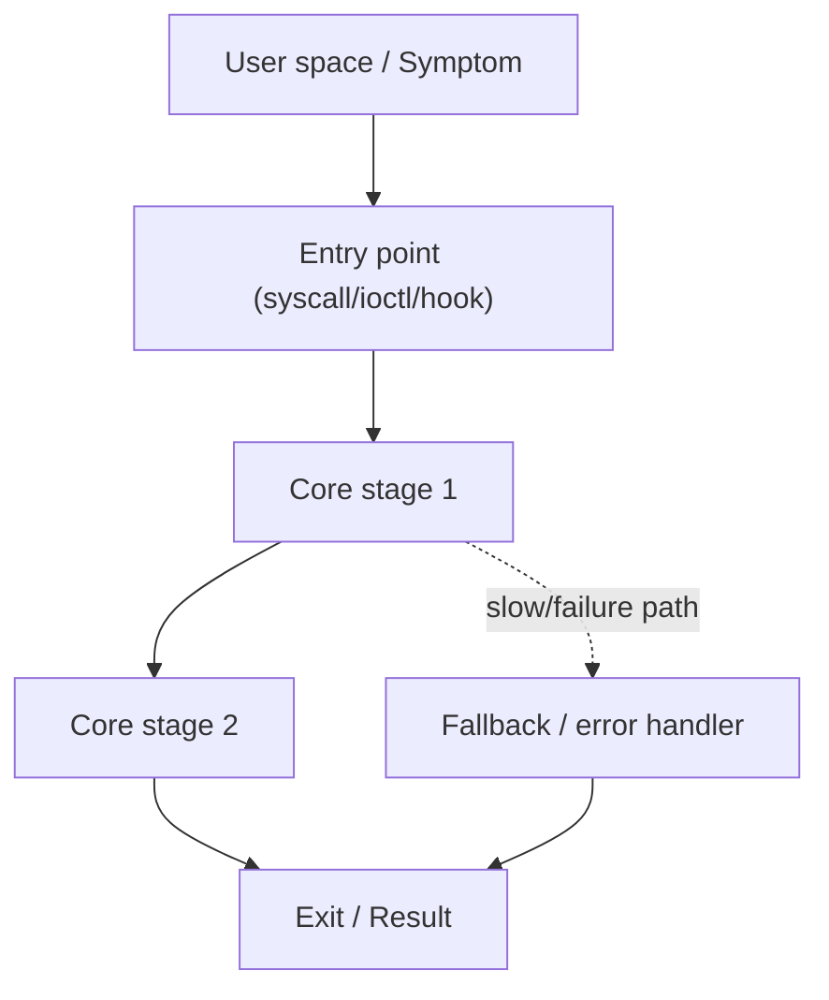

> 本模板面向有一定编程/内核基础的读者：重点是**路径（调用关系）**、**关键数据结构**、**关键函数逐步/逐行式讲解**，以及遇到问题时如何**快速切入源码**。
>
> 说明：标题前缀 `【01】` 仅表示“由浅入深的序号（1..N）”，不写 “Day X”。

## 0. 目标与边界（环境信息尽量写清）

- 序号（1..N）：01（按需替换）
- 模块/主题：
- 学习目标/典型场景（可选）：
- 典型问题/症状（可选）：
- Kernel 版本：v5.15.y（尽量写具体 tag/commit）
- 架构：arm64
- 源码树路径：`/Volumes/CF/code/source-code/linux-5.15.200`（按需替换）
- 不覆盖的内容：

## 1. 设计原理（为什么需要它 + 演进/迭代历史）

- 为什么需要该机制（动机/约束/场景）：
- 关键 trade-off（性能/可扩展/延迟/一致性）：
- 与其它方案对比（为什么没选 A / 为何从 A 演进到 B）：
- 迭代历史（挑 3–6 个关键节点即可，解释“现在为什么是这样”）：

### 1.1 自上而下：大图（What/Where）

- 上游/下游依赖：哪些子系统会调用它？它又调用谁？
- 关键不变量（invariants）：
- 并发模型：运行上下文（进程/softirq/hardirq/kthread/workqueue）与锁设计要点

### 1.2 路线图（call-path route）

## 2. 关键数据结构详解（尽量覆盖“相关结构体及字段”）

> 原则：先列清单，再逐个解释（定义位置/字段/生命周期/锁/所有权）。字段太多时：把“负重字段”展开，其余字段按类别简述。

### 2.1 结构体清单（与主路径/慢路径相关）

- `struct XXX`：`path/to/header.h`
- `struct YYY`：`...`

### 2.2 `struct XXX`（字段逐个解释）

- 定义：`include/linux/...` 或 `kernel/...`（写具体路径）
- 生命周期：
- 所有权/引用计数：
- 锁与并发：
- 字段逐个解释：
  - `field_a`：
  - `field_b`：

## 3. 核心流程源码走读（主路径 + 关键函数逐步/逐行式讲解）

### 3.1 入口点（从用户态/外部看）

- 入口 API（syscall/ioctl/netlink/driver callback/...）：
- 典型触发方式（命令/代码片段/触发条件）：
- arm64 相关 glue（若有）：`arch/arm64/...`

### 3.2 Happy path（主路径）

用“路线”的方式写清楚每一步跳到哪里（函数名 + 源码路径）。

1. `path/to/file.c: foo()`
2. `...`

### 3.3 关键函数逐行式注释（建议：伪代码 + 对应源码位置）

> 目标：不靠大段贴源码也能讲清楚每一行在干什么。必要时只摘取小段片段（< 25 行）并解释。

- `path/to/file.c: critical_fn()`：
  - Step 1（对应源码位置/分支）：
  - Step 2：

## 4. 慢速/异常路径详解（非主流程）

- Slow path A：
  1. `...`
- 异常/错误码路径：
  1. `...`
- 资源不足（内存/锁/IO）时的回退与重试：

## 5. 调优参数与观测指标（/proc 等 + “在源码哪里生效”）

### 5.1 Kconfig（编译期开关）

- `CONFIG_...`：
  - 作用：
  - 依赖：
  - 生效位置：`#ifdef CONFIG_...` / `IS_ENABLED(...)`

### 5.2 Boot params（启动参数）

- `foo=`：
  - 定义/注册：`path/to/file.c: __setup()/early_param()`
  - 解析存储位置：
  - 生效位置（读/检查的代码点）：

### 5.3 sysctl（/proc/sys）

- `.../.../...`：
  - 定义：`path/to/file.c: struct ctl_table ...`
  - 默认值：
  - handler：
  - 生效位置：

### 5.4 module params（/sys/module/.../parameters）

- `param_name`：
  - 定义：`path/to/file.c: module_param(...)`
  - 默认值：
  - 权限：
  - 生效位置：

### 5.5 debugfs/sysfs/procfs/tracepoints（指标面）

- `/proc/...`：
  - 生成位置：`path/to/file.c`
  - 指标含义：
- tracepoints：
  - 事件名：
  - 触发位置：`TRACE_EVENT` / `trace_...()` 调用点

## 6. 常见问题与源码级解释（症状 → 证据 → 根因）

### 6.1 Case 1（示例）

- 症状：
- 第一怀疑点（与理由）：
- 观测证据（trace/perf/eBPF）：
- 路径定位（关键函数/分支）：
- 根因（结构体字段/状态机/竞态点）：
- 修复/规避建议：

## 7. 分析工具箱（按“场景→工具→落点”组织）

> 建议结构：每个工具回答什么问题、适用边界、最小命令、关键输出如何映射到函数/结构体/路径。

### 7.1 路径/时延（确认调用关系）

- tracefs / ftrace（function_graph / function / events）：
  - 目标：确认入口点与主路径；定位延迟段
  - 落点：函数名 → 源码路径；tracepoint → 触发点

### 7.2 CPU/锁/热点（性能）

- perf（record/report/top）：
  - 目标：CPU hotspot、锁竞争、cache/mem 相关迹象
  - 落点：符号栈 → 关键函数；结合路线图对齐阶段

### 7.3 动态插桩（线上统计/聚合）

- eBPF / bpftrace：
  - 目标：对关键函数/tracepoint 做统计与聚合（延迟、频次、错误码分布）
  - 落点：kprobe/tracepoint → 具体代码点与参数

### 7.4 崩溃/死机（离线）

- crash + vmlinux：
  - 目标：panic/oops 后分析任务、栈、对象与关键结构体
  - 落点：回溯栈与结构体字段 → 对应代码路径与状态机位置

### 7.5 并发/内存类问题（健壮性）

- lockdep / KASAN / KCSAN / KFENCE：
  - 目标：死锁风险、越界/UAF、数据竞态
  - 落点：报告栈 → 关键临界区与对象生命周期点

## 附录 I：讲解提纲包（Explain Pack）

### I.1 30 秒定义（one-liner）

- 一句话：

### I.2 3–5 分钟白板讲解提纲（建议层次）

1. 接口/入口点（从哪里进）
2. 核心对象（结构体/生命周期/所有权）
3. 状态机/不变量（关键约束）
4. 主路径（happy path）与关键分支
5. 慢路径/异常路径（为什么慢/为什么错）
6. 调参/观测（如何验证你讲的是真的）

### I.3 高频追问（3–8 题）

- Q1：
  - 答案骨架：
  - 易错点：
  - 延伸：

### I.4 trade-off 对比表

| 方案 | 为什么不用/坑 | 现在方案收益 | 代价 |
|---|---|---|---|
| A | | | |
| B | | | |

### I.5 v5.15 演进视角（2–4 个关键节点）

- 节点 1（版本/patch/动机）：
- 节点 2：
