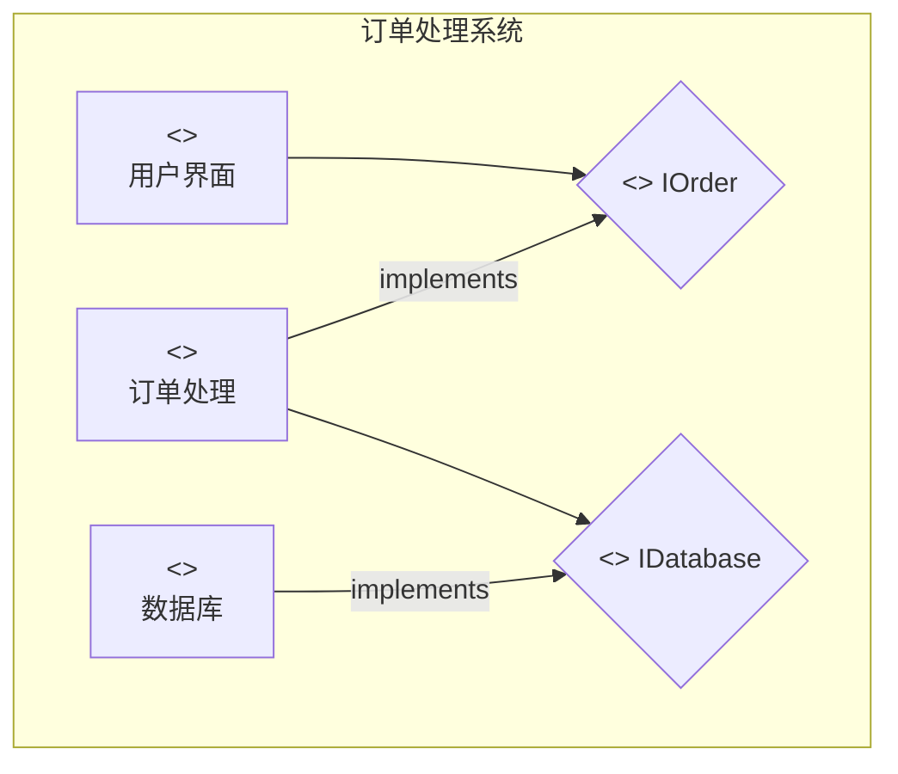
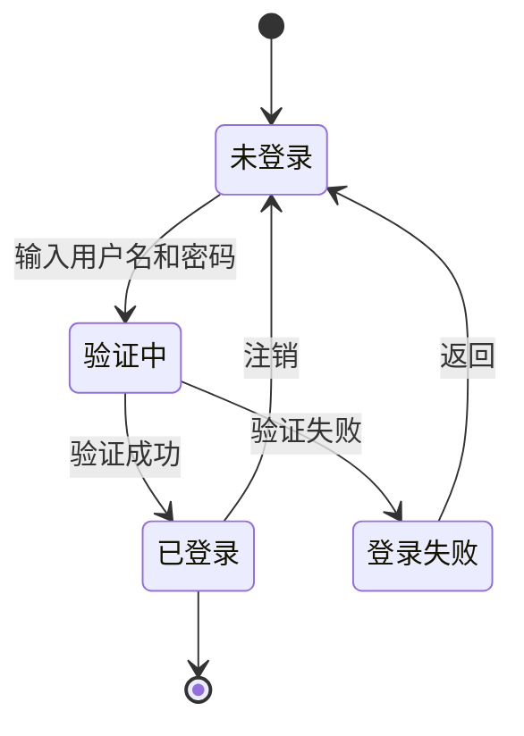
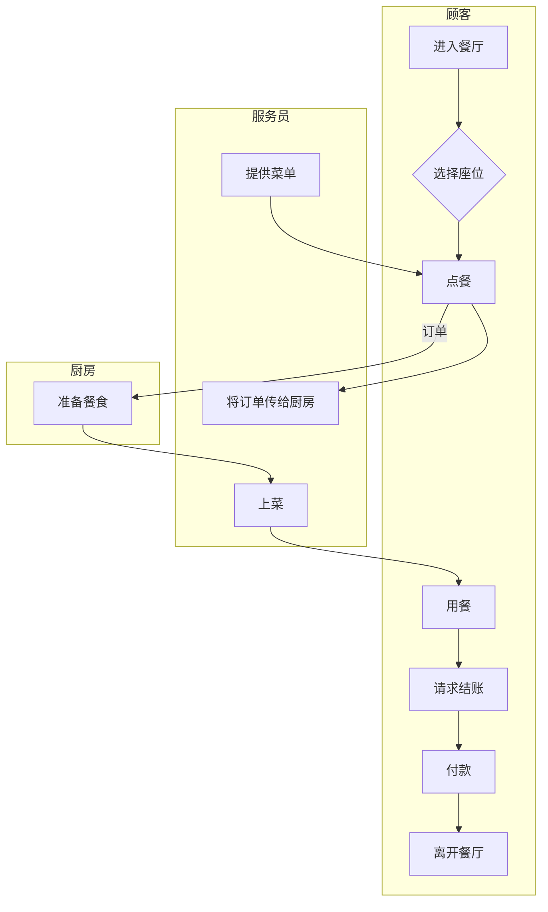
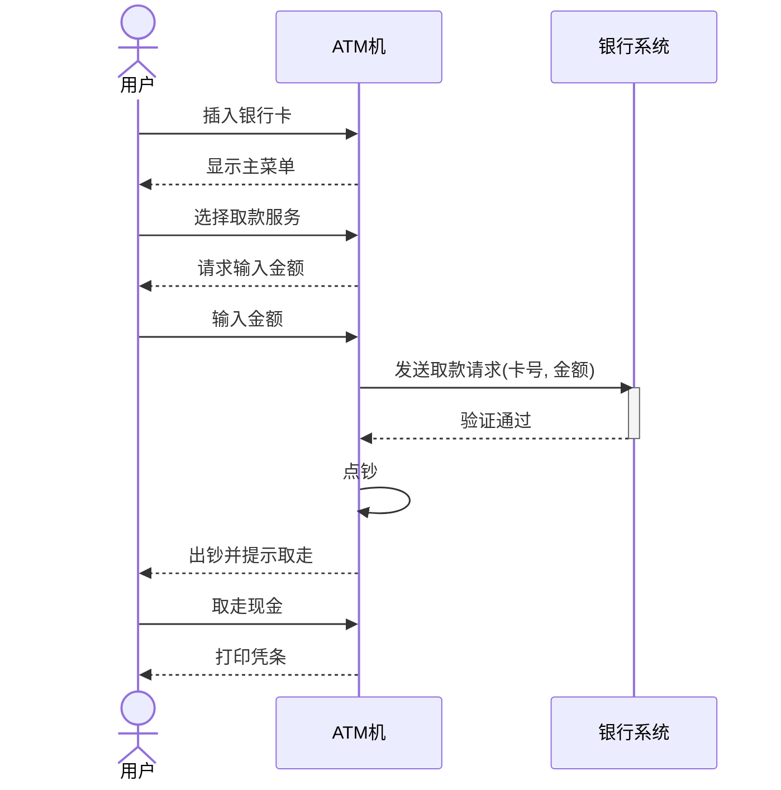
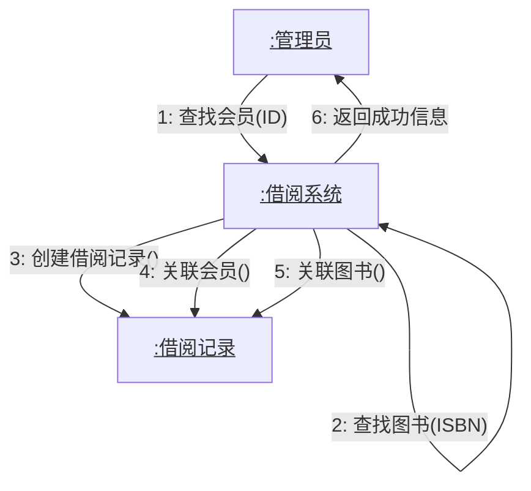

## UML是什么

UML全称是Unified Modeling Language（统一建模语言），它本质上是一种标准化的可视化建模语言。你可以把UML想象成建筑师绘制建筑蓝图的工具，只不过软件工程师用它来描绘软件系统的结构和行为。

UML最初由三位软件工程专家在1990年代中期开发，他们被称为"三个朋友"（Three Amigos）：Grady Booch、Ivar Jacobson和James Rumbaugh。他们将各自的建模方法融合，创造出了这个统一的建模标准。

理解UML的关键在于认识它是一种"语言"。就像人类使用自然语言交流思想一样，UML提供了一套标准化的符号和规则，让软件开发人员能够准确地表达和交流系统设计思想。

## UML的作用和意义

**可视化沟通工具**：想象一下你要向非技术人员解释一个复杂的软件系统。用代码很难让他们理解，但通过UML图表，你可以清晰地展示系统的结构和工作流程。这就像用地图而不是文字描述来指路一样直观。

**设计思维的具象化**：在编写代码之前，UML帮助我们将抽象的系统概念转化为具体的视觉表示。这个过程本身就能帮助我们发现设计中的问题和不一致之处。

**团队协作的桥梁**：在大型项目中，不同的开发人员需要协同工作。UML提供了共同的"词汇表"，确保每个人对系统的理解保持一致。这种标准化的表达方式大大减少了误解和沟通成本。

**文档化和维护**：良好的UML文档能够帮助新加入项目的开发人员快速理解系统架构，也为后期的系统维护和升级提供重要参考。

**质量保证**：通过建模过程，我们可以在实际编码之前识别潜在的设计缺陷，从而降低后期修改的成本。

## UML 2.x版本概要

UML的发展经历了几个重要阶段，理解这个演进过程有助于我们更好地把握其核心特性。

UML 1.x版本在1990年代末奠定了基础，但随着软件开发复杂性的增加和新需求的出现，UML需要进一步发展。2005年，OMG（对象管理组织）发布了UML 2.0，这是一个重大的版本更新。

UML 2.x版本的主要改进包括：更精确的语义定义，使得UML图表的含义更加明确；增强的扩展机制，允许用户根据特定领域的需求定制UML；新增的图表类型，特别是交互概览图和时序图的改进；更好的工具支持和标准化。

目前最新的版本是UML 2.5.1（2017年发布），它在保持向后兼容性的同时，进一步完善了语法和语义规范。

## UML图的分类

UML提供了14种不同类型的图表，每种都有其特定的用途和关注点。为了更好地理解，我们可以将这些图表分为两大类：

**结构图（Structure Diagrams）**：这类图表主要关注系统的静态结构，描述系统由哪些组件构成以及它们之间的关系。包括类图（Class Diagram）、对象图（Object Diagram）、组件图（Component Diagram）、部署图（Deployment Diagram）、包图（Package Diagram）、组合结构图（Composite Structure Diagram）和配置文件图（Profile Diagram）。

**行为图（Behavior Diagrams）**：这类图表专注于系统的动态行为，展示系统如何运作和响应。包括用例图（Use Case Diagram）、活动图（Activity Diagram）、状态机图（State Machine Diagram）、序列图（Sequence Diagram）、通信图（Communication Diagram）、交互概览图（Interaction Overview Diagram）和时序图（Timing Diagram）。

## 软件工程师常用的UML图

### 类图

[UML类图](UML类图)

## 🟫 二、组件图 (Component Diagram)

组件图用于展示软件系统的物理结构，描述了软件组件（如源代码文件、库、可执行文件）以及它们之间的依赖关系。

### 核心概念

- **组件 (Component)**：系统中可替换的、物理的部分，它封装了实现并提供了一组接口。
- **接口 (Interface)**：组件提供或需要的一组操作的集合。
- **依赖 (Dependency)**：一个组件的功能需要另一个组件来完成。
- **端口 (Port)**：组件与外部环境的交互点。

### 用例：订单处理系统

**场景描述**：一个订单管理系统，其用户界面（UI）组件依赖于订单处理组件，而订单处理组件又需要访问数据库组件来存取数据。

---

## 🟧 三、状态图 (State Machine Diagram)

状态图（又称状态机图）用于描述一个对象在其生命周期内所经历的各种状态，以及响应事件时状态之间的转换。

### 核心概念

- **状态 (State)**：对象在其生命周期中的一种条件或情况。
- **初始状态 (Initial State)**：一个对象创建时的起始状态。
- **终止状态 (Final State)**：对象生命周期的结束。
- **转换 (Transition)**：从一个状态到另一个状态的迁移，通常由事件触发。
- **事件 (Event)**：触发状态转换的特定事情。
- **动作 (Action)**：在转换或状态内部执行的原子性操作。

### 用例：用户登录流程

**场景描述**：一个用户登录系统的状态变化。系统从未登录状态开始，用户输入凭据后进入验证中状态，根据验证结果，进入已登录或登录失败状态。

---

## 🟩 四、泳道图（活动图）(Activity Diagram with Swimlanes)

活动图描述了系统的工作流程或业务流程，而泳道则在此基础上划分了不同角色或部门的职责范围。

### 核心概念

- **活动 (Activity)**：工作流中的一个步骤或任务。
- **动作 (Action)**：活动的基本单位。
- **控制流 (Control Flow)**：显示活动之间的执行顺序。
- **决策节点 (Decision Node)**：表示一个基于条件判断的分支。
- **合并节点 (Merge Node)**：将多个分支流合并为一个。
- **分叉 (Fork)** 和 **汇合 (Join)**：用于表示并行活动。
- **泳道 (Swimlane)**：将活动按责任对象进行分组。

### 用例：餐厅点餐流程

**场景描述**：描述顾客在餐厅的点餐、付款流程，涉及顾客、服务员和厨房三个角色。

---

## 🟦 五、序列图 (Sequence Diagram)

序列图是一种交互图，它强调消息在对象之间传递的时间顺序。它清晰地展示了对象如何以及按什么顺序进行交互。

### 核心概念

- **生命线 (Lifeline)**：代表一个参与交互的对象，在图顶部用矩形表示，并向下延伸出一条虚线。
- **参与者 (Actor)**：与系统交互的外部实体（通常是用户）。
- **激活框 (Activation Box)**：生命线上的矩形条，表示对象正在执行操作的时间段。
- **消息 (Message)**：对象之间的通信，用带箭头的线表示。
  - **同步消息 (Synchronous Message)**：发送方等待接收方返回结果。
  - **异步消息 (Asynchronous Message)**：发送方不等待接收方返回。
  - **返回消息 (Return Message)**：表示从一个操作调用中返回。

### 用例：ATM取款

**场景描述**：用户在ATM机上进行取款操作，涉及用户、ATM机和银行系统之间的交互。

---

## 🟪 六、通讯图 (Communication Diagram)

通讯图（在UML 1.x中称为协作图）也是一种交互图，它与序列图类似，但更侧重于展示对象之间的结构关系和消息传递路径，而不是时间顺序。

### 核心概念

- **对象 (Object)**：参与交互的实例。
- **链接 (Link)**：连接对象的线，表示对象之间可以发送消息。
- **消息 (Message)**：沿着链接发送，带有序号和箭头来表示顺序和方向。

### 用例：图书借阅系统

**场景描述**：图书管理员为会员办理借书手续。管理员通过借阅系统，查找会员信息和图书信息，然后创建一条借阅记录。

