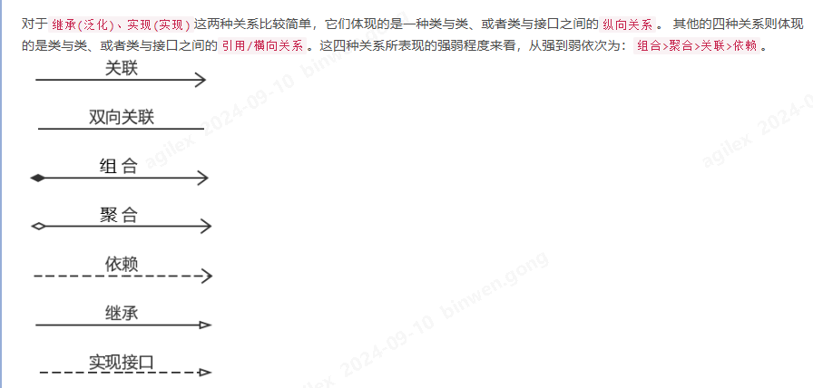
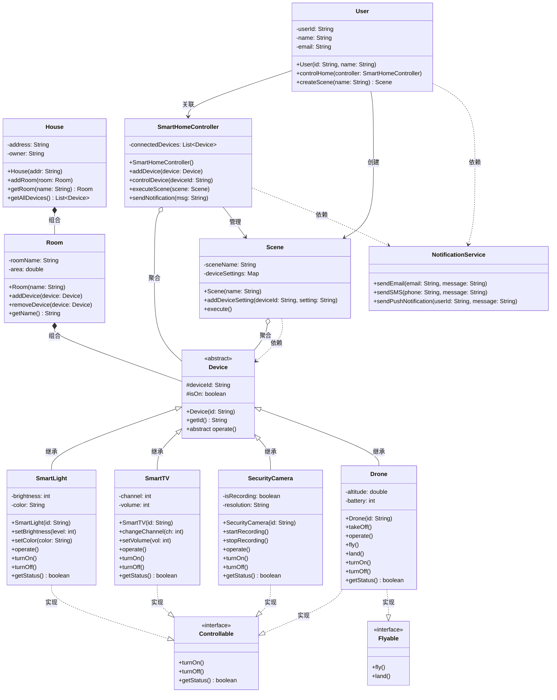

## 类图 (Class Diagram)

类图是UML中最基本也是最重要的一种图，它描述了系统的静态结构，展示了系统中的类、类的属性、方法以及类与类之间的关系。

### 核心概念

- **类 (Class)**：对一组具有相同属性和行为的对象的抽象。
- **属性 (Attribute)**：类的特征或数据。
- **方法 (Method/Operation)**：类的行为或操作。
- **关系 (Relationship)**：类之间的联系，主要有关联、聚合、组合、依赖和继承。

### 类的表示方法

一个标准的类表示包含以下部分：

``` bash
+-------------------+
|    ClassName      | <- 类名（必须，通常使用首字母大写）
+-------------------+
| - attribute1: Type| <- 属性（可选，包含可见性、名称、类型）
| + attribute2: Type|
+-------------------+
| + method1(): Type | <- 方法（可选，包含可见性、名称、参数、返回类型）
| - method2(): void |
+-------------------+
```

可见性修饰符的含义：

- `+` 表示public（公有）
- `-` 表示private（私有）
- `#` 表示protected（受保护）
- `~` 表示package（包级别）

### 关系详解

| 关系类型 | 描述 | 箭头样式 |
| :--- | :--- | :--- |
| **继承 (Inheritance)** | 一个类（子类）继承另一个类（父类）的功能。 | 带空心三角的实线，指向父类 |
| **实现 (Realization)** | 一个类实现一个接口。 | 带空心三角的虚线，指向接口 |
| **关联 (Association)** | 类之间的一种结构化关系。 | 普通实线箭头或无箭头 |
| **聚合 (Aggregation)** | `has-a`关系，表示整体与部分的关系，部分可以独立于整体存在。 | 带空心菱形的实线，菱形指向整体 |
| **组合 (Composition)** | `contains-a`关系，更强的聚合，部分不能独立于整体存在。 | 带实心菱形的实线，菱形指向整体 |
| **依赖 (Dependency)** | 一个类的变化会影响另一个类。 | 带箭头的虚线，指向被依赖的类 |



UML类图中的六种关系详解

1. 继承 (Inheritance) - "is-a" 关系

   - 概念：子类继承父类的所有属性和方法，表示"是一个"的关系。
   - 特点：
     - 子类可以重写父类的方法
     - 子类可以添加自己特有的属性和方法
     - 体现了面向对象的多态性
     - 例子：狗是动物，猫是动物

2. 实现 (Realization) - "can-do" 关系

   - 概念：类实现接口中定义的方法，表示"能够做什么"的关系。
   - 特点：
     - 接口只定义方法签名，不包含实现
     - 一个类可以实现多个接口
     - 实现类必须提供接口中所有方法的具体实现
   - 例子：鸟类实现飞行接口，鱼类实现游泳接口

3. 关联 (Association) - "uses-a" 关系

   - 概念：表示两个类之间的结构化关系，通常是长期的、稳定的关系。
   - 特点：
     - 可以是单向或双向的
     - 可以有多重性（1对1，1对多，多对多）
     - 对象之间相互独立存在
   - 例子：学生和课程的关系，一个学生可以选修多门课程

4. 聚合 (Aggregation) - "has-a" 关系

   - 概念：表示整体与部分的关系，但部分可以独立于整体存在。
   - 特点：
     - 是一种较弱的拥有关系
     - 部分对象可以被多个整体对象共享
     - 整体消失时，部分仍然可以存在
   - 例子：部门和员工的关系，员工可以转到其他部门

5. 组合 (Composition) - "contains-a" 关系

   - 概念：表示强烈的整体与部分关系，部分不能独立于整体存在。
   - 特点：
     - 是一种强的拥有关系
     - 整体负责部分的创建和销毁
     - 整体消失时，部分也必须消失
   - 例子：房子和房间的关系，房子被拆除时房间也不存在了

6. 依赖 (Dependency) - "uses" 关系

- 概念：表示一个类的变化会影响另一个类，通常是临时性的关系。
- 特点：
  - 通常出现在方法参数、局部变量或方法调用中
  - 是最弱的关系
  - 通常是临时性的使用关系
- 例子：汽车依赖汽油，但汽油不属于汽车的一部分

### 用例



> 这个语法我觉得只要能跑起来就行，变量类型怎么放看自己的语言就行了。习惯看的才快。

关系解释说明

在这个智能家居系统的例子中：

1. 继承关系：SmartLight、SmartTV、SecurityCamera、Drone 都继承自抽象类 Device，获得了设备的基本属性和方法。
2. 实现关系：所有具体设备类都实现了 Controllable 接口，提供开关和状态查询功能；Drone 还实现了 Flyable 接口。
3. 组合关系：
   - House 组合 Room：房子被拆除时，房间也不存在
   - Room 组合 Device：房间被移除时，其中的设备配置也消失
4. 聚合关系：
   - SmartHomeController 聚合 Device：控制器管理设备，但设备可以独立存在
   - Scene 聚合 Device：场景包含设备设置，但设备本身独立存在
5. 关联关系：
   - User 与 SmartHomeController 有稳定的使用关系
   - User 可以创建和管理 Scene
6. 依赖关系：
   - SmartHomeController 依赖 NotificationService 发送通知
   - Scene 在执行时依赖具体的 Device
   - User 在某些操作中可能依赖 NotificationService

### 类图设计的最佳实践

在设计类图时，我们需要注意几个重要原则。首先是适当的抽象层次，不要在类图中包含过多的实现细节，重点关注类的职责和关系。其次是保持简洁性，避免在一个图中包含太多类，必要时可以分解为多个相关的类图。最后要确保关系的准确性，仔细考虑类之间的关系类型，选择最合适的关系表示方法。
