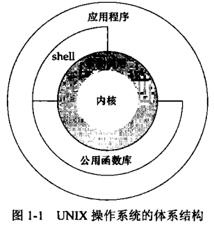

[目录](UNIX环境高级编程)

## UNIX 体系结构

## 登录

在 /etc/passwd 文件中，每一行对应一个用户。

有各种shell，如bash、sh、csh、ksh、tcsh、zsh等。

## 文件和目录

多数不是通过目录存放文件属性，存在硬链接这种东西。

`.`和`..`

进程有工作目录，工作目录可以被改变。

## 输入和输出

标准输入、标准输出、标准错误描述符会自动创建。

STDIN_FILENO、STDOUT_FILENO、STDERR_FILENO

## 程序和进程

exec 函数族

fork 函数

## 出错处理

errno 变量

出错恢复

通常可以等一会，再重试。

## 用户标识

用户ID和组ID，附属ID

在 /etc/group 文件中，每一行对应一个组。

## 信号

## 时间值

进程存在三种时间

- 时钟时间
- 用户CPU时间
- 系统CPU时间

## 系统调用和库函数

系统调用更加短小精悍。库函数功能更丰富。

## 小结
