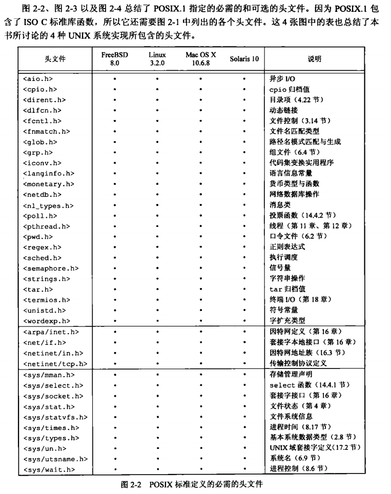
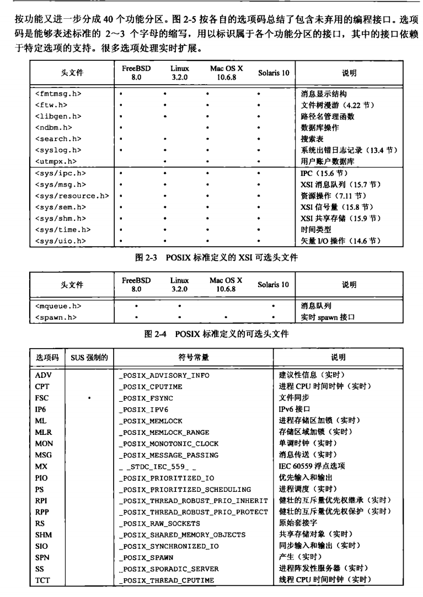
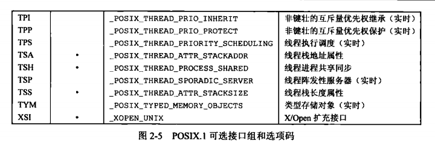

[目录](UNIX环境高级编程)

## UNIX标准化

### ISO C

定义了C语言的标准和标准库。

### IEEE POSIX

可移植操作系统接口。

### Single UNIX Specification

### FIPS

## UNIX系统实现

演进出以下3个分支。

1. AT&T分支，从此引出了系统III和系统V（被称为 UNIX 的商用版本）。
2. 加州大学伯克利分校分支，从此引出 4.xBSD 实现。
3. 由 AT&T 贝尔实验室的计算科学研究中心不断开发的 UNIX 研究版本，从此引出 UNIX分时系统第8版、第9版,终止于1990年的第10版。

### SVR4

UNIX System V Release 4

### 4.4BSD

Berkeley Software Distribution

### FreeBSD

FreeBSD 基于 4.4BSD

### Linux

### Mac OS X

### Solaris

## 标准与实现的关系

## 限制

- 编译时限制（例如，短整型的最大值）
- 运行时限制（文件名有多少个字符）

### ISO C限制

在头文件<limits.h>中定义了各种类型的限制。

### POSIX限制

### XSI限制

### 函数sysconf, pathconf, fpathconf

### 不确定的运行时限制

## 选项

提供了一些功能支持。

## 功能测试宏

## 基本系统数据类型

有些会通过typedef来定义。保证使用的时候是兼容的。如 clock_t

## 标准之间的冲突

有些标准定的时候不够严谨，导致有些标准之间存在冲突。

## 小结
