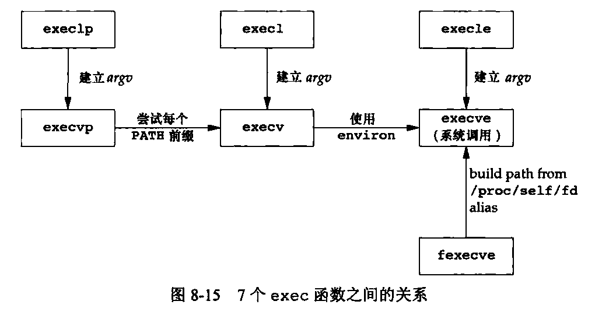
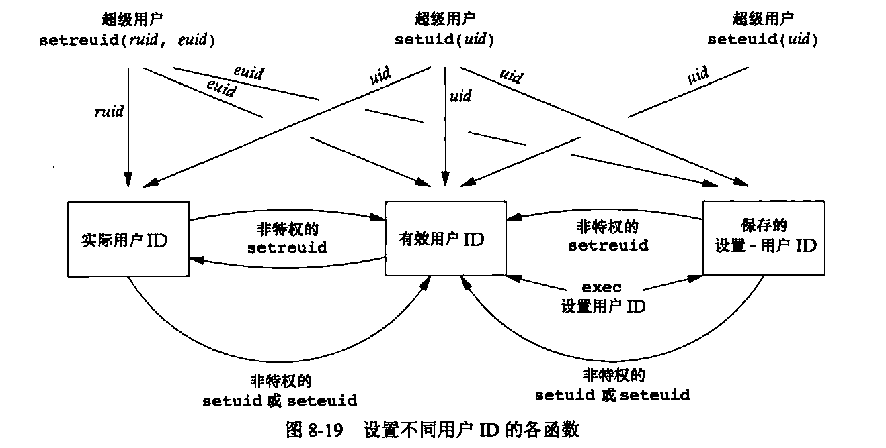

[目录](UNIX环境高级编程)

## 引言

## 进程标识符

pid是唯一的。pid 使用 延迟复用算法。

```c
#include <unistd.h>

pid_t getpid(void);
pid_t getppid(void);
uid_t getuid(void);
uid_t geteuid(void);
gid_t getgid(void);
gid_t getegid(void);
```

- pid为0的进程是调度进程，调度进程是内核的一部分，它不表示实际的进程。
- pid为1的进程是init进程，在自举过程内核后启动一个操作系统。
- pid为2的进程是页守护进程，负责支持虚拟存储器系统的分页操作。

## fork函数

```c
#include <unistd.h>

pid_t fork(void);
```

`fork` 函数被调用一次，但返回两次。两次返回的唯一区别是子进程的返回值为0，而父进程的返回值为子进程的进程ID。因为一个进程可以有很多子进程，但只有一个父进程。

子进程和父进程共享代码段。其余的区域，如数据段、栈和堆，都是独立的。

由于在fork之后经常跟随着exec,所以现在的很多实现并不执行一个父进程数据段、栈和堆的完全副本。作为替代，使用了写时复制(Copy-On-Write，COW)技术。这些区域由父进程和子进程共享，而且内核将它们的访问权限改变为只读。如果父进程和子进程中的任一个试图修改这些区域，则内核只为修改区域的那块内存制作一个副本。

Linux 高版本中，提供了clone函数。允许调用者控制哪些部分由父进程和子进程共享。

fork之后是父进程先执行还是子进程先执行是不确定的，取决于内核的调度算法。

fork之前调用write,其数据写到标准输出一次。但是，标准IO库是带缓冲的。回忆-下5.12节，如果标准输出连到终端设备，则它是行缓冲的;否则它是全缓冲的。当以交互方式运行该程序时，只得到该printf输出的行一次，其原因是标准输出缓冲区由换行符冲洗。但是当将标准输出重定向到一一个文件时，却得到printf输出行两次。其原因是，在fork之前调用了printf一次，但当调用fork时，该行数据仍在缓冲区中，然后在将父进程数据空间复制到子进程中时，该缓冲区数据也被复制到子进程中，此时父进程和子进程各自有了带该行内容的缓冲区。在exit之前的第二个printf将其数据追加到已有的缓冲区中。当每个进程终止时，其缓冲区中的内容都被写到相应文件中。

> 注意缓冲区是独立的。

### 文件共享

描述符共享

父进程和子进程共享文件偏移量

---

使fork失败的两个主要原因是:

- 系统中已经有太多的进程了
- 该实际用户ID的进程总数超过了系统限制

除了打开文件之外，父进程的很多其他属性也由子进程继承，包括：

- 实际用户ID，实际组ID，有效用户ID，有效组ID
- 附属组ID
- 进程组ID
- 会话ID
- 控制终端
- 设置用户ID标志和设置组ID标志
- 当前工作目录
- 根目录
- 文件模式创建屏蔽字
- 信号屏蔽和安排
- 对任一打开文件描述符的执行时关闭标志
- 环境
- 连接的共享存储段
- 存储映射
- 资源限制

父进程和子进程区别具体如下

- fork返回值不同
- 进程ID不同
- 子进程的tms_utime,tms_stime,tms_cutime,tms_ustime为0
- 子进程不继承父进程设置的文件锁
- 子进程的未处理闹钟被清除
- 子进程的未处理信号集设置为空集

## vfork函数

`vfork`并不将父进程的地址空间完全复制到子进程中，因为子进程会立即调用`exec`(或`exit`),于是也就不会引用该地址空间.不过在子进程调用`exec`或`exit`之前，它在父进程的地址空间中运行.但如果子进程修改数据(除了用于存放`vfork`返回值的变量),进程函数调用,或者没有调用`exec`或`exit`就返回都可能带来未知的结果.

`vfork`和`fork`之前的另一个区别是:`vfork`保证子进程先运行,在它调用`exec`或`exit`之后父进程才可能被调度运行,当子进程调用这两个函数的任意一个时,父进程会恢复运行.(如果在调用这两个函数之前子进程依赖于父进程的进一步动作,则会导致死锁.)

## exit函数

`exit`是c库中的函数,而`_exit`是系统调用.

ISOC定义_Exit是为了为进程提供一种无需运行终止处理程序或信号处理程序而终止的方法.UNIX系统中,该函数等价于`_exit`,并不冲洗标准I/O流.

这里提到了`线程取消`.后面会讲,先mark一下.

父进程提前子进程结束,子进程会变成孤儿进程,被init进程收养.

内核为每个终止子进程保存了一定量的信息,所以当终止进程的父进程调用`wait`或`waitpid`时,可以得到子进程的退出状态,并释放终止进程所占用的系统资源.

## wait和waitpid函数

当一个进程正常或异常终止时,内核就向父进程发送`SIGCHLD`.因为子进程终止是一个异步事件,所以这种信号也是内核向父进程发的异步通知.父进程可以选择忽略该信号,或者提供一个该信号发生时即被调用执行的函数.

当调用`wait`或`waitpid`时

- 如果其所有子进程都还在运行,则阻塞.
- 如果一个子进程已经终止,正等待父进程获取其终止状态,则取得该子进程的终止状态立即返回.
- 如果他没有子进程,则立即返回错误.

`wait`函数和`waitpid`函数区别

- 在一个子进程终止前,`wait`使其调用者阻塞,而`waitpid`有一个选项,可使调用者不阻塞.
- `waitpid`并不等待在其调用之后的子进程终止,它有选项可以控制是等待一个特定的进程还是等待第一个终止的子进程.

终止状态用定义在`<sys/wait.h>`中的各个宏来查看.有4个互斥的宏可以用来取得进程终止的原因，他们的名字都以WIF开始.基于这4个宏哪个值为真,就可选用其他宏来取得退出状态,信号编号等.

| 宏 | 说明 |
| --- | --- |
| WIFEXITED(status) | 子进程正常终止,对于这种情况,可使用WEXITSTATUS(status)取得子进程的退出状态(在子进程中,exit, _exit,return的参数)的低8位|
| WIFSIGNALED(status) | 子进程异常终止,对于这种情况,可使用WTERMSIG(status)取得使子进程终止的信号编号,而WCOREDUMP(status)则当子进程转储核心文件时为真|
| WIFSTOPPED(status) | 子进程暂停,对于这种情况,可使用WSTOPSIG(status)取得使子进程暂停的信号编号|
| WIFCONTINUED(status) | 如果子进程由停止状态继续执行,则为真|

waitpid函数提供了wait函数没有提供的3个功能

- waitpid可等待一个特定的进程,而wait则返回任一终止子进程的状态.
- waitpid提供了一个wait的非阻塞版本.有时希望获取一个子进程的状态,但不想阻塞.
- waitpid通过WUNTRACED和WCONTINUED选项支持作业控制.

> 如果一个进程fork一个子进程,但不要等待子进程终止,也不希望子进程处于僵尸状态等到父进程终止,实现这一要求的诀窍是调用fork两次.让init进程去回收.

## waitid函数

获取进程终止状态

```c
#include <sys/wait.h>

pid_t waitid(idtype_t idtype, id_t id, siginfo_t *infop, int options);
```

`waitid`函数提供了`wait`和`waitpid`函数的扩展功能.

```c
#include <sys/wait.h>

int waitid(idtype_t idtype, id_t id, siginfo_t *infop, int options);
```

参数

- idtype: 指定要等待的进程类型,P_PID,P_PGID,P_ALL
- id: 指定要等待的进程ID
- infop: 指向siginfo_t结构体的指针,该结构包含了造成子进程状态改变有关信号的详细信息
- options: 按位或运算,指示调用者关注哪些状态变化

| 常量 | 说明 |
| --- | --- |
| P_PID | 等待指定进程ID的进程 |
| P_PGID | 等待指定进程组ID的进程 |
| P_ALL | 等待所有进程,忽略id |

| 常量 | 说明 |
| --- | --- |
| WCONTINUED | 等待一进程,他以前曾被停止,此后又已继续,但其状态尚未报告|
| WEXITED | 等待已退出的进程 |
| WNOHANG | 如无可用的子进程退出状态,立即返回而非阻塞 |
| WNOWAIT | 不破坏子进程退出状态.该子进程退出状态可由后续的wait,waitid或waitpid获取 |
| WSTOPPED | 等待一进程,他已经停止,但其状态尚未报告 |

WCONTINUED,WEXITED或WSTOPPED这3个常亮之一必须在options参数中指定

## wait3和wait4函数

```c
#include <sys/wait.h>

pid_t wait3(int *statloc, int options, struct rusage *rusage);
pid_t wait4(pid_t pid, int *statloc, int options, struct rusage *rusage);
```

可用于获取子进程的终止状态,并获取子进程所消耗的资源.

## 竞争条件(race condition)

当多个进程都企图对共享数据进行某种处理,而最后的结果又取决于进程运行的顺序,则称发生了竞争条件.

```c
WAIT_PARENT
TELL_CHILD

WAIT_CHILD
TELL_PARENT
```

fork没有办法保证父进程在子进程之前执行.就算能保证也依赖于内核的调度算法.

## exec函数

调用`exec`函数并不创建新进程，所以前后的进程ID并未改变,只是磁盘上进程的代码、数据、栈和堆都会被替换.

```c
#include <unistd.h>

int execl(const char *path, const char *arg, ...);
int execv(const char *path, char *const argv[]);
int execle(const char *path, const char *arg, ...);
int execlp(const char *file, const char *arg, ...);
int execvp(const char *file, char *const argv[]);
int execvpe(const char *file, char *const argv[], char *const envp[]);
int fexecve(int fd, char *const argv[], char *const envp[]);
```

当指定file参数时,如果file中包含/，则将file解析为路径，否则，将file解析为PATH环境变量中的一个可执行文件。如果使用路径前缀中的一个找到了一个可执行文件，但是该文件不是由连接编辑器产生的机器可执行文件，则就认为该文件是一个shell脚本，于是调用shell来执行该脚本。

`fexecve`函数避免了寻找正确的可执行文件。调用进程可以使用文件描述符验证所需要的文件并且无竞争的执行该文件。否则，拥有特权的恶意用户就可以在找到文件位置并且验证之后，但在调用进程执行该文件之前替换可执行文件。



## 更改用户ID和更改组ID

设计应用时，使用最小特权模型。

```c
#include <unistd.h>

int setuid(uid_t uid);
int setgid(gid_t gid);
```



## 解释器文件

## system函数

## 进程会计

## 用户标识

## 进程调度

## 进程时间

## 小结
