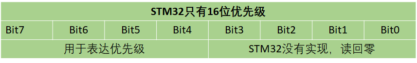
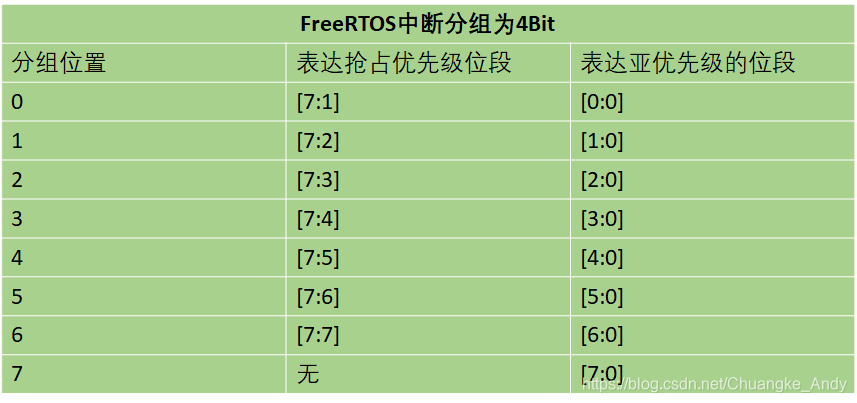
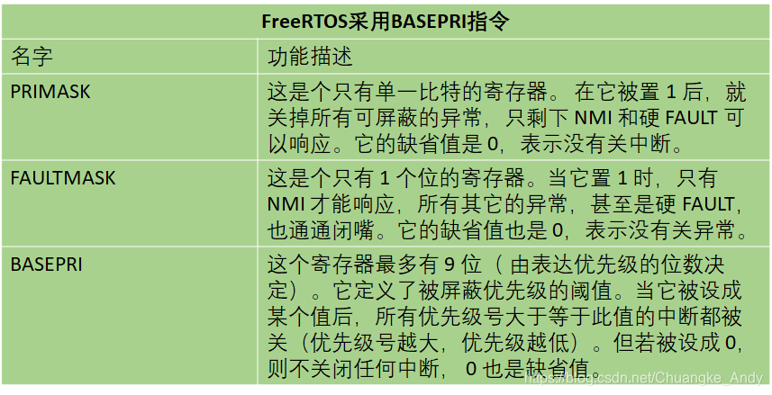

## 透查本质

中断其实就是一种抢占机制，而不同芯片不同平台对中断的管理不一样，例如`cortex-m`是`NVIC`等等。本质只是管理了很多不同优先级的抢占机制。那么当中断触发了，代码该跳去哪儿了? 其实就有个表，对应每个中断的跳转地址。

临界段其实就是代码片段，只不过这部分的代码访问了共享资源，为了特定表示，叫成临界段。这部分通常要上锁关中断等保护措施，防止资源在同一时刻被多个任务访问。

## 中断管理

### 中断管理简介

中断是微控制器的一个常见特性，中断由硬件产生，当中断产生后CPU就会中断当前的流程转而去处理中断服务，Cortex-M内核的MCU提供了一个用于中断管理的嵌套向量中断控制器（NVIC）

当多个中断来临时处理器应该享有哪一个中断是由中断的优先级来决定的，高优先级的中断（优先级编号小）首先得到响应，而高优先级的中断可以抢占低优先级的中断，即中断嵌套。Cortex-M处理器的有些中断是具有固定的优先级的，比如复位、NMI、HardFault，这些中断的优先级都是负数，优先级也是最高的。

Cortex-M处理有三个固定优先级和256个可编程的优先级，最多有128个抢占登记，实际的优先级数量由芯片厂商决定的。多数厂商都会精简设计，比如STM32就只选择了4位作为优先级，共只有16级优先级。如下图示:



Cortex-M处理器还把256个优先级按位分为高低两段：抢占优先级（分组优先级）和亚优先级（子优先级），通过NVIC中的AIRCR寄存器的PRIGROUP（优先级分组）位段来配置分组。下图即为抢占优先级和亚优先级的表达，以及位数和PRIGROUP分组的关系：



在STM32上移植FreeRTOS还需要重点关注PRIMASK、FAULTMASK和BASEPRI这三个寄存器，这三个寄存器的说明见下表。FreeRTOS的开关中断是操作BASEPRI寄存器来实现的，它可以关闭低于某个阈值的中断，高于这个阈值的中断则不会被关闭



### 中断相关函数

#### 关闭中断

```c
/* 关闭中断 */
void taskDISABLE_INTERRUPTS(void)
//只能关掉优先级低于configMAX_SYSCALL_INTERRUPT_PRIORITY的中断
//此函数不允许嵌套
/* 源码分析 */
#define portDISABLE_INTERRUPTS()  vPortRaiseBASEPRI()
static portFORCE_INLINE void vPortRaiseBASEPRI(void)
{  /*vPortRaiseBASEPRI()是向寄存器BASEPRI写入宏configMAX_SYSCALL_INTERRUPT_PRIORITY
  **表示优先级低于configMAX_SYSCALL_INTERRUPT_PRIORITY的中断会被屏蔽*/
  uint32_t ulNewBASEPRI = configMAX_SYSCALL_INTERRUPT_PRIORITY;
    __asm
    {
      msr basepri, ulNewBASEPRI
        dsb
        isb
    }
}

```

#### 打开中断

```c
/* 打开中断 */
void taskENABLE_INTERRUPTS (void)
//此函数不允许嵌套
/* 源码分析 */
#define portENABLE_INTERRUPTS()    vPortSetBASEPRI( 0 )
static portFORCE_INLINE void vPortSetBASEPRI( uint32_t ulBASEPRI )
{  //vPortSetBASEPRI()是向BASEPRI寄存器写入一个值    
    __asm
    {
      msr basepri, ulBASEPRI
    }
}
```

## 临界段

### 临界段的定义

代码的临界段也称为临界区，是指那些必须完整运行，不能被打断的代码段，比如有的外设的初始化需要严格的时序，初始化过程中不能被打断。为确保临界段代码的执行不被中断，在进入临界段之前须关中断，而临界段代码执行完毕后，要立即打开中断


不想被打断访问的资源有哪些：

- 读取或者修改变量（全局变量）
- 调用公共函数的代码（不可重入函数）
- 使用硬件资源（外设）
- 对时序有精准要求的操作
- 用户不想被打断的代码

### 临界段相关函数

> 临界段不可嵌套
> 带不带ISR的区别在于，ISR中不进行嵌套计数，同时需要恢复进入临界段前的中断状态，防止中断状态被乱设置。

#### 进入/退出临界段

任务级临界段代码保护

```c
/*********** 进入临界段 ***********/
函数原型：void taskENTER_CRITICAL(void)
///
/* 源码分析 */
#define taskENTER_CRITICAL()    portENTER_CRITICAL()
#define portENTER_CRITICAL()  vPortEnterCritical()
void vPortEnterCritical( void )
{  
    portDISABLE_INTERRUPTS();  //关闭中断
    uxCriticalNesting++;  //记录临界段嵌套次数
    if( uxCriticalNesting == 1 )
    {
        configASSERT((portNVIC_INT_CTRL_REG & portVECTACTIVE_MASK) == 0);
    }
}
/*********** 退出临界段 ***********/
函数原型：void taskEXIT_CRITICAL(void)
///
/* 源码分析 */
#define taskEXIT_CRITICAL()    portEXIT_CRITICAL()
#define portEXIT_CRITICAL()     vPortExitCritical()
void vPortExitCritical( void )
{  
    configASSERT( uxCriticalNesting );
    uxCriticalNesting--;      //记录临界段嵌套次数
    if( uxCriticalNesting == 0 )  
    {
        portENABLE_INTERRUPTS();  //打开中断
    }
}

```

中断级临界段代码保护

> 中断的优先级一定要低于configMAX_SYSCALL_INTERRUPT_PRIORITY, 因为高于这个优先级的中断服务函数不能调用 FreeRTOS 的 API 函数

```c
/*********** 进入临界段 ***********/
函数原型：UBaseType_t taskENTER_CRITICAL_FROM_ISR(void)
返 回 值：返回上次中断屏蔽寄存器操作值
///
/* 源码分析 */
#define taskENTER_CRITICAL_FROM_ISR()     portSET_INTERRUPT_MASK_FROM_ISR()
#define portSET_INTERRUPT_MASK_FROM_ISR()  ulPortRaiseBASEPRI()
static portFORCE_INLINE uint32_t ulPortRaiseBASEPRI( void )
{  
  uint32_t ulReturn, ulNewBASEPRI = configMAX_SYSCALL_INTERRUPT_PRIORITY;
    __asm
    {
        mrs ulReturn, basepri    //读出BASEPRI的值，保存在ulReturn中
        msr basepri, ulNewBASEPRI  //将ulNewBASEPRI的值写入到BASEPRI寄存器中
        dsb
        isb
    }
    return ulReturn;        //返回ulReturn，退出临界区代码保护时要使用
}
/*********** 退出临界段 ***********/
函数原型：void taskENTER_CRITICAL_FROM_ISR(UBaseType_t uxSavedInterruptStatus)
传 入 值：传入上次中断屏蔽寄存器操作值
///
/* 源码分析 */
#define taskEXIT_CRITICAL_FROM_ISR(x)  portCLEAR_INTERRUPT_MASK_FROM_ISR(x)
#define portCLEAR_INTERRUPT_MASK_FROM_ISR(x)  vPortSetBASEPRI(x)
static portFORCE_INLINE void vPortSetBASEPRI(uint32_t ulBASEPRI)
{  
  __asm
    {
        msr basepri, ulBASEPRI  //将进入临界区时的返回值，传入BASEPRI寄存器
    }
}

```
