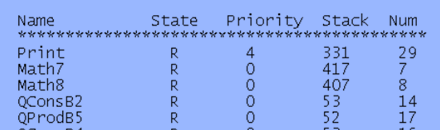

多任务简单理解就是把一个很长时间拆分成n个时间片，每个时间片执行一个任务。

## 透查本质

这里引申出freertos的很多知识，简单说一下。

如果我们把一个while(1)里面的很多函数(任务)拆分成多个任务，这时候我们思考一下需要哪些东西才能完成这个功能。

1. 首先我们需要一个任务调度器，来切换任务，那对于多核的我们可以用其中一个核来切换别的核的任务，但是单核的怎么办？所以任务调度器是基于中断的，在中断的上下文中完成任务的切换。
2. 那么既然会切换，那切换的内容去哪保存，所以我们需要一个任务控制块，里面保存了很多任务的信息，便于下次切换的时候给他恢复了。所以每个任务会有一个任务控制块去管理自己的任务，以及一个调用栈，同时调用栈的大小我们也要考虑。
3. 那么我们怎么知道什么时候要切换，先给谁cpu资源呢？所以需要对任务的状态进行划分，只看那些处于就绪态的任务，同时对任务的优先级进行划分。我们就能够更快的知道哪些任务要调度，谁先调度的问题。
4. 那假设我很长一段时间都没有任务要调度，总不能一直空转吧，所以需要一个空闲任务，当没有任务要调度的时候，就运行空闲任务。其实空闲任务我认为是cpu节省能耗的一种重要方式。就是让cpu停下来。
5. 每个任务运行的频率是不需要一样的，当我运行完了，不能让他空转，所以会有主动让出cpu资源的方式，就是任务挂起。同时任务需要设置一个运行频率。
6. 如果都是同等优先级，总不能你运行完了，我再运行。这时候还需要考虑一个任务每次运行的时间该是多少，就引出了时间片。时间片大了，其他任务就可能被饿死。时间片小了，cpu切换的频率就高了，可能很多时间都浪费在切换上了。
7. 不同任务可能依赖一些共享的资源，这时候需要考虑互斥，所以需要互斥信号量，锁去保护这些共享资源。

> 现在我们再看freertos的任务，是不是就更容易理解了。同时大家欢迎补充

## 基础知识

在使用RTOS的时候一个实时应用可以作为一个独立的任务。每个任务都有自己的运行环境，不依赖于系统中其他的任务或者RTOS调度器。任何一个时间点只能有一个任务运行(单核环境)，具体运行哪个任务是由RTOS调度器来决定的，RTOS调度器因此就会重复的开启、关闭每个任务。任务不需要了解RTOS调度器的具体行为，RTOS调度器的职责是确保当一个任务开始执行的时候其上下文环境(寄存器值，堆栈内容等)和任务上一次退出的时候相同。为了做到这一点，每个任务都必须有个堆栈，当任务切换的时候将上下文环境保存在堆栈中，这样当任务再次执行的时候就可以从堆栈中取出上下文环境，任务恢复运行

### 任务状态

Freertos有四种状态

- 运行态：当任务正在运行时，处于运行态；处于运行态的任务就是当前正在使用处理器的任务
- 就绪态：已经准备就绪，可以运行的任务；有同优先级或更高优先级的任务正在运行占用CPU
- 阻塞态：任务正在等待某个外部事件即处于阻塞态；阻塞态有超时时间，若超时会退出阻塞态
- 挂起态：进入挂起态后也不能被调度器调用进入运行态；挂起态的任务没有超时时间

转换图如下


### 任务优先级

   每个任务都可以分配一个从0 \~ （configMAX\_PRIORITIES - 1）的优先级，configMAX\_PRIORITIES在文件FreeRTOSConfig.h中定义，可以通过STM32CubeMX中FreeRTOS下的MAX\_PRIORITIES参数进行配置。MAX\_PRIORITIES可以为任意值，但是考虑到RAM的消耗，最好设置为一个满足应用的最小值

   优先级数字越低表示任务的优先级越低，0的优先级最低，configMAX\_PRIORITIES - 1的优先级最高。空闲任务的优先级最低，为0。

### 任务实现

在使用FreeRTOS的过程中，要使用xTaskCreate()或xTaskCreateStatic()来创建任务，这两个函数的第一个参数pxTaskCode，就是这个任务的任务函数。任务函数就是完成本任务工作的函数。FreeRTOS官方给出的任务函数模板如下：

```c
void vATaskFunction(void *pvParameters)    //根据实际情况定义任务名；返回类型一定要为void类型
{
    for(;;)    //代表一个循环
    {
    任务应用程序；  //任务代码
    vTaskDelay();  //延时函数，不一定会用到
    }
    vTaskDelete(NULL);  //任务函数一般不允许跳出循环，如果一定要跳出的话在跳出循环后一定要删除此任务
}

```

> 看 xTaskCreateStatic() 的传参可以得知的内存是由用户静态分配的

### 任务控制块

FreeRTOS的每个任务都有一些属性需要存储，FreeRTOS把这些属性集合到一起用一个结构体来表示，这个结构体叫做任务控制块：TCB\_t，在使用函数xTaskCreate()创建任务的时候就会自动的给每个任务分配一个任务控制块。此结构体在文件task.c中有定义，如下：

```c
typedef struct tskTaskControlBlock
{
    volatile StackType_t  *pxTopOfStack;  /*任务堆栈栈顶*/

    #if ( portUSING_MPU_WRAPPERS == 1 )
    xMPU_SETTINGS  xMPUSettings;    /*MPU相关设置*/
    #endif

    ListItem_t      xStateListItem;    /*状态列表项*/
    ListItem_t      xEventListItem;    /*事件列表项*/
    UBaseType_t      uxPriority;      /*任务优先级*/
    StackType_t      *pxStack;      /*任务堆栈起始地址*/
    char        pcTaskName[ configMAX_TASK_NAME_LEN ];  /*任务名字*/

    #if ( portSTACK_GROWTH > 0 )
    StackType_t    *pxEndOfStack;    /*任务堆栈栈底*/
    #endif

    #if ( portCRITICAL_NESTING_IN_TCB == 1 )
    UBaseType_t    uxCriticalNesting;  /*临界区嵌套深度*/
    #endif

    #if ( configUSE_TRACE_FACILITY == 1 )
    UBaseType_t    uxTCBNumber;    /*debug的时候用到*/
    UBaseType_t    uxTaskNumber;    /*trace的时候用到*/
    #endif

    #if ( configUSE_MUTEXES == 1 )
    UBaseType_t    uxBasePriority;    /*任务基础优先级，优先级反转时用到*/
    UBaseType_t    uxMutexesHeld;    /*任务获取到的互斥信号量个数*/
    #endif

    #if ( configUSE_APPLICATION_TASK_TAG == 1 )
    TaskHookFunction_t pxTaskTag;
    #endif

    #if( configNUM_THREAD_LOCAL_STORAGE_POINTERS > 0 )  //与本地存储有关
    void *pvThreadLocalStoragePointers[ configNUM_THREAD_LOCAL_STORAGE_POINTERS ];
    #endif

    #if( configGENERATE_RUN_TIME_STATS == 1 )
    uint32_t    ulRunTimeCounter;  /*用来记录任务运行总时间*/
    #endif

    #if ( configUSE_NEWLIB_REENTRANT == 1 )
    struct  _reent xNewLib_reent;    /*定义一个newlib结构体变量*/
    #endif

    #if( configUSE_TASK_NOTIFICATIONS == 1 )  /*任务通知相关变量*/
    volatile uint32_t ulNotifiedValue;    /*任务通知值*/
    volatile uint8_t ucNotifyState;      /*任务通知状态*/
    #endif

    /* 用来标记任务是动态创建还是静态创建*/
    #if( tskSTATIC_AND_DYNAMIC_ALLOCATION_POSSIBLE != 0 )
    uint8_t  ucStaticallyAllocated;     /*静态创建此变量为pdTURE;动态创建此变量为pdFALSE*/
    #endif

    #if( INCLUDE_xTaskAbortDelay == 1 )
    uint8_t ucDelayAborted;
    #endif

} tskTCB;

/*新版本的任务控制块重命名为TCB_t，本质上还是tskTCB，主要考虑旧版本的兼容*/
typedef tskTCB TCB_t;
```

> 里面有些变量时方便调试定位问题的。

### 任务堆栈简介

FreeRTOS之所以能正确的恢复一个任务的运行就是因为有任务堆栈在保驾护航，任务调度器在进行任务切换的时候会将当前任务的现场（CPU寄存器值等）保存在此任务的任务堆栈中，等到此任务下次运行的时候就会先用堆栈中保存的值来恢复现场，恢复现场以后任务就会接着从上次中断的地方开始运行

创建任务的时候需要给任务指定堆栈，若使用xTaskCreate()动态创建任务，任务堆栈会由函数xTaskCreate()自动创建；若使用xTaskCreateStatic()静态创建任务，就需要自行定义任务堆栈，将堆栈首地址作为函数的参数puxStackBuffer传递给函数，如下：

```c
TaskHandle_t xTaskCreateStatic(  TaskFunction_t pxTaskCode,
                const char * const pcName,
                const uint32_t ulStackDepth,
                void * const pvParameters,
                UBaseType_t uxPriority,
                StackType_t * const puxStackBuffer,    //需要自定义，并将堆栈首地址传递给此参数
                StaticTask_t * const pxTaskBuffer )

```

不论是使用动态还是静态方法创建任务，创建任务都需要指定任务堆栈大小。任务堆栈的数据类型为StackType\_t，其本质是uint32\_t，在portmacro.h文件中由定义，如下：（可见StackType\_t类型的变量为4个字节，因此任务的实际堆栈大小就是我们所定义的4倍）

```c

#define portSTACK_TYPE  uint32_t
....
typedef portSTACK_TYPE StackType_t;

```

## 任务创建和删除

### 静态和动态的区别

#### 静态创建任务

静态创建任务是在编译时分配任务所需的内存空间。
创建任务时需要定义并初始化一个StaticTask\_t类型的变量，该变量用于存储任务的相关信息。
静态创建任务的内存空间在任务整个运行期间都被任务所占用，直到任务被删除。
静态创建任务通常在应用程序的启动阶段进行，任务的数量是固定的，无法在运行时动态调整。

#### 动态创建任务

动态创建任务是在运行时通过动态内存分配函数（例如pvPortMalloc()）来分配任务所需的内存空间。
创建任务时，不需要定义和初始化额外的变量，任务的相关信息直接存储在动态分配的内存中。
动态创建任务的内存空间可以在任务完成后释放，可以在运行时动态地创建和删除任务。
动态创建任务通过调用函数xTaskCreate()来实现，任务的数量可以在运行时根据需求进行动态调整。

### 任务创建和删除API函数

**xTaskCreate()函数：动态创建一个新的任务，每个任务都需要RAM来保存任务状态(任务控制块+任务栈)，此接口采用动态分配内存资源。**

```c
   BaseType_t xTaskCreate(TaskFunction_t pvTaskCode,  //任务函数(函数名)
                          const char *const pcName,  //任务名称(字符串)
                          unsigned short usStackDepth,  //任务堆栈大小
                          void *pvParameters,      //传递给任务函数的参数
                          UBaseType_t uxPriority,    //任务优先级
                          TaskHandle_t *pxCreatedTask);//任务句柄
   返回值：pdPASS：创建成功
        errCOULD_NOT_ALLOCATE_REQUIRED_MEMORY:堆空间不足，失败
   /*注意：configSUPPORT_DYNAMIC_ALLOCATION 必须置为1*/

```

**xTaskCreateStatic()函数：静态创建一个新的任务，每个任务都需要RAM来保存任务状态(任务控制块+任务栈)，此接口采用静态分配内存资源。**

```c
   TaskHandle_t xTaskCreateStatic(TaskFunction_t pvTaskCode,//任务函数(函数名)
                                  const char *const pcName, //任务名称(字符串)
                                  uint32_t ulStackDepth,   //任务堆栈大小
                                  void *pvParameters,     //传递给任务函数的参数
                                  UBaseType_t uxPriority,   //任务优先级
                                  StackType_t *const puxStackBuffer, //任务堆栈
                                  StaticTask_t *const pxTaskBuffer);//任务控制块
   返回值：NULL：任务创建失败
        其他值：任务句柄
   /*注意：configSUPPORT_STATIC_ALLOCATION 必须置为1*/

```

> 如果是一直要运行的任务，建议走静态创建，特别是重要的任务。因为在编译的时候就可以知道内存还是否够用。血的教训 QAQ

**任务删除函数。**

```c
函数原型：void vTaskDelete(TaskHandle_t xTaskToDelete)
参    数：xTaskToDelete 要删除的任务的任务句柄
返 回 值：无
```

### 任务创建和删除源码分析

#### 创建任务

```c
BaseType_t xTaskCreate(  TaskFunction_t pxTaskCode,
               const char * const pcName,
               const uint16_t usStackDepth,
               void * const pvParameters,
               UBaseType_t uxPriority,
               TaskHandle_t * const pxCreatedTask )
   {
     TCB_t *pxNewTCB;
     BaseType_t xReturn;
         
     #define portSTACK_GROWTH  //(-1)表示满减栈
     #if( portSTACK_GROWTH > 0 ){
     }
     #else{ /* portSTACK_GROWTH */
       StackType_t *pxStack;
       /* 任务栈内存分配*/
       pxStack = ( StackType_t *) pvPortMalloc(((( size_t) usStackDepth ) * sizeof( StackType_t))); 
       if( pxStack != NULL ){
         /* 任务控制块内存分配 */
         pxNewTCB = ( TCB_t * ) pvPortMalloc( sizeof( TCB_t ) ); 
         if( pxNewTCB != NULL ){
           /* 赋值栈地址 */
           pxNewTCB->pxStack = pxStack;
         }
         else{
           /* 释放栈空间 */
           vPortFree( pxStack );
         }
       }
       else{
         /* 没有分配成功 */
         pxNewTCB = NULL;
       }
     }
     #endif /* portSTACK_GROWTH */

     if( pxNewTCB != NULL )
     {
       /* 新建任务初始化 */
       prvInitialiseNewTask( pxTaskCode, pcName, ( uint32_t ) usStackDepth, pvParameters, uxPriority, pxCreatedTask, pxNewTCB, NULL );
       /* 把任务添加到就绪列表中 */
       prvAddNewTaskToReadyList( pxNewTCB );
       xReturn = pdPASS;
     }
     else{
       xReturn = errCOULD_NOT_ALLOCATE_REQUIRED_MEMORY;
     }

     return xReturn;
   }

```

#### 任务初始化

```c
static void prvInitialiseNewTask(TaskFunction_t      pxTaskCode,
                const char * const   pcName,
                const uint32_t     ulStackDepth,
                void * const       pvParameters,
                UBaseType_t       uxPriority,
                TaskHandle_t * const   pxCreatedTask,
                TCB_t *        pxNewTCB,
                const MemoryRegion_t * const xRegions ){
    StackType_t *pxTopOfStack;
    UBaseType_t x;

    /* 计算栈顶的地址 */
    #if( portSTACK_GROWTH < 0 ){
    /* 把栈空间的高地址分配给栈顶 */
    pxTopOfStack = pxNewTCB->pxStack + ( ulStackDepth - ( uint32_t ) 1 );
    /* 栈对齐----栈要8字节对齐 */
    pxTopOfStack = (StackType_t *)(((portPOINTER_SIZE_TYPE) pxTopOfStack) & (~((portPOINTER_SIZE_TYPE)portBYTE_ALIGNMENT_MASK))); 
    /* 检查是否有错误 */
    configASSERT((((portPOINTER_SIZE_TYPE) pxTopOfStack & (portPOINTER_SIZE_TYPE) portBYTE_ALIGNMENT_MASK) == 0UL));
    }
    #else /* portSTACK_GROWTH */
    {
    }
    #endif /* portSTACK_GROWTH */

    /* 存储任务名称 */
    for( x = ( UBaseType_t ) 0; x < ( UBaseType_t ) configMAX_TASK_NAME_LEN; x++ ){
    pxNewTCB->pcTaskName[ x ] = pcName[ x ];

    if( pcName[ x ] == 0x00 ){
        break;
    }
    else{
        mtCOVERAGE_TEST_MARKER();//测试覆盖率的一个宏
    }
    }

    /* \0补齐字符串 */
    pxNewTCB->pcTaskName[ configMAX_TASK_NAME_LEN - 1 ] = '\0';
    /* 判断任务分配的优先级，是否大于最大值  如果超过最大值，赋值最大值 */
    if( uxPriority >= ( UBaseType_t ) configMAX_PRIORITIES ){
    uxPriority = ( UBaseType_t ) configMAX_PRIORITIES - ( UBaseType_t ) 1U;
    }
    else{
    mtCOVERAGE_TEST_MARKER();
    }
    /* 赋值任务优先级到任务控制块 */
    pxNewTCB->uxPriority = uxPriority;
    /* 任务状态表 事件表初始化 */
    vListInitialiseItem( &( pxNewTCB->xStateListItem ) );
    vListInitialiseItem( &( pxNewTCB->xEventListItem ) );
    /* 任务控制块链接到任务状态表中 */
    listSET_LIST_ITEM_OWNER( &( pxNewTCB->xStateListItem ), pxNewTCB );
    /* 任务控制块连接到事件表中 */
    listSET_LIST_ITEM_VALUE( &( pxNewTCB->xEventListItem ), ( TickType_t ) configMAX_PRIORITIES - ( TickType_t ) uxPriority ); 
    listSET_LIST_ITEM_OWNER( &( pxNewTCB->xEventListItem ), pxNewTCB );

    #if( portUSING_MPU_WRAPPERS == 1 ){
    
    }
    #else{ /* portUSING_MPU_WRAPPERS */
    /* 任务堆栈初始化，之后返回任务栈顶 */
    pxNewTCB->pxTopOfStack = pxPortInitialiseStack( pxTopOfStack, pxTaskCode, pvParameters );
    }
    #endif /* portUSING_MPU_WRAPPERS */

    if( ( void * ) pxCreatedTask != NULL ){
    /* 赋值任务句柄 */
    *pxCreatedTask = ( TaskHandle_t ) pxNewTCB;
    }
    else{
    mtCOVERAGE_TEST_MARKER();
    }
}
```

#### 任务堆栈初始化

```c
StackType_t *pxPortInitialiseStack(StackType_t *pxTopOfStack, TaskFunction_t pxCode, void *pvParameters){
    pxTopOfStack--;    /* 入栈程序状态寄存器 */
    *pxTopOfStack = portINITIAL_XPSR;  /* xPSR */
    
    pxTopOfStack--;    /* 入栈PC指针 */
    *pxTopOfStack = ( ( StackType_t ) pxCode ) & portSTART_ADDRESS_MASK;  /* PC */
    
    pxTopOfStack--;    /* 入栈LR链接寄存器 */
    *pxTopOfStack = ( StackType_t ) prvTaskExitError;  /* LR */
    
    pxTopOfStack -= 5;  /* 跳过R12, R3, R2 and R1这四个寄存器，不初始化 */
    *pxTopOfStack = ( StackType_t ) pvParameters;  /* R0作为传参入栈 */
    
    pxTopOfStack--;    /* 异常返回值入栈   返回值是确定程序使用的栈地址是哪一个 MSP PSP*/
    *pxTopOfStack = portINITIAL_EXEC_RETURN;
    
    pxTopOfStack -= 8;  /* 跳过R11, R10, R9, R8, R7, R6, R5 and R4这8个寄存器，不初始化 */
    return pxTopOfStack;  /*最终返回栈顶*/
}

```

以STM32(堆栈为向下增长模式)为例，经过上面的初始化后，此时的堆栈结果如下图所示


#### 任务删除

```c
void vTaskDelete( TaskHandle_t xTaskToDelete ){
    TCB_t *pxTCB;
    /* 进入临界段 */
    taskENTER_CRITICAL();
    {
    /* 如果传入的参数为NULL，说明调用vTaskDelete的任务要删除自身 */
    pxTCB = prvGetTCBFromHandle( xTaskToDelete );
    /* 将任务从就绪列表中移除 */
    if( uxListRemove( &( pxTCB->xStateListItem ) ) == ( UBaseType_t ) 0 ){
        taskRESET_READY_PRIORITY( pxTCB->uxPriority );
    }
    else{
        mtCOVERAGE_TEST_MARKER();
    }
    /* 查看任务是否在等待某个事件，并将其从相应的列中删除 */
    if( listLIST_ITEM_CONTAINER( &( pxTCB->xEventListItem ) ) != NULL ){
        ( void ) uxListRemove( &( pxTCB->xEventListItem ) );
    }
    else{
        mtCOVERAGE_TEST_MARKER();
    }
        
    uxTaskNumber++;
    /* 要删除的是当前正在运行的任务 */
    if( pxTCB == pxCurrentTCB ){
        /* 把任务添加到等待删除的任务列表中，并在空闲任务中删除 */
        vListInsertEnd( &xTasksWaitingTermination, &( pxTCB->xStateListItem ) );
        /* 记录有多少个任务需要释放内存 */
        ++uxDeletedTasksWaitingCleanUp;
        /* 任务删除钩子函数---需要用户自己实现*/
        portPRE_TASK_DELETE_HOOK( pxTCB, &xYieldPending );
    }
    else{
        /* 要删除的是别的任务 */
        --uxCurrentNumberOfTasks;
        prvDeleteTCB( pxTCB );
        /* 重新计算还要多长时间执行下一个任务 */
        prvResetNextTaskUnblockTime();
    }
    traceTASK_DELETE( pxTCB );
    }
    /* 退出临界段 */
    taskEXIT_CRITICAL();

    /* 判断调度器是否开启 */
    if( xSchedulerRunning != pdFALSE ){
    /* 如果是删除任务本身，马上进行任务调度（释放CPU的使用权）*/
    if( pxTCB == pxCurrentTCB ){
        configASSERT( uxSchedulerSuspended == 0 );
        portYIELD_WITHIN_API();
    }
    else{
        mtCOVERAGE_TEST_MARKER();
    }
    }
}

```

## 任务挂起和恢复

### 任务挂起和恢复函数

```c
vTaskSuspend()函数：将任务置于挂起状态
void vTaskSuspend(TaskHandle_t xTaskToSuspend)
参    数：xTaskToSuspend 要挂起的任务的任务句柄
返 回 值：无

vTaskResume()函数：将任务从挂起状态恢复到就绪态
void vTaskResume(TaskHandle_t xTaskToResume)
参    数：xTaskToResume 要恢复的任务的任务句柄
返 回 值：无

```

### 任务挂起和恢复函数源码分析

#### 任务挂起函数源码分析

```c
void vTaskSuspend(TaskHandle_t xTaskToSuspend){
    TCB_t *pxTCB;
    /* 进入临界段 */
    taskENTER_CRITICAL();
    {
        /* 获取任务控制块,若为NULL则挂起自身 */
        pxTCB = prvGetTCBFromHandle(xTaskToSuspend);
        /* 将任务从就绪列表中移除 */
        if(uxListRemove(&(pxTCB->xStateListItem)) == (UBaseType_t)0){
            taskRESET_READY_PRIORITY(pxTCB->uxPriority);
        }
        else{
            mtCOVERAGE_TEST_MARKER();
        }
        /* 查看任务是否在等待某个事件，如是则将其从事件列表中移除 */
        if(listLIST_ITEM_CONTAINER(&(pxTCB->xEventListItem))!=NULL){
            (void) uxListRemove(&(pxTCB->xEventListItem));
        }
        else{
            mtCOVERAGE_TEST_MARKER();
        }
        /* 将任务添加到挂起任务列表表尾 */
        vListInsertEnd(&xSuspendedTaskList, &(pxTCB->xStateListItem));
        }
        /* 退出临界段 */
        taskEXIT_CRITICAL();
        
        if(xSchedulerRunning != pdFALSE){  //判断调度器是否开启
        /* 重新计算还要多长时间执行下一个任务 */
        taskENTER_CRITICAL();
        {
            prvResetNextTaskUnblockTime();
        }
        taskEXIT_CRITICAL();
        }
        else{
        mtCOVERAGE_TEST_MARKER();
        }

        if(pxTCB == pxCurrentTCB){
        if(xSchedulerRunning != pdFALSE){
            /* 若刚挂起的是正在运行的任务，且任务调度器运行正常，则强制进行一次任务切换 */
            configASSERT( uxSchedulerSuspended == 0 );
            portYIELD_WITHIN_API();
        }
        else{
            /* 若任务调度器没有开启，则读取当前任务挂起列表的长度，判断所有任务是否都被挂起*/
            if(listCURRENT_LIST_LENGTH(&xSuspendedTaskList) == uxCurrentNumberOfTasks){
            /* 若所有任务都被挂起，把当前的任务控制块赋值为NULL  */
            pxCurrentTCB = NULL;
            }
            else{
            /* 若还有没被挂起的任务，则获取下一个要运行的任务 */
            vTaskSwitchContext();
            }
        }
    }
    else{
    mtCOVERAGE_TEST_MARKER();
    }
}

```

#### 任务恢复函数源码分析

```c
void vTaskResume(TaskHandle_t xTaskToResume){
    /* 获取要恢复的任务控制块 */
    TCB_t * const pxTCB = (TCB_t *) xTaskToResume;
    configASSERT( xTaskToResume );

    /* 任务控制块不能为NULL和当前任务  */
    if(( pxTCB != NULL ) && ( pxTCB != pxCurrentTCB )){
    /* 进入临界段 */
    taskENTER_CRITICAL();
    {
        /* 判断任务是否被挂起 */
        if(prvTaskIsTaskSuspended(pxTCB) != pdFALSE){
        /* 从挂起列表中移除 */
        (void) uxListRemove(&( pxTCB->xStateListItem));
        /* 添加到就绪列表中 */
        prvAddTaskToReadyList( pxTCB );
        /* 要恢复的任务优先级高于当前正在运行的任务优先级 */
        if(pxTCB->uxPriority >= pxCurrentTCB->uxPriority){
            /* 完成一次任务切换 */
            taskYIELD_IF_USING_PREEMPTION();
        }
        else{
            mtCOVERAGE_TEST_MARKER();
        }
        }
        else
        {
        mtCOVERAGE_TEST_MARKER();
        }
    }
    /* 退出临界段 */
    taskEXIT_CRITICAL();
    }
    else{
    mtCOVERAGE_TEST_MARKER();
    }
}

```

## 多任务调度

[RTOS系列文章（2）：PendSV功能，为什么需要PendSV-CSDN博客](https://blog.csdn.net/u012351051/article/details/124789418)

### 多任务启动流程

| 启动后以下各函数由上至下依次执行      | 含义      |
| --------------------- | ------- |
| vTaskStartScheduler() | 启动任务调度器 |
| xPortStartScheduler() | 启动调度器   |
| prvStartFirstTask()   | 启动第一个任务 |
| SVC                   | 调用SVC中断 |

### 源码分析

#### 启动任务调度器

```c
void vTaskStartScheduler( void ){
    BaseType_t xReturn;
    /* Add the idle task at the lowest priority. */
    #if(configSUPPORT_STATIC_ALLOCATION == 1){
    }
    #else{
    /* 动态创建空闲任务 */
    xReturn = xTaskCreate(prvIdleTask,
                "IDLE", configMINIMAL_STACK_SIZE,
                (void *) NULL,
                (tskIDLE_PRIORITY|portPRIVILEGE_BIT),
                &xIdleTaskHandle); 
    }
    #endif /* configSUPPORT_STATIC_ALLOCATION */

    if(xReturn == pdPASS){
    /* 关闭中断 */
    portDISABLE_INTERRUPTS();      
    /* 下一个任务锁定时间赋值为最大,其实就是时间片调度，不让其进行调度 */
    #define portMAX_DELAY ( TickType_t ) 0xffffffffUL
    xNextTaskUnblockTime = portMAX_DELAY;
    /* 调度器的运行状态置位，标记开始运行了 */
    xSchedulerRunning = pdTRUE;
    /* 初始化系统的节拍值为0 */
    xTickCount = ( TickType_t ) 0U;
    /* 启动调度器 */
    if(xPortStartScheduler() != pdFALSE){
    //如果调度器启动成功就不会执行到这里，所以没有代码
    }
    else{
    //不会执行到这里，所以没有代码
    }
    }
    else{
    //运行到这里说明系统内核没有启动成功，空闲任务创建失败  
    }
}

```

#### 启动调度器

FreeRTOS系统时钟是由滴答定时器来提供，任务切换也会用到PendSV中断，这些硬件的初始化在这里完成

```c
BaseType_t xPortStartScheduler( void ){
    /* 为了保证系统的实时性,配置systick和pendsv与内核有相同的优先级 */
    portNVIC_SYSPRI2_REG |= portNVIC_PENDSV_PRI;
    portNVIC_SYSPRI2_REG |= portNVIC_SYSTICK_PRI;
    /* 配置滴答定时器systick的定时周期，并开启systick中断 */
    vPortSetupTimerInterrupt();
    /* 初始化临界段嵌套计数器 */
    uxCriticalNesting = 0;
    /* 启动第一个任务 */
    prvStartFirstTask();
    /* 代码正常执行的话不会到这里! */
    return 0;
}
```

#### 启动第一个任务

```c
__asm void prvStartFirstTask( void ){
    PRESERVE8  //8字节对齐，AAPCS的标准，ARM特有
    /* 将0xE000ED08保存在寄存器R0中；它是中断向量表的一个地址，
    存储的是MSP的指针，最终获取到MSP的RAM的地址 */
    ldr r0, =0xE000ED08
    ldr r0, [r0]  //取R0保存的地址处的值赋给R0
    ldr r0, [r0]  //获取MSP初始值
    /* 重新把MSP的地址，赋值为MSP，相当于复位MSP  */
    msr msp, r0
    /* 开启全局中断 */
    cpsie i  //使能中断
    cpsie f  //使能中断
    dsb    //数据同步屏障
    isb    //指令同步屏障
    /* 调用SVC  */
    svc 0
    nop
    nop
}

```

#### 调用SVC中断

在prvStartFirstTask()中通过调用SVC指令触发了SVC中断，而第一个任务的启动就是在SVC中断服务函数中完成的

```c
__asm void vPortSVCHandler(void){
    PRESERVE8//8字节对齐

    /* 获取当前任务控制块 */
    ldr  r3, =pxCurrentTCB
    ldr r1, [r3]  //
    ldr r0, [r1]  //
    /* 出栈内核寄存器,R14其实就是异常返回值 */
    ldmia r0!, {r4-r11, r14}
    /* 进程栈指针PSP设置为任务的堆栈 */
    msr psp, r0
    isb  //指令同步屏障
    /* 把basepri赋值为0，即打开屏蔽中断 */
    mov r0, #0
    msr basepri, r0
    /* 异常退出 */
    bx r14
}

```

### 任务切换

#### 任务切换场合

RTOS系统的核心是任务管理，而任务管理的核心是任务切换，任务切换决定了任务的执行顺序。上下文(任务)切换被触发的场合可以是

- 系统滴答定时器(SysTick)中断
- 执行一个系统调用
    典型的嵌入式OS系统中，处理器被划分为多个时间片。若系统中只有两个任务，这两个任务会交替执行，任务切换都是在SysTick中断中执行，如下图示

  

在一些OS设计中,为了解决SysTick和IRQ的冲突问题，PendSV异常将上下文切换请求延迟到所有其他IRQ处理都已经完成后，在PendSV异常内执行上下文切换。如下图示：

  

PendSV(可挂起的系统调用)异常对OS操作非常重要，其优先级可通过编程设置。可通过将中断控制和状态寄存器ICSR的bit28(挂起位)置1来触发PendSV中断。上面提到过上下文切换被触发的两个场合：SysTick中断和执行一个系统调用，其源码分析如下：

SysTick中断

```c
//滴答定时器中断服务函数
void SysTick_Handler(void){
if(xTaskGetSchedulerState()!=taskSCHEDULER_NOT_STARTED){ //系统已经运行
xPortSysTickHandler();
}
}

void xPortSysTickHandler( void ){
vPortRaiseBASEPRI();  //关闭中断
{
if( xTaskIncrementTick() != pdFALSE ){ //增加时钟计数器xTickCount的值            
    /* 通过向中断控制和状态寄存器的bit28位写入1挂起PendSV来启动PendSV中断 */
    portNVIC_INT_CTRL_REG = portNVIC_PENDSVSET_BIT; 
}
}
vPortClearBASEPRIFromISR();  //打开中断
}

```

执行一个系统调用

#### PendSV中断服务函数

任务切换的具体过程是在PendSV中断服务函数中完成的，下面分析PendSV中断服务函数源码.

```c
__asm void xPortPendSVHandler( void ){
    extern uxCriticalNesting;
    extern pxCurrentTCB;
    extern vTaskSwitchContext;

    PRESERVE8

    mrs r0, psp
    isb
    /* 获取当前任务控制块，其实就获取任务栈顶 */
    ldr  r3, =pxCurrentTCB
    ldr  r2, [r3]
    /* 浮点数处理，如果使能浮点数，就需要入栈 */
    tst r14, #0x10
    it eq
    vstmdbeq r0!, {s16-s31}
    /* 保存内核寄存器---调用者需要做的 */
    stmdb r0!, {r4-r11, r14}
    /* 保存当前任务栈顶,把栈顶指针入栈 */
    str r0, [r2]
    stmdb sp!, {r3}
    /* 使能可屏蔽的中断-----临界段 */
    mov r0, #configMAX_SYSCALL_INTERRUPT_PRIORITY
    msr basepri, r0
    dsb
    isb
    /* 执行上下文切换 */
    bl vTaskSwitchContext
    /* 使能可屏蔽的中断 */
    mov r0, #0
    msr basepri, r0
    /* 恢复任务控制块指向的栈顶 */
    ldmia sp!, {r3}
    /* 获取当前栈顶 */
    ldr r1, [r3]
    ldr r0, [r1]
    /* 出栈*/
    ldmia r0!, {r4-r11, r14}
    /* 出栈*/
    tst r14, #0x10
    it eq
    vldmiaeq r0!, {s16-s31}
    /* 更新PSP指针 */
    msr psp, r0
    isb
    /* 异常返回，下面要执行的代码，就是要切换的任务代码了 */
    bx r14
    nop
    nop
}

```

在PendSV中断服务函数中有调用函数vTaskSwitchContext来获取下一个要运行的任务，其源码如下

```c
void vTaskSwitchContext( void ){
    if( uxSchedulerSuspended != ( UBaseType_t ) pdFALSE ){
    /* 标记调度器状态*/
    xYieldPending = pdTRUE;
    }
    else{
    /* 标记调度器状态*/
    xYieldPending = pdFALSE;
    /* 检查任务栈是否溢出 */
    taskCHECK_FOR_STACK_OVERFLOW();
    /* 选择优先级最高的任务，把当前的任务控制块进行赋值 */
    taskSELECT_HIGHEST_PRIORITY_TASK();
    }
}

```

## 任务堆栈

运行freertos系统的大部分都是资源有限的MCU，所以对于RAM我们都要考虑尽量的节省，避免资源浪费。

### 任务堆栈大小

需要用到堆栈的地方：

- 函数嵌套：函数局部变量、函数形参、函数返回地址、函数内部状态值
- 任务切换：任务切换时所有的寄存器都需要入栈
- 中断：M3内核MCU有8个寄存器是自动入栈的(任务栈)，进入中断以后其余寄存器入栈以及可能发生的中断嵌套都是用的系统栈

### 任务堆栈大小确定方法

#### MDK html文件分析

通过查看工程源码中“MDK-ARM”里的工程名文件夹下的html文件可以知道每个被调用函数的最大栈需求以及各个函数之间的调用关系


#### 栈溢出检测

1. 在任务切换时检测任务栈指针是否过界
2. 任务创建的时候将任务栈所有数据初始化为0xa5，任务切换并进行任务栈检测的时候检查末尾的16个字节是否都是0xa5；

```c
/*******************栈溢出检测宏的配置********************/
#define configCHECK_FOR_STACK_OVERFLOW
0, 配置为0，表示不启动栈溢出检测
1, 配置为1，表示启用栈溢出检测方案一
2, 配置为2，表示启用栈溢出检测方案二
/*********************栈溢出回调函数**********************/
函数原型：void vApplicationStackOverflowHook(TaskHandle_t *pxTask,signed char *pcTaskName)
传 入 值：pxTask 堆栈溢出任务的句柄
    pcTaskName 堆栈溢出任务的名称

```

#### 任务状态打印

通过调用vTaskList()函数打印每个任务的详细信息（栈名、栈状态、优先级、栈的剩余空间、任务序号）

```c
/*******************任务状态信息打印宏的配置*******************/
#define configUSE_TRACE_FACILITY  //必须置1
#define configUSE_STATS_FORMATTING_FUNCTIONS  //必须置1
/*********************任务状态信息打函数**********************/
函数原型：void vTaskList(char *pcWriteBuffer)
传 入 值：pcWriteBuffer 缓冲区地址

```

根据传入的缓冲区（缓冲区要足够大，以容纳生成的报告，每个任务大约需要40个字节）生成字符串，这个字符串包含所有任务信息



## 任务相关函数

freertos中有很多与任务相关的API函数，大多数是辅助函数。下表是这些与任务相关的API函数功能和描述简介

### 函数简介

| 函数名                                  | 功能描述                       |
| ------------------------------------ | -------------------------- |
| uxTaskPriorityGet()                  | 查询某个任务的优先级                 |
| vTaskPrioritySet()                   | 改变某个任务的优先级                 |
| uxTaskGetSystemState()               | 获取系统中任务状态                  |
| vTaskGetInfo()                       | 获取某个任务信息                   |
| xTaskGetApplicationTaskTag()         | 获取某个任务的标签值                 |
| xTaskGetCurrentTaskHandle()          | 获取当前正在运行任务的任务句柄            |
| xTaskGetHandle()                     | 根据任务名字查找某个任务的句柄            |
| xTaskGetIdleTaskHandle()             | 获取空闲任务的句柄                  |
| uxTaskGetStackHighWaterMark()        | 获取任务的堆栈的历史剩余最小值，也叫高水位线     |
| eTaskGetState()                      | 获取某个任务的状态，该状态时eTaskState类型 |
| pcTaskGetName()                      | 获取某个任务的任务名字                |
| xTaskGetTickCount()                  | 获取系统时间计数器值                 |
| xTaskGetTickCountFromISR()           | 在中断服务函数中获取时间计数器值           |
| xTaskGetSchedulerState()             | 获取任务调度器的状态，开启或未开启          |
| uxTaskGetNumberOfTask()              | 获取当前系统中存在的任务数量             |
| vTaskList()                          | 以表格的形式输出当前系统中所有任务的详细信息     |
| vTaskGetRunTimeStats()               | 获取每个任务的运行时间                |
| vTaskSetApplicationTaskTag()         | 设置任务标签值                    |
| vTaskSetThreadLocalStoragePointer()  | 设置线程本地存储指针                 |
| pvTaskGetThreadLocalStoragePointer() | 获取线程本地存储指针                 |

### 函数详解

uxTaskPriorityGet()：查询某个任务的优先级

```c
/*****************************相关宏的配置*****************************/
#define INCLUDE_uxTaskPriorityGet        必须置为1
/*******************************函数原型*******************************/
函数原型：UBaseType_t uxTaskPriorityGet(TaskHandle_t xTask)
传 入 值：xTask 要查找的任务的任务句柄
返 回 值：获取到的对应的任务的优先级 
```

vTaskPrioritySet() ：改变某个任务的优先级

```c
/*****************************相关宏的配置*****************************/
#define INCLUDE_vTaskPrioritySet        必须置为1
/*******************************函数原型*******************************/
函数原型：void vTaskPrioritySet(TaskHandle_t xTask,UBaseType_t uxNewPriority)
传 入 值：xTask 要更改优先级的任务的任务句柄
    uxNewPriority 任务要使用的新的优先级
```

uxTaskGetSystemState()：获取系统中所有任务的任务状态，每个任务的状态信息保存在一个TaskStatus\_t类型的结构体里，这个结构体包含了任务句柄、任务名称、堆栈、优先级等信息

```c
/*****************************相关宏的配置*****************************/
#define configUSE_TRACE_FACILITY        必须置为1
/*******************************函数原型*******************************/
函数原型：UBaseType_t uxTaskGetSystemState(TaskStatus_t *const pxTaskStatusArray,
                    const UBaseType_t uxArraySize,
                    uint32_t *const pulTotalRunTime)
传 入 值：pxTaskStatusArray 指向TaskStatus_t结构体类型的数组首地址
    uxArraySize      保存任务状态数组的大小
    pulTotalRunTime   若开启了系统运行时间统计，则用来保存系统总的运行时间
返 回 值：统计到的任务状态的个数，也就是填写到数组pxTaskStatusArray中的个数

/*****TaskStatus_t结构体*****/
typedef struct xTASK_STATUS{
TaskHandle_t  xHandle;  //任务句柄
const char*    pcTaskName;  //任务名字
UBaseType_t    xTaskNumber;  //任务编号
eTaskState    eCurrentState;  //当前任务状态
UBaseType_t    uxCurrentPriority;  //任务当前的优先级
UBaseType_t    uxBasePriority;    //任务基础优先级
uint32_t    ulRunTimeCounter;  //任务运行的总时间
StackType_t*  pxStackBase;  //堆栈基地址
uint16_t    usStackHighWaterMark;//任务创建依赖任务堆栈剩余的最小值
}TaskStatus_t;

```

vTaskGetInfo()：获取某个指定的单个任务的任务信息

```c
/*****************************相关宏的配置*****************************/
#define configUSE_TRACE_FACILITY        必须置为1
/*******************************函数原型*******************************/
函数原型：void vTaskGetInfo(TaskHandle_t  xTask,
                TaskStatus_t* pxTaskStatus,
                BaseType_t xGetFreeStackSpace,
                eTaskState eState)
传 入 值：xTask 要查找的任务的任务句柄
    pxTaskStatus 指向类型为TaskStatus_t结构体变量
    xGetFreeStackSpace 堆栈剩余的历史最小值
    eState 保存任务运行状态 (更方便获取，仅此)

```

xTaskGetApplicationTaskTag() ：获取某个任务的标签值

```c
/*****************************相关宏的配置*****************************/
#define configUSE_APPLICATION_TASK_TAG   必须置为1
/*******************************函数原型*******************************/
函数原型：void xTaskGetApplicationTaskTag(TaskHandle_t xTask)
传 入 值：xTask 要获取标签值的任务的任务句柄，若为NULL表示获取当前任务的标签值
返 回 值：任务的标签值

```

xTaskGetCurrentTaskHandle() ：获取当前正在运行任务的任务句柄，其实获取到的就是任务控制块

```c
/*****************************相关宏的配置*****************************/
#define INCLUDE_xTaskGetCurrentTaskHandle  必须置为1
/*******************************函数原型*******************************/
函数原型：TaskHandle_t xTaskGetCurrentTaskHandle(void)
返 回 值：当前任务的任务句柄

```

xTaskGetHandle() ：根据任务名字查找某个任务的句柄

```c
/*****************************相关宏的配置*****************************/
#define INCLUDE_xTaskGetHandle  必须置为1
/*******************************函数原型*******************************/
函数原型：TaskHandle_t xTaskGetHandle(const char* pcNameToQuery)
传 入 值：pcNameToQuery 任务名
返 回 值：任务名所对应的任务句柄；返回NULL表示没有对应的任务

```

xTaskGetIdleTaskHandle() ：获取空闲任务的句柄

```c
/*****************************相关宏的配置*****************************/
#define INCLUDE_xTaskGetIdleTaskHandle  必须置为1
/*******************************函数原型*******************************/
函数原型：TaskHandle_t xTaskGetIdleTaskHandle(void)
返 回 值：空闲任务的任务句柄

```

uxTaskGetStackHighWaterMark()：每个任务在创建的时候就确定了堆栈大小，此函数用于检查任务从创建好到现在的历史剩余最小值，这个值越小说明任务堆栈溢出的可能性就越大

```c
/*****************************相关宏的配置*****************************/
#define INCLUDE_uxTaskGetStackHighWaterMark  必须置为1
/*******************************函数原型*******************************/
函数原型：UBaseType_t uxTaskGetStackHighWaterMark(TaskHandle_t xTask)
传 入 值：xTask 要查询的任务的任务句柄，若为NULL表示查询自身任务的高水位线
返 回 值：任务堆栈的高水位线值，即堆栈的历史剩余最小值

```

eTaskGetState() ：获取某个任务的状态，比如：运行态、阻塞态、挂起态、就绪态等

```c
/*****************************相关宏的配置*****************************/
#define INCLUDE_eTaskGetState  必须置为1
/*******************************函数原型*******************************/
函数原型：eTaskState eTaskGetState(TaskHandle_t xTask)
传 入 值：xTask 要查询的任务的任务句柄
返 回 值：返回eTaskState枚举类型值

```

pcTaskGetName() ：根据任务句柄来获取该任务的任务名字

```c
/*******************************函数原型*******************************/
函数原型：char* pcTaskGetName(TaskHandle_t xTaskToQuery)
传 入 值：xTaskToQuery 要查询的任务的任务句柄，若为NULL表示查询自身任务名
返 回 值：返回任务所对应的任务名

```

xTaskGetTickCount() ：用于查询任务调度器从启动到现在时间计数器xTickCount的值。xTickCount是系统的时钟节拍值，并不是真实的时间值。每个滴答定时器中断xTickCount就会加一，中断周期取决于系统时钟节拍数

```c
/*******************************函数原型*******************************/
函数原型：TickType_t xTaskGetTickCount(void)
返 回 值：时间计数器xTickCount的值
```

xTaskGetTickCountFromISR() ：在中断服务函数中获取时间计数器值

```c
/*******************************函数原型*******************************/
函数原型：TickType_t xTaskGetTickCountFromISR(void)
返 回 值：时间计数器xTickCount的值

```

xTaskGetSchedulerState() ：获取任务调度器的状态，开启、关闭还是挂起

```c
/*****************************相关宏的配置*****************************/
#define INCLUDE_xTaskGetSchedulerState  必须置为1
/*******************************函数原型*******************************/
函数原型：BaseType_t xTaskGetSchedulerState(void)
返 回 值：taskCHEDULER_NOT_STARTED 调度器未启动
    taskCHEDULER_RUNNING 调度器正在运行
    taskCHEDULER_SUSPENDED 调度器挂起

```

xTaskGetNumberOfTask() ：获取当前系统中存在的任务数量

```c
/*******************************函数原型*******************************/
函数原型：UBaseType_t uxTaskGetNumberOfTask(void)
返 回 值：当前系统中存在的任务数量，此值包含各种状态下的任务数

```

vTaskList() ：以表格的形式输出当前系统中所有任务的详细信息

```c
/*******************************函数原型*******************************/
函数原型：void vTaskList(char *pcWriteBuffer)
传 入 值：pcWriteBuffer 保存任务状态信息表的存储区

```

vTaskGetRunTimeStats() ：获取每个任务的运行时间

```c
/*****************************相关宏的配置*****************************/
#define configGENERATE_RUN_TIME_STATS        必须置为1
#define configUSE_STATS_FORMATTING_FUNCTIONS   必须置为1
/*******************************函数原型*******************************/
函数原型：void vTaskGetRunTimeStats(char *pcWriteBuffer)
传 入 值：pcWriteBuffer 保存任务时间信息的存储区

```

vTaskSetApplicationTaskTag() ：用于设置某个任务的标签值

```c
/*****************************相关宏的配置*****************************/
#define configUSE_APPLICATION_TASK_TAG   必须置为1
/*******************************函数原型*******************************/
函数原型：void vTaskSetApplicationTaskTag(TaskHandle_t xTask，
                    TaskHookFunction_t pxHookFunction)
传 入 值：xTask 要要设置标签值的任务的任务句柄
    pxHookFunction 要设置的标签值

```

vTaskSetThreadLocalStoragePointer() ：设置线程本地存储指针的值，每个任务都有自已的指针数组作为线程本地存储，使用这些线程本地存储可以用来在任务控制块中存储一些只属于任务自已的应用信息

```c
/*****************************相关宏的配置*****************************/
#define configNUM_THREAD_LOCAL_STORAGE_POINTERS   本地存储指针数组的大小
/*******************************函数原型*******************************/
函数原型：void vTaskSetThreadLocalStoragePointer(TaskHandle_t xTaskToSet,
                        BaseType_t xIndex,
                        void* pvValue)
传 入 值：xTaskToSet 要设置线程本地存储指针的任务的任务句柄
    xIndex 要设置的线程本地存储指针数组的索引
    pvValue 要存储的值

```

pvTaskGetThreadLocalStoragePointer() ：获取线程本地存储指针

```c
/*****************************相关宏的配置*****************************/
#define configNUM_THREAD_LOCAL_STORAGE_POINTERS   本地存储指针数组的大小
/*******************************函数原型*******************************/
函数原型：void *pvTaskGetThreadLocalStoragePointer(TaskHandle_t xTaskToQuery,
                                            BaseType_t xIndex )
传 入 值：xTaskToQuery 要获取线程本地存储指针的任务的任务句柄
    xIndex 要获取的线程本地存储指针数组的索引

```
