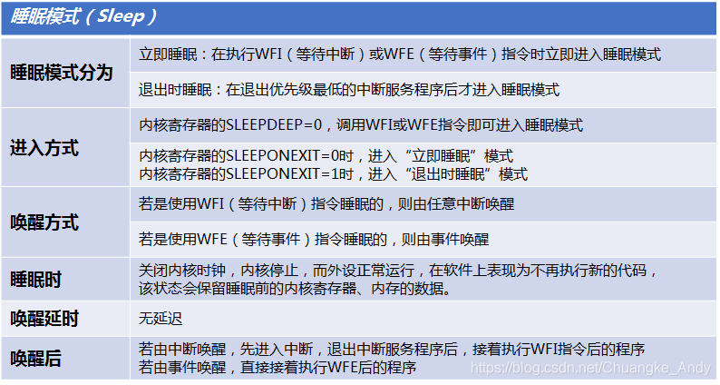
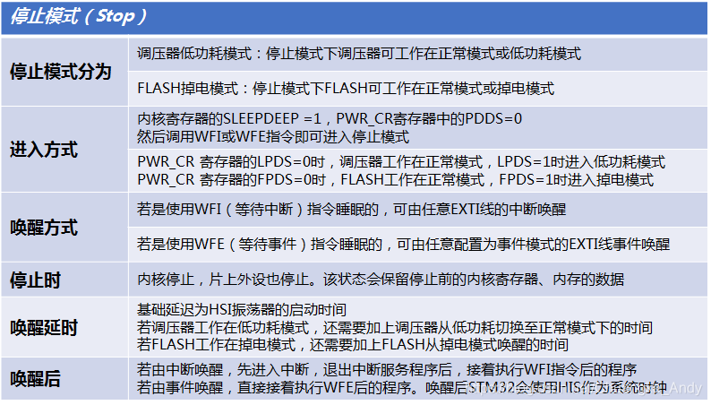
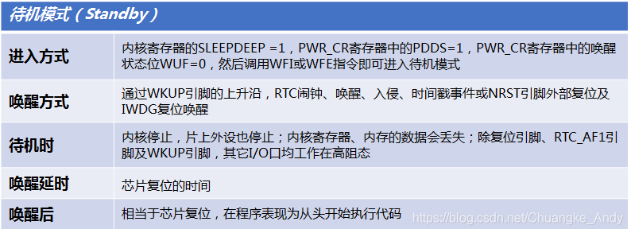
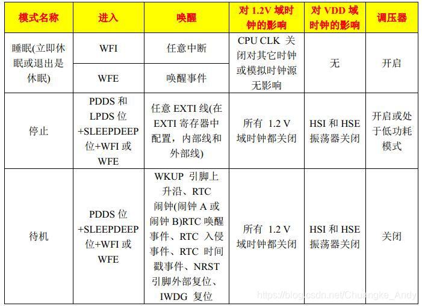
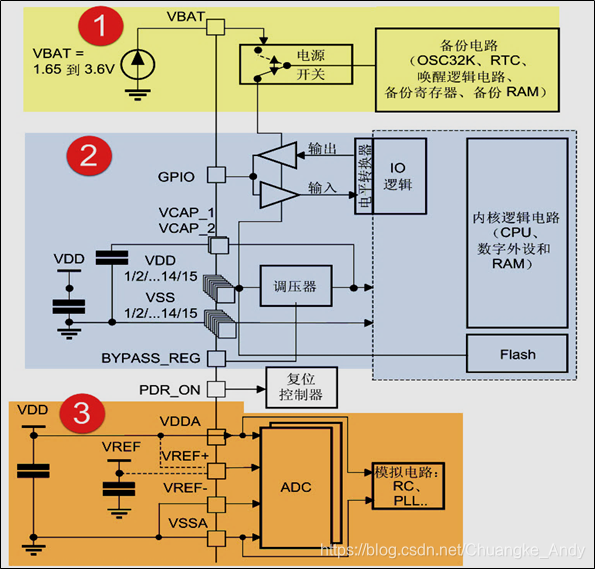
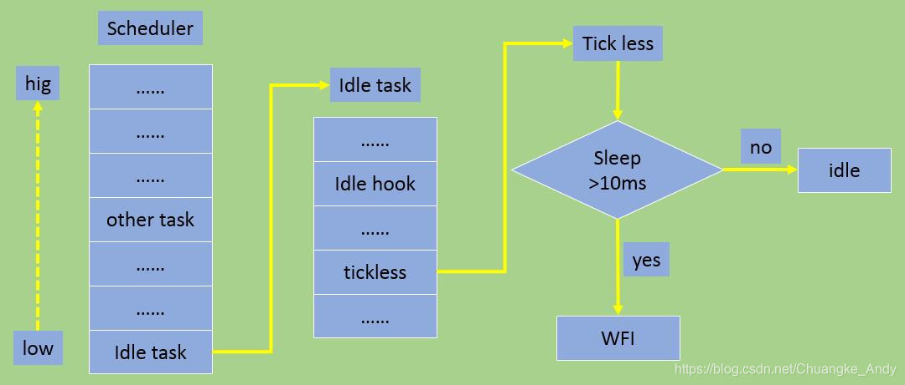

很多应用场合对于功耗的要求很严格，比如可穿戴低功耗产品、物联网低功耗产品等。一般MCU都有相应的低功耗模式，裸机开发时可以使用MCU的低功耗模式。FreeRTOS也提供了一个叫Tickless的低功耗模式，方便带FreeRTOS操作系统的应用开发

## 低功耗管理介绍

### STM32低功耗模式

STM32本身就支持低功耗模式，以STM32F1为例，其有三种低功耗模式：睡眠（Sleep）模式、停止（Stop）模式、待机（Standby）模式







三种模式的对比如下图示：



STM32的电源管理系统主要分为以下三个部分：1为备份域；2为调压器供电电路；3为ADC电源电路



## Tickless低功耗模式

简单应用中处理器大量的时间都在处理空闲任务，所以可以考虑当处理器处理空闲任务时进入低功耗模式，当需要处理应用层代码时再将处理器从低功耗模式唤醒。一般采用基于时间片轮转的抢占式任务调度机制的低功耗设计思路为：当idle任务运行时，进入低功耗模式；在适当的条件下，通过中断或外部事件唤醒MCU。

但是该设计的缺陷是每当OS系统定时器产生中断时，也会将MCU从低功耗模式中唤醒，而频繁的进入/唤醒低功耗模式使得MCU无法进入深度睡眠，对于低功耗设计而言是不合理的。FreeRTOS中设计的低功耗模式------Tickless Idle Mode，可以让MCU更长时间的处于低功耗模式。



Tickless Idle Mode的设计思想在于尽可能的在MCU空闲时使其进入低功耗模式，因此需要解决以下问题：

合理的进入低功耗模式，避免频繁使MCU在低功耗和运行模式下进行不必要的切换。RTOS的系统时钟源于硬件的某个周期性定时器（Cotex-M内核多数采用SysTick），RTOS的任务调度器可以预期到下一个周期性任务（或定时器任务）的触发时间，从而调整系统时钟定时器中断触发时间，以避免RTOS进入不必要的时间中断，从而更长时间停留在低功耗模式中。此时RTOS的时钟不再是周期的而是动态的（在原有的时钟基准时将不再产生中断，即Tickless）
当MCU被唤醒时，通过某种方式为系统时钟提供补偿。MCU可能被动态调整过的系统时钟中断或突发性的外部事件所唤醒，都可以通过运行在低功耗模式下的某种定时器来计算出MCU处于低功耗模式下的时间，在MCU唤醒后对系统时间进行软件补偿
软件实现时，根据具体的应用情景和MCU低功耗特性来处理问题。尤其是MCU的低功耗特性，不同MCU处于不同的低功耗模式下所能使用的外设（主要是定时器）是不同的，RTOS的系统时钟可以进行适当的调整。

### Tickless低功耗模式实现

#### 宏 configUSE\_TICKLESS\_IDLE

要想使用Tickless模式，必须将FreeRTOSConfig.h中的如下宏置1；FreeRTOS只提供了个别的硬件平台模式，STM32采用模式1即可，如果采用其他模式，配置为2

```c
#define configUSE_TICKLESS_IDLE    1  //启用低功耗Tickless模式

```

#### 宏 portSUPPRESS\_TICKS\_AND\_SLEEP

使能了Tickless模式后，当空闲任务是唯一可运行的任务（其他任务都处于阻塞或挂起态）以及系统处于低功耗模式的时间大于configEXPECTED\_IDLE\_TIME\_BEFORE\_SLEEP个时钟节拍时，FreeRTOS内核就会调用宏portSUPPRESS\_TICKS\_AND\_SLEEP来处理低功耗相关的工作。

```c
#ifndef portSUPPRESS_TICKS_AND_SLEEP    \
extern void vPortSuppressTicksAndSleep(TickType_t  xExpectedIdleTime );
#define portSUPPRESS_TICKS_AND_SLEEP( xExpectedIdleTime )   \
vPortSuppressTicksAndSleep( xExpectedIdleTime )
#endif
//参数 xExpectedIdleTime 表示处理器将要在低功耗模式运行的时长

```

函数 vPortSuppressTicksAndSleep 是实际的低功耗执行代码，本来需要用户自己实现，但是针对STM32平台，FreeRTOS已经帮我们实现了，其源码如下示

```c
__weak void vPortSuppressTicksAndSleep(TickType_t xExpectedIdleTime){
  uint32_t ulReloadValue,ulCompleteTickPeriods,ulCompletedSysTickDecrements, ulSysTickCTRL;
  TickType_t xModifiableIdleTime;
  /* 判断系统最小时间片（systick定时器的Reload值）是否大于systick的最大装载周期 */
  if( xExpectedIdleTime > xMaximumPossibleSuppressedTicks ){
  /* MCU在低功耗模式运行的时长 */
  xExpectedIdleTime = xMaximumPossibleSuppressedTicks;
  }
  /* 关闭systick定时器 */
  portNVIC_SYSTICK_CTRL_REG &= ~portNVIC_SYSTICK_ENABLE_BIT;
  /* systick重载值= 当前的systick计数值+单次系统tick装载值*（系统最小时间片-1）*/
  ulReloadValue = portNVIC_SYSTICK_CURRENT_VALUE_REG + ( ulTimerCountsForOneTick * ( xExpectedIdleTime - 1UL ) );
  /* 装载值若大于补偿周期，则要减去补偿周期 */
  if( ulReloadValue > ulStoppedTimerCompensation ){
  ulReloadValue -= ulStoppedTimerCompensation;
  }
  /* 关闭中断，虽然关闭了中断，但可以唤醒CPU,不进行中断处理  */
  __disable_irq();
  __dsb( portSY_FULL_READ_WRITE );
  __isb( portSY_FULL_READ_WRITE );
  /* 是否有其他任务，进入了就绪态 */
  if( eTaskConfirmSleepModeStatus() == eAbortSleep ){
  /* 不能进入低功耗模式，并将当前的systick计数值放到systick装载寄存器中 */
  portNVIC_SYSTICK_LOAD_REG = portNVIC_SYSTICK_CURRENT_VALUE_REG;
  /* 重新启动systick */
  portNVIC_SYSTICK_CTRL_REG |= portNVIC_SYSTICK_ENABLE_BIT;
  /* 重新赋值装载寄存器值为一个系统的tick周期. */
  portNVIC_SYSTICK_LOAD_REG = ulTimerCountsForOneTick - 1UL;
  /* 开启中断 */
  __enable_irq();
  }
  else{
  /* 可以进入低功耗模式，装载休眠systick装载值 */
  portNVIC_SYSTICK_LOAD_REG = ulReloadValue;
  /* 清除systick当前计数值 */
  portNVIC_SYSTICK_CURRENT_VALUE_REG = 0UL;
  /* 启动systick定时器*/
  portNVIC_SYSTICK_CTRL_REG |= portNVIC_SYSTICK_ENABLE_BIT;
  xModifiableIdleTime = xExpectedIdleTime;
  /* 进入低功耗前要处理的事情,需要用户实现休眠处理，以进一步降低功耗 */
  configPRE_SLEEP_PROCESSING( &xModifiableIdleTime );
  if( xModifiableIdleTime > 0 ){
      /* 让CPU休眠 */
    __dsb( portSY_FULL_READ_WRITE );
    __wfi();
    __isb( portSY_FULL_READ_WRITE );
  }
  /* 退出低功耗后要处理的事情,需要用户实现 */
  configPOST_SLEEP_PROCESSING( &xExpectedIdleTime );
  /* 停止systick定时器 */
  ulSysTickCTRL = portNVIC_SYSTICK_CTRL_REG;
  portNVIC_SYSTICK_CTRL_REG = ( ulSysTickCTRL & ~portNVIC_SYSTICK_ENABLE_BIT );
  /* 使能中断 */
  __enable_irq();
  /* 判断是由外部中断还是systick定时器计时时间到唤醒的 */
  if( ( ulSysTickCTRL & portNVIC_SYSTICK_COUNT_FLAG_BIT ) != 0 ){//systick唤醒的
      uint32_t ulCalculatedLoadValue;
      /*systick恢复值= 单个tick周期值- （休眠装载值-当前systick计数值）*/
    ulCalculatedLoadValue = ( ulTimerCountsForOneTick - 1UL ) - ( ulReloadValue - portNVIC_SYSTICK_CURRENT_VALUE_REG );
      /* 保护处理：装载值很小或大，都赋值为1个tick周期 */
    if( ( ulCalculatedLoadValue < ulStoppedTimerCompensation ) || ( ulCalculatedLoadValue > ulTimerCountsForOneTick ) ){
    ulCalculatedLoadValue = ( ulTimerCountsForOneTick - 1UL );
    }
    /* 装载恢复systick装载值 */
    portNVIC_SYSTICK_LOAD_REG = ulCalculatedLoadValue;
      /* 休眠周期的补偿值，单位为tick */
    ulCompleteTickPeriods = xExpectedIdleTime - 1UL;
  }
  else{//外部中断唤醒的，需进行时间补偿
    /* 休眠运行装载值= 休眠装载值-当前systick计数值）*/
    ulCompletedSysTickDecrements = ( xExpectedIdleTime * ulTimerCountsForOneTick ) - portNVIC_SYSTICK_CURRENT_VALUE_REG;
      /* 休眠运行周期，单位为tick值 */
    ulCompleteTickPeriods = ulCompletedSysTickDecrements / ulTimerCountsForOneTick;
      /* 装载恢复systick装载值 */
    portNVIC_SYSTICK_LOAD_REG = ( ( ulCompleteTickPeriods + 1UL ) * ulTimerCountsForOneTick ) - ulCompletedSysTickDecrements;
  }
  /* 清除systick计数值，重启systick定时器，恢复systick周期为1个tick值 */
  portNVIC_SYSTICK_CURRENT_VALUE_REG = 0UL;
  portENTER_CRITICAL();
  {
    portNVIC_SYSTICK_CTRL_REG |= portNVIC_SYSTICK_ENABLE_BIT;
    vTaskStepTick( ulCompleteTickPeriods );//补偿系统时钟
    portNVIC_SYSTICK_LOAD_REG = ulTimerCountsForOneTick - 1UL;
  }
  portEXIT_CRITICAL();
  }
}

```

#### 宏 configPRE\_SLEEP\_PROCESSING() 和 configPOST\_SLEEP\_PROCESSING()

在低功耗设计中不仅是将处理器设置到低功耗模式就行了，有时还需要做一些其他处理，比如将处理器降低到合适的频率、修改时钟源（切换到内部时钟源）、关闭外设时钟以及关闭其他功能模块电源等

```c
#if configUSE_TICKLESS_IDLE == 1 
#define configPRE_SLEEP_PROCESSING   PreSleepProcessing//进入低功耗前要处理的事情
#define configPOST_SLEEP_PROCESSING  PostSleepProcessing//退出低功耗后要处理的事情
#endif /* configUSE_TICKLESS_IDLE == 1 */

```

弱符号函数PreSleepProcessing和PostSleepProcessing需要用户自已根据需要编写

#### 宏configEXPECTED\_IDLE\_TIME\_BEFORE\_SLEEP

处理器工作在低功耗模式的时间没有任何限制，可以等于1个时钟节拍，但是时间太短的话就没有意义，比如1个时钟节拍，刚进入低功耗模式就要退出低功耗模式。因此需要对工作在低功耗模式的时间加一个限制，宏configEXPECTED\_IDLE\_TIME\_BEFORE\_SLEEP就是用来完成此功能的。

默认情况下此宏设置为2个时钟节拍，且最小不能小于2个时钟节拍。

```c
#ifndef configEXPECTED_IDLE_TIME_BEFORE_SLEEP
  #define configEXPECTED_IDLE_TIME_BEFORE_SLEEP  2
#endif
#if configEXPECTED_IDLE_TIME_BEFORE_SLEEP < 2
  #error configEXPECTED_IDLE_TIME_BEFORE_SLEEP must not be less than 2
#endif

```
