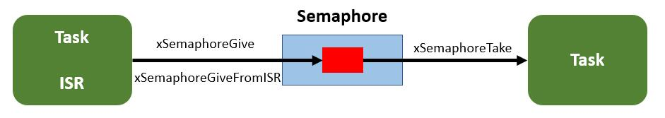
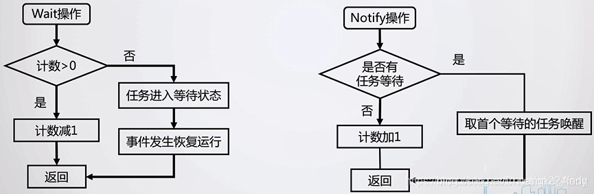
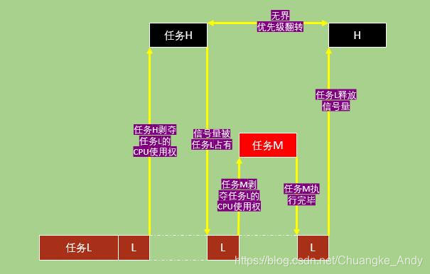
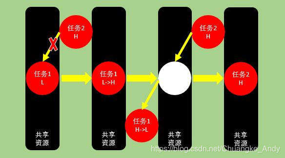

信号量一般用来进行资源管理和任务同步，FreeRTOS中信号量又分为二值信号量、计数型信号量、互斥信号量和递归互斥信号量。

## 二值信号量

### 简介

二值信号量即任务与中断间或者两个任务间的标志，该标志非“满”即“空”。也可以理解为只有一个队列项的队列，该队列要么是满要么是空，Send操作相当把该标志置“满”，Receive操作相关与把该标志取"空"，经过send和receive操作实现任务与中断间或者两任务的操作同步。二值信号量的使用方法如下图所。



### 二值信号量的函数应用

#### 创建二值信号量

```c
/********************动态创建二值信号量**********************************************/
SemaphoreHandle_t xSemaphoreCreateBinary(void);
/********************静态创建二值信号量**********************************************/
SemaphoreHandle_t xSemaphoreCreateBinaryStatic(StaticSemaphore_t *pxSemaphoreBuffer);
参数：pxSemaphoreBuffer指向一个StaticSemaphore_t类型的变量，用来保存信号量结构体
/***********************************************************************************/
返回值：创建成功返回二值信号量句柄；失败返回NULL

```

二值信号量创建函数是一个宏，最终是通过xQueueGenericCreate()函数来完成，其源码如下：

```c
/*其实就是创建了一个长度为1、队列项长度为0、类型为二值信号量的队列*/
#if( configSUPPORT_DYNAMIC_ALLOCATION == 1 )
#define xSemaphoreCreateBinary()             \
xQueueGenericCreate((UBaseType_t) 1,           \
          semSEMAPHORE_QUEUE_ITEM_LENGTH,   \
          queueQUEUE_TYPE_BINARY_SEMAPHORE)  \
#endif

```

#### 发出信号量

```c
/********************任务级信号量释放**********************************************/
BaseType_t xSemaphoreGive(SemaphoreHandle_t  xSemaphore)
/********************中断级信号量释放**********************************************/
BaseType_t xSemaphoreGiveFromISR( SemaphoreHandle_t xSemaphore,//要释放的信号量句柄
                         BaseType_t *pxHigherPriorityTaskWoken)//标记退出后是否切换任务
/***********************************************************************************/
返回值：释放成功返回pdPASS;释放失败返回errQUEUE_FULL                         

```

二值信号量释放函数xSemaphoreGive()是一个宏，其实就是向队列发送消息，其源码如下：

```c
/*其实就是没有具体消息、阻塞时间为0、后向入队的入队过程*/
#define xSemaphoreGive(xSemaphore)        \
xQueueGenericSend((QueueHandle_t) (xSemaphore), \
          NULL,             \
          semGIVE_BLOCK_TIME,       \
          queueSEND_TO_BACK)      \ 

```

#### 获取信号量

```c
/********************任务级信号量获取**********************************************/
BaseType_t xSemaphoreTake(SemaphoreHandle_t  xSemaphore//要获取的信号量句柄
              TickType_t xBlockTime)//阻塞时间
/********************中断级信号量获取**********************************************/
BaseType_t xSemaphoreTakeFromISR(SemaphoreHandle_t xSemaphore,//要获取的信号量句柄
                         BaseType_t *pxHigherPriorityTaskWoken)//标记退出后是否切换任务
/***********************************************************************************/
返回值：获取成功返回pdPASS;释放失败返回pdFALSE                      

```

获取信号量函数也是一个宏，其实就是读取队列的过程，其源码如下

```c
#define xSemaphoreTake(xSemaphore, xBlockTime)    \
xQueueGenericReceive((QueueHandle_t) (xSemaphore),   \
           NULL,               \
           (xBlockTime),           \
           pdFALSE)            \

```

## 计数信号量

计数型信号量有以下两种典型用法：

**事件计数**：每次事件发生，事件处理函数将释放信号量（信号量计数值加1），其他处理任务会获取信号量（信号量计数值减1）来处理事件。因此，计数值是事件发生的数量和事件处理的数量差值。计数信号量在创建时其值为0
**资源管理**：信号量表示有效的资源数目。任务必须先获取信号量才能获取资源控制权。当计数值减为零时表示没有的资源。当任务完成后，它会返还信号量（信号量计数值增加）。信号量创建时计数值应等于最大资源数目。

计数信号量有释放信号量操作和获取信号量操作，释放信号量操作的时候计数器的值会加一，获取信号操作，计数器的值减一，如果减到0任务会进入到等待状态；具体操作方式有两种，如下图所示：



### 计数信号量的API函数

#### 创建计数信号量

```c
/********************动态创建计数信号量**********************************************/
SemaphoreHandle_t xSemaphoreCreateCounting(UBaseType_t uxMaxCount,
                       UBaseType_t uxInitialCount)
/********************静态创建计数信号量**********************************************/
SemaphoreHandle_t xSemaphoreCreateCountingStatic(UBaseType_t uxMaxCount,//信号量最大计数值
                       UBaseType_t uxInitialCount,//计数信号量初始值
                  StaticSemaphore_t * pxSemaphoreBuffer)//保存信号量结构体
/***********************************************************************************/
返回值：创建成功返回计数信号量句柄；失败返回NULL

```

动态计数信号量创建函数是一个宏，最终是通过xQueueCreateCountingSemaphore()函数来完成，其源码如下：

```c
#if( configSUPPORT_DYNAMIC_ALLOCATION == 1 )
#define xSemaphoreCreateCounting( uxMaxCount, uxInitialCount )   \
xQueueCreateCountingSemaphore( (uxMaxCount),(uxInitialCount) )  
#endif

QueueHandle_t xQueueCreateCountingSemaphore(const UBaseType_t uxMaxCount,const UBaseType_t uxInitialCount){
  QueueHandle_t xHandle;
  /* 调用消息队列创建函数，创建队列长度为uxMaxCount，队列项长度为0，类型为计数信号量的队列 */
  xHandle = xQueueGenericCreate(uxMaxCount,queueSEMAPHORE_QUEUE_ITEM_LENGTH,queueQUEUE_TYPE_COUNTING_SEMAPHORE);
  if( xHandle != NULL ){
    /* 将计数信号量的初始值来设置uxMessagesWaiting，代表可用的资源数量 */
    ( ( Queue_t * ) xHandle )->uxMessagesWaiting = uxInitialCount;
    traceCREATE_COUNTING_SEMAPHORE();
  }
  else{
    traceCREATE_COUNTING_SEMAPHORE_FAILED();
  }
  return xHandle;
}


```

#### 释放和获取计数信号量

计数型信号量的释放与获取与二值信号量相同

## 互斥信号量

### 前提背景

#### 优先级翻转

优先级翻转是使用二值信号量时常遇见的问题，在可剥夺内核中非常常见，但是在实时系统中不允许出现这种现象，因为会破坏任务的预期顺序，可能会导致严重后果。

如下图所示的优先级翻转的例子：

1. 低优先级任务L要访问共享资源，在获取到信号量使用CPU的过程中，如果此时高优先级任务H到达，会剥夺L的CPU使用权从而运行任务H
2. 当H想要访问共享资源时，由于此时该资源的信号量仍被L占用着，H只能挂起等待L释放该信号量
3. L继续运行，此时中优先级任务M到达，再次剥夺L的CPU使用权从而运行任务M
4. M执行完后，将CPU使用权归还给任务L，L继续运行
5. L运行完毕并释放出了信号量，至此高优先级的任务H才能获取到该信号量访问共享资源并运行



由上图可见，任务H的优先级实际上降到了任务L的优先级水平，因为要一直等待L释放其占用的共享资源。过程中不需要使用共享资源的中优先级任务M抢占CPU使用权后顺利运行完成，这样就相当于M的优先级高于J，导致优先级翻转。

互斥信号量其实就是一个拥有优先级继承的二值信号量。二值信号适合于同步应用中，互斥信号适用于需要互斥访问的应用中。互斥访问中互斥信号量相当于一个钥匙，当任务想要使用资源的时候就必须先获得这个钥匙，使用完资源后必须归还这个钥匙。

当一个互斥信号量正被一个低优先级任务使用时，若有高优先级的任务也尝试获取该互斥信号量的话就会被阻塞。不过此时高优先级任务会将低优先级任务的优先级提升到与与自已相同的等级（即优先级继承）。优先级继承只是尽可能降低优先级翻转带来的影响，并不能完全消除优先级翻转。



### 互斥信号量的API函数

#### 创建互斥信号量

```c
/********************动态创建互斥信号量**********************************************/
SemaphoreHandle_t xSemaphoreCreateMutex(void)
/********************静态创建互斥信号量**********************************************/
SemaphoreHandle_t xSemaphoreCreateMutexStatic(StaticSemaphore_t * pxSemaphoreBuffer)
//参数：pxSemaphoreBuffer 指向一个StaticSemaphore_t类型的变量，用来保存信号量结构体
/***********************************************************************************/
返回值：创建成功返回互斥信号量句柄；失败返回NULL

```

动态互斥信号量创建函数是一个宏，最终是通过xQueueCreateMutex()函数来完成，其源码如下：

```c
#if( configSUPPORT_DYNAMIC_ALLOCATION == 1 )
#define xSemaphoreCreateMutex()  xQueueCreateMutex(queueQUEUE_TYPE_MUTEX)    
#endif

/**************xQueueCreateMutex源码分析*********************/
QueueHandle_t xQueueCreateMutex( const uint8_t ucQueueType ){
  Queue_t *pxNewQueue;
  const UBaseType_t uxMutexLength = (UBaseType_t) 1,uxMutexSize = (UBaseType_t) 0;
  /* 创建一个队列长度为1，队列项长度为0，队列类型为queueQUEUE_TYPE_MUTEX的队列 */
  pxNewQueue = (Queue_t *)xQueueGenericCreate(uxMutexLength,uxMutexSize,ucQueueType);
  /* 初始化互斥信号量，其实就是初始化消息队列的控制块 */
  prvInitialiseMutex( pxNewQueue );
  return pxNewQueue;
}

/**************prvInitialiseMutex源码分析*********************/
static void prvInitialiseMutex( Queue_t *pxNewQueue ){
  if( pxNewQueue != NULL ){
  /* 对创建好的队列结构体的某些互斥信号量特有的成员变量重新赋值 */
  pxNewQueue->pxMutexHolder = NULL;//互斥信号量专有的宏
  pxNewQueue->uxQueueType = queueQUEUE_IS_MUTEX;//互斥信号量专有的宏
  /* 如果是递归互斥信号量，将以下成员变量赋值为0 */
  pxNewQueue->u.uxRecursiveCallCount = 0;
  traceCREATE_MUTEX( pxNewQueue );
  /* 释放互斥信号量 */
  (void) xQueueGenericSend(pxNewQueue,NULL,(TickType_t) 0U,queueSEND_TO_BACK);
  }
  else{
  traceCREATE_MUTEX_FAILED();
  }
}

```

#### 释放互斥信号量

释放互斥信号量函数与二值信号量、计数信号量释放函数是一样的。但是由于互斥信号涉及到优先级继承的问题，所以处理过程会有一些区别。

信号量释放函数xSemaphoreGive()实际上调用xQueueGenericSend()函数，分析该函数源码（消息队列中有介绍）可见函数会调用prvCopyDataToQueue()函数。互斥信号量的优先级继承就是在prvCopyDataToQueue()函数中完成的，其源码如下：

```c
 /**************prvCopyDataToQueue源码分析*********************/                       
static BaseType_t prvCopyDataToQueue(Queue_t * const pxQueue,
                   const void *pvItemToQueue,
                  const BaseType_t xPosition){
  BaseType_t xReturn = pdFALSE;
  UBaseType_t uxMessagesWaiting;
  uxMessagesWaiting = pxQueue->uxMessagesWaiting;
  if( pxQueue->uxItemSize == (UBaseType_t) 0){
  #if ( configUSE_MUTEXES == 1 ) //如果是互斥信号量
  {
    if( pxQueue->uxQueueType == queueQUEUE_IS_MUTEX ){
    /* 调用以下函数处理优先级继承问题 */
    xReturn = xTaskPriorityDisinherit((void *) pxQueue->pxMutexHolder);
    pxQueue->pxMutexHolder = NULL;//互斥信号量释放后，就不属于任何任务了
    }
    else{
    mtCOVERAGE_TEST_MARKER();
    } 
  }
  #endif /* configUSE_MUTEXES */
  }
  /*********************************************************/
  /********************省略其他处理代码*********************/
  /*********************************************************/
  pxQueue->uxMessagesWaiting = uxMessagesWaiting + ( UBaseType_t ) 1;
  return xReturn
}

```

优先级处理函数xTaskPriorityDisinherit()的源码分析如下：

```c
BaseType_t xTaskPriorityDisinherit(TaskHandle_t const pxMutexHolder){
  TCB_t * const pxTCB = ( TCB_t * ) pxMutexHolder;
  BaseType_t xReturn = pdFALSE;
  if( pxMutexHolder != NULL ){
  /* 任务获取到互斥信号量后就会涉及到优先级继承 */
  configASSERT( pxTCB == pxCurrentTCB );
  configASSERT( pxTCB->uxMutexesHeld );
  ( pxTCB->uxMutexesHeld )--;//用于标记任务当前获取到的互斥信号量个数
  /* 如果任务当前优先级和任务基优先级不同，则存在优先级继承 */
  if(pxTCB->uxPriority != pxTCB->uxBasePriority){
    /* 当前任务只获取到一个互斥信号量 */
    if( pxTCB->uxMutexesHeld == ( UBaseType_t ) 0 ){
    /* 把任务的当前优先级降低到基优先级 */
    if(uxListRemove(&(pxTCB->xStateListItem)) == (UBaseType_t ) 0){
      taskRESET_READY_PRIORITY( pxTCB->uxPriority );
    }
    else{
      mtCOVERAGE_TEST_MARKER();
    }
    /* 使用新的优先级将任务添加到就绪列表中 */
    traceTASK_PRIORITY_DISINHERIT( pxTCB, pxTCB->uxBasePriority );
    pxTCB->uxPriority = pxTCB->uxBasePriority;
    /* 复位任务的事件列表项 */
    listSET_LIST_ITEM_VALUE( &( pxTCB->xEventListItem ), \
    (TickType_t)configMAX_PRIORITIES - (TickType_t)pxTCB->uxPriority); 
    prvAddTaskToReadyList( pxTCB );//将恢复优先级后的任务重新添加到就绪表
    xReturn = pdTRUE;//返回pdTRUE，表示需要进行任务调度
    }
    else{
    mtCOVERAGE_TEST_MARKER();
    }
  }
  else{
    mtCOVERAGE_TEST_MARKER();
  }
  }
  else{
  mtCOVERAGE_TEST_MARKER();
  }
  return xReturn;
}

```

#### 获取互斥信号量

互斥信号量获取函数与二值信号量、计数信号量获取函数是一样的，都是xSemaphoreTake()函数，最终调用xQueueGenericReceive()；获取互斥信号量的过程也需要处理优先级继承的问题，源码分析如下示

```c
BaseType_t xQueueGenericReceive(QueueHandle_t xQueue, 
                void * const pvBuffer, 
                TickType_t xTicksToWait, 
                const BaseType_t xJustPeeking){
  BaseType_t xEntryTimeSet = pdFALSE;
  TimeOut_t xTimeOut;
  int8_t *pcOriginalReadPosition;
  Queue_t * const pxQueue = ( Queue_t * ) xQueue;

  for( ;; ){
  taskENTER_CRITICAL();
  {
    const UBaseType_t uxMessagesWaiting = pxQueue->uxMessagesWaiting;
      /* 判断队列是否有消息 */
    if(uxMessagesWaiting > (UBaseType_t ) 0){
    /* 如有数据，调用以下函数使用数据拷贝的方式从队列中提取数据 */
    pcOriginalReadPosition = pxQueue->u.pcReadFrom;
    prvCopyDataFromQueue( pxQueue, pvBuffer );
    if( xJustPeeking == pdFALSE ){//数据读取后需要将数据删除
      traceQUEUE_RECEIVE( pxQueue );
          /* 移除消息 */
      pxQueue->uxMessagesWaiting = uxMessagesWaiting - 1;
        #if ( configUSE_MUTEXES == 1 )
      {
      if( pxQueue->uxQueueType == queueQUEUE_IS_MUTEX ){
      /* 若获取信号量成功，则标记互斥信号量的所有者 */
        pxQueue->pxMutexHolder = (int8_t *) pvTaskIncrementMutexHeldCount(); 
      }
      else{
        mtCOVERAGE_TEST_MARKER();
      }
      }
      #endif /* configUSE_MUTEXES */
      /* 查看是否有任务因为入队而阻塞，若有就解除阻塞态 */
       if(listLIST_IS_EMPTY(&( pxQueue->xTasksWaitingToSend)) == pdFALSE){
      if(xTaskRemoveFromEventList(&(pxQueue->xTasksWaitingToSend)) != pdFALSE){
        /* 若解除阻塞的任务优先级比当前任务高，就需要进行一次任务切换 */
        queueYIELD_IF_USING_PREEMPTION();
      }
      else{
        mtCOVERAGE_TEST_MARKER();
      }
      }
      else{
      mtCOVERAGE_TEST_MARKER();
      }
    }
    else{//数据读取后不需要将数据删除
      traceQUEUE_PEEK( pxQueue );
      pxQueue->u.pcReadFrom = pcOriginalReadPosition;
      /* 查看是否有任务因为出队而阻塞，若有就解除阻塞态 */
      if(listLIST_IS_EMPTY(&(pxQueue->xTasksWaitingToReceive)) == pdFALSE){
      if( xTaskRemoveFromEventList( &( pxQueue->xTasksWaitingToReceive ) ) != pdFALSE ){
        /* 若解除阻塞的任务优先级比当前任务高，就需要进行一次任务切换 */
        queueYIELD_IF_USING_PREEMPTION();
      }
      else{
        mtCOVERAGE_TEST_MARKER();
      }
      }
      else{
      mtCOVERAGE_TEST_MARKER();
      }
    }
    taskEXIT_CRITICAL();
    return pdPASS;
    }
    else{  //若队列为空
    if( xTicksToWait == ( TickType_t ) 0 ){
      /* 如阻塞时间为0，则直接返回errQUEUE_EMPTY */
      taskEXIT_CRITICAL();
      traceQUEUE_RECEIVE_FAILED( pxQueue );
      return errQUEUE_EMPTY;
    }
    else if( xEntryTimeSet == pdFALSE ){
      /* 若阻塞时间不为0，则初始化时间状态结构体 */
      vTaskSetTimeOutState( &xTimeOut );
      xEntryTimeSet = pdTRUE;
    }
    else{
      /* Entry time was already set. */
      mtCOVERAGE_TEST_MARKER();
    }
    }
  }
  taskEXIT_CRITICAL();
  vTaskSuspendAll();
  prvLockQueue( pxQueue );
  /* 更新时间状态结构体，检查是否超时 */
  if( xTaskCheckForTimeOut( &xTimeOut, &xTicksToWait ) == pdFALSE ){
    /* 检查队列是否为空 */
    if( prvIsQueueEmpty( pxQueue ) != pdFALSE){//若队列为空
    traceBLOCKING_ON_QUEUE_RECEIVE( pxQueue );
    #if ( configUSE_MUTEXES == 1 )
    {
      if( pxQueue->uxQueueType == queueQUEUE_IS_MUTEX ){
      taskENTER_CRITICAL();
      {
        /* 处理互斥信号量的优先级继承 */
        vTaskPriorityInherit( ( void * ) pxQueue->pxMutexHolder );
      }
      taskEXIT_CRITICAL();
      }
      else{
      mtCOVERAGE_TEST_MARKER();
      }
    }
    #endif
    /* 由于队列为空，将任务添加到xTasksWaitingToReceive列表中 */
    vTaskPlaceOnEventList( &( pxQueue->xTasksWaitingToReceive ), xTicksToWait );
    prvUnlockQueue( pxQueue );
    if( xTaskResumeAll() == pdFALSE )
    {
      portYIELD_WITHIN_API();
    }
    else
    {
      mtCOVERAGE_TEST_MARKER();
    }
    }
    else  //若队列不为空，重试一次出队
    {
    prvUnlockQueue( pxQueue );
    ( void ) xTaskResumeAll();
    }
  }
  else
  {
    prvUnlockQueue( pxQueue );
    ( void ) xTaskResumeAll();
      if( prvIsQueueEmpty( pxQueue ) != pdFALSE )
    {
    traceQUEUE_RECEIVE_FAILED( pxQueue );
    return errQUEUE_EMPTY;
    }
    else
    {
    mtCOVERAGE_TEST_MARKER();
    }
  }
  }
}

```

## 递归互斥信号量

递归互斥信号量是一种特殊的互斥信号量，已经获取了互斥信号量的任务不能再次获取这个互斥信号量，但是递归互斥信号量不同；已经获取了递归互斥信号量的任务可以再次获取这个递归互斥信号量（即可以嵌套使用），且次数不限。

递归互斥信号量也有优先级继承的问题。一个任务获取了多少次递归互斥信号量就必须释放多少次。比如，若某个任务成功获取了3次递归互斥量，那么该任务也需要同样释放3次递归信号量。同互斥信号量一样，递归互斥信号量不能用在中断服务函数中。

### 递归互斥信号量的API函数

#### 创建递归互斥信号量

```c
/********************动态创建递归互斥信号量**********************************************/
SemaphoreHandle_t xSemaphoreCreateRecursiveMutex(void)
/********************静态创建递归互斥信号量**********************************************/
SemaphoreHandle_t xSemaphoreCreateRecursiveMutexStatic(StaticSemaphore_t * pxSemaphoreBuffer)
//参数：pxSemaphoreBuffer 指向一个StaticSemaphore_t类型的变量，用来保存信号量结构体
/***********************************************************************************/
返回值：创建成功返回互斥信号量句柄；失败返回NULL

```

动态递归互斥信号量创建函数是一个宏，最终是通过xQueueCreateMutex()函数来完成，其源码如下：

```c
#if( configSUPPORT_DYNAMIC_ALLOCATION == 1 )
#define xSemaphoreCreateRecursiveMutex()    \
    xQueueCreateMutex(queueQUEUE_TYPE_RECURSIVE_MUTEX)    
#endif

```

xQueueCreateMutex函数的源码分析，可参考互斥信号量介绍

#### 释放递归互斥信号量

递归互斥信号量有专门的释放函数：xSemaphoreGiveRecursive()

```c
/********************递归互斥信号量释放*************************************/
BaseType_t xSemaphoreGiveRecursive(SemaphoreHandle_t  xMutex)
/************************************************************************/
返回值：释放成功返回pdPASS;释放失败返回pdFAIL                   

```

递归互斥信号量释放函数是一个宏，最终调用xQueueGiveMutexRecursive()函数，源码如下示：

```c
#define xSemaphoreGiveRecursive(xMutex)    xQueueGiveMutexRecursive((xMutex))

/**************xQueueGiveMutexRecursive()函数*********************/
BaseType_t xQueueGiveMutexRecursive( QueueHandle_t xMutex ){
  BaseType_t xReturn;
  Queue_t * const pxMutex = ( Queue_t * ) xMutex;
  /* 检查递归互斥信号量是不是被当前任务获取 */
  if(pxMutex->pxMutexHolder == (void *)xTaskGetCurrentTaskHandle()){
  ( pxMutex->u.uxRecursiveCallCount )--;//用来记录递归信号量被释放的次数
  /* uxRecursiveCallCount为0时，说明是最后一次释放 */
  if(pxMutex->u.uxRecursiveCallCount == (UBaseType_t) 0){
    /* 此时调用xQueueGenericSend完成真正的释放  */
    (void)xQueueGenericSend(pxMutex,NULL,queueMUTEX_GIVE_BLOCK_TIME,queueSEND_TO_BACK);
  }
  else{
    mtCOVERAGE_TEST_MARKER();
  }
  xReturn = pdPASS;//释放成功
  }
  else{
  xReturn = pdFAIL;//不是被当前任务获取，释放失败
  }
  return xReturn;
}


```

#### 获取递归互斥信号量

递归互斥信号量有专门的获取函数：xSemaphoreTakeRecursive()

```c
/********************递归互斥信号量获取*******************************************/
BaseType_t xSemaphoreTakeRecursive(SemaphoreHandle_t  xMutex//要获取的信号量句柄
                     TickType_t xBlockTime)//阻塞时间
/******************************************************************************/
返回值：获取成功返回pdPASS;释放失败返回pdFALSE                      

```

递归互斥信号量获取函数是一个宏，最终调用xQueueTakeMutexRecursive()函数，源码如下示：

```c
#if( configUSE_RECURSIVE_MUTEXES == 1 )
#define xSemaphoreTakeRecursive( xMutex, xBlockTime ) \
xQueueTakeMutexRecursive(( xMutex ), ( xBlockTime ))
#endif

/**************xQueueTakeMutexRecursive()函数*********************/
BaseType_t xQueueTakeMutexRecursive(QueueHandle_t xMutex,TickType_t xTicksToWait){
  BaseType_t xReturn;
  Queue_t * const pxMutex = ( Queue_t * ) xMutex;
  /* 检查当前任务是不是递归互斥信号量的拥有者 */
  if(pxMutex->pxMutexHolder == (void *) xTaskGetCurrentTaskHandle()){
  ( pxMutex->u.uxRecursiveCallCount )++;//若是，表示本次是重复获取信号量
  xReturn = pdPASS;
  }
  else{//如果任务是第一次获取信号量，就需要调用以下函数完成真正的信号量获取
  xReturn = xQueueGenericReceive( pxMutex, NULL, xTicksToWait, pdFALSE );
  /* 第一次获取信号量成功后，将uxRecursiveCallCount加1 */
  if( xReturn != pdFAIL ){
    ( pxMutex->u.uxRecursiveCallCount )++;
  }
  else{
    traceTAKE_MUTEX_RECURSIVE_FAILED( pxMutex );
  }
  }
  return xReturn;
}


```
