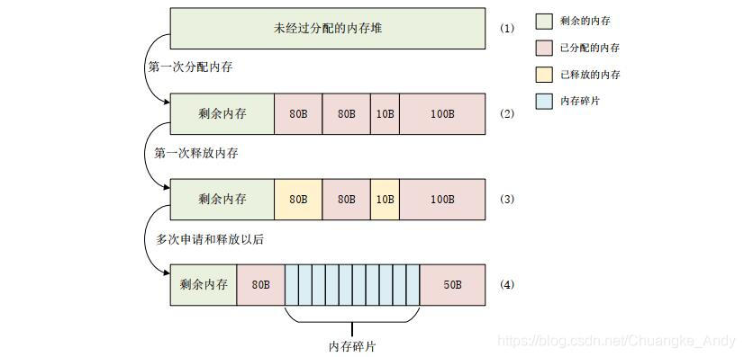
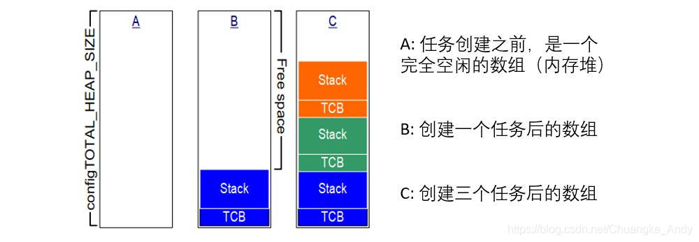
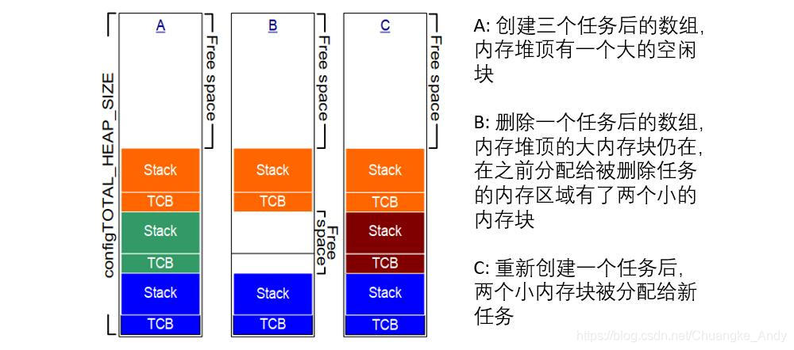
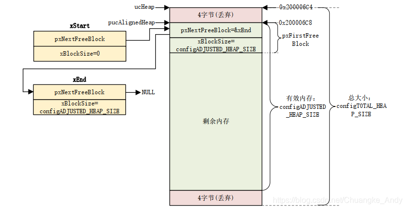
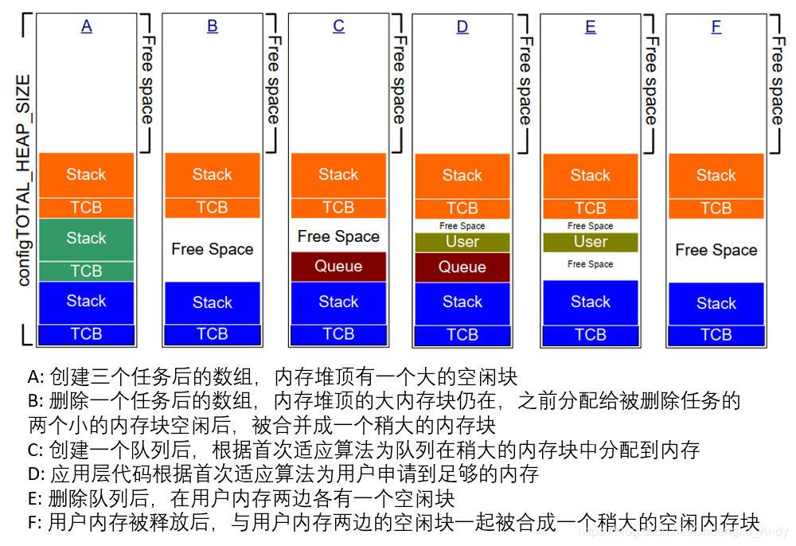

内存管理是一个系统基本组成部分，FreeRTOS中大量使用了内存管理，比如创建任务、信号量、队列等会自动从堆中申请内存。用户应用层代码也可以使用FreeRTOS提供的内存管理函数来申请和释放内存

## 简介

FreeRTOS创建任务、信号量、队列等的时候有两种内存申请的方法：一种是动态的申请所需的RAM；一种是由用户自行定义所需的RAM（静态申请）。

| 两者的区别 | 动态内存                                          | 静态内存                 |
| ----- | --------------------------------------------- | -------------------- |
| 时间不同  | 发生在程序调入和执行的时候                                 | 发生在程序编译和连接的时候        |
| 空间不同  | 堆只能动态分配；栈可以动态分配；动态分配由函数malloc进行（栈的动态分配由编译器进行） | 栈也可以静态分配；静态分配是编译器完成的 |

标准C库中的malloc()和free()函数也可以实现动态内存管理，但是其有如下缺陷：

- 在小型嵌入式系统中效率不高
- 占据了相当大的一块代码空间
- 它们几乎都不是安全的
- 具有不确定性，每次执行的时间不同
- 有可能产生内存碎片
- 这两个函数会使得链接器配置得复杂
- 若允许堆空间的生长方向覆盖其他变量占据的内存，会成为 debug 的灾难

内存碎片是指小块的、碎片化的内存。内存碎片是伴随着内存申请和释放而来的，如下图所示




FreeRTOS使用pvPortMalloc()函数来替代malloc()申请内存，使用vPortFree()函数来替代 free()释放内存

不同的嵌入式系统对于内存分配和时间要求不同，内存分配算法可作为系统的可选选项，FreeRTOS使用者就可以使用适合的内存分配方法。FreeRTOS提供了5中内存分配方法，这5种方法分别对应heap\_1.c、heap\_2.c、heap\_3.c、heap\_4.c、heap\_5.c这五个文件。下面将会详见介绍这五种方法的区别。

| 分配方法      | 区别                                  |
| --------- | ----------------------------------- |
| heap\_1.c | 最简单，但是只能申请内存，不能释放                   |
| heap\_2.c | 提供了内存释放函数，但是不能合并内存块，易导致内存碎片         |
| heap\_3.c | 对标准C中的malloc()和free()的简单封装，并提供了线程保护 |
| heap\_4.c | 在heap\_2.c的基础上增加了内存块合并功能，降低了内存碎片的产生 |
| heap\_5.c | 在heap\_4.c的基础上，支持内存堆使用不连续的内存块       |

## heap\_1内存分配方法

### 分配方法介绍

动态内存分配需要一个内存堆，不管哪种分配方法，FreeRTOS中的内存堆都为uxHeap\[]，大小为configTOTAL\_HEAP\_SIZE,其在heap\_x.c（x为1\~5）中定义

```c
#if (configAPPLICATION_ALLCATED_HEAP == 1)  
  extern uint8_t ucHeap[configTOTAL_HEAP_SIZE]; //需要用户自行定义内存堆
#else
  static uint8_t ucHeap[configTOTAL_HEAP_SIZE]; //编译器决定

```


heap\_1内存分配的特点如下：

- 适用于创建好任务、信号量和队列就不会删除的应用
- 具有可确定性，不会导致内存碎片
- 代码实现和内存分配过程简单，内存是从一个静态数字中分配，适合于不需要动态内存分配的应用



### 内存申请函数

heap\_1的内存申请函数pvPortMalloc()源码如下：

```c
void *pvPortMalloc( size_t xWantedSize ){
  void *pvReturn = NULL;
  static uint8_t *pucAlignedHeap = NULL;
  /* 确保字节对齐 */
  #if( portBYTE_ALIGNMENT != 1 )
  {
  if( xWantedSize & portBYTE_ALIGNMENT_MASK ){
    /* 需要进行字节对齐 */
    xWantedSize += (portBYTE_ALIGNMENT-(xWantedSize&portBYTE_ALIGNMENT_MASK));
  }
  }
  #endif
  vTaskSuspendAll();//挂起任务调度器，申请内存过程不能被其他任务打断
  {
  if( pucAlignedHeap == NULL ){
    /* 确保内存堆的开始地址是字节对齐的 */
    pucAlignedHeap = (uint8_t *)(((portPOINTER_SIZE_TYPE) &ucHeap[portBYTE_ALIGNMENT]) & (~((portPOINTER_SIZE_TYPE)portBYTE_ALIGNMENT_MASK)));
  }
  /* 检查是否有足够的内存供分配，以及是否越界 */
  if(((xNextFreeByte + xWantedSize) < configADJUSTED_HEAP_SIZE) &&((xNextFreeByte + xWantedSize) > xNextFreeByte)){
    pvReturn = pucAlignedHeap + xNextFreeByte;//返回申请到的内存首地址
    xNextFreeByte += xWantedSize;
  }
  traceMALLOC( pvReturn, xWantedSize );
  }
  ( void ) xTaskResumeAll();//恢复任务调度器
  #if( configUSE_MALLOC_FAILED_HOOK == 1 )//若使能了内存申请失败钩子函数
  {
  if( pvReturn == NULL ){
    extern void vApplicationMallocFailedHook(void);//钩子函数，用户自已实现
    vApplicationMallocFailedHook();
  }
  }
  #endif
  return pvReturn;//成功返回申请到的内存首地址，失败返回NULL
}

```


### 内存释放函数

```c
void vPortFree( void *pv ){
  /* 可以看出没有具体的释放过程，即申请内存成功就不允许释放 */
  ( void ) pv;
  configASSERT( pv == NULL );
}

```


## heap\_2内存分配方法

### 分配方法介绍

heap\_2提供了内存释放函数，但是缺点是不会把释放的内存块合并成大的内存块，因此随着不断的申请释放内存，内存堆就会被分为多个大小不一的内存块，也就是会导致内存碎片

内存块：为了实现内存释放，heap\_2引入了内存块概念，每分出去一段内存就是一个内存块，剩下的空闲内存也是一个内存块，内存块大小不定。使用链表结构来管理内存块。

```c
typedef struct A_BLOCK_LINK
{
  struct A_BLOCK_LINK *pxNextFreeBlock;  //指向下一个空闲内存块
  size_t xBlockSize;  //当前空闲内存块大小
} BlockLink_t;
```


heap\_2内存分配的特点如下：

- 可使用在可能会重复的删除任务、队列、信号量等的应用中
- 若分配和释放的内存大小是随机的，不建议使用该分配方法
- 具有不可确定性，但仍比标准C中的malloc()和free()效率高




### 内存堆初始化函数

内存堆初始化函数prvHeapInit( )源码如下：

```c
static void prvHeapInit( void ){
  BlockLink_t *pxFirstFreeBlock;
  uint8_t *pucAlignedHeap;
  /* 确保内存堆开始地址是字节对齐的 */
  pucAlignedHeap=(uint8_t *)(((portPOINTER_SIZE_TYPE)&ucHeap[portBYTE_ALIGNMENT])\
  &(~((portPOINTER_SIZE_TYPE)portBYTE_ALIGNMENT_MASK)));
  /* xStart指向空闲内存块链表首 */
  xStart.pxNextFreeBlock = ( void * ) pucAlignedHeap;
  xStart.xBlockSize = ( size_t ) 0;
  /* xEnd指向空闲内存块链表表尾 */
  xEnd.xBlockSize = configADJUSTED_HEAP_SIZE;
  xEnd.pxNextFreeBlock = NULL;
  /* 初始化时只有一个空闲内存块，其大小就是可用的内存堆大小 */
  pxFirstFreeBlock = ( void * ) pucAlignedHeap;
  pxFirstFreeBlock->xBlockSize = configADJUSTED_HEAP_SIZE;
  pxFirstFreeBlock->pxNextFreeBlock = &xEnd;
}

```


初始化后的内存堆




### 内存块插入函数

heap\_2允许内存释放，可用使用内存块插入函数将释放的内存添加到内存链表中

```c
#define prvInsertBlockIntoFreeList( pxBlockToInsert ){  
  BlockLink_t *pxIterator;          
  size_t xBlockSize;      
  xBlockSize = pxBlockToInsert->xBlockSize;  
  /* 遍历链表，查找插入点 */                        
  for(pxIterator=&xStart;pxIterator->pxNextFreeBlock->xBlockSize<xBlockSize;\
  pxIterator = pxIterator->pxNextFreeBlock){                                        
  /* 不做任何操作 */
  }                                        
  /* 将内存块插入到插入点 */                                  
  pxBlockToInsert->pxNextFreeBlock = pxIterator->pxNextFreeBlock;    
  pxIterator->pxNextFreeBlock = pxBlockToInsert;      
}

```


### 内存申请函数

```c
void *pvPortMalloc( size_t xWantedSize ){
  BlockLink_t *pxBlock, *pxPreviousBlock, *pxNewBlockLink;
  static BaseType_t xHeapHasBeenInitialised = pdFALSE;
  void *pvReturn = NULL;
  vTaskSuspendAll();
  {
  /* 第一次申请内存需要初始化内存堆 */
  if( xHeapHasBeenInitialised == pdFALSE ){
    prvHeapInit();
    xHeapHasBeenInitialised = pdTRUE;
  }
  /* 内存大小字节对齐，实际申请时还要加上结构体空间 */
  if( xWantedSize > 0 ){
    xWantedSize += heapSTRUCT_SIZE;
    /* xWantedSize做字节对齐 */
    if( ( xWantedSize & portBYTE_ALIGNMENT_MASK ) != 0 ){
    /* 字节对齐 */
    xWantedSize += (portBYTE_ALIGNMENT - (xWantedSize&portBYTE_ALIGNMENT_MASK));
    }
  }
  /* 申请的内存大小合理，则进行内存分配 */
  if((xWantedSize > 0) && (xWantedSize < configADJUSTED_HEAP_SIZE)){
    /* 从xStart开始查找大小满足的内存块 */
    pxPreviousBlock = &xStart;
    pxBlock = xStart.pxNextFreeBlock;
    while((pxBlock->xBlockSize < xWantedSize)&&(pxBlock->pxNextFreeBlock != NULL)){
    pxPreviousBlock = pxBlock;
    pxBlock = pxBlock->pxNextFreeBlock;
    }
    /* 找到的可用内存块不能是链表尾xEnd */
    if( pxBlock != &xEnd ){
    /* 返回申请到的内存首地址 */
    pvReturn=(void *)(((uint8_t *)pxPreviousBlock->pxNextFreeBlock)+heapSTRUCT_SIZE);
    /* 内存块已经被申请掉了，将该内存块从空闲内存块链表中移除  */
    pxPreviousBlock->pxNextFreeBlock = pxBlock->pxNextFreeBlock;
    /* 如果申请到的内存减去所需内存还大于heapMINIMUM_BLOCK_SIZE */
    if((pxBlock->xBlockSize - xWantedSize) > heapMINIMUM_BLOCK_SIZE){
      /* 就把多余出来的内存重新组合成一个新的可用空闲内存块 */
      pxNewBlockLink = ( void * ) ( ( ( uint8_t * ) pxBlock ) + xWantedSize );
      pxNewBlockLink->xBlockSize = pxBlock->xBlockSize - xWantedSize;
      pxBlock->xBlockSize = xWantedSize;
      /* 将新的空闲内存块插入到空闲内存块链表中 */
      prvInsertBlockIntoFreeList( ( pxNewBlockLink ) );
    }
    xFreeBytesRemaining -= pxBlock->xBlockSize;//更新内存堆剩余内存大小
    }
  }
  traceMALLOC( pvReturn, xWantedSize );
  }
  (void) xTaskResumeAll();//恢复任务调度器
  #if( configUSE_MALLOC_FAILED_HOOK == 1 )
  {
  if( pvReturn == NULL ){
    extern void vApplicationMallocFailedHook( void );
    vApplicationMallocFailedHook();
  }
  }
  #endif
  return pvReturn;
}

```


### 内存释放函数

```c
void vPortFree( void *pv ){
  uint8_t *puc = ( uint8_t * ) pv;
  BlockLink_t *pxLink;
  if( pv != NULL ){
  /* 要释放的内存首地址，需要减去heap结构体的内存大小 */
  puc -= heapSTRUCT_SIZE;
  /* 防止编译器报错 */
  pxLink = ( void * ) puc;
  vTaskSuspendAll();
  {
    /* 将内存块添加到空闲内存块链表中 */
    prvInsertBlockIntoFreeList( ( ( BlockLink_t * ) pxLink ) );
    xFreeBytesRemaining += pxLink->xBlockSize;
    traceFREE( pv, pxLink->xBlockSize );
  }
  ( void ) xTaskResumeAll();
  }
}

```


## heap\_3内存分配方法

### 分配方法介绍

heap\_3是对标准C中的malloc()和free()的简单封装，并做了线程保护

heap\_3内存分配的特点如下：

- 需要编译器提供一个内存堆，编译器库要提供malloc()和free()函数
- 通过修改启动文件中的Heap\_Size来修改内存堆的大小（STM32中）
- configTOTAL\_HEAP\_SZIE不起作用
- 具有不确定性，并且会增加代码量

### 内存申请函数

```c
void *pvPortMalloc( size_t xWantedSize ){
  void *pvReturn;
  vTaskSuspendAll();//挂起任务调度器，提供线程保护
  {
  pvReturn = malloc( xWantedSize );//调用malloc申请内存
  traceMALLOC( pvReturn, xWantedSize );
  }
  ( void ) xTaskResumeAll();//恢复任务调度器
  #if( configUSE_MALLOC_FAILED_HOOK == 1 )
  {
  if( pvReturn == NULL ){
    extern void vApplicationMallocFailedHook( void );
    vApplicationMallocFailedHook();
  }
  }
  #endif
  return pvReturn;
}

```


### 内存释放函数

```c
void vPortFree( void *pv ){
  if( pv ){
  vTaskSuspendAll();//挂起任务调度器，提供线程保护
  {
    free( pv );//调用free释放内存
    traceFREE( pv, 0 );
  }
  ( void ) xTaskResumeAll();//恢复任务调度器
  }
}

```


## heap\_4内存分配方法

### 分配方法介绍

heap\_4提供了一个最优的匹配算法，与heap\_2不同，heap\_4会将内存碎片合并成一个大的可用内存块

heap\_4内存分配的特点如下：

- 可用在需要重复创建和删除任务、队列、信号量等的应用中
- 不会像heap\_2那样产生严重的内存碎片
- 具有不确定性，但比标准C中的malloc()和free()效率高



### 内存堆初始化函数

```c
static void prvHeapInit( void ){
  BlockLink_t *pxFirstFreeBlock;
  uint8_t *pucAlignedHeap;
  size_t uxAddress;
  size_t xTotalHeapSize = configTOTAL_HEAP_SIZE;
  /* 起始地址做字节对齐处理 */
  uxAddress = ( size_t ) ucHeap;
  if( ( uxAddress & portBYTE_ALIGNMENT_MASK ) != 0 ){
  uxAddress += ( portBYTE_ALIGNMENT - 1 );
  uxAddress &= ~( ( size_t ) portBYTE_ALIGNMENT_MASK );
  xTotalHeapSize -= uxAddress - ( size_t ) ucHeap;
  }
  pucAlignedHeap = ( uint8_t * ) uxAddress;
  /* xStars为空闲内存块链表头 */
  xStart.pxNextFreeBlock = ( void * ) pucAlignedHeap;
  xStart.xBlockSize = ( size_t ) 0;
  /* pxEnd为空闲内存块链表尾 */
  uxAddress = ( ( size_t ) pucAlignedHeap ) + xTotalHeapSize;
  uxAddress -= xHeapStructSize;
  uxAddress &= ~( ( size_t ) portBYTE_ALIGNMENT_MASK );
  pxEnd = ( void * ) uxAddress;
  pxEnd->xBlockSize = 0;
  pxEnd->pxNextFreeBlock = NULL;
  /* 开始时内存堆整个空间是一个空闲内存块 */
  pxFirstFreeBlock = ( void * ) pucAlignedHeap;
  pxFirstFreeBlock->xBlockSize = uxAddress - ( size_t ) pxFirstFreeBlock;
  pxFirstFreeBlock->pxNextFreeBlock = pxEnd;
  /* 只存在一个内存块，且该内存块大小为整个内存堆空间 */
  xMinimumEverFreeBytesRemaining = pxFirstFreeBlock->xBlockSize;
  xFreeBytesRemaining = pxFirstFreeBlock->xBlockSize;
  /* Work out the position of the top bit in a size_t variable. */
  xBlockAllocatedBit = ((size_t)1) << ((sizeof(size_t)*heapBITS_PER_BYTE)-1);
}

```


完成初始化后的内存堆


### 内存块插入函数

内存块插入函数用来将某个内存块插入到空闲内存块链表中，其源码如下

```c
static void prvInsertBlockIntoFreeList( BlockLink_t *pxBlockToInsert ){
  BlockLink_t *pxIterator;
  uint8_t *puc;
  /* 遍历空闲内存块链表，查找内存块插入点 */
  for(pxIterator=&xStart;pxIterator->pxNextFreeBlock<pxBlockToInsert;pxIterator=pxIterator->pxNextFreeBlock){
  /* 不做任何处理 */
  }
  /* 若插入的内存块可以和前一个内存块合并的话就合并两个内存块 */
  puc = ( uint8_t * ) pxIterator;
  if( ( puc + pxIterator->xBlockSize ) == ( uint8_t * ) pxBlockToInsert ){
  pxIterator->xBlockSize += pxBlockToInsert->xBlockSize;
  pxBlockToInsert = pxIterator;
  }
  else{
  mtCOVERAGE_TEST_MARKER();
  }
  /* 检查是否可以与后面的内存块合并 */
  puc = ( uint8_t * ) pxBlockToInsert;
  if( ( puc + pxBlockToInsert->xBlockSize ) == ( uint8_t * ) pxIterator->pxNextFreeBlock ){
  if( pxIterator->pxNextFreeBlock != pxEnd ){
    /* 将两个内存块合并成一个大的内存块 */
    pxBlockToInsert->xBlockSize += pxIterator->pxNextFreeBlock->xBlockSize;
    pxBlockToInsert->pxNextFreeBlock = pxIterator->pxNextFreeBlock->pxNextFreeBlock;
  }
  else{
    pxBlockToInsert->pxNextFreeBlock = pxEnd;
  }
  }
  else{
  pxBlockToInsert->pxNextFreeBlock = pxIterator->pxNextFreeBlock;
  }
  /* 若不等于，表示内存块插入过程中没有进行过内存块合并 */
  if( pxIterator != pxBlockToInsert ){
  pxIterator->pxNextFreeBlock = pxBlockToInsert;
  }
  else{
  mtCOVERAGE_TEST_MARKER();
  }
}

```


### 内存申请函数

```c
void *pvPortMalloc( size_t xWantedSize ){
  BlockLink_t *pxBlock, *pxPreviousBlock, *pxNewBlockLink;
  void *pvReturn = NULL;
  vTaskSuspendAll();
  {
  /* 若第一次调用，则需初始化内存堆 */
  if( pxEnd == NULL ){
    prvHeapInit();
  }
  else{
    mtCOVERAGE_TEST_MARKER();
  }
  /* 需要申请的内存块大小的最高位不能为1，最高位是用来记录内存块有没有被使用 */
  if( ( xWantedSize & xBlockAllocatedBit ) == 0 ){
    /*  实际申请的内存数需要加上结构体的大小 */
    if( xWantedSize > 0 ){
    xWantedSize += xHeapStructSize;
    /* xWantedSize做字节对齐 */
    if( ( xWantedSize & portBYTE_ALIGNMENT_MASK ) != 0x00 ){
      /* 字节对齐 */
      xWantedSize += (portBYTE_ALIGNMENT-(xWantedSize&portBYTE_ALIGNMENT_MASK));
      configASSERT((xWantedSize & portBYTE_ALIGNMENT_MASK) == 0);
    }
    else{
      mtCOVERAGE_TEST_MARKER();
    }
    }
    else{
    mtCOVERAGE_TEST_MARKER();
    }
    
    if((xWantedSize > 0) && (xWantedSize <= xFreeBytesRemaining)){
    /* 从xStart开始，查找大小满足所需内存数的内存块 */
    pxPreviousBlock = &xStart;
    pxBlock = xStart.pxNextFreeBlock;
    while((pxBlock->xBlockSize < xWantedSize)&&(pxBlock->pxNextFreeBlock != NULL)){
      pxPreviousBlock = pxBlock;
      pxBlock = pxBlock->pxNextFreeBlock;
    }
    /* 如果找到的内存块是pxEnd的话就表示没有内存可以分配 */
    if( pxBlock != pxEnd ){
      /* 找到内存块后将内存首地址保存到pvReturn中 */
      pvReturn = (void *)(((uint8_t *)pxPreviousBlock->pxNextFreeBlock) + xHeapStructSize);
      /* 内存块已经被申请了，需要将该内存块从空闲内存块链表中移除 */
      pxPreviousBlock->pxNextFreeBlock = pxBlock->pxNextFreeBlock;
      /* 如果申请到的内存块大于所需内存，就将其分成两块 */
      if((pxBlock->xBlockSize - xWantedSize) > heapMINIMUM_BLOCK_SIZE){
      /* 就把多余出来的内存重新组合成一个新的可用空闲内存块 */
      pxNewBlockLink = ( void * ) ( ( ( uint8_t * ) pxBlock ) + xWantedSize );
      configASSERT(((( size_t) pxNewBlockLink) & portBYTE_ALIGNMENT_MASK) == 0);
      pxNewBlockLink->xBlockSize = pxBlock->xBlockSize - xWantedSize;
      pxBlock->xBlockSize = xWantedSize;
      /* 将新的空闲内存块插入到空闲内存块链表中 */
      prvInsertBlockIntoFreeList( pxNewBlockLink );
      }
      else{
      mtCOVERAGE_TEST_MARKER();
      }
      xFreeBytesRemaining -= pxBlock->xBlockSize;//更新内存堆剩余内存大小
      if( xFreeBytesRemaining < xMinimumEverFreeBytesRemaining ){
      xMinimumEverFreeBytesRemaining = xFreeBytesRemaining;
      }
      else{
      mtCOVERAGE_TEST_MARKER();
      }
      /* 内存块申请成功，标记此内存块已经被使用 */
      pxBlock->xBlockSize |= xBlockAllocatedBit;
      pxBlock->pxNextFreeBlock = NULL;
    }
    else{
      mtCOVERAGE_TEST_MARKER();
    }
    }
    else{
    mtCOVERAGE_TEST_MARKER();
    }
  }
  else{
    mtCOVERAGE_TEST_MARKER();
  }
  traceMALLOC( pvReturn, xWantedSize );
  }
  ( void ) xTaskResumeAll();
  #if( configUSE_MALLOC_FAILED_HOOK == 1 )
  {
  if( pvReturn == NULL ){
    extern void vApplicationMallocFailedHook( void );
    vApplicationMallocFailedHook();
  }
  else{
    mtCOVERAGE_TEST_MARKER();
  }
  }
  #endif
  configASSERT((((size_t)pvReturn) & (size_t)portBYTE_ALIGNMENT_MASK) == 0);
  return pvReturn;
}

```


### 内存释放函数

```c
void vPortFree( void *pv ){
  uint8_t *puc = ( uint8_t * ) pv;
  BlockLink_t *pxLink;
  if( pv != NULL ){
  /* 获取内存块的BlockLink_t结构体 */
  puc -= xHeapStructSize;
  /* 防止编译器报错 */
  pxLink = ( void * ) puc;
  /* 确认要释放的内存块是被使用了的 */
  configASSERT( ( pxLink->xBlockSize & xBlockAllocatedBit ) != 0 );
  configASSERT( pxLink->pxNextFreeBlock == NULL );
  if( ( pxLink->xBlockSize & xBlockAllocatedBit ) != 0 ){
    if( pxLink->pxNextFreeBlock == NULL ){
    /* 将xBlockSize最高位清零，重新标记次内存块没有使用 */
    pxLink->xBlockSize &= ~xBlockAllocatedBit;
    vTaskSuspendAll();
    {
      /* 将内存块插入到空闲内存链表中 */
      xFreeBytesRemaining += pxLink->xBlockSize;
      traceFREE( pv, pxLink->xBlockSize );
      prvInsertBlockIntoFreeList( ( ( BlockLink_t * ) pxLink ) );
    }
    ( void ) xTaskResumeAll();
    }
    else{
    mtCOVERAGE_TEST_MARKER();
    }
    }
    else{
    mtCOVERAGE_TEST_MARKER();
    }
  }
}

```


## heap\_5内存分配方法

### 分配方法介绍

heap\_5使用与heap\_4相同的合并算法，内存管理基本相同。但是heap\_5允许内存堆跨越多个不连续的内存段。比如外接了SRAM的STM32，如果使用heap\_4的话就只能在内部RAM和外部SRAM中二选一，若使用heap\_5则两个都可以一起作为内存堆来使用

使用heap\_5的话，需要在调用API函数之前先调用函数 vPortDefineHeapRegions() 来对内存堆做初始化处理，在内存堆初始化完成之前禁止调用内存申请函数，其函数原型如下：

```c
void vPortDefineHeapRegions( (const HeapRegion_t *) xHeapRegions)
//其参数是一个HeapRegion_t类型的数组
typedef struct HeapRegion
{
  uint8_t *pucStartAddress;  //内存块的起始地址
  size_t xSizeInBytes;    //内存段大小
}HeapRegion_t;

```


以STM32F103为例，现有两个内存段：内部SRAM和外部SRAM，起始地址分别为：0x20000000、0x68000000，大小分别为：64KB，1MB，那么数组就如下：

```c
HeapRegion_t xHeapRegions[] = 
{
  {(uint8_t *)0x20000000UL,0x10000},  //内部SRAM内存
  {(uint8_t *)0x68000000UL,0x100000},  //外部SRAM内存
  {NULL,0}              //必须添加的数组结尾
}

```


heap\_5的内存申请与释放函数和heap\_4的基本一样，可参考heap\_4的内存申请与释放函数
