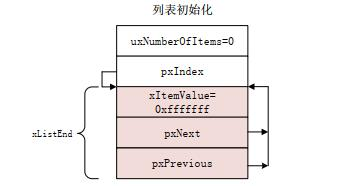
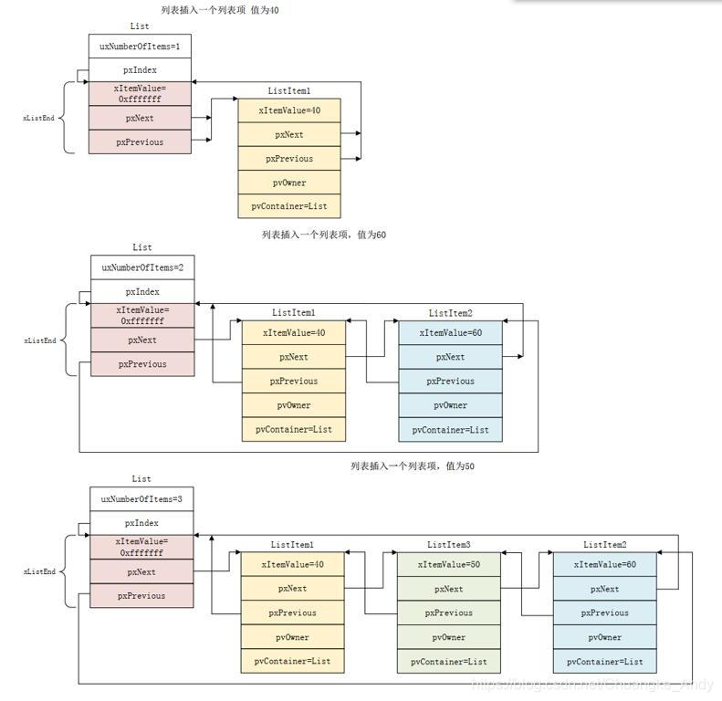
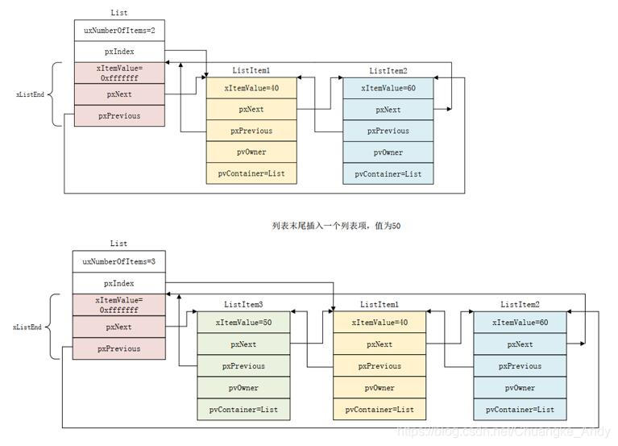

## 透查本质

freertos 的列表和列表项其实就是数据结构中的链表。只是加了一些反射机制(linux 内核中也广泛应用)。然后列表就是链表头。

## 列表和列表项

列表和列表项是FreeRTOS的一个数据结构，FreeRTOS大量使用到了列表和列表项，它是FreeRTOS的基石

### 列表和列表项的定义

#### 列表

列表是FreeRTOS中的一个数据结构，与链表类似，列表被用来跟踪FreeRTOS中的任务。其结构体 *List\_t* 在 *list.h* 文件中被定义

```c
typedef struct xLIST
{
  /* 列表内有效列表项个数 */
  configLIST_VOLATILE UBaseType_t uxNumberOfItems;
  /* 记录当前列表项索引号，用于遍历列表 */
  ListItem_t * configLIST_VOLATILE pxIndex;      
  /* 列表中最后一个列表项，表示列表结束 ，只是一个标记点*/
  MiniListItem_t xListEnd;              
} List_t;

```

#### 列表项

列表项就是存放在列表中的项目，FreeRTOS提供两种类型的列表项：列表项和迷你列表项。列表项的结构体 *ListItem\_t* 在 *list.h* 文件中被定义

```c
struct xLIST_ITEM
{
  /* 列表项值 */
  configLIST_VOLATILE TickType_t xItemValue;      
  /* 指向下一个列表项值 */
  struct xLIST_ITEM * configLIST_VOLATILE pxNext;    
  /* 指向上一个列表项值 */
  struct xLIST_ITEM * configLIST_VOLATILE pxPrevious;
  /* 当前列表项的拥有者，一般指向TCB，反射机制*/
  void * pvOwner;                    
  /* 当前列表项归属的列表 */
  void * configLIST_VOLATILE pvContainer;        
};
typedef struct xLIST_ITEM ListItem_t;

```

#### 迷你列表项

有些情况下不需要列表项这么全的功能，为了避免造成内存浪费，定义了迷你列表项。迷你列表项的结构体 *MiniListItem\_t* 在 *list.h* 文件中被定义

```c
struct xMINI_LIST_ITEM
{
  /* 列表项值 */
  configLIST_VOLATILE TickType_t xItemValue;
  /* 指向下一个列表项值 */
  struct xLIST_ITEM * configLIST_VOLATILE pxNext;
  /* 指向上一个列表项值 */
  struct xLIST_ITEM * configLIST_VOLATILE pxPrevious;
};
typedef struct xMINI_LIST_ITEM MiniListItem_t;

```


### 列表和列表项的函数应用

列表的初始化：新创建的列表需要对其做初始化处理，其实就是初始化List\_t结构体中的各个成员变量，通过vListInitialise()函数来完成，该函数在list.c文件中定义

```c
void vListInitialise( List_t * const pxList )
{
  /* 此时列表中只有一个列表项xListEnd，索引地址指向尾节点 */
  pxList->pxIndex = ( ListItem_t * ) &( pxList->xListEnd );      
  /* xListEnd列表项值初始化为portMAX_DELAY（portmacro.h中定义的宏）*/
  pxList->xListEnd.xItemValue = portMAX_DELAY;
  /* 初始化xListEnd的pxNext变量，此时指向自身 */
  pxList->xListEnd.pxNext = ( ListItem_t * ) &( pxList->xListEnd );  
  /* 初始化xListEnd的pxPrevious变量，此时指向自身 */
  pxList->xListEnd.pxPrevious = ( ListItem_t * ) &( pxList->xListEnd );
  /* 当前有效的列表项个数为0，没有算xListEnd */
  pxList->uxNumberOfItems = ( UBaseType_t ) 0U;
}

```



列表项的初始化：新创建的列表项也需要初始化，通过vListInitialiseItem()函数来完成，该函数在list.c文件中定义

```c
void vListInitialiseItem( ListItem_t * const pxItem )
{
  /* 列表项初始化为不归属任何任务列表所有 */
  pxItem->pvContainer = NULL;
}

```

列表项的插入：将指定列表项插入到列表中，通过vListInsert()函数来完成

```c
void vListInsert( List_t * const pxList,   //列表项要插入的列表
          ListItem_t * const pxNewListItem){  //要插入的列表项
  ListItem_t *pxIterator;
  /* 获取要插入的列表项值 */
  const TickType_t xValueOfInsertion = pxNewListItem->xItemValue;
  /* 如获取到的列表项值为最大时，直接插入到尾部 */
  if( xValueOfInsertion == portMAX_DELAY )
  {
    pxIterator = pxList->xListEnd.pxPrevious;
  }
  else{
    /* 从尾节点开始遍历，与下个节点的Value值进行比较，当要插入Value值大于遍历列表项Value时，就获得插入位置（按升序方式插入） */
    for( pxIterator = ( ListItem_t * ) &( pxList->xListEnd ); pxIterator->pxNext->xItemValue <= xValueOfInsertion; pxIterator = pxIterator->pxNext ) 
    {
      //空循环，什么也不做
    }
  }
  /* 更新后面节点信息 （前后指针进行赋值） */
  pxNewListItem->pxNext = pxIterator->pxNext;
  pxNewListItem->pxNext->pxPrevious = pxNewListItem;
  /* 更新前面节点信息（前后指针进行赋值） */
  pxNewListItem->pxPrevious = pxIterator;
  pxIterator->pxNext = pxNewListItem;
  /* 把列表项归属于当前的列表 */
  pxNewListItem->pvContainer = ( void * ) pxList;
  /* 有效列表项数量进行累加 */
  ( pxList->uxNumberOfItems )++;
}

```

> 下图演示了向一个空列表中依次插入40、60和50三个列表项的插入过程



列表项的末尾插入：将指定列表项插入到列表末尾，通过vListInsertEnd()函数来完成

```c
void vListInsertEnd( List_t * const pxList,   //列表项要插入的列表
           ListItem_t * const pxNewListItem )  //要插入的列表项
{
  /* 获取当前列表索引值  */
  ListItem_t * const pxIndex = pxList->pxIndex;
  /* 插入到索引值之前,先进行尾部更新  */
  pxNewListItem->pxNext = pxIndex;
  pxNewListItem->pxPrevious = pxIndex->pxPrevious;
  /* 再进行头部更新 */
  pxIndex->pxPrevious->pxNext = pxNewListItem;
  pxIndex->pxPrevious = pxNewListItem;
  /* 列表项归属于列表 */
  pxNewListItem->pvContainer = ( void * ) pxList;
  /* 更新列表项数目 */
  ( pxList->uxNumberOfItems )++;
}

```

> 下图演示了向一个列表末尾插入列表项的插入过程



列表项的删除：从列表中删除指定的列表项，通过uxListRemove()函数来完成

```c
UBaseType_t uxListRemove( ListItem_t * const pxItemToRemove )
{
  /* 获取列表项所在的列表地址 */
  List_t * const pxList = ( List_t * ) pxItemToRemove->pvContainer;
  /* 将要删除的列表项的前后两个列表项进行连接 */
  pxItemToRemove->pxNext->pxPrevious = pxItemToRemove->pxPrevious;
  pxItemToRemove->pxPrevious->pxNext = pxItemToRemove->pxNext;
  /* Only used during decision coverage testing. */
  mtCOVERAGE_TEST_DELAY();
  /* 索引是否需要更新 */
  if( pxList->pxIndex == pxItemToRemove )
  {
    pxList->pxIndex = pxItemToRemove->pxPrevious;
  }
  else
  {
    mtCOVERAGE_TEST_MARKER();
  }
  /* 被删除列表项的成员变量pvContainer清零 */
  pxItemToRemove->pvContainer = NULL;
  /* 有效列表项数量减一 */
  ( pxList->uxNumberOfItems )--;
  /* 返回当前列表的有效列表项数量 */
  return pxList->uxNumberOfItems;
}

```

列表项的遍历：List\_t中的成员变量pxIndex是用来遍历列表的，FreeRTOS使用如下函数（宏）来完成列表的遍历，每调用一次这个函数，列表的pxIndex变量就会指向下一个列表项，并返回这个列表项的pvOwner变量值

```c
/* pxTCB用来保存pxIndex所指向的列表项的pvOwner, pxList表示要遍历的列表 */
#define listGET_OWNER_OF_NEXT_ENTRY( pxTCB, pxList )  \
{  \
  /* 首先获取当前列表 */
  List_t * const pxConstList = ( pxList );  \
  /* 列表的pxIndex变量指向下一个列表项 */
  ( pxConstList )->pxIndex = ( pxConstList )->pxIndex->pxNext;  \
  /* 如果pxIndex指向了列表的xListEnd成员变量，表示到了列表末尾 */
  if( ( void * ) ( pxConstList )->pxIndex == ( void * ) &( ( pxConstList )->xListEnd ) )  \
  {  \
    /* 此时就跳过xListEnd,pxIndex再次指向列表头的列表项，这样就完成了一次列表遍历 */
    ( pxConstList )->pxIndex = ( pxConstList )->pxIndex->pxNext;  \
  }  \
  /* 获取当前pxIndex指向的所有者（其实就是任务控制块）*/
  ( pxTCB ) = ( pxConstList )->pxIndex->pvOwner;  \
}

```
