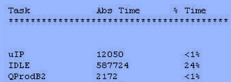

## 透查本质

主要是用来debug，统计系统的一些指标。

## 处理器利用率统计的作用

处理器利用率其实就是系统运行的程序占用的CPU资源，表示机器在某段时间程序运行的情况，如果这段时间中，程序一直在占用CPU的使用权，那么可以认为CPU的利用率是100%；CPU的利用率越高，说明机器在这个时间上运行了很多程序，反之较少。利用率的高低与CPU强弱有直接关系。比如同一段程序，如果在运算速度很慢的CPU上运行，它可能要1000ms，而在运算速度很快的CPU上运行可能只需要10ms，那么在1000ms这段时间中，前者的处理器利用率就是100%，而后者只有1%，因为1000ms内前者都在使用 CPU做运算，而后者只使用10ms的时间做运算，剩下的时间CPU可以做其他事情。

调试的时候很有必要得到当前系统的CPU利用率相关信息，但是在产品发布时，就可以去掉CPU利用率统计功能，以避免消耗系统资源。FreeRTOS 是使用一个外部的变量进行时间统计，并且消耗一个高精度的定时器，其用于定时的精度是系统时钟节拍的10-20倍。比如当前系统时钟节拍是1000Hz，那么定时器的计数节拍就要是10000-20000Hz。

但是FreeRTOS进行CPU利用率统计时，也有一定缺陷，即没有对进行CPU利用率统计时间的变量做溢出保护，一般使用的是32位变量来记录系统运行时间计数值，若按20000Hz 的中断频率计算，每50us进入一次中断，变量加一，则最大支持计数时间为：232\*50us / 3600s = 59.6分钟，即运行时间超过了59.6分钟后变量将溢出，统计结果将不准确，此外系统一直响应定时器50us一次的中断会比较影响系统的性能。

## 处理器利用率统计API函数

FreeRTOS可以通过相关的配置来统计任务的运行时间信息，任务的运行时间信息提供了每个任务获取到CPU使用权总的时间。函数vTaskGetRunTimeStats( )会将统计到的信息填充到一个表里，表里面提供了每个任务的运行时间和其所占总时间的百分比，如下图示：



```c
/*****************************相关宏的配置*****************************/
#define configGENERATE_RUN_TIME_STATS        必须置为1
#define configUSE_STATS_FORMATTING_FUNCTIONS   必须置为1
#define portCONFIGURE_TIMER_FOR_RUN_TIME_STATS   初始化高精度定时器
#define portGET_RUN_TIME_COUNTER_VALUE        获取高精度定时器计数值
/***************************任务运行时间函数***************************/
函数原型：void vTaskGetRunTimeStats(char *pcWriteBuffer)
传 入 值：pcWriteBuffer 保存任务时间信息的存储区

```
