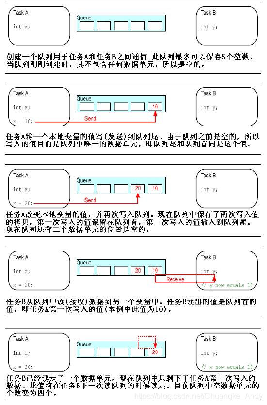

## 透查本质

本质还是管理数据结构, 和c++的queue是差不多的。然后加了一层任务管理和调试信息。

## 消息队列简介

消息队列可以在任务与任务、任务与中断之间传递消息，队列可以保存有限个具有确定长度的数据单元。队列可保存的最大单元数目被称为队列的长度，在队列创建时需要指定其长度和每个单元（队列项或消息）的大小。通常情况下，队列被作为FIFO（先进先出）使用，即数据由队尾写入，从队首读出。当然由队列首写入也是可能的。


队列有如下特性：

**数据存储**：往队列写入数据是通过字节拷贝把数据复制存储到队列中；从队列读出数据使得把队列中的数据拷贝删除
**可被多任务存取**：队列不是属于某个特别指定的任务的，任何任务都可以向队列中发送消息，或者从队列中提取消息
**读队列时阻塞**：当某个任务试图读一个队列时，其可以指定一个阻塞超时时间。在这段时间中，若队列为空，该任务将保持阻塞状态以等待队列数据有效。当其他任务或中断服务程序往其等待的队列中写入了数据，该任务将自动由阻塞态转移为就绪态。当等待的时间超过了指定的阻塞时间，即使队列中尚无有效数据，任务也会自动由阻塞态转移为就绪态
**写队列时阻塞**：任务也可以在写队列时指定一个阻塞超时时间。这个时间是当被写队列已满时，任务进入阻塞态以等待队列空间有效的最长时间

队列读写过程如下图所示



队列的结构体 Queue\_t 如下示，该结构体在queue.c文件中定义：

```c
typedef struct QueueDefinition
{
  int8_t *pcHead;  /* 指向队列存储区开始地址 */
  int8_t *pcTail;  /* 指向队列存储区最后一个字节 */
  int8_t *pcWriteTo; /* 指向存储区中下一个空闲区域 */

  union
  {
    /* 当用作队列的时候指向最后一个出队的队列项首地址 */
    int8_t *pcReadFrom;  
    /* 当用作递归互斥量的时候用来记录递归互斥量被调用的次数 */    
    UBaseType_t uxRecursiveCallCount;
  } u;

  List_t xTasksWaitingToSend;    /* 等待发送任务列表 */
  List_t xTasksWaitingToReceive;  /* 等待接收任务列表 */

  volatile UBaseType_t uxMessagesWaiting;/* 队列中当前队列项数量（消息数） */
  UBaseType_t uxLength;      /* 创建队列时指定的队列长度 */
  UBaseType_t uxItemSize;      /* 创建队列时指定的每个队列项（消息）最大长度 */
  /* 当队列上锁后用来统计从队列中接收到（出队的）的队列项数量，若未上锁为queueUNLOCKED */
  volatile int8_t cRxLock;
  /* 当队列上锁后用来统计发送到（入队的）队列中的队列项数量，若未上锁为queueUNLOCKED */    
  volatile int8_t cTxLock;    

  #if( ( configSUPPORT_STATIC_ALLOCATION == 1 ) && ( configSUPPORT_DYNAMIC_ALLOCATION == 1 ) )
    uint8_t ucStaticallyAllocated;  /* 若使用静态存储，赋值为pdTURE */
  #endif

  #if ( configUSE_QUEUE_SETS == 1 )  /* 队列集相关宏 */
    struct QueueDefinition *pxQueueSetContainer;
  #endif

  #if ( configUSE_TRACE_FACILITY == 1 )  /* 跟踪调试相关宏 */
    UBaseType_t uxQueueNumber;
    uint8_t ucQueueType;
  #endif
} xQUEUE;
/* 老版本的FreeRTOS中队列可能会使用xQUEUE这个名字，新版本都用Queue_t */
typedef xQUEUE Queue_t;

```

## 消息队列的函数应用

### 创建消息队列

在使用队列之前必须先创建队列，有动态和静态创建队列两种方法。以下四个函数原型在queue.c文件中定义

```c
/********************动态创建队列**********************************************************************/
QueueHandle_t xQueueCreate(UBaseType_t uxQueueLength, //要创建的队列长度（队列的项目数）
               UBaseType_t uxItemSize);  //队列项（消息）的长度（字节）
/********************动态创建队列**********************************************************************/
QueueHandle_t xQueueGenericCreate(const UBaseType_t uxQueueLength,//要创建的队列长度（队列的项目数）
                  const UBaseType_t uxItemSize,  //队列项（消息）的长度（字节）
                  const uint8_t ucQueueType); //队列类型
/********************静态创建队列**********************************************************************/
QueueHandle_t xQueueCreateStatic(UBaseType_t uxQueueLength,//要创建的队列长度（队列的项目数） 
                 UBaseType_t uxItemSize, //队列项（消息）的长度（字节）
                 uint8_t *pucQueueStorage, //指向队列项的存储区
                 StaticQueue_t *pxStaticQueue);//用来保存队列结构体
/********************静态创建队列**********************************************************************/
QueueHandle_t xQueueGenericCreateStatic(const UBaseType_t uxQueueLength,//要创建的队列长度（队列的项目数）
                    const UBaseType_t uxItemSize,//队列项（消息）的长度（字节） 
                    uint8_t *pucQueueStorage,//指向队列项的存储区 
                    StaticQueue_t *pxStaticQueue,//用来保存队列结构体
                    const uint8_t ucQueueType);//队列类型
/*****************************************************************************************************/
返回值：创建成功返回队列句柄；失败返回NULL

```

动态创建队列最终会调用xQueueGenericCreate()函数，下面来分析该源码（静态创建类似，不做分析）

```c
QueueHandle_t xQueueGenericCreate(const UBaseType_t uxQueueLength, 
                  const UBaseType_t uxItemSize, 
                  const uint8_t ucQueueType ){
  Queue_t *pxNewQueue;
  size_t xQueueSizeInBytes;
  uint8_t *pucQueueStorage;
  if( uxItemSize == ( UBaseType_t ) 0 ){
    /* 如果队列项大小为0,就不需要存储区 */
    xQueueSizeInBytes = ( size_t ) 0; 
  }
  else{
    /* 最大队列项数量乘以单个队列项大小，就是消息存储区的大小 */
    xQueueSizeInBytes = ( size_t ) ( uxQueueLength * uxItemSize ); 
  }
  /* 给队列申请内存空间=队列结构体大小+消息存储区大小 */
  pxNewQueue = ( Queue_t * ) pvPortMalloc( sizeof( Queue_t ) + xQueueSizeInBytes );
  if( pxNewQueue != NULL ){  //内存申请成功
    /* 计算出消息存储区的首地址 */
    pucQueueStorage = ( ( uint8_t * ) pxNewQueue ) + sizeof( Queue_t );
    /* 初始化消息队列 */
    prvInitialiseNewQueue( uxQueueLength, uxItemSize, pucQueueStorage, ucQueueType, pxNewQueue );
  }
  return pxNewQueue;
}

```

队列初始化函数prvInitialiseNewQueue()源码分析

```c
static void prvInitialiseNewQueue(const UBaseType_t uxQueueLength, 
                  const UBaseType_t uxItemSize, 
                  uint8_t *pucQueueStorage, 
                  const uint8_t ucQueueType, 
                  Queue_t *pxNewQueue){
  /* 防止编译器报错 */
  ( void ) ucQueueType;
  if(uxItemSize == ( UBaseType_t ) 0){
    /* 若队列项长度为0，说明没有队列存储区 */
    pxNewQueue->pcHead = ( int8_t * ) pxNewQueue;
  }
  else{
    /* 把队列空间首地址指向队列项存储区首地址 */
    pxNewQueue->pcHead = ( int8_t * ) pucQueueStorage;
  }
  /* 初始化队列结构体相关成员变量 */
  pxNewQueue->uxLength = uxQueueLength;
  pxNewQueue->uxItemSize = uxItemSize;
  /* 队列复位 */
  ( void ) xQueueGenericReset( pxNewQueue, pdTRUE );
}

```

队列复位函数xQueueGenericReset源码分析

```c
BaseType_t xQueueGenericReset( QueueHandle_t xQueue, BaseType_t xNewQueue){
  Queue_t * const pxQueue = ( Queue_t * ) xQueue;
  //进入临界段，此时操作队列控制块，不允许被打断
  taskENTER_CRITICAL();
  {
    /* 初始化队列相关成员变量*/
    pxQueue->pcTail = pxQueue->pcHead + ( pxQueue->uxLength * pxQueue->uxItemSize );//头地址赋值
    pxQueue->uxMessagesWaiting = ( UBaseType_t ) 0U;//等待处理的消息个数为0
    pxQueue->pcWriteTo = pxQueue->pcHead;//写入指针赋值为队列头指针
    pxQueue->u.pcReadFrom = pxQueue->pcHead + ( ( pxQueue->uxLength - ( UBaseType_t ) 1U ) * pxQueue->uxItemSize );//读出指针写入最后一个可用消息
    pxQueue->cRxLock = queueUNLOCKED;//赋值队列锁为解锁状态
    pxQueue->cTxLock = queueUNLOCKED;//赋值队列锁为解锁状态
    /* 判断是否为新建队列，若不是还需要其他处理 */
    if( xNewQueue == pdFALSE ){
      /* 判断发送等待列表里面是否有任务 */
      if(listLIST_IS_EMPTY(&(pxQueue->xTasksWaitingToSend))==pdFALSE){
        /* 移除事件列表中的任务 */
        if(xTaskRemoveFromEventList(&(pxQueue->xTasksWaitingToSend))!=pdFALSE){
          /* 进行上下文切 */
          queueYIELD_IF_USING_PREEMPTION();
        }
        else{
          mtCOVERAGE_TEST_MARKER();
        }
      }
      else{
        mtCOVERAGE_TEST_MARKER();
      }
    }
    else{ 
      /* 若是新建队列，则直接初始化发送和接受列表项 */
      vListInitialise( &( pxQueue->xTasksWaitingToSend ) );
      vListInitialise( &( pxQueue->xTasksWaitingToReceive ) );
    }
  }
  taskEXIT_CRITICAL();
  return pdPASS;
}

```

### 向队列发送消息

#### 任务级入队函数

```c
/**********发送消息到队尾********************************************************************************/
BaseType_t xQueueSend(QueueHandle_t xQueue,//队列句柄,指明向哪个队列发送数据
            const void *pvItemToQueue,//指向要发送的消息
            TickType_t xTicksToWait);//队列满时，任务进入阻塞态等待队列空闲的最大时间（阻塞时间）
/**********发送消息到队尾********************************************************************************/
BaseType_t xQueueSendToBack(QueueHandle_t xQueue,//队列句柄,指明向哪个队列发送数据
            const void *pvItemToQueue,//指向要发送的消息
            TickType_t xTicksToWait);//阻塞时间
/**********发送消息到队头********************************************************************************/
BaseType_t xQueueSendToFront(QueueHandle_t xQueue,//队列句柄,指明向哪个队列发送数据
            const void *pvItemToQueue,//指向要发送的消息
            TickType_t xTicksToWait);//阻塞时间
/**********发送消息到队列（带覆写功能，即队列满了以后会覆写掉旧的数据）*************************************/
BaseType_t xQueueOverwrite(QueueHandle_t xQueue,//队列句柄,指明向哪个队列发送数据
            const void *pvItemToQueue);//指向要发送的消息
/**********任务级通用入队函数***************************************************************************/
BaseType_t xQueueGenericSend(QueueHandle_t xQueue, //队列句柄,指明向哪个队列发送数据
               const void * const pvItemToQueue, //指向要发送的消息
               TickType_t xTicksToWait,//阻塞时间
               const BaseType_t xCopyPosition);//入队方式（后向/前向/覆写）
/******************************************************************************************************/
返回值：发送消息成功，返回pdPASS;队列满消息发送失败，返回errQUEUE_FULL

```

任务级入队函数最终都是调用xQueueGenericSend()函数，下面来分析该函数源码

```c
BaseType_t xQueueGenericSend(QueueHandle_t xQueue, 
               const void * const pvItemToQueue, 
               TickType_t xTicksToWait, 
               const BaseType_t xCopyPosition){
  BaseType_t xEntryTimeSet = pdFALSE, xYieldRequired;
  TimeOut_t xTimeOut;
  Queue_t * const pxQueue = ( Queue_t * ) xQueue;
  /* 使用for死循环，是为了快速的处理消息拷贝 */
  for( ;; ){    
    taskENTER_CRITICAL(); //进入了临界段
    {
      /* 判断消息队列是否满了以及是否允许覆盖入队，任一条件成立都执行入队操作  */
      if((pxQueue->uxMessagesWaiting < pxQueue->uxLength)||(xCopyPosition == queueOVERWRITE))      {
        /* 拷贝数据到队列操作空间内 */
        xYieldRequired = prvCopyDataToQueue(pxQueue, pvItemToQueue, xCopyPosition);
        #if ( configUSE_QUEUE_SETS == 1 )
        { /*......省略掉与队列集相关代码......*/  }
        #else /* configUSE_QUEUE_SETS */
        {
          /* 判断等待接收的列表是否为空. */
          if(listLIST_IS_EMPTY(&(pxQueue->xTasksWaitingToReceive)) == pdFALSE){
            /* 若不为空，表示有任务由于请求消息而阻塞，则改变阻塞态为就绪态. */
            if(xTaskRemoveFromEventList(&(pxQueue->xTasksWaitingToReceive)) != pdFALSE){
              /* 进行上下文切换*/
              queueYIELD_IF_USING_PREEMPTION();
            }
            else{
              mtCOVERAGE_TEST_MARKER();
            }
          }
          else if( xYieldRequired != pdFALSE){
            /* 再次进行上下文切换 */
            queueYIELD_IF_USING_PREEMPTION();
          }
          else{
            mtCOVERAGE_TEST_MARKER();
          }
        }
        #endif /* configUSE_QUEUE_SETS */
        taskEXIT_CRITICAL();  //退出临界段
        return pdPASS;      //返回pdPASS,标记入队成功
      }
      else{
        /* 队列满了不允许入队时，先判断是否需要阻塞 */
        if( xTicksToWait == ( TickType_t ) 0 ){
          /* 为0表示，表示没有阻塞时间 */
          taskEXIT_CRITICAL();//退出临界段
          traceQUEUE_SEND_FAILED( pxQueue );
          return errQUEUE_FULL;//返回队列已满
        }
        else if( xEntryTimeSet == pdFALSE ){
          /* 若有阻塞时间，就初始化时间结构体*/
          vTaskSetTimeOutState( &xTimeOut );
          xEntryTimeSet = pdTRUE;
        }
        else{
          /* 时间结构体已经初始化过了 */
          mtCOVERAGE_TEST_MARKER();
        }
      }
    }    
    taskEXIT_CRITICAL();//退出临界段    
    /* 执行到这里说明当前队列已满，并且设置了不为0的阻塞时间 */
    vTaskSuspendAll();//挂起任务调度器
    prvLockQueue( pxQueue );//给队列上锁
    /* 判断阻塞时间是否超时了 */
    if( xTaskCheckForTimeOut( &xTimeOut, &xTicksToWait ) == pdFALSE){
      /* 若未超时，则判断队列是否还是满的 */
      if( prvIsQueueFull( pxQueue ) != pdFALSE ){
        /* 若此时队仍满且未超时，则把当前任务添加到等待发送的事件列表和延时列表中去*/
        traceBLOCKING_ON_QUEUE_SEND( pxQueue );
        vTaskPlaceOnEventList( &( pxQueue->xTasksWaitingToSend ), xTicksToWait );  
        prvUnlockQueue( pxQueue );//解锁队列
        if( xTaskResumeAll() == pdFALSE ){//恢复任务调度器
          portYIELD_WITHIN_API();//进行上下文切换
        }
      }
      else{
        /* 若此时队列未满，但未超时，则重新进行入队操作 */
        prvUnlockQueue( pxQueue );
        ( void ) xTaskResumeAll();
      }
    }
    else{
      /* 若已超时，则解锁队列，恢复任务调度器 */
      prvUnlockQueue( pxQueue );
      ( void ) xTaskResumeAll();
      traceQUEUE_SEND_FAILED( pxQueue );
      return errQUEUE_FULL;//返回队列已满
    }
  }
}

```

#### 中断级入队函数

```c
/**********发送消息到队尾*****************************************************************************/
BaseType_t xQueueSendFromISR(QueueHandle_t xQueue,//队列句柄,指明向哪个队列发送数据 
               const void * pvItemToQueue,//指向要发送的消息 
               BaseType_t * pxHigherPriorityTaskWoken);//标记退出此函数后是否进行任务切换
/**********发送消息到队尾****************************************************************************/
BaseType_t xQueueSendToBackFromISR(QueueHandle_t xQueue, 
                    const void * pvItemToQueue, 
                    BaseType_t * pxHigherPriorityTaskWoken);
/**********发送消息到队头****************************************************************************/
BaseType_t xQueueSendToFrontFromISR(QueueHandle_t xQueue, 
                     const void * pvItemToQueue, 
                   BaseType_t * pxHigherPriorityTaskWoken);
/**********发送消息到队列（带覆写功能，即队列满了以后会覆写掉旧的数据）********************************/
BaseType_t xQueueOverwriteFromISR(QueueHandle_t xQueue, 
                   const void * pvItemToQueue, 
                   BaseType_t * pxHigherPriorityTaskWoken);
/**********中断级通用入队函数***********************************************************************/
BaseType_t xQueueGenericSendFromISR(QueueHandle_t xQueue, 
                  const void * pvItemToQueue, 
                  BaseType_t * pxHigherPriorityTaskWoken, 
                  BaseType_t xCopyPosition);//入队方式（后向/前向/覆写）
/*************************************************************************************************/
返回值：发送消息成功，返回pdPASS;队列满消息发送失败，返回errQUEUE_FULL

```

中断级入队函数最终都是调用xQueueGenericSendFromISR()函数，下面来分析该函数源码

```c
BaseType_t xQueueGenericSendFromISR(QueueHandle_t xQueue, 
                  const void * const pvItemToQueue, 
                  BaseType_t * const pxHigherPriorityTaskWoken, 
                  const BaseType_t xCopyPosition){
  BaseType_t xReturn;
  UBaseType_t uxSavedInterruptStatus;
  Queue_t * const pxQueue = ( Queue_t * ) xQueue;
  /* 带返回值的关闭中断，需要保存上次关闭中断的状态值，恢复时候写入 */
  uxSavedInterruptStatus = portSET_INTERRUPT_MASK_FROM_ISR();
  {
    /* 判断消息队列是否满了以及是否允许覆盖入队，任一条件成立都执行入队操作  */
    if( ( pxQueue->uxMessagesWaiting < pxQueue->uxLength ) || ( xCopyPosition == queueOVERWRITE ) )
    {
      /* 获取队列发送锁的状态值 */
      const int8_t cTxLock = pxQueue->cTxLock;
      /* 拷贝数据到队列操作空间内 */
      ( void ) prvCopyDataToQueue( pxQueue, pvItemToQueue, xCopyPosition );
      /* 判断队列是否上锁 */
      if( cTxLock == queueUNLOCKED ){  //若队列未上锁
        #if ( configUSE_QUEUE_SETS == 1 )
        {/*......省略掉与队列集相关代码......*/}
        #else /* configUSE_QUEUE_SETS */
        {
          /* 判断等待接收的列表是否为空. */
          if(listLIST_IS_EMPTY(&(pxQueue->xTasksWaitingToReceive) == pdFALSE){
            /* 若不为空，表示有任务由于请求消息而阻塞，则改变阻塞态为就绪态. */
            if(xTaskRemoveFromEventList( &( pxQueue->xTasksWaitingToReceive))!= pdFALSE){
              /* 若上一步变成就绪态的任务优先级比当前任务高，则标记为pdTRUE，表示要进行任务切换 */
              if( pxHigherPriorityTaskWoken != NULL ){
                *pxHigherPriorityTaskWoken = pdTRUE;
              }
              else{
                mtCOVERAGE_TEST_MARKER();
              }
            }
            else{
              mtCOVERAGE_TEST_MARKER();
            }
          }
          else{
            mtCOVERAGE_TEST_MARKER();
          }
        }
        #endif /* configUSE_QUEUE_SETS */
      }
      else{ //若队列已经上锁
        /* 发送锁加一，表示进行了一次入队操作 */
        pxQueue->cTxLock = ( int8_t ) ( cTxLock + 1 );
      }
      xReturn = pdPASS;//返回pdPASS，表示入队完成
    }
    else{  //若队列满    
      traceQUEUE_SEND_FROM_ISR_FAILED( pxQueue );
      xReturn = errQUEUE_FULL;//返回errQUEUE_FULL，表示队列满
    }
  }
  /* 开启中断，保存上次状态值 */
  portCLEAR_INTERRUPT_MASK_FROM_ISR( uxSavedInterruptStatus );
  return xReturn;
}

```

### 队列上锁和解锁

#### 队列上锁&#x20;

prvLockQueue()：本质上是一个宏，定义如下

```c
//就是将队列中的成员变量cRxLock和cTxLock设置为queueLOCKED_UNMODIFIED
#define prvLockQueue( pxQueue )                \
  taskENTER_CRITICAL();                  \
  {                            \
    if( ( pxQueue )->cRxLock == queueUNLOCKED )      \
    {                          \
      ( pxQueue )->cRxLock = queueLOCKED_UNMODIFIED;  \
    }                          \
    if( ( pxQueue )->cTxLock == queueUNLOCKED )      \
    {                          \
      ( pxQueue )->cTxLock = queueLOCKED_UNMODIFIED;  \
    }                          \
  }                            \
  taskEXIT_CRITICAL()

```

```c
//上锁计数器cRxLock和cTxLock记录了队列上锁期间，入队或出队的数量
static void prvUnlockQueue( Queue_t * const pxQueue ){
  /* 进入临界段 */
  taskENTER_CRITICAL();
  {    
    int8_t cTxLock = pxQueue->cTxLock;//获取发送锁的状态值
    /* 遍历直到解锁为止，队列上锁后向队列发送消息成功，入队计数器cTxLock会加一 */
    while( cTxLock > queueLOCKED_UNMODIFIED ){
      #if ( configUSE_QUEUE_SETS == 1 )
      {/*......省略掉与队列集相关代码......*/}
      #else /* configUSE_QUEUE_SETS */
      {
        /* 判断等待接收的列表是否为空. */
        if( listLIST_IS_EMPTY( &( pxQueue->xTasksWaitingToReceive ) ) == pdFALSE ){
          /* 若不为空，将任务从列表中删除 */
          if(xTaskRemoveFromEventList(&(pxQueue->xTasksWaitingToReceive)) != pdFALSE){
            /* 若移除的任务优先级比当前任务高，则进行任务切换 */
            vTaskMissedYield();
          }
          else{
            mtCOVERAGE_TEST_MARKER();
          }
        }
        else{
          break;
        }
      }
      #endif /* configUSE_QUEUE_SETS */
      --cTxLock;//每处理完一条，队列发送锁就减一，直至处理完成
    }    
    pxQueue->cTxLock = queueUNLOCKED;//处理完成后，解除发送锁
  }  
  taskEXIT_CRITICAL();//退出临界段
  /* 接下来处理cRxLock，处理过程与cTxLock类似 */
  taskENTER_CRITICAL();
  {
    int8_t cRxLock = pxQueue->cRxLock;
    while( cRxLock > queueLOCKED_UNMODIFIED ){
      if(listLIST_IS_EMPTY(&(pxQueue->xTasksWaitingToSend)) == pdFALSE){
        if(xTaskRemoveFromEventList(&(pxQueue->xTasksWaitingToSend)) != pdFALSE){
          vTaskMissedYield();
        }
        else{
          mtCOVERAGE_TEST_MARKER();
        }
        --cRxLock;
      }
      else{
        break;
      }
    }
    pxQueue->cRxLock = queueUNLOCKED;
  }
  taskEXIT_CRITICAL();
}

```

#### 队列解锁

```c
//上锁计数器cRxLock和cTxLock记录了队列上锁期间，入队或出队的数量
static void prvUnlockQueue( Queue_t * const pxQueue ){
  /* 进入临界段 */
  taskENTER_CRITICAL();
  {    
    int8_t cTxLock = pxQueue->cTxLock;//获取发送锁的状态值
    /* 遍历直到解锁为止，队列上锁后向队列发送消息成功，入队计数器cTxLock会加一 */
    while( cTxLock > queueLOCKED_UNMODIFIED ){
      #if ( configUSE_QUEUE_SETS == 1 )
      {/*......省略掉与队列集相关代码......*/}
      #else /* configUSE_QUEUE_SETS */
      {
        /* 判断等待接收的列表是否为空. */
        if( listLIST_IS_EMPTY( &( pxQueue->xTasksWaitingToReceive ) ) == pdFALSE ){
          /* 若不为空，将任务从列表中删除 */
          if(xTaskRemoveFromEventList(&(pxQueue->xTasksWaitingToReceive)) != pdFALSE){
            /* 若移除的任务优先级比当前任务高，则进行任务切换 */
            vTaskMissedYield();
          }
          else{
            mtCOVERAGE_TEST_MARKER();
          }
        }
        else{
          break;
        }
      }
      #endif /* configUSE_QUEUE_SETS */
      --cTxLock;//每处理完一条，队列发送锁就减一，直至处理完成
    }    
    pxQueue->cTxLock = queueUNLOCKED;//处理完成后，解除发送锁
  }  
  taskEXIT_CRITICAL();//退出临界段
  /* 接下来处理cRxLock，处理过程与cTxLock类似 */
  taskENTER_CRITICAL();
  {
    int8_t cRxLock = pxQueue->cRxLock;
    while( cRxLock > queueLOCKED_UNMODIFIED ){
      if(listLIST_IS_EMPTY(&(pxQueue->xTasksWaitingToSend)) == pdFALSE){
        if(xTaskRemoveFromEventList(&(pxQueue->xTasksWaitingToSend)) != pdFALSE){
          vTaskMissedYield();
        }
        else{
          mtCOVERAGE_TEST_MARKER();
        }
        --cRxLock;
      }
      else{
        break;
      }
    }
    pxQueue->cRxLock = queueUNLOCKED;
  }
  taskEXIT_CRITICAL();
}

```

### 队列读取消息

#### 任务级出队函数

```c
/**********从队列中读取队列项，读取完后删除队列项**************************************************/
BaseType_t xQueueReceive(QueueHandle_t xQueue,//队列句柄 
             void * const pvBuffer,//保存数据的缓冲区
             TickType_t xTicksToWait);//阻塞时间，表示队列空时进入阻塞态等待数据的最大时间
/**********从队列中读取队列项，读取完后不删除队列项************************************************/
BaseType_t xQueuePeek(QueueHandle_t xQueue, 
            void * const pvBuffer, 
            TickType_t xTicksToWait);
/**********从队列中读取队列项通用函数************************************************************/
BaseType_t xQueueGenericReceive(QueueHandle_t xQueue, 
                void * const pvBuffer, 
                TickType_t xTicksToWait, 
                const BaseType_t xJustPeeking);//标记读取成功后是否需要删除队列项
/**********************************************************************************************/
返回值：读取数据成功，返回pdTRUE；读取失败，返回pdFALSE

```

> 任务级出队函数最终都是调用xQueueGenericReceive()函数，出队与入队的源码流程差不多，在此不再赘述

#### 中断级出队函数

```c
/**********从队列中读取队列项，读取完后删除队列项*******************************************/
BaseType_t xQueueReceiveFromISR(QueueHandle_t xQueue,//队列句柄 
                   void * const pvBuffer,//保存数据的缓冲区
                 BaseType_t * pxTaskWoken);//标记退出函数后是否进行任务切换
/**********从队列中读取队列项，读取后不删除队列项*******************************************/
BaseType_t xQueuePeekFromISR(QueueHandle_t xQueue,//队列句柄 
                void * const pvBuffer,//保存数据的缓冲区);
返回值：读取数据成功，返回pdTRUE；读取失败，返回pdFALSE

```
