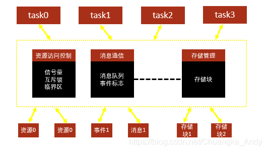

RTOS全称为 Real Time Operation System，即实时操作系统。RTOS强调的是实时性，又分为硬实时和软实时。硬实时要求在规定的时间内必须完成操作，不允许超时；而软实时里对处理过程超时的要求则没有很严格。RTOS的核心就是任务调度

RTOS通用组件如下图示

微控制器用于深度嵌入式应用，一般都有非常明确、专门的工作。尺寸的限制以及专用的终端应用等性质，令其很少能使用完整的RTOS实现。因此FreeRTOS仅为内核提供了实时调度功能、任务间通信、时序和同步原语。更准确地说，它是一个实时内核，或实时执行器。命令控制台界面、网络栈等额外的功能可作为附加组件。

## 内核配置

在 `FreeRTOS.h` 文件中。需要定义在 `FreeRTOSConfig.h` 文件中。

> 如果想研究的透彻，可以把每个宏在哪里发挥作用的看一下。

- 内核配置一

| 参数名称                 | 参数说明                        |
| -------------------- | --------------------------- |
| USE\_PREEMPTION      | 定义调度器模式                     |
| CPU\_CLOCK\_HZ       | 定义CPU的主频                    |
| TICK\_RATE\_HZ       | 定义系统时钟节拍数                   |
| MAX\_PRIORITIES      | 定义可供用户使用的最大优先级数             |
| MINIMAL\_STACK\_SIZE | 定义空闲任务的栈空间大小                |
| MAX\_TASK\_NAME\_LEN | 定义任务名最大的字符数                 |
| USE\_16\_BIT\_TICKS  | 系统时钟节拍计数使用TickType\_t数据类型定义 |
| IDLE\_SHOULD\_YIELD  | 用于使能与空闲任务同优先级的任务            |

- 内核配置二

| 参数名称                                  | 参数说明                          |
| ------------------------------------- | ----------------------------- |
| USE\_MUTEXES                          | 用于使能互斥锁                       |
| USE\_RECURSIVE\_MUTEXES               | 用于使能递归互斥锁                     |
| USE\_COUNTING\_SEMAPHORES             | 用于使能计数信号量                     |
| QUEUE\_REGISTRY\_SIZE                 | 用于设置可以注册的信号量和消息队列个数           |
| USE\_APPLICATION\_TASK\_TAG           | 用于使能任务标记                      |
| ENABLE\_BACKWARD\_COMPATIBILITY       | 用于使能新版本对老版本的兼容特性              |
| USE\_PORT\_OPTIMISED\_TASK\_SELECTION | 用于优化优先级列表中要执行的最高优先级任务的算法      |
| USE\_TICKLESS\_IDLE                   | 用于使能tickless低功耗模式             |
| USE\_TASK\_NOTIFICATIONS              | 使能任务间直接的消息传递，包括信号量、事件标志组和消息邮箱 |

- 内存管理

| 参数名称               | 参数说明        |
| ------------------ | ----------- |
| MEMORY\_ALLOCATION | 定义内存分配模式    |
| TOTAL\_HEAP\_SIZE  | 定义动态内存分配总长度 |
| HEAP\_NUMBER       | 定义动态内存管理方式  |

- 任务运行信息获取配置

| 参数名称                              | 参数说明                                                                                                                                                     |
| --------------------------------- | -------------------------------------------------------------------------------------------------------------------------------------------------------- |
| GENERATE\_RUN\_TIME\_STATS        | 用于使能任务运行状态参数统计                                                                                                                                           |
| USE\_TRACE\_FACILITY              | 使能此配置将添加额外的结构体成员和函数                                                                                                                                      |
| USE\_STATS\_FORMATTING\_FUNCTIONS | 用户配置宏定义 configUSE\_TRACE\_FACILITY 和configUSE\_STATS\_FORMATTING\_FUNCTIONS都为 1 的时候，将使能函数 vTaskList() 和 vTaskGetRunTimeStats()，如果两者中任何一个为 0，那么这两个函数都将被禁能 |

- 软件定时器

| 参数名称        | 参数说明      |
| ----------- | --------- |
| USE\_TIMERS | 用于使能软件定时器 |

- 中断优先级

| 参数名称                                       | 参数说明                                        |
| ------------------------------------------ | ------------------------------------------- |
| LIBRARY\_LOWEST\_INTERRUPT\_PRIORITY       | 用于配置 FreeRTOS 用到的 SysTick 中断和 PendSV 中断的优先级 |
| LIBRARY\_MAX\_SYSCALL\_INTERRUPT\_PRIORITY | 定义了受 FreeRTOS 管理的最高优先级中断                    |

- 函数Include配置

| 参数名称                        | 参数说明        |
| --------------------------- | ----------- |
| vTaskPrioritySet            | 设置任务优先级     |
| uxTaskPriorityGet           | 获取任务优先级     |
| vTaskDelete                 | 任务删除        |
| vTaskCleanUpResources       | 清理任务资源      |
| vTaskSuspend                | 任务挂起        |
| vTaskDelayUntil             | 任务绝对延时      |
| vTaskDelay                  | 任务延时        |
| xTaskGetSchedulerState      | 获取调度器状态     |
| xTaskResumeFromISR          | 在中断中恢复任务    |
| xQueueGetMutexHolder        | 获取互斥锁持有者    |
| pcTaskGetTaskName           | 获取任务名称      |
| uxTaskGetStackHighWaterMark | 获取任务堆栈信息    |
| xTaskGetCurrentTaskHandle   | 获取当前任务句柄    |
| eTaskGetState               | 获取任务状态      |
| xEventGroupSetBitFromISR    | 在中断中设置事件标志组 |
| xTimerPendFunctionCall      | 定时器挂起后回调函数  |
| xTaskAbortDelay             | 终止任务延时      |
| xTaskGetHandle              | 获取任务句柄      |
