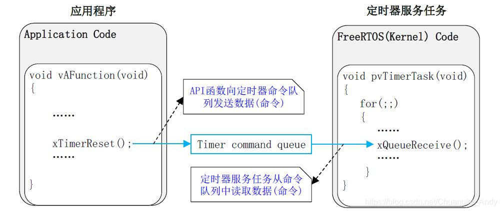
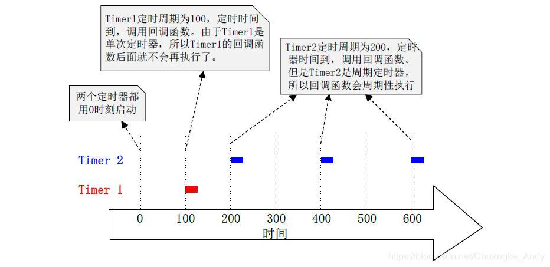

MCU一般都自带定时器，属于硬件定时器，但是不同的MCU其硬件定时器数量不同，有时需要考虑成本的问题。在硬件定时器不够用的时候，FreeRTOS也提供了定时器功能，不过是属于软件定时器，其定时精度没有硬件定时器高，但是对于精度要求不高的周期性任务也足够了

## 透查本质

在freertos中出现是为了方便执行定时任务，但其是个可选项，同时本质是一个高优先级任务。

## 软件定时器简介

软件定时器允许设置一段时间，当设置的时间到达之后就会执行回调函数。软件定时器的回调函数是在定时器服务任务中执行的，因此不能在回调函数中调用会阻塞任务的API函数

定时器是一个可选的、不属于FreeRTOS内核的功能，是由定时器服务任务来提供的。定时器相关API函数大多是使用定时器命令队列发送命令给定时器服务任务的，用户不能直接访问该命令队列。



如上图示，定时器命令队列将用户应用任务和定时器服务任务连接在一起。用户应用程序调用了函数xTimerReset()，其结果是复位命令会被发送到定时器命令队列中，再由定时器服务任务来处理这个命令

软件定时器分为两种：单次定时器和周期定时器。单次定时器在定时时间到了后执行一次回调函数就会停止运行；周期定时器一旦启动就会周期性的执行回调函数



## 定时器的相关配置

1. configUSE\_TIMERS 宏置1：自动创建定时器服务任务。
2. configTIMER\_TASK\_PRIORITY：软件定时器服务任务的任务优先级
3. configTIMER\_QUEUE\_LENGTH：设置定时器命令队列的队列长度
4. configTIMER\_TASK\_STACK\_DEPTH：设置定时器服务任务的任务堆栈大小

FreeRTOS启动调度器的时候会自动创建定时器服务任务，其源码如下所示：

```c
BaseType_t xTimerCreateTimerTask( void ){
  BaseType_t xReturn = pdFAIL;
  /* 检查软件定时器列表和队列,若没有创建内存空间则新建  */
  prvCheckForValidListAndQueue();
  if( xTimerQueue != NULL ){
  #if( configSUPPORT_STATIC_ALLOCATION == 1 )
  {
    /*****此处省略静态创建代码*****/
  }
  #else
  {
    /* 为了满足软件定时器的实时性，软件定时器任务的优先级设置为最大值 */
    xReturn = xTaskCreate(prvTimerTask,
              "Tmr Svc",
              configTIMER_TASK_STACK_DEPTH,
              NULL,
    ((UBaseType_t)configTIMER_TASK_PRIORITY)|portPRIVILEGE_BIT,
              &xTimerTaskHandle);
    }
  #endif /* configSUPPORT_STATIC_ALLOCATION */
  }
  else{
  mtCOVERAGE_TEST_MARKER();
  }
  configASSERT( xReturn );
  return xReturn;
}
/* 检查软件定时器列表和队列 */
static void prvCheckForValidListAndQueue( void ){
  taskENTER_CRITICAL();
  {
  /* 若队列为空，则进行列表的初始化和队列的创建 */
  if( xTimerQueue == NULL ){
    vListInitialise( &xActiveTimerList1 );
    vListInitialise( &xActiveTimerList2 );
    pxCurrentTimerList = &xActiveTimerList1;
    pxOverflowTimerList = &xActiveTimerList2;
    /* 开始创建消息队列 */
    #if( configSUPPORT_STATIC_ALLOCATION == 1 )
    {
    /*****************************/
    /*****此处省略静态创建代码*****/
    /*****************************/
    }
    #else
    {
    xTimerQueue = xQueueCreate((UBaseType_t)configTIMER_QUEUE_LENGTH, sizeof(DaemonTaskMessage_t));
    }
    #endif
    /*****************************/
    /*****此处省略部分其他代码*****/
    /*****************************/
  }
  else
  {
    mtCOVERAGE_TEST_MARKER();
  }
  }
  taskEXIT_CRITICAL();
}

```

## 软件定时器API函数

### 复位软件定时器

复位软件定时器，若软件定时器已经启动，则重新计算超时时间；若软件定时器没有启动，则启动软件定时器。

```c
/********************复位软件定时器，用在任务中************************************/
BaseType_t xTimerReset(TimerHandle_t xTimer,  //要复位的软件定时器句柄
          TickType_t xTicksToWait)  //阻塞时间
/********************复位软件定时器，用在中断服务函数中*****************************/
BaseType_t xTimerResetFromISR(TimerHandle_t xTimer, //要复位的软件定时器句柄
      BaseType_t * pxHigherPriorityTaskWoken) //退出后是否进行任务切换
/********************************************************************************/
返回值：定时器复位成功返回pdPASS；失败返回pdFAIL

```

复位定时器函数是一个宏，最终调用xTimerGenericCommand()函数

```c
#define xTimerReset(xTimer, xTicksToWait)       \
    xTimerGenericCommand((xTimer),         \
               tmrCOMMAND_RESET,     \
               (xTaskGetTickCount()), \
               NULL,           \
               (xTicksToWait))    \
//参数：1、软件定时器句柄;2、定义Reset编号;3、当前的系统的Tick值;4、null;5、阻塞时间

```

### 创建软件定时器

创建一个软件定时器，并返回一个软件定时器句柄。创建软件定时器后，软件定时器并没有启动。

```c
/********************动态创建软件定时器*******************************************/
TimerHandle_t xTimerCreate(char * const pcTimerName,//软件定时器名字
           TickType_t xTimerPeriodInTicks,//定时器周期（单位是时钟节拍数）
               UBaseType_t uxAutoReload,//定时器模式（单次还是周期）
                   void * const pvTimerID,//定时器ID号
     TimerCallbackFunction_t pxCallbackFunction)//定时器回调函数
/********************静态创建软件定时器*******************************************/
TimerHandle_t xTimerCreateStatic(char * const pcTimerName,//软件定时器名字
           TickType_t xTimerPeriodInTicks,//定时器周期（单位是时钟节拍数）
               UBaseType_t uxAutoReload,//定时器模式（单次还是周期）
                   void * const pvTimerID,//定时器ID号
     TimerCallbackFunction_t pxCallbackFunction,//定时器回调函数
                  StaticTimer_t * pxTimerBuffer)//保存定时器结构体
/********************************************************************************/
返回值：创建成功返回软件定时器句柄；失败返回NULL

```

创建软件定时器函数xTimerCreate()的源码分析如下示：

```c
TimerHandle_t xTimerCreate(  const char * const pcTimerName,
              const TickType_t xTimerPeriodInTicks,
              const UBaseType_t uxAutoReload,
              void * const pvTimerID,
              TimerCallbackFunction_t pxCallbackFunction){
  Timer_t *pxNewTimer;
  //动态分配 软件定时器控制块内存空间
  pxNewTimer = ( Timer_t * ) pvPortMalloc( sizeof( Timer_t ) );
  if( pxNewTimer != NULL ){
  //进入控制初始化
  prvInitialiseNewTimer( pcTimerName, xTimerPeriodInTicks, uxAutoReload, pvTimerID, pxCallbackFunction, pxNewTimer );
  }
  return pxNewTimer;
}
  
static void prvInitialiseNewTimer(const char * const pcTimerName,
                  const TickType_t xTimerPeriodInTicks,
                  const UBaseType_t uxAutoReload,
                  void * const pvTimerID,
                  TimerCallbackFunction_t pxCallbackFunction,
                  Timer_t *pxNewTimer){
  /* 0 is not a valid value for xTimerPeriodInTicks. */
  configASSERT( ( xTimerPeriodInTicks > 0 ) );
  if( pxNewTimer != NULL ){
  /* 再次判断是否已经创建 队列 初始化了列表 */
  prvCheckForValidListAndQueue();
  /* 1、进行软件定时器控制块信息的赋值  2、把当前软件定时器列表项初始化，便于以后使用*/
  pxNewTimer->pcTimerName = pcTimerName;
  pxNewTimer->xTimerPeriodInTicks = xTimerPeriodInTicks;
  pxNewTimer->uxAutoReload = uxAutoReload;
  pxNewTimer->pvTimerID = pvTimerID;
  pxNewTimer->pxCallbackFunction = pxCallbackFunction;
  vListInitialiseItem( &( pxNewTimer->xTimerListItem ) );
  traceTIMER_CREATE( pxNewTimer );
  }
}

```

### 开启软件定时器

```c
/****************开启软件定时器，用在任务中***********************************/
BaseType_t xTimerStart(TimerHandle_t xTimer,  //要复位的软件定时器句柄
          TickType_t xTicksToWait)  //阻塞时间
/****************开启软件定时器，用在中断服务函数中****************************/
BaseType_t xTimerStartFromISR(TimerHandle_t xTimer, //要复位的软件定时器句柄
      BaseType_t * pxHigherPriorityTaskWoken) //退出后是否进行任务切换
/********************************************************************************/
返回值：定时器开启成功返回pdPASS；失败返回pdFAIL

```

开始软件定时器函数是一个宏，最终调用xTimerGenericCommand()函数

```c
#define xTimerStart(xTimer, xTicksToWait)           \
    xTimerGenericCommand((xTimer),              \
               tmrCOMMAND_START,     \
                   (xTaskGetTickCount()), \
               NULL,           \
               (xTicksToWait))        \
//参数：1、软件定时器句柄;2、定义Start编号;3、当前的系统的Tick值;4、null;5、阻塞时间

```

### 停止软件定时器

```c
/****************停止软件定时器，用在任务中***********************************/
BaseType_t xTimerStop(TimerHandle_t xTimer,    //要复位的软件定时器句柄
          TickType_t xTicksToWait)  //阻塞时间
/****************停止软件定时器，用在中断服务函数中****************************/
BaseType_t xTimerStopFromISR(TimerHandle_t xTimer,  //要复位的软件定时器句柄
      BaseType_t * pxHigherPriorityTaskWoken) //退出后是否进行任务切换
/********************************************************************************/
返回值：定时器停止成功返回pdPASS；失败返回pdFAIL

```

停止软件定时器函数是一个宏，最终也是调用xTimerGenericCommand()函数

```c
#define xTimerStop(xTimer, xTicksToWait)            \
    xTimerGenericCommand((xTimer),              \
               tmrCOMMAND_STOP,     \
                   0U,           \
               NULL,           \
               (xTicksToWait))        \
//参数：1、软件定时器句柄;2、定义Stop编号;3、不需要传入消息;4、null;5、阻塞时间

```

函数xTimerGenericCommand()的源码如下：

```c
BaseType_t xTimerGenericCommand(TimerHandle_t xTimer, 
             const BaseType_t xCommandID,//标识触发的类型
           const TickType_t xOptionalValue,//xTaskGetTickCount
     BaseType_t * const pxHigherPriorityTaskWoken,
              const TickType_t xTicksToWait){
  BaseType_t xReturn = pdFAIL;
  DaemonTaskMessage_t xMessage;
  if( xTimerQueue != NULL ){
  xMessage.xMessageID = xCommandID;
  xMessage.u.xTimerParameters.xMessageValue = xOptionalValue;
  xMessage.u.xTimerParameters.pxTimer = ( Timer_t * ) xTimer;
  /* 判断命令类型 */
  if( xCommandID < tmrFIRST_FROM_ISR_COMMAND ){
    /* 判断调度器状态 */
    if( xTaskGetSchedulerState() == taskSCHEDULER_RUNNING ){
    xReturn = xQueueSendToBack(xTimerQueue, &xMessage, xTicksToWait);
    }
    else{
    xReturn = xQueueSendToBack(xTimerQueue, &xMessage, tmrNO_DELAY);
    }
  }
  else{
    xReturn = xQueueSendToBackFromISR(xTimerQueue,&xMessage,pxHigherPriorityTaskWoken);
  }
  traceTIMER_COMMAND_SEND(xTimer, xCommandID, xOptionalValue, xReturn);
  }
  else{
  mtCOVERAGE_TEST_MARKER();
  }
  return xReturn;
}

```
