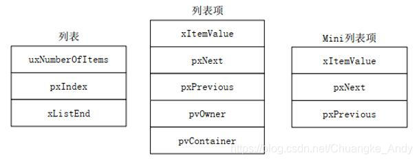
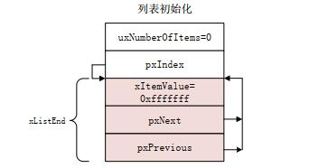
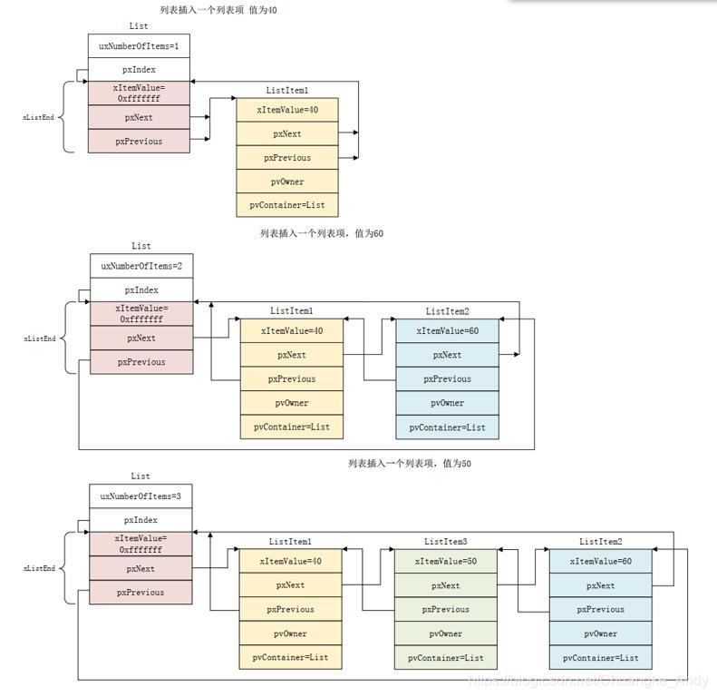
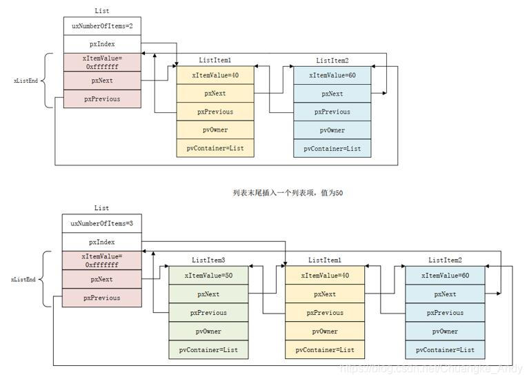

## 透查本质

在学习操作系统的时候，应该从本质出发。

疑问：

1. 操作系统的出现时机（背景），解决的问题？
2. 操作系统是如何保证安全的？
3. 操作系统是如何管理硬件资源的？
4. 操作系统是如何被推广的？
5. 操作系统的兼容性，跨平台性怎么样？
6. debug能力怎么样？
7. 是否方便易用，是否容易上手？

回答：

1. 资源受限设备的复杂性增加，仅仅靠while(1)无法软件解耦。有实时性的要求。
2. 给cpu分为特权模式和用户模式，特权模式可以访问所有资源，用户模式只能访问部分资源。任务有自己的栈空间，任务切换时，保存和恢复上下文。
3. 中断管理，cpu时间片管理，内存管理。
4. 极小的占用，开源免费，标准接口。
5. 支持多种架构的芯片，支持多种编译工具链。
6. 自带一些调试工具，追踪功能，内存检测。
7. 支持多任务，任务间通信，同步，互斥。

有啥说啥

> 这样设计有什么好处，为什么？
> 有没有必要这样设计？
> 有没有其他设计方案？
> 根据场景倒推设计思路。

[简介](freertos-简介)

[任务](freertos-任务)

[时间管理](freertos-时间管理)

[中断管理和临界段](freertos-中断管理和临界段)

[处理器利用率](freertos-处理器利用率)

## 列表和列表项

列表和列表项是FreeRTOS的一个数据结构，FreeRTOS大量使用到了列表和列表项，它是FreeRTOS的基石

### 列表和列表项的定义

#### 列表

列表是FreeRTOS中的一个数据结构，与链表类似，列表被用来跟踪FreeRTOS中的任务。其结构体 *List\_t* 在 *list.h* 文件中被定义

```c
typedef struct xLIST
{
  /* 列表内有效列表项个数 */
  configLIST_VOLATILE UBaseType_t uxNumberOfItems;
  /* 记录当前列表项索引号，用于遍历列表 */
  ListItem_t * configLIST_VOLATILE pxIndex;      
  /* 列表中最后一个列表项，表示列表结束 */
  MiniListItem_t xListEnd;              
} List_t;

```

#### 列表项

列表项就是存放在列表中的项目，FreeRTOS提供两种类型的列表项：列表项和迷你列表项。列表项的结构体 *ListItem\_t* 在 *list.h* 文件中被定义

```c
struct xLIST_ITEM
{
  /* 列表项值 */
  configLIST_VOLATILE TickType_t xItemValue;      
  /* 指向下一个列表项值 */
  struct xLIST_ITEM * configLIST_VOLATILE pxNext;    
  /* 指向上一个列表项值 */
  struct xLIST_ITEM * configLIST_VOLATILE pxPrevious;
  /* 当前列表项的拥有者 */
  void * pvOwner;                    
  /* 当前列表项归属的列表 */
  void * configLIST_VOLATILE pvContainer;        
};
typedef struct xLIST_ITEM ListItem_t;

```

#### 迷你列表项

有些情况下不需要列表项这么全的功能，为了避免造成内存浪费，定义了迷你列表项。迷你列表项的结构体 *MiniListItem\_t* 在 *list.h* 文件中被定义

```c
struct xMINI_LIST_ITEM
{
  /* 列表项值 */
  configLIST_VOLATILE TickType_t xItemValue;
  /* 指向下一个列表项值 */
  struct xLIST_ITEM * configLIST_VOLATILE pxNext;
  /* 指向上一个列表项值 */
  struct xLIST_ITEM * configLIST_VOLATILE pxPrevious;
};
typedef struct xMINI_LIST_ITEM MiniListItem_t;

```



### 列表和列表项的函数应用

列表的初始化：新创建的列表需要对其做初始化处理，其实就是初始化List\_t结构体中的各个成员变量，通过vListInitialise()函数来完成，该函数在list.c文件中定义

```c
void vListInitialise( List_t * const pxList )
{
  /* 此时列表中只有一个列表项xListEnd，索引地址指向尾节点 */
  pxList->pxIndex = ( ListItem_t * ) &( pxList->xListEnd );      
  /* xListEnd列表项值初始化为portMAX_DELAY（portmacro.h中定义的宏）*/
  pxList->xListEnd.xItemValue = portMAX_DELAY;
  /* 初始化xListEnd的pxNext变量，此时指向自身 */
  pxList->xListEnd.pxNext = ( ListItem_t * ) &( pxList->xListEnd );  
  /* 初始化xListEnd的pxPrevious变量，此时指向自身 */
  pxList->xListEnd.pxPrevious = ( ListItem_t * ) &( pxList->xListEnd );
  /* 当前有效的列表项个数为0，没有算xListEnd */
  pxList->uxNumberOfItems = ( UBaseType_t ) 0U;
}

```



列表项的初始化：新创建的列表项也需要初始化，通过vListInitialiseItem()函数来完成，该函数在list.c文件中定义

```c
void vListInitialiseItem( ListItem_t * const pxItem )
{
  /* 列表项初始化为不归属任何任务列表所有 */
  pxItem->pvContainer = NULL;
}

```

列表项的插入：将指定列表项插入到列表中，通过vListInsert()函数来完成

```c
void vListInsert( List_t * const pxList,   //列表项要插入的列表
          ListItem_t * const pxNewListItem){  //要插入的列表项
  ListItem_t *pxIterator;
  /* 获取要插入的列表项值 */
  const TickType_t xValueOfInsertion = pxNewListItem->xItemValue;
  /* 如获取到的列表项值为最大时，直接插入到尾部 */
  if( xValueOfInsertion == portMAX_DELAY )
  {
    pxIterator = pxList->xListEnd.pxPrevious;
  }
  else{
    /* 从尾节点开始遍历，与下个节点的Value值进行比较，当要插入Value值大于遍历列表项Value时，就获得插入位置（按升序方式插入） */
    for( pxIterator = ( ListItem_t * ) &( pxList->xListEnd ); pxIterator->pxNext->xItemValue <= xValueOfInsertion; pxIterator = pxIterator->pxNext ) 
    {
      //空循环，什么也不做
    }
  }
  /* 更新后面节点信息 （前后指针进行赋值） */
  pxNewListItem->pxNext = pxIterator->pxNext;
  pxNewListItem->pxNext->pxPrevious = pxNewListItem;
  /* 更新前面节点信息（前后指针进行赋值） */
  pxNewListItem->pxPrevious = pxIterator;
  pxIterator->pxNext = pxNewListItem;
  /* 把列表项归属于当前的列表 */
  pxNewListItem->pvContainer = ( void * ) pxList;
  /* 有效列表项数量进行累加 */
  ( pxList->uxNumberOfItems )++;
}

```

> 下图演示了向一个空列表中依次插入40、60和50三个列表项的插入过程



列表项的末尾插入：将指定列表项插入到列表末尾，通过vListInsertEnd()函数来完成

```c
void vListInsertEnd( List_t * const pxList,   //列表项要插入的列表
           ListItem_t * const pxNewListItem )  //要插入的列表项
{
  /* 获取当前列表索引值  */
  ListItem_t * const pxIndex = pxList->pxIndex;
  /* 插入到索引值之前,先进行尾部更新  */
  pxNewListItem->pxNext = pxIndex;
  pxNewListItem->pxPrevious = pxIndex->pxPrevious;
  /* 再进行头部更新 */
  pxIndex->pxPrevious->pxNext = pxNewListItem;
  pxIndex->pxPrevious = pxNewListItem;
  /* 列表项归属于列表 */
  pxNewListItem->pvContainer = ( void * ) pxList;
  /* 更新列表项数目 */
  ( pxList->uxNumberOfItems )++;
}

```

> 下图演示了向一个列表末尾插入列表项的插入过程



列表项的删除：从列表中删除指定的列表项，通过uxListRemove()函数来完成

```c
UBaseType_t uxListRemove( ListItem_t * const pxItemToRemove )
{
  /* 获取列表项所在的列表地址 */
  List_t * const pxList = ( List_t * ) pxItemToRemove->pvContainer;
  /* 将要删除的列表项的前后两个列表项进行连接 */
  pxItemToRemove->pxNext->pxPrevious = pxItemToRemove->pxPrevious;
  pxItemToRemove->pxPrevious->pxNext = pxItemToRemove->pxNext;
  /* Only used during decision coverage testing. */
  mtCOVERAGE_TEST_DELAY();
  /* 索引是否需要更新 */
  if( pxList->pxIndex == pxItemToRemove )
  {
    pxList->pxIndex = pxItemToRemove->pxPrevious;
  }
  else
  {
    mtCOVERAGE_TEST_MARKER();
  }
  /* 被删除列表项的成员变量pvContainer清零 */
  pxItemToRemove->pvContainer = NULL;
  /* 有效列表项数量减一 */
  ( pxList->uxNumberOfItems )--;
  /* 返回当前列表的有效列表项数量 */
  return pxList->uxNumberOfItems;
}

```

列表项的遍历：List\_t中的成员变量pxIndex是用来遍历列表的，FreeRTOS使用如下函数（宏）来完成列表的遍历，每调用一次这个函数，列表的pxIndex变量就会指向下一个列表项，并返回这个列表项的pvOwner变量值

```c
/* pxTCB用来保存pxIndex所指向的列表项的pvOwner, pxList表示要遍历的列表 */
#define listGET_OWNER_OF_NEXT_ENTRY( pxTCB, pxList )  \
{  \
  /* 首先获取当前列表 */
  List_t * const pxConstList = ( pxList );  \
  /* 列表的pxIndex变量指向下一个列表项 */
  ( pxConstList )->pxIndex = ( pxConstList )->pxIndex->pxNext;  \
  /* 如果pxIndex指向了列表的xListEnd成员变量，表示到了列表末尾 */
  if( ( void * ) ( pxConstList )->pxIndex == ( void * ) &( ( pxConstList )->xListEnd ) )  \
  {  \
    /* 此时就跳过xListEnd,pxIndex再次指向列表头的列表项，这样就完成了一次列表遍历 */
    ( pxConstList )->pxIndex = ( pxConstList )->pxIndex->pxNext;  \
  }  \
  /* 获取当前pxIndex指向的所有者（其实就是任务控制块）*/
  ( pxTCB ) = ( pxConstList )->pxIndex->pvOwner;  \
}

```

## 消息队列

[消息队列](消息队列/消息队列.md "消息队列")

## 信号量

[信号量](信号量/信号量.md "信号量")

## 事件标志组

### 事件标志组简介

信号量只能实现任务与单个事件或任务间的同步。但是某些任务可能会需要与多个事件或任务进行同步，此时就可以使用事件标志组来解决。事件标志组能够实现某个任务与多个事件或任务间的同步

- 事件位：用来表明某个事件是否发生，通常用作事件标志
- 事件组：一组事件位组成一个事件组，事件组中的事件位通过编号来访问

事件标志组的数据类型为 *EventGroupHandle\_t*，事件标志组中的所有事件位都存储在一个无符号的 *EventBits\_t* 类型的变量中；该变量为16位数据类型时，事件标志组可以存储8个事件位；该变量为32位数据类型时，事件标志组可以存储24个事件位（高8位均有其他用途）

```c
/***************EventBits_t在event_groups.h中定义**********/
typedef TickType_t EventBits_t;
/***************TickType_t在portmacro.h中定义**************/
#if( configUSE_16_BIT_TICKS == 1 )
    typedef uint16_t TickType_t;//事件标志组可以存储8个事件位
    #define portMAX_DELAY ( TickType_t ) 0xffff
#else
    typedef uint32_t TickType_t;//事件标志组可以存储24个事件位
    #define portMAX_DELAY ( TickType_t ) 0xffffffffUL
    #define portTICK_TYPE_IS_ATOMIC 1
#endif

```

### 事件标志组API函数

#### 创建事件标志组

```c
/********************动态创建事件标志组**********************************************/
EventGroupHandle_t xEventGroupCreate(void)
/********************静态创建事件标志组**********************************************/
EventGroupHandle_t xEventGroupCreateStatic(StaticEventGroup_t * pxEventGroupBuffer)
//参数：pxEventGroupBuffer指向一个StaticEventGroup_t类型的变量，用来保存事件标志组结构体
/***********************************************************************************/
返回值：创建成功返回事件标志组句柄；失败返回NULL

```

#### 设置事件位

```c
/****************将指定的事件位清零，用在任务中***************************************/
EventBits_t xEventGroupClearBits(EventGroupHandle_t xEventGroup,//要操作的事件标志组句柄
                 const EventBits_t uxBitsToClear)//要清零的事件位
/****************将指定的事件位置1，用在任务中***************************************/
EventBits_t xEventGroupSetBits(EventGroupHandle_t xEventGroup,//要操作的事件标志组句柄
                 const EventBits_t uxBitsToSet)//要置1的事件位
返回值：将指定事件位清零之前的事件组值；将指定事件位置1后的事件组值
/****************将指定的事件位清零，用在中断服务函数中********************************/
BaseType_t xEventGroupClearBitsFromISR(EventGroupHandle_t xEventGroup,
                      const EventBits_t uxBitsToClear)//要清零的事件位               
/****************将指定的事件位置1，用在中断服务函数中********************************/
//#define configUSE_TRACE_FACILITY需要配置为1
BaseType_t xEventGroupSetBitsFromISR(EventGroupHandle_t xEventGroup, 
                   const EventBits_t uxBitsToSet,//要置1的事件位
              BaseType_t *pxHigherPriorityTaskWoken)//标记退出后是否切换任务
返回值：清零或置1成功返回pdPASS;清零或置1失败返回pdFALSE             

```

指定事件位清零函数xEventGroupClearBits的源码如下示：

```c
EventBits_t xEventGroupClearBits(EventGroupHandle_t xEventGroup,
                const EventBits_t uxBitsToClear){
  EventGroup_t *pxEventBits = ( EventGroup_t * ) xEventGroup;
  EventBits_t uxReturn;
  taskENTER_CRITICAL();//进入临界段
  {
    /* 获取当前事件标志位 */
    uxReturn = pxEventBits->uxEventBits;
    /* 清除要设置的事件标志位 */
    pxEventBits->uxEventBits &= ~uxBitsToClear;
  }
  taskEXIT_CRITICAL();//退出临界段
  return uxReturn;//返回事件标志组值
}

```

指定事件位置1函数xEventGroupSetBits的源码如下示：

```c
EventBits_t xEventGroupSetBits(EventGroupHandle_t xEventGroup,
                const EventBits_t uxBitsToSet){
  ListItem_t *pxListItem, *pxNext;
  ListItem_t const *pxListEnd;
  List_t *pxList;
  EventBits_t uxBitsToClear = 0, uxBitsWaitedFor, uxControlBits;
  EventGroup_t *pxEventBits = ( EventGroup_t * ) xEventGroup;
  BaseType_t xMatchFound = pdFALSE;
  /* 获取事件列表头 */
  pxList = &( pxEventBits->xTasksWaitingForBits );
  /* 获取列表尾节点 */
  pxListEnd = listGET_END_MARKER( pxList ); 
  vTaskSuspendAll();//挂起调度器
  {  
    pxListItem = listGET_HEAD_ENTRY( pxList );//获取头节点
    pxEventBits->uxEventBits |= uxBitsToSet;//设置事件标志位
    /* 循环遍历整个列表项，直到列表头节点等于尾节点（指针） */
    while(pxListItem != pxListEnd){      
      pxNext = listGET_NEXT(pxListItem);//获取下个列表项
      /* 获取当前列表项的值 */
      uxBitsWaitedFor = listGET_LIST_ITEM_VALUE(pxListItem);    
      xMatchFound = pdFALSE;//标记是否找到需要处理的节点
      /* 拆分 */
      uxControlBits = uxBitsWaitedFor & eventEVENT_BITS_CONTROL_BYTES;
      uxBitsWaitedFor &= ~eventEVENT_BITS_CONTROL_BYTES;
      if((uxControlBits & eventWAIT_FOR_ALL_BITS) == (EventBits_t)0){
        /* 或逻辑，等待位已经置位 */
        if((uxBitsWaitedFor & pxEventBits->uxEventBits) != (EventBits_t)0){      
          xMatchFound = pdTRUE;//找到了已经触发的节点
        }
        else{
          mtCOVERAGE_TEST_MARKER();
        }
      }
      /* 表示所有等待的位都已经触发 */
      else if((uxBitsWaitedFor&pxEventBits->uxEventBits) == uxBitsWaitedFor){    
        xMatchFound = pdTRUE;//找到触发的节点
      }
      else{
        /* Need all bits to be set, but not all the bits were set. */
      }

      if( xMatchFound != pdFALSE ){
        /* 判断是否需要清除 */
        if((uxControlBits & eventCLEAR_EVENTS_ON_EXIT_BIT)!=(EventBits_t)0){
          uxBitsToClear |= uxBitsWaitedFor;//做个标记
        }
        else{
          mtCOVERAGE_TEST_MARKER();
        }
        /* 把任务从事件列表中移除  */
        (void)xTaskRemoveFromUnorderedEventList(pxListItem,pxEventBits->uxEventBits|eventUNBLOCKED_DUE_TO_BIT_SET);
      }
      pxListItem = pxNext;//当前列表项指向下个，继续遍历
    }
    pxEventBits->uxEventBits &= ~uxBitsToClear;//清除设置后的标志位
  }  
  (void) xTaskResumeAll();//开启调度器
  return pxEventBits->uxEventBits;
}

```

#### 获取事件标志组值

```c
/****************获取当前事件标志组的值，用在任务中***********************************/
EventBits_t xEventGroupGetBits(EventGroupHandle_t xEventGroup)//要操作的事件标志组句柄
/****************获取当前事件标志组的值，用在中断服务函数中****************************/
EventBits_t xEventGroupGetBitsFromISR(EventGroupHandle_t xEventGroup)
返回值：当前事件标志组的值

```

用在任务中获取当前事件标志组的值函数是一个宏定义，如下示：

```c
EventBits_t xEventGroupGetBitsFromISR(EventGroupHandle_t xEventGroup){
  UBaseType_t uxSavedInterruptStatus;
  EventGroup_t *pxEventBits = ( EventGroup_t * ) xEventGroup;
  EventBits_t uxReturn;  
  /* 禁止中断,带返回值 */
  uxSavedInterruptStatus = portSET_INTERRUPT_MASK_FROM_ISR();
  {    
    uxReturn = pxEventBits->uxEventBits;//获取事件标志位
  }
  /* 恢复中断，在进入禁止之前的状态 */
  portCLEAR_INTERRUPT_MASK_FROM_ISR( uxSavedInterruptStatus );
  return uxReturn;
}

```

等待指定的事件位

```c
/****************等待指定的事件位***************************************************/
EventBits_t xEventGroupWaitBits(EventGroupHandle_t xEventGroup, //要等待的事件标志组
               const EventBits_t uxBitsToWaitFor, //要等待的事件位
                 const BaseType_t xClearOnExit, //退出是否要清除位
                const BaseType_t xWaitForAllBits, //与逻辑还是或逻辑
                     TickType_t xTicksToWait) //阻塞等待时间
参  数：xClearOnExit若为pdTURE，则表示设置的位在函数退出时会被清零；
    xWaitForAllBits若为pdTURE，则表示所有要设置的位都置1或阻塞时间到，函数才会返回
    若为pdFALSE,则表示只要要设置的某一位置1或阻塞时间到，函数就会返回
返回值：返回所等待的事件位置1后的事件标志组的值，或返回阻塞时间到


EventBits_t xEventGroupWaitBits( EventGroupHandle_t xEventGroup, 
                const EventBits_t uxBitsToWaitFor, 
                const BaseType_t xClearOnExit, 
                const BaseType_t xWaitForAllBits, 
                TickType_t xTicksToWait){
  EventGroup_t *pxEventBits = ( EventGroup_t * ) xEventGroup;
  EventBits_t uxReturn, uxControlBits = 0;
  BaseType_t xWaitConditionMet, xAlreadyYielded;
  BaseType_t xTimeoutOccurred = pdFALSE;  
  vTaskSuspendAll();//挂起调度器
  {
    /* 获取当前的事件标志位 */
    const EventBits_t uxCurrentEventBits = pxEventBits->uxEventBits;
    /* 检查是否触发 */
    xWaitConditionMet = prvTestWaitCondition(uxCurrentEventBits, uxBitsToWaitFor, xWaitForAllBits);
    if( xWaitConditionMet != pdFALSE ){      
      /* 已经触发 */
      uxReturn = uxCurrentEventBits;
      xTicksToWait = ( TickType_t ) 0;
      /* 清楚已经触发的标志 */
      if( xClearOnExit != pdFALSE ){
        pxEventBits->uxEventBits &= ~uxBitsToWaitFor;
      }
      else{
        mtCOVERAGE_TEST_MARKER();
      }
    }
    else if(xTicksToWait == (TickType_t) 0){
      /* 不需要超时，直接返回标志位. */
      uxReturn = uxCurrentEventBits;
    }
    else{
      /* 事件没有触发，并且需要超时*/
      if( xClearOnExit != pdFALSE ){
        uxControlBits |= eventCLEAR_EVENTS_ON_EXIT_BIT;
      }
      else{
        mtCOVERAGE_TEST_MARKER();
      }

      if( xWaitForAllBits != pdFALSE ){
        //uxControlBits = 0x05000000UL;
        uxControlBits |= eventWAIT_FOR_ALL_BITS;
      }
      else{
        mtCOVERAGE_TEST_MARKER();
      }

      /* 把任务添加到事件列表中  */
      vTaskPlaceOnUnorderedEventList(&( pxEventBits->xTasksWaitingForBits), ( uxBitsToWaitFor | uxControlBits ), xTicksToWait );
      uxReturn = 0;
      traceEVENT_GROUP_WAIT_BITS_BLOCK( xEventGroup, uxBitsToWaitFor );
    }
  }
  xAlreadyYielded = xTaskResumeAll();//恢复调度器  
  if(xTicksToWait != (TickType_t ) 0){//再次判断是否需要超时
    if( xAlreadyYielded == pdFALSE ){
      portYIELD_WITHIN_API();//进行上下文切换 ->pendSV
    }
    else{
      mtCOVERAGE_TEST_MARKER();
    }
    /* 任务已经恢复，则复位列表项中的值  复位为任务有优先级 */
    uxReturn = uxTaskResetEventItemValue();
    /* 是不是通过事件置位解除的任务 */
    if((uxReturn & eventUNBLOCKED_DUE_TO_BIT_SET) == (EventBits_t)0){    
      taskENTER_CRITICAL();//进入临界段
      {
        
        uxReturn = pxEventBits->uxEventBits;// 获取当前事件位
        /* 再此判断是否已经置位 */
        if( prvTestWaitCondition( uxReturn, uxBitsToWaitFor, xWaitForAllBits ) != pdFALSE ){
          /* 如果需要清除，清除触发后的标志位 */
          if( xClearOnExit != pdFALSE ){
            pxEventBits->uxEventBits &= ~uxBitsToWaitFor;
          }
          else{
            mtCOVERAGE_TEST_MARKER();
          }
        }
        else{
          mtCOVERAGE_TEST_MARKER();
        }
      }
      taskEXIT_CRITICAL();
      xTimeoutOccurred = pdFALSE;
    }
    else{
      /* The task unblocked because the bits were set. */
    }
    /* 返回当前事件标志位 */
    uxReturn &= ~eventEVENT_BITS_CONTROL_BYTES;
  }
  traceEVENT_GROUP_WAIT_BITS_END( xEventGroup, uxBitsToWaitFor, xTimeoutOccurred );
  return uxReturn;
}


```

#### 等待指定的事件位

```c
/****************等待指定的事件位***************************************************/
EventBits_t xEventGroupWaitBits(EventGroupHandle_t xEventGroup, //要等待的事件标志组
               const EventBits_t uxBitsToWaitFor, //要等待的事件位
                 const BaseType_t xClearOnExit, //退出是否要清除位
                const BaseType_t xWaitForAllBits, //与逻辑还是或逻辑
                     TickType_t xTicksToWait) //阻塞等待时间
参  数：xClearOnExit若为pdTURE，则表示设置的位在函数退出时会被清零；
    xWaitForAllBits若为pdTURE，则表示所有要设置的位都置1或阻塞时间到，函数才会返回
    若为pdFALSE,则表示只要要设置的某一位置1或阻塞时间到，函数就会返回
返回值：返回所等待的事件位置1后的事件标志组的值，或返回阻塞时间到


EventBits_t xEventGroupWaitBits( EventGroupHandle_t xEventGroup, 
                const EventBits_t uxBitsToWaitFor, 
                const BaseType_t xClearOnExit, 
                const BaseType_t xWaitForAllBits, 
                TickType_t xTicksToWait){
  EventGroup_t *pxEventBits = ( EventGroup_t * ) xEventGroup;
  EventBits_t uxReturn, uxControlBits = 0;
  BaseType_t xWaitConditionMet, xAlreadyYielded;
  BaseType_t xTimeoutOccurred = pdFALSE;  
  vTaskSuspendAll();//挂起调度器
  {
    /* 获取当前的事件标志位 */
    const EventBits_t uxCurrentEventBits = pxEventBits->uxEventBits;
    /* 检查是否触发 */
    xWaitConditionMet = prvTestWaitCondition(uxCurrentEventBits, uxBitsToWaitFor, xWaitForAllBits);
    if( xWaitConditionMet != pdFALSE ){      
      /* 已经触发 */
      uxReturn = uxCurrentEventBits;
      xTicksToWait = ( TickType_t ) 0;
      /* 清楚已经触发的标志 */
      if( xClearOnExit != pdFALSE ){
        pxEventBits->uxEventBits &= ~uxBitsToWaitFor;
      }
      else{
        mtCOVERAGE_TEST_MARKER();
      }
    }
    else if(xTicksToWait == (TickType_t) 0){
      /* 不需要超时，直接返回标志位. */
      uxReturn = uxCurrentEventBits;
    }
    else{
      /* 事件没有触发，并且需要超时*/
      if( xClearOnExit != pdFALSE ){
        uxControlBits |= eventCLEAR_EVENTS_ON_EXIT_BIT;
      }
      else{
        mtCOVERAGE_TEST_MARKER();
      }

      if( xWaitForAllBits != pdFALSE ){
        //uxControlBits = 0x05000000UL;
        uxControlBits |= eventWAIT_FOR_ALL_BITS;
      }
      else{
        mtCOVERAGE_TEST_MARKER();
      }

      /* 把任务添加到事件列表中  */
      vTaskPlaceOnUnorderedEventList(&( pxEventBits->xTasksWaitingForBits), ( uxBitsToWaitFor | uxControlBits ), xTicksToWait );
      uxReturn = 0;
      traceEVENT_GROUP_WAIT_BITS_BLOCK( xEventGroup, uxBitsToWaitFor );
    }
  }
  xAlreadyYielded = xTaskResumeAll();//恢复调度器  
  if(xTicksToWait != (TickType_t ) 0){//再次判断是否需要超时
    if( xAlreadyYielded == pdFALSE ){
      portYIELD_WITHIN_API();//进行上下文切换 ->pendSV
    }
    else{
      mtCOVERAGE_TEST_MARKER();
    }
    /* 任务已经恢复，则复位列表项中的值  复位为任务有优先级 */
    uxReturn = uxTaskResetEventItemValue();
    /* 是不是通过事件置位解除的任务 */
    if((uxReturn & eventUNBLOCKED_DUE_TO_BIT_SET) == (EventBits_t)0){    
      taskENTER_CRITICAL();//进入临界段
      {
        
        uxReturn = pxEventBits->uxEventBits;// 获取当前事件位
        /* 再此判断是否已经置位 */
        if( prvTestWaitCondition( uxReturn, uxBitsToWaitFor, xWaitForAllBits ) != pdFALSE ){
          /* 如果需要清除，清除触发后的标志位 */
          if( xClearOnExit != pdFALSE ){
            pxEventBits->uxEventBits &= ~uxBitsToWaitFor;
          }
          else{
            mtCOVERAGE_TEST_MARKER();
          }
        }
        else{
          mtCOVERAGE_TEST_MARKER();
        }
      }
      taskEXIT_CRITICAL();
      xTimeoutOccurred = pdFALSE;
    }
    else{
      /* The task unblocked because the bits were set. */
    }
    /* 返回当前事件标志位 */
    uxReturn &= ~eventEVENT_BITS_CONTROL_BYTES;
  }
  traceEVENT_GROUP_WAIT_BITS_END( xEventGroup, uxBitsToWaitFor, xTimeoutOccurred );
  return uxReturn;
}

```

## 软件定时器

[软件定时器](freertos-软件定时器)

## 低功耗管理

[低功耗管理](2025-4-20-freertos-低功耗管理)

## 内存管理

[内存管理](/freertos/2025-4-20-freertos-内存管理)

## 常见名词

- MPU ：**Memory Protection Unit**（内存保护单元）
- CRITICAL：临界
- SysTick：内置的系统定时器
- SVC：**System Service Call**系统调用（用于产生系统函数的调用请求）
- PendSV：**Pend System Service Call** 可悬起的系统调用（可以像普通的中断一样被抢占挂起的，具有缓期执行的特点）
- ISR：**Interrupt Service Routine**中断服务例程
- IRQ：**Interrupt Request** 中断请求
- idle task：**空闲任务**，操作系统在没有其他任务需要运行时执行的默认任务。

队列解锁

创建事件标志组


[参考链接](https://andyxi.blog.csdn.net/article/details/115397230)
