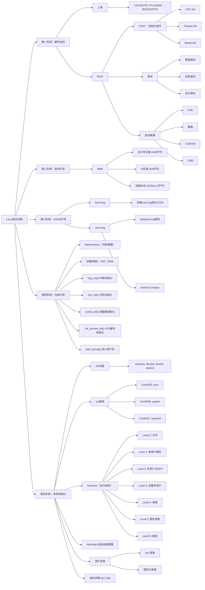

## init.d

```mermaid
graph LR
  A["Linux启动流程"]

  A --> B1["第一阶段：硬件启动"]
  A --> B2["第二阶段：启动引导"]
  A --> B3["第三阶段：GRUB引导"]
  A --> B4["第四阶段：内核引导"]
  A --> B5["第五阶段：系统初始化"]

  %% 第一阶段
  B1 --> B1a["上电"]
  B1a --> B1a1["CS=0xFFFF, IP=0x0000 → 执行0xFFFF0"]
  B1 --> B1b["BIOS"]
  B1b --> B1b1["POST：初始化组件"]
  B1b1 --> B1b1a["CPU Init"]
  B1b1 --> B1b1b["Chipset Init"]
  B1b1 --> B1b1c["Board Init"]
  B1b --> B1b2["驱动"]
  B1b2 --> B1b2a["键鼠驱动"]
  B1b2 --> B1b2b["自检驱动"]
  B1b2 --> B1b2c["显示驱动"]
  B1b --> B1b3["启动管理"]
  B1b3 --> B1b3a["PXE"]
  B1b3 --> B1b3b["硬盘"]
  B1b3 --> B1b3c["CDROM"]
  B1b3 --> B1b3d["USB"]

  %% 第二阶段
  B2 --> B2a["MBR"]
  B2a --> B2a1["主引导记录 (446字节)"]
  B2a --> B2a2["分区表 (64字节)"]
  B2a --> B2a3["结束标志 0x55AA (2字节)"]

  %% 第三阶段
  B3 --> B3a["boot.img"]
  B3a --> B3a1["加载core.img到0x7C00"]
  B3 --> B3b["core.img"]
  B3b --> B3b1["diskboot.img模块"]
  B3b --> B3b2["kernel & module"]

  %% 第四阶段
  B4 --> B4a["/boot/vmlinuz（内核镜像）"]
  B4 --> B4b["创建进程0：INIT_TASK"]
  B4 --> B4c["trap_init() 中断初始化"]
  B4 --> B4d["mm_init() 内存初始化"]
  B4 --> B4e["sched_init() 调度器初始化"]
  B4 --> B4f["vfs_caches_init() VFS缓存初始化"]
  B4 --> B4g["start_kernel() 进入用户态"]

  %% 第五阶段
  B5 --> B5a["init功能"]
  B5a --> B5a1["/sbin/init, /bin/init, /bin/sh, /etc/init"]
  B5 --> B5b["init类型"]
  B5b --> B5b1["CentOS5: sysv"]
  B5b --> B5b2["CentOS6: upstart"]
  B5b --> B5b3["CentOS7: systemd"]
  B5 --> B5c["Runlevel（运行级别）"]
  B5c --> B5c0["Level 0: 关机"]
  B5c --> B5c1["Level 1: 单用户模式"]
  B5c --> B5c2["Level 2: 多用户无NFS"]
  B5c --> B5c3["Level 3: 完整多用户"]
  B5c --> B5c4["Level 4: 保留"]
  B5c --> B5c5["Level 5: 图形界面"]
  B5c --> B5c6["Level 6: 重启"]
  B5 --> B5d["/etc/fstab 启动挂载配置"]
  B5 --> B5e["用户登录"]
  B5e --> B5e1["ssh 登录"]
  B5e --> B5e2["图形化登录"]
  B5 --> B5f["虚拟终端 tty1~tty6"]
```
