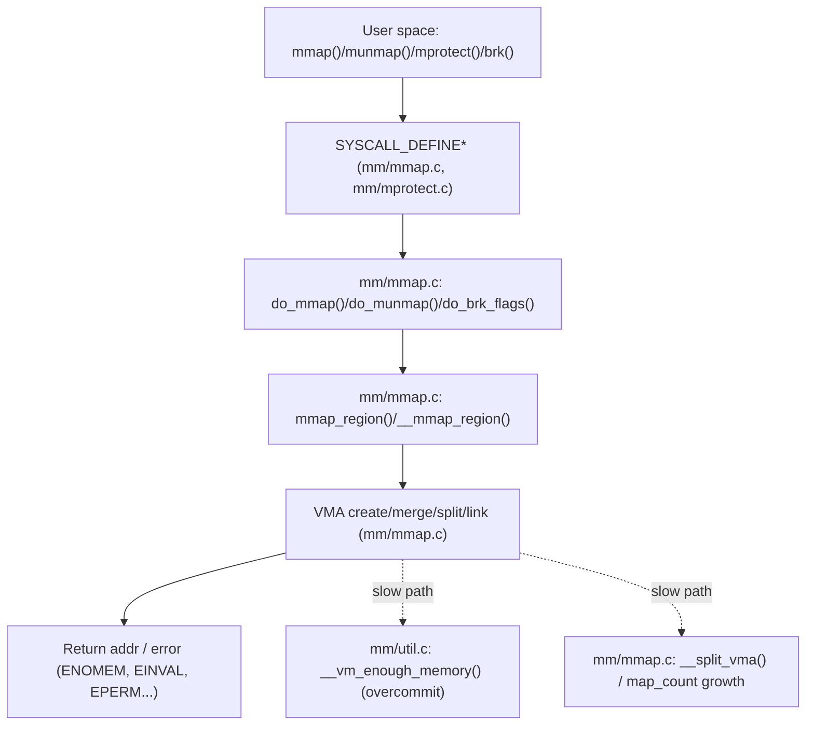

> 目标读者：有一定内核/系统编程基础的工程师。本文以 Linux `v5.15.200`（arm64）为基线，强调“入口 → call route → 关键对象 → 慢路径 → 参数/观测 → 排障落点到源码”。

## 0. 目标与边界（环境信息尽量写清）

- 序号（1..N）：01
- 模块/主题：进程地址空间与 VMA（`struct mm_struct` / `struct vm_area_struct`）
- Kernel 版本：`v5.15.200`
- 架构：`arm64`
- 源码树路径：`/Volumes/CF/code/source-code/linux-5.15.200`
- 覆盖：
  - `mmap/munmap/mprotect/mremap/brk/mlock/madvise` 的**VMA 视角**主路径
  - VMA 插入/合并/拆分、`mmap_lock` 的语义与常见慢路径
- 不覆盖：
  - page fault 细节（见【03】）
  - 页表/TLB flush 细节（见【02】）
  - reclaim/swap/compaction（见【06】【07】【08】）

## 1. 设计原理（为什么需要它 + 演进/迭代历史）

### 1.1 为什么需要 VMA / mm_struct

- 进程虚拟地址空间需要一个“区间元数据层”描述：权限（R/W/X）、匿名/文件映射、COW、NUMA policy、madvise hint、锁/并发约束。
- VMA 是“策略与机制的分界点”：
  - 缺页（【03】）在 VMA 上决定走匿名页、文件页、hugetlb、userfaultfd 等分支；
  - unmap（【02】）从 VMA 提供范围，决定 zap 策略与拆分粒度；
  - reclaim（【06】）与 mmap 的 overcommit/memcg（【11】）又在 VMA/ mm 层交汇。

### 1.2 关键 trade-off

- **查找快 vs 更新快**：VMA 查找频繁（fault、mprotect、madvise），更新也频繁（mmap/munmap/mremap）。因此内核在 `mm_struct` 中同时维护：
  - 适合区间查找的 rb-tree（`mm_struct.mm_rb` 等）；
  - 线性链表（`mm_struct.mmap`）方便遍历与一些批处理。
- **并发读多写少**：fault/unmap/mprotect 都需要在“读多写少”的现实中可扩展，因此使用 `mmap_lock`（v5.15 中大量路径仍以 rwsem 语义为核心）。

### 1.3 演进视角（v5.15 观测点）

- `mmap_sem` 命名逐步演进为 `mmap_lock`，强调“读者=缺页/遍历者，写者=映射变更者”的并发模型。
- 对 map_count（VMA 数量）进行更强约束：`vm.max_map_count`（见 §5）在 `mm/mmap.c` 的 fast-path 上直接检查，避免极端 VMA 数量导致路径退化。

### 1.4 路线图（call-path route）

## 2. 关键数据结构详解（尽量覆盖“相关结构体及字段”）

### 2.1 结构体清单（与主路径/慢路径相关）

- `include/linux/mm_types.h: struct mm_struct`
- `include/linux/mm_types.h: struct vm_area_struct`
- `include/linux/mm.h: struct vm_operations_struct`（file-backed fault 的“钩子面”）

### 2.2 `struct mm_struct`（你需要盯住的字段）

- 定义：`/Volumes/CF/code/source-code/linux-5.15.200/include/linux/mm_types.h: struct mm_struct`
- 生命周期：
  - 创建：`copy_mm()` / `mm_init()`（fork/exec 路线；本文只用作背景）
  - 销毁：`exit_mmap()`（unmap 全部 VMA；与【02】交界）
- 并发与锁：
  - `mmap_lock`：保护 VMA 结构（插入/删除/修改/遍历）以及部分与页表交互的关键不变量
- 常用“负重字段”（建议在源码里逐个跟读它们的写入点）：
  - `mm_rb` / `mmap`：VMA rb-tree / list
  - `map_count`：VMA 数量；与 `vm.max_map_count` 强相关（见 §5）
  - `pgd`：页表根（与【02】交界）

### 2.3 `struct vm_area_struct`（VMA：区间 + 策略的最小单元）

- 定义：`/Volumes/CF/code/source-code/linux-5.15.200/include/linux/mm_types.h: struct vm_area_struct`
- 生命周期：
  - 由 `mmap_region()/__mmap_region()` 创建并链接进 `mm_struct`
  - 由 `do_munmap()/__do_munmap()` 删除（或由 mprotect/madvise 触发拆分/合并）
- 字段（抓住“决定分支”的字段）：
  - `vm_start/vm_end`：区间范围
  - `vm_flags`：权限、匿名/文件、hugetlb、locked、madvise 等 hint 的核心载体
  - `vm_file/vm_pgoff`：file-backed 映射的身份与偏移
  - `vm_ops`：file-backed 的 fault/open/close 等回调（与【03】【04】交界）

## 3. 核心流程源码走读（主路径 + 关键函数逐步/逐行式讲解）

### 3.1 入口点（从用户态/外部看）

- `mmap()`：`/Volumes/CF/code/source-code/linux-5.15.200/mm/mmap.c: SYSCALL_DEFINE6(mmap_pgoff)`
- `munmap()`：`/Volumes/CF/code/source-code/linux-5.15.200/mm/mmap.c: SYSCALL_DEFINE2(munmap)`
- `brk()`：`/Volumes/CF/code/source-code/linux-5.15.200/mm/mmap.c: SYSCALL_DEFINE1(brk)`
- `mprotect()`：`/Volumes/CF/code/source-code/linux-5.15.200/mm/mprotect.c: SYSCALL_DEFINE3(mprotect)`

### 3.2 Happy path：`mmap()` 新建 VMA（匿名映射为例）

主线（强调“每一步负责什么不变量”）：

1. `mm/mmap.c: SYSCALL_DEFINE6(mmap_pgoff)`：参数校验、对齐与 flags 解析（用户态 → 内核态边界）
2. `mm/mmap.c: do_mmap()`：决定地址（若 addr=0 则走选址）、准备 VMA 的初始 `vm_flags`
3. `mm/mmap.c: mmap_region()` → `__mmap_region()`：核心阶段
   - 预检查：是否超过 `sysctl_max_map_count`（`mm/mmap.c` 直接检查 `mm->map_count`）
   - 若需要：尝试与相邻 VMA 合并（减少 map_count 与 rb-tree 变更）
4. “链接阶段”（在 `mm/mmap.c` 内的一组 helper）：把新 VMA 插入 rb-tree + list，并更新 `map_count`
5. 返回：成功返回映射起始虚拟地址；失败回滚（见 §4）

### 3.3 Happy path：`munmap()` 删除 VMA 区间

1. `mm/mmap.c: SYSCALL_DEFINE2(munmap)`
2. `mm/mmap.c: do_munmap()` → `__do_munmap()`：拆分边界、从 rb-tree/list 断开 VMA
3. `mm/memory.c: unmap_vmas()`：进入 unmap/zap 与 TLB gather（详见【02】）

### 3.4 Happy path：`mprotect()` 修改权限（触发 VMA 拆分/合并）

1. `mm/mprotect.c: SYSCALL_DEFINE3(mprotect)`
2. `mm/mprotect.c: mprotect_fixup()`：对区间做拆分/修改 flags（可能触发 map_count 增长）
3. `mm/mprotect.c`：必要时触发 pte 级别权限变更与 flush（与【02】交界）

## 4. 慢速/异常路径详解（失败分支、回退、重试、资源不足）

### 4.1 典型失败：`-ENOMEM` / `mmap: cannot allocate memory`

常见触发点（你排障时应逐条排除）：

- 超过 `vm.max_map_count`：
  - 检查点：`/Volumes/CF/code/source-code/linux-5.15.200/mm/mmap.c` 中对 `mm->map_count` 的判断
  - 典型症状：`ENOMEM`，但系统内存仍充足；进程 VMA 数量爆炸（大量小映射/频繁拆分）
- overcommit 策略拒绝：
  - 入口：`mm/util.c: __vm_enough_memory()`
  - 常见调用点：`mm/mmap.c` / `mm/shmem.c` / `mm/swapfile.c`（见【11】的 overcommit 主线）
- 权限/安全策略：
  - `vm.mmap_min_addr`（低地址映射限制，安全增强）；见 §5

### 4.2 map_count 增长与“拆分风暴”

- `mprotect/madvise/mremap` 会导致 VMA 拆分，间接推高 `map_count`。
- 对策思路（工程侧）：
  - 合并映射、减少频繁小区间权限变更；
  - 观察 `map_count` 与 sysctl `vm.max_map_count` 的关系（见 §5）。

### 4.3 `mmap_lock` 竞争导致的尾延迟

- 典型现象：多线程频繁 mmap/munmap 与 page fault 并发，导致 fault 侧拿读锁与写侧互斥，尾延迟上升。
- 排查切入：
  - 先用观测证明是锁竞争（见 §7 的 perf/ftrace/lock_stat）
  - 再回到 `mm/mmap.c` 与调用点（malloc、JIT、mmap 文件 IO）做流量整形。

## 5. 调优参数与观测指标（映射到源码“在哪里读/在哪里生效”）

### 5.1 sysctl / boot params（与源码对应）

- `vm.max_map_count`
  - 注册：`/Volumes/CF/code/source-code/linux-5.15.200/kernel/sysctl.c`（`vm_table[]`）
  - 数据：`/Volumes/CF/code/source-code/linux-5.15.200/mm/util.c: sysctl_max_map_count`
  - 生效点：`/Volumes/CF/code/source-code/linux-5.15.200/mm/mmap.c`（对 `mm->map_count` 的 fast-path 检查）
- `vm.mmap_min_addr`
  - 注册：`/Volumes/CF/code/source-code/linux-5.15.200/kernel/sysctl.c`（`vm_table[]`）
  - handler：`mmap_min_addr_handler`（在 sysctl 侧）
  - 生效点：通常在 mmap 路线的安全检查（可从 `dac_mmap_min_addr` 的引用追）
- `norandmaps`（boot param）
  - 注册：`/Volumes/CF/code/source-code/linux-5.15.200/mm/memory.c: __setup("norandmaps", disable_randmaps)`
  - 影响：关闭地址空间随机化相关的映射随机策略（与安全/可复现性权衡）

### 5.2 /proc 指标面（定位到实现文件）

- `/proc/<pid>/maps` / `/proc/<pid>/smaps`
  - 实现：`/Volumes/CF/code/source-code/linux-5.15.200/fs/proc/task_mmu.c`
  - 用途：确认 VMA 数量/布局/权限/匿名与文件映射比例（辅助定位 map_count、拆分风暴、权限异常）

## 6. 常见问题与源码级解释（症状 → 诊断路线 → 根因定位）

### 6.1 症状：频繁 ENOMEM，但机器内存还很多

诊断路线（从最便宜的证据开始）：

1. 先看 VMA 数量与碎片程度：`cat /proc/<pid>/maps | wc -l`
2. 再看 `vm.max_map_count`：`sysctl vm.max_map_count`
3. 如 VMA 数量逼近上限：
   - 对照 `mm/mmap.c` 的检查点（`mm->map_count` vs `sysctl_max_map_count`）
   - 追溯：是谁触发了大量小映射/拆分（malloc arena、JIT、mprotect 频繁切换等）
4. 若 VMA 数量不高：
   - 看 overcommit：`sysctl vm.overcommit_memory` / `vm.overcommit_ratio`（见【11】）
   - 用 `strace -f` 抓失败 errno 与触发 syscall

### 6.2 症状：mprotect 很慢 / 尾延迟高

1. 先用 perf 证明 CPU 花在 `mprotect_fixup()` 相关栈上
2. 再用 ftrace 观察是否频繁拆分 VMA 导致 map_count 反复增减
3. 如同时伴随 page fault：进一步检查 `mmap_lock` 读写竞争

## 7. 分析工具箱（最小命令 + 关键输出怎么读 + 如何落到源码）

- **快速确认 VMA 数量与异常拆分**
  - 命令：`cat /proc/<pid>/maps | wc -l`
  - 解读：数量异常高 → 优先怀疑 map_count/拆分风暴
  - 源码落点：`mm/mmap.c` 的 `map_count` 检查与拆分路径
- **perf：定位热点函数**
  - 命令：`sudo perf top -p <pid>`
  - 关注：`do_mmap`/`mmap_region`/`__do_munmap`/`mprotect_fixup`
  - 源码落点：`mm/mmap.c`、`mm/mprotect.c`
- **ftrace：抓 call route（验证分支）**
  - 命令：`echo function_graph > /sys/kernel/tracing/current_tracer`（按环境启用 tracefs）
  - 关注：`do_mmap`/`mmap_region` 期间是否频繁走 split/merge
- **源码导航（可直接复制）**
  - `K=/Volumes/CF/code/source-code/linux-5.15.200`
  - `rg -n "\\bdo_mmap\\b|\\bmmap_region\\b|\\b__mmap_region\\b" $K/mm/mmap.c`
  - `rg -n "\\bdo_munmap\\b|\\b__do_munmap\\b" $K/mm/mmap.c`
  - `rg -n "\\bmprotect_fixup\\b" $K/mm/mprotect.c`
  - `rg -n "\\bsysctl_max_map_count\\b" $K/mm/util.c $K/kernel/sysctl.c $K/mm/mmap.c`

---

## 附录 I：讲解提纲包（Explain Pack）

### 30 秒定义（one-liner）

VMA 是 Linux 进程地址空间中“区间级元数据”的最小单元，`mm_struct` 维护这些区间的组织结构与并发约束，使得 mmap/munmap/mprotect 与 page fault/unmap/reclaim 等路径能在统一不变量下协作。

### 3–5 分钟白板讲解提纲

1. 接口：`mmap/munmap/mprotect/brk` 解决“虚拟地址空间怎么被切片与授权”
2. 核心对象：`mm_struct`（全局视图）+ `vm_area_struct`（区间视图）
3. 组织结构：rb-tree 做区间查找，list 做遍历；`map_count` 作为复杂度守门人
4. 并发模型：`mmap_lock`（读者=fault/遍历，写者=映射变更）
5. 慢路径：overcommit / max_map_count / 拆分风暴 / 锁竞争
6. 调参与观测：`vm.max_map_count`、`vm.mmap_min_addr`、`/proc/<pid>/(s)maps`

### 高频追问（答案骨架 + 易错点 + 延伸）

1. 为什么要限制 `vm.max_map_count`？
   - 骨架：避免 rb-tree/list 操作与拆分/合并在极端 VMA 数量下退化；也是 DoS 防护面
   - 易错点：把 ENOMEM 误判成“系统内存不足”
   - 延伸：结合 `mm/mmap.c` 的检查点解释错误码来源
2. `mmap_lock` 为什么会影响 page fault？
   - 骨架：fault 需要在 VMA 稳定视图下决定分支并可能修改 PTE，因此与映射变更互斥
   - 易错点：只看 fault 栈，不看写侧 mmap/munmap 的压力
   - 延伸：用 perf+ftrace 量化读写竞争

### trade-off 对比表

| 方案 | 好处 | 坑/代价 | 为什么 Linux 选现在这样 |
|---|---|---|---|
| 只用线性 list 管 VMA | 实现简单 | 查找退化，fault 成本高 | 区间查找是主路径，必须用树结构 |
| 每次权限变更都新建 VMA | 逻辑清晰 | map_count 爆炸、拆分风暴 | 需要 merge/split 折中 |
| 完全无锁读 VMA | 读很快 | 一致性与回收难 | 以 `mmap_lock` 提供统一不变量更可控 |

### v5.15 演进视角（现在为什么是这样）

- `mmap_lock` 命名与语义收敛：强调对 VMA 元数据的读写并发约束
- sysctl/限制项（如 `vm.max_map_count`）被放到关键路径，尽早失败避免更深层的代价

