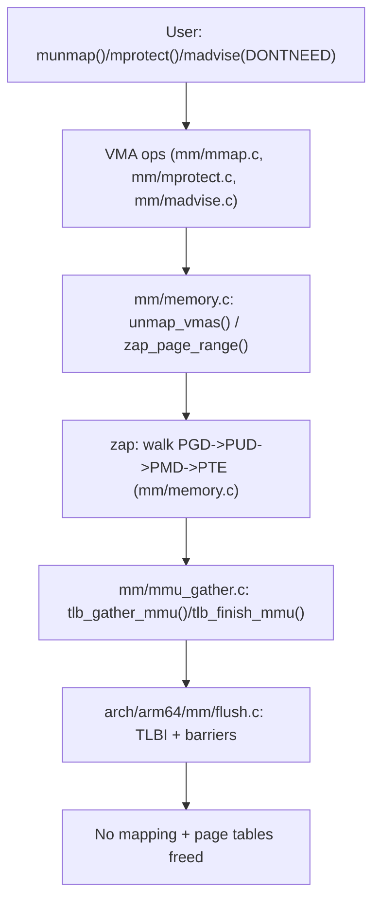

> 本文聚焦“虚拟地址区间被撤销映射时发生了什么”：从 VMA 范围（【01】）进入 zap PTE/PMD → 批量回收页表 → 触发 TLB shootdown（arm64）。基线：Linux `v5.15.200`（arm64）。

## 0. 目标与边界

- 序号（1..N）：02
- 模块/主题：页表管理、unmap/zap、TLB flush（含 arm64 glue）
- Kernel 版本：`v5.15.200`，Arch：`arm64`
- 源码树：`/Volumes/CF/code/source-code/linux-5.15.200`
- 覆盖：
  - `munmap/mprotect/madvise(DONTNEED)` 等触发的 unmap 典型 call route
  - `mmu_gather`（TLB batching）与 “zap page table” 的关键不变量
  - arm64 上 TLB flush 的落点（到 `arch/arm64/mm/flush.c`）
- 不覆盖：
  - page fault 的建表流程（见【03】）
  - THP/hugetlb 的大页细节（见【09】）

## 1. 设计原理

### 1.1 为什么 unmap 必须“分层 + 批量”

- 目标：把一个虚拟地址区间从“可访问”变为“不可访问”，并回收相关页表与页面引用。
- 难点：多核 + 并发执行 + TLB 缓存导致“页表更新”与“CPU 看到更新”之间有延迟与一致性成本。
- 核心取舍：
  - 逐页 flush 最简单，但 IPI/TLB 操作成本爆炸；
  - 批量 flush 降低成本，但需要 `mmu_gather` 维护区间边界与延迟回收不变量。

### 1.2 路线图（call-path route）

## 2. 关键数据结构详解

### 2.1 结构体清单

- `include/linux/mm_types.h: struct mm_struct`
- `mm/mmu_gather.c: struct mmu_gather`
- `include/linux/mmu_notifier.h: struct mmu_notifier_range`（可选：当有 notifier 时）
- 页表项类型：`arch/arm64/include/asm/pgtable.h`（`pgd_t/pud_t/pmd_t/pte_t` 等）

### 2.2 `struct mmu_gather`（TLB batching 的“事务上下文”）

- 定义/实现：`/Volumes/CF/code/source-code/linux-5.15.200/mm/mmu_gather.c`
- 职责：
  - 记录需要 flush 的地址范围与批次；
  - 延迟释放页表页，保证在 flush 之前不会被复用导致可见性问题。
- 你排查“unmap 后仍能访问/偶发奇怪 fault”时，`mmu_gather` 是必须确认的不变量来源。

## 3. 核心流程源码走读

### 3.1 Happy path：`munmap()` → unmap → tlb_finish

1. `mm/mmap.c: do_munmap()` → `__do_munmap()`：拿到需要撤销映射的 VMA 范围（与【01】交界）
2. `mm/memory.c: unmap_vmas()`：针对 VMA 列表/范围驱动 unmap
3. `mm/memory.c: zap_page_range()`（及其内部 helper）：
   - page table walk：PGD→PUD→PMD→PTE
   - 清 PTE/PMD，并把待回收项交给 `mmu_gather`
4. `mm/mmu_gather.c: tlb_finish_mmu()`：收尾阶段，确保 flush 完成后再释放相关结构
5. `arch/arm64/mm/flush.c`：TLB 相关落点（最终生效）

### 3.2 Happy path：`mprotect()` 触发权限变更与 flush

- 入口：`mm/mprotect.c: mprotect_fixup()`（与【01】的 VMA 拆分/合并一致）
- 关键点：
  - PTE 权限更新需要对齐架构的页表位语义（arm64：XN/AP/UXN 等）
  - 必要时触发 TLB flush，避免旧权限在 TLB 中残留

## 4. 慢速/异常路径

### 4.1 大范围 unmap 导致 shootdown 开销暴涨

- 现象：`munmap` 或 `madvise(DONTNEED)` 对超大区间操作，触发大量 TLB flush / IPI。
- 排查：
  - perf 看热点是否在 flush/tlb_finish 栈；
  - tracepoint `tlb:tlb_flush`（见 §5）确认 flush 次数与区间分布。

### 4.2 与 THP/hugetlb 的交界导致“拆大页/拆表”

- 当映射涉及 THP PMD 映射，unmap 可能需要 split（见【09】），路径更重。
- 你在 unmap 栈上看到 hugepage/split 相关函数时，应把问题边界切到【09】核对策略。

## 5. 调优参数与观测指标（映射到源码）

### 5.1 tracepoints：TLB flush 观测

- tracepoint 定义：`/Volumes/CF/code/source-code/linux-5.15.200/include/trace/events/tlb.h: TRACE_EVENT(tlb_flush, ...)`
- 使用场景：
  - 证明 TLB flush 是否为延迟主因；
  - 把 flush 与具体用户态操作（munmap/mprotect）相关联。

### 5.2 debug 观测面（建议按需要启用）

- 页表 dump：`CONFIG_PTDUMP` / debugfs 相关工具（arm64 常见在 `arch/arm64/mm/ptdump.c` 一带）
- debug_vm_pgtable：用于验证页表位行为与一致性（作为机制层“自证”手段）

## 6. 常见问题与源码级解释

### 6.1 症状：`munmap()` 很慢 / 系统抖动

诊断路线：

1. 用 tracepoint 证明是否是 TLB flush 主因：`tlb:tlb_flush`
2. 若 flush 很频繁：
   - 检查是否有大量小区间/碎片化 VMA（回到【01】看 map_count 与拆分风暴）
   - 检查是否涉及 THP split（回到【09】）
3. 若 flush 不多：
   - 关注 page table walk 与释放页表页的成本（`mm/memory.c` / `mm/mmu_gather.c`）

## 7. 分析工具箱

- **trace-cmd / perf trace：捕获 tlb flush**
  - 最小命令（示例）：`sudo perf trace -e tlb:tlb_flush`（按系统 tracepoint 支持调整）
  - 解读：按区间大小/频率定位“谁在 flush”
- **perf：定位 unmap 热点**
  - 命令：`sudo perf top -g --call-graph dwarf -p <pid>`
  - 关注：`unmap_vmas`、`zap_page_range`、`tlb_finish_mmu`、arch flush 栈
- **ftrace function_graph：画出 zap 路线**
  - 关注：PGD/PUD/PMD/PTE walk 的关键 helper，确认是否频繁 split/flush
- **源码导航**
  - `K=/Volumes/CF/code/source-code/linux-5.15.200`
  - `rg -n "\\bunmap_vmas\\b|\\bzap_page_range\\b" $K/mm/memory.c`
  - `rg -n "\\btlb_finish_mmu\\b|\\btlb_gather_mmu\\b" $K/mm/mmu_gather.c`
  - `rg -n "TRACE_EVENT\\(tlb_flush\\b" $K/include/trace/events/tlb.h`
  - `rg -n "\\bflush_tlb\\b|\\btlbi\\b" $K/arch/arm64/mm/flush.c -S`

---

## 附录 I：讲解提纲包（Explain Pack）

### 30 秒定义

unmap 是“撤销映射 + 回收页表 + 确保 CPU 的 TLB 不再缓存旧翻译”的组合动作；`mmu_gather` 用 batching 把 flush 与释放动作组织成一笔一致性可证明的事务。

### 3–5 分钟白板提纲

1. 入口：`munmap/mprotect/madvise` 给出区间（来自 VMA）
2. 走表：从 PGD→PTE 清映射、统计/回收
3. 一致性：TLB shootdown 必须发生在“可复用页表页”之前
4. batching：`mmu_gather` 把区间 flush 合并，降低 IPI 开销
5. 慢路径：大范围区间、THP split、VMA 碎片化导致 flush 次数暴涨

### 高频追问

1. 为什么不能只改页表不 flush TLB？
   - 骨架：CPU 可能继续命中旧 TLB 翻译/权限，破坏访问语义
   - 延伸：结合 arm64 flush 落点解释 barrier/tlbi 的必要性

