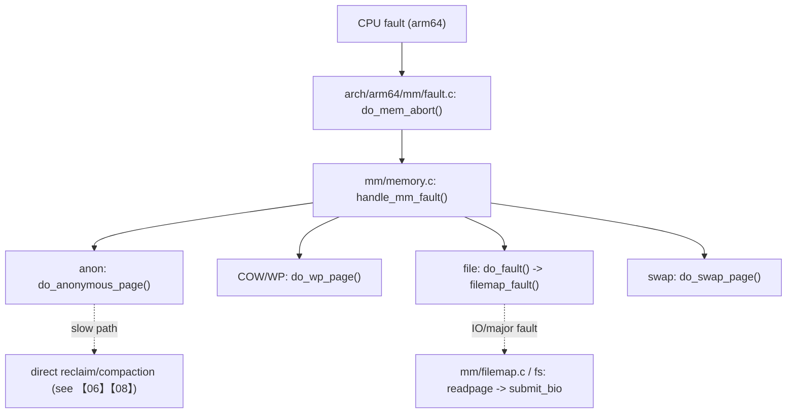

> 本文用 “arm64 fault 入口 → `handle_mm_fault()` → 分支（anon/file/COW/swap）” 的方式，把缺页异常主路径讲清楚，并给出可验证的 call route、观测指标与源码落点。基线：Linux `v5.15.200`（arm64）。

## 0. 目标与边界

- 序号（1..N）：03
- 模块/主题：page fault（缺页异常）的策略层主线
- Kernel：`v5.15.200`，Arch：`arm64`
- 源码树：`/Volumes/CF/code/source-code/linux-5.15.200`
- 覆盖：
  - arm64 fault 入口到 `mm/memory.c: handle_mm_fault()` 的主线
  - 匿名首次缺页、COW（write-protect fault）、file-backed fault 的典型分支
  - fault 与 reclaim/THP/userfaultfd 的交界点（做边界标注）
- 不覆盖：
  - VMA 管理与选址（见【01】）
  - 页表/TLB flush 机制细节（见【02】）
  - page cache 的完整算法（见【04】）

## 1. 设计原理

### 1.1 “机制 vs 策略”的分层

- **机制层**（更多在【02】）：页表结构、TLB、flush 语义。
- **策略层**（本篇）：发生访问异常时，基于 VMA 与 PTE 状态决定走哪条路径：
  - 匿名页：分配零页 / 分配新页 + 建 PTE
  - 文件页：进入 page cache / 触发 readpage
  - 写保护：COW（复制页）/ 权限升级
  - swap：swap-in / swap cache

### 1.2 路线图（call-path route）

## 2. 关键数据结构详解

### 2.1 结构体清单

- `mm/memory.c: struct vm_fault`（fault 上下文）
- `include/linux/mm_types.h: struct vm_area_struct`（决定策略：权限/匿名/文件/hugetlb/uffd）
- PTE/PMD 类型：`arch/arm64/include/asm/pgtable.h`（机制层字段在【02】展开）

### 2.2 `struct vm_fault`（把“这次 fault 的信息”收进一个包）

- 位置：`/Volumes/CF/code/source-code/linux-5.15.200/mm/memory.c`（与其相关头文件）
- 关注点：
  - fault address / pgoff / flags：决定走匿名还是文件，是否允许写，是否可重试
  - 与 VMA/PTE 状态的组合决定最终分支（这也是你做排障时要复现的“条件集”）

## 3. 核心流程源码走读

### 3.1 入口点（arm64）

- fault 入口：`/Volumes/CF/code/source-code/linux-5.15.200/arch/arm64/mm/fault.c: do_mem_abort()`
- 策略入口：`/Volumes/CF/code/source-code/linux-5.15.200/mm/memory.c: handle_mm_fault()`

### 3.2 Happy path：匿名首次缺页（anonymous zero / alloc）

典型路线（读者应能用 ftrace/perf 证明它确实发生）：

1. `arch/arm64/mm/fault.c: do_mem_abort()`
2. `mm/memory.c: handle_mm_fault()`
3. `mm/memory.c: do_anonymous_page()`
4. 分配页（常见通过 `alloc_pages*` 系列进入【05】）
5. 建 PTE / 更新统计（计数落点见 §5）

### 3.3 Happy path：COW（写保护 fault）

1. `handle_mm_fault()`
2. `mm/memory.c: do_wp_page()`：核心分支
3. 分配新页、拷贝旧页内容、更新 PTE 权限与引用
4. 可能触发 TLB flush（机制层落点见【02】）

### 3.4 Happy path：file-backed fault（进入 page cache）

1. `handle_mm_fault()`
2. `mm/memory.c: do_fault()`
3. `mm/filemap.c: filemap_fault()`（具体调用链在【04】展开）
4. 如未命中 cache：触发 IO → 形成 major fault（慢路径见 §4）

## 4. 慢速/异常路径详解

### 4.1 major fault（IO 路径）

- 触发条件：file-backed 页不在 page cache，需要从存储读取。
- 现象：
  - `pgmajfault` 增长；
  - perf 栈出现 filemap/readpage/submit_bio 相关路径。
- 边界切换：此时应把读者引导到【04】（page cache & readahead & writeback）。

### 4.2 fault 触发 direct reclaim / compaction

- 触发条件：内存紧张、分配无法满足水位/碎片要求。
- 现象：fault 栈上出现 `try_to_free_pages()`（【06】）或 compaction（【08】）。
- 解释：fault 是“同步路径”，因此这类慢路径会直接体现为业务尾延迟。

### 4.3 权限/地址错误导致 SIGSEGV

- 触发条件：VMA 不存在、权限不允许、访问越界。
- 路线：在 arm64 fault 入口处完成信号投递与错误上报（在 `arch/arm64/mm/fault.c` 一带可追）。

## 5. 调优参数与观测指标（映射到源码）

### 5.1 /proc/vmstat：缺页相关计数

- 指标入口：`/proc/vmstat`（用户态看到的名字是结果，更新点在 mm 事件计数）
- 更新机制（导航种子）：
  - 计数 API：`count_vm_event()` / `__count_vm_event()`（定义在 `include/linux/vmstat.h` 一带）
  - 统计汇总/输出：`mm/vmstat.c`（与 `/proc/vmstat` 输出路径交界）
- 建议读者在文章中把最常用的字段（`pgfault/pgmajfault`）映射到更新点（从 `rg` 追 `PGFAULT`/`PGMAJFAULT` 的调用）。

### 5.2 tracepoints（用于“证明你猜的分支是真的”）

- filemap/writeback/vmscan 等 tracepoints 在对应子系统头文件中（`include/trace/events/*`）
- fault 本身的观测经常依赖 perf/ftrace/kprobe（因为 fault 分支多，tracepoint 覆盖不总是完整）

## 6. 常见问题与源码级解释

### 6.1 症状：业务尾延迟尖刺，perf 栈在 `handle_mm_fault`

诊断路线：

1. 先区分 major/minor：看 `pgmajfault` 是否同步上升（IO 慢 vs 纯内存慢）
2. 若 major 多：转【04】检查 page cache、readahead、IO 拥塞
3. 若 major 少但仍慢：
   - 看是否触发 direct reclaim/compaction（fault 栈上是否出现 `try_to_free_pages` / `compact_zone`）
   - 转【06】【08】做压力与碎片诊断

### 6.2 症状：大量 COW 导致 CPU 飙升

1. 先用 perf 抓 `do_wp_page` 是否热点
2. 再看业务是否频繁 `fork()` 后写共享大内存（典型“写时复制放大”）
3. 源码落点：`mm/memory.c: do_wp_page()` 的关键分支（什么条件下复制、什么条件下升级权限）

## 7. 分析工具箱

- **perf：区分 major/minor 与热点分支**
  - 命令：`sudo perf record -g -p <pid> -- sleep 10 && sudo perf report`
  - 关注：`do_anonymous_page` / `do_wp_page` / `do_fault` / `filemap_fault`
- **ftrace function_graph：还原 call route**
  - 目标：验证匿名/文件/COW 分支各自的关键函数链
- **bpftrace：按进程统计 fault 类型**
  - 思路：挂 `handle_mm_fault` 或更具体的分支函数（kprobe），按返回/flag 分类聚合（按环境能力调整）
- **源码导航**
  - `K=/Volumes/CF/code/source-code/linux-5.15.200`
  - `rg -n "\\bdo_mem_abort\\b" $K/arch/arm64/mm/fault.c`
  - `rg -n "\\bhandle_mm_fault\\b|\\bdo_anonymous_page\\b|\\bdo_wp_page\\b|\\bdo_fault\\b|\\bdo_swap_page\\b" $K/mm/memory.c`
  - `rg -n "\\bfilemap_fault\\b" $K/mm/filemap.c`

---

## 附录 I：讲解提纲包（Explain Pack）

### 30 秒定义

page fault 是 CPU 访问虚拟地址时发现“页表不存在/权限不符/需要 IO”触发的同步异常；内核在 `handle_mm_fault()` 中结合 VMA 与 PTE 状态选择匿名/文件/COW/swap 等分支，并可能在压力下同步触发回收与压缩。

### 3–5 分钟白板提纲

1. 入口：arm64 `do_mem_abort()` 把异常变成一次“缺页处理请求”
2. 决策：`handle_mm_fault()` 基于 VMA/PTE 走四大分支（anon/file/COW/swap）
3. 代价：minor fault 通常是内存内操作；major fault 进入 IO；压力下可能 direct reclaim
4. 观测：`pgfault/pgmajfault` + perf 栈 +（必要时）kprobe/ftrace 验证路线

