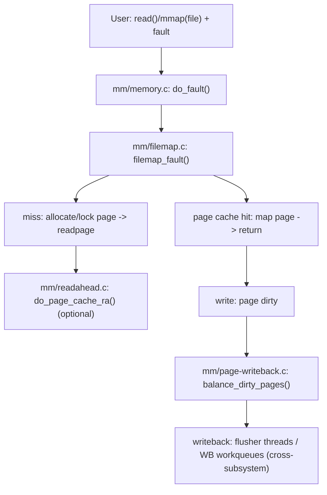

> 本文把 “file-backed fault / buffered IO” 相关的 mm 核心链路讲清：page cache 命中/缺失、readahead 触发、脏页回写节流（dirty throttling）。基线：Linux `v5.15.200`（arm64）。

## 0. 目标与边界

- 序号（1..N）：04
- 模块/主题：page cache + readahead + writeback（mm 侧主线）
- Kernel：`v5.15.200`，Arch：`arm64`
- 源码树：`/Volumes/CF/code/source-code/linux-5.15.200`
- 覆盖：
  - file-backed fault：`do_fault()` → `filemap_fault()`（与【03】交界）
  - readahead 关键函数：`page_cache_ra_unbounded()` / `do_page_cache_ra()`
  - writeback/节流：`balance_dirty_pages()` / `wb_dirty_limits()`
- 不覆盖：
  - 具体文件系统/块层/驱动（只追到交界点）
  - reclaim 的完整算法（见【06】）

## 1. 设计原理

### 1.1 为什么 page cache 必须存在

- 把“文件数据”以 page/folio 的形式缓存到内存里，复用读 IO、聚合写 IO、支撑 mmap file-backed fault。
- 与 VFS/FS 的分层：mm 提供 page cache 的通用机制，具体 readpage/writepage 由 address_space + aops 驱动。

### 1.2 关键 trade-off

- 命中率 vs 内存占用：缓存越大越容易挤压匿名内存，引发 reclaim/swap（见【06】【07】）
- 顺序 IO 预读收益 vs 误读浪费：readahead 需要根据访问模式动态调整
- 写回吞吐 vs 前台尾延迟：dirty throttling 通过让脏页制造者 sleep 来平衡系统稳定性

### 1.3 路线图（call-path route）

## 2. 关键数据结构详解

### 2.1 结构体清单（种子）

- `include/linux/fs.h: struct address_space`
- `include/linux/mm_types.h: struct page`（v5.15 处于 page→folio 过渡期，读代码时需识别两套 API）
- `include/linux/writeback.h: struct writeback_control`
- `mm/backing-dev.c` 相关：bdi / wb（writeback 域对象）

### 2.2 `struct address_space`（文件页缓存的“宿主”）

- 关键点：
  - page cache 的索引/树结构挂在 address_space 上；
  - aops（address_space_operations）把 mm 与具体 FS/块层连接起来（readpage/writepage/readahead）。

## 3. 核心流程源码走读

### 3.1 Happy path：file-backed fault 命中 page cache

1. `mm/memory.c: do_fault()`（从【03】进入）
2. `mm/filemap.c: filemap_fault()`
3. 查找/锁定缓存页（命中则直接映射并返回）

### 3.2 Slow path：file-backed fault miss → 触发 IO

1. `filemap_fault()` 发现缺页对应的页不在 cache
2. 分配并锁 page/folio
3. 调用 aops 触发 readpage（跨到具体 FS/块层）
4. 等待 IO 完成 → 填充 page cache → 建立 PTE（回到【03】【02】交界）

### 3.3 Readahead：把“下一段可能会用到的页”提前拉进来

- `mm/readahead.c: page_cache_ra_unbounded()`
- `mm/readahead.c: do_page_cache_ra()`
- 与 `mm/filemap.c` 的交界：`filemap_fault()`/读路径中根据访问模式决定是否触发预读。

### 3.4 Writeback/节流：脏页制造者为何会 sleep

1. 写路径把页标记为 dirty（跨子系统：具体写路径在 FS）
2. `mm/page-writeback.c: balance_dirty_pages()`：
   - 计算 dirty limits：`wb_dirty_limits()`
   - 若超限则 sleep，给 flusher/writeback 时间把脏页写回
3. 关键 tracepoint：`trace_balance_dirty_pages()`（用于把节流与延迟关联）

## 4. 慢速/异常路径

### 4.1 major fault 的尾延迟

- 典型根因：
  - IO 慢/拥塞；
  - readahead 误判导致不必要 IO；
  - page lock 竞争（同一页被多个 fault/读线程争用）。
- 证据链：
  - `pgmajfault` 增长（见【03】）
  - perf 栈进入 readpage/submit IO
  - writeback tracepoint 显示写回拥塞

### 4.2 dirty throttling 抖动（balance_dirty_pages 频繁 sleep）

- 触发条件：dirty 超过 `dirty_ratio` 或 `dirty_bytes` 等上限（见 §5）
- 现象：前台写线程周期性 sleep，吞吐/延迟呈锯齿形
- 排查要点：确认是全局限制还是某个 bdi/wb 域的限制（需结合 bdi/wb 对象与 tracepoint）

## 5. 调优参数与观测指标（映射到源码）

### 5.1 sysctl：dirty/writeback 关键参数

（下面每个参数都应在文章中解释“默认值/单位/影响面/副作用”。）

- `vm.dirty_background_ratio`
  - 注册：`/Volumes/CF/code/source-code/linux-5.15.200/kernel/sysctl.c`（`vm_table[]`）
  - 数据/handler：`/Volumes/CF/code/source-code/linux-5.15.200/mm/page-writeback.c: dirty_background_ratio` + `dirty_background_ratio_handler()`
  - 生效点：`mm/page-writeback.c` 的 dirty limits 计算
- `vm.dirty_ratio`
  - 注册：`kernel/sysctl.c`
  - 数据/handler：`mm/page-writeback.c: vm_dirty_ratio` + `dirty_ratio_handler()`
  - 生效点：`balance_dirty_pages()` 计算阈值并决定 sleep
- `vm.dirty_writeback_centisecs` / `vm.dirty_expire_centisecs`
  - 注册：`kernel/sysctl.c`
  - handler：`mm/page-writeback.c: dirty_writeback_centisecs_handler()`（等）
  - 生效点：writeback 周期、过期脏页被回收/写回的时机
- `vm.laptop_mode`
  - 注册：`kernel/sysctl.c`
  - 数据：`mm/page-writeback.c: laptop_mode`
  - 生效点：`mm/page-writeback.c` 的定时器/写回策略（偏向合并写回以减少唤醒）

### 5.2 tracepoints：filemap/writeback

- filemap：`/Volumes/CF/code/source-code/linux-5.15.200/include/trace/events/filemap.h`
- writeback：`/Volumes/CF/code/source-code/linux-5.15.200/include/trace/events/writeback.h`
- 建议读法：先用 tracepoint 把“事件频率/延迟尖刺”对齐，再回到对应函数走读分支。

## 6. 常见问题与源码级解释

### 6.1 症状：大量 major fault（读抖动）

1. 证据：`/proc/vmstat` 的 `pgmajfault` 增长（或 perf 栈进入 `filemap_fault` + IO）
2. 定位：
   - 是随机读导致 readahead 无效？（看 `mm/readahead.c` 的触发条件与访问模式判断）
   - 是 page cache 太小被频繁回收？（转【06】看 reclaim/working set）
3. 根因落点：
   - `mm/filemap.c: filemap_fault()`
   - `mm/readahead.c: do_page_cache_ra()`

### 6.2 症状：写吞吐抖动/尾延迟高（balance_dirty_pages）

1. 证据：perf 栈频繁出现 `balance_dirty_pages()`；tracepoint 显示节流事件密集
2. 定位：dirty limits 计算是否过于激进？是否某 bdi 受限？是否写回线程拥塞？
3. 根因落点：`mm/page-writeback.c: balance_dirty_pages()` 的 sleep 决策分支

## 7. 分析工具箱

- **观测 dirty / writeback 状态**
  - 命令：`cat /proc/meminfo | egrep 'Dirty|Writeback|Cached'`
  - 解读：Dirty/Writeback 高并长期不回落 → 关注 writeback 拥塞与 throttling
- **perf：定位热点**
  - 命令：`sudo perf top -g -p <pid>`
  - 关注：`filemap_fault`、`do_page_cache_ra`、`balance_dirty_pages`
- **tracepoints：把抖动钉死到事件**
  - 关注：writeback/filemap 事件（按环境选择 trace-cmd/perf trace）
- **源码导航**
  - `K=/Volumes/CF/code/source-code/linux-5.15.200`
  - `rg -n "\\bfilemap_fault\\b" $K/mm/filemap.c`
  - `rg -n "\\bpage_cache_ra_unbounded\\b|\\bdo_page_cache_ra\\b" $K/mm/readahead.c`
  - `rg -n "\\bbalance_dirty_pages\\b|\\bwb_dirty_limits\\b" $K/mm/page-writeback.c`
  - `rg -n "TRACE_EVENT\\(writeback|TRACE_EVENT\\(filemap" $K/include/trace/events/writeback.h $K/include/trace/events/filemap.h`

---

## 附录 I：讲解提纲包（Explain Pack）

### 30 秒定义

page cache 把文件数据页缓存进内存以服务 read/mmap fault；readahead 尝试预测未来访问并预取；writeback/dirty throttling 用一组 sysctl 阈值把脏页增长限制在系统可承受范围内，避免 IO 与内存压力把系统拖垮。

