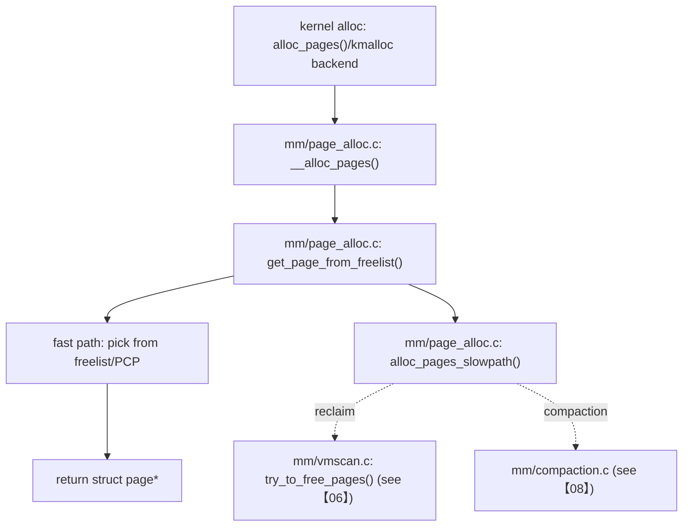

> 本文从“物理页如何被分配/释放”出发，讲清 buddy allocator 的主路径与慢路径（直接回收/压缩的入口只做边界标注）。基线：Linux `v5.15.200`（arm64）。

## 0. 目标与边界

- 序号（1..N）：05
- 模块/主题：物理页分配（buddy/zone/watermark/percpu pages）
- Kernel：`v5.15.200`，Arch：`arm64`
- 源码树：`/Volumes/CF/code/source-code/linux-5.15.200`
- 覆盖：
  - `mm/page_alloc.c` 主路径：`__alloc_pages()` / `get_page_from_freelist()`
  - 释放路径：`free_unref_page()`（PCP 相关）
  - 水位线与关键 sysctl（映射到 handler 与生效点）
- 不覆盖：
  - slab（见【10】）
  - reclaim/compaction 的完整算法（见【06】【08】）

## 1. 设计原理

### 1.1 为什么 buddy allocator 要按 order 管理

- 目的：用一套简单的数据结构管理“连续物理页”的分配/释放，满足从 4K 到更大块的需求。
- trade-off：
  - order 越大越容易因碎片化失败（与 compaction 交界见【08】）
  - 频繁小页分配若每次都加锁会很慢 → 引入 PCP（per-cpu pages）做缓存

### 1.2 路线图（call-path route）

## 2. 关键数据结构详解

### 2.1 结构体清单

- `include/linux/mm_types.h: struct page`
- `include/linux/mmzone.h: struct zone, struct pglist_data, struct free_area`
- `mm/page_alloc.c`：PCP（per-cpu pages）相关结构（按使用点追）

### 2.2 `struct zone` / watermarks

- zone 是物理内存的分区单位（DMA/Normal/Movable 等），水位线决定“还能不能继续分配”以及何时唤醒 kswapd。
- 你需要把这几个问题在代码里跑通：
  1) watermarks 怎么计算？
  2) 分配时在哪些检查点拒绝？
  3) 拒绝后走向 direct reclaim/kswapd/compaction 的条件分别是什么？

## 3. 核心流程源码走读

### 3.1 Happy path：`__alloc_pages()` 快速分配

1. `mm/page_alloc.c: __alloc_pages()`
2. `mm/page_alloc.c: get_page_from_freelist()`：按 gfp_mask/zone/迁移类型选择 freelist
3. 成功：返回 `struct page *`（之后可能被 higher layer 转换为虚拟地址/映射到用户态等）

### 3.2 Happy path：释放路径（PCP）

1. `mm/page_alloc.c: free_unref_page()`
2. 典型行为：优先回收到 per-cpu 列表，减少全局锁竞争

## 4. 慢速/异常路径详解

### 4.1 `alloc_pages_slowpath()`：水位不足/碎片化

- 触发：`get_page_from_freelist()` 无法满足 watermarks 或高阶页无法满足连续性
- 后果：
  - 可能同步进入 direct reclaim（业务尾延迟上升；见【06】）
  - 可能触发 compaction（见【08】）
  - 最坏触发 OOM（见【11】）

### 4.2 高阶页失败（order>0）

- 现象：`__alloc_pages` 在 order 高时失败显著上升
- 解释：buddy 的连续性要求 + pageblock/migratetype 碎片化
- 证据链：`/proc/pagetypeinfo` + extfrag 指标（见 §5）

## 5. 调优参数与观测指标（映射到源码）

### 5.1 sysctl：watermarks 相关关键项

- `vm.min_free_kbytes`
  - 注册：`/Volumes/CF/code/source-code/linux-5.15.200/kernel/sysctl.c`（`vm_table[]`）
  - handler：`/Volumes/CF/code/source-code/linux-5.15.200/mm/page_alloc.c: min_free_kbytes_sysctl_handler()`
  - 生效点：watermark 计算与分配检查（从 handler 往下追）
- `vm.watermark_scale_factor`
  - 注册：`kernel/sysctl.c`
  - handler：`mm/page_alloc.c: watermark_scale_factor_sysctl_handler()`
  - 生效点：watermark 计算逻辑
- `vm.min_unmapped_ratio`
  - 注册：`kernel/sysctl.c`（`sysctl_min_unmapped_ratio`）
  - handler：`mm/page_alloc.c: sysctl_min_unmapped_ratio_sysctl_handler()`
  - 生效点：分配/回收协作的阈值（从 handler 追到引用点）

### 5.2 /proc：buddy/zone 观测面

- `/proc/buddyinfo`、`/proc/zoneinfo`、`/proc/pagetypeinfo`
  - 创建：`/Volumes/CF/code/source-code/linux-5.15.200/mm/vmstat.c: proc_create_seq("buddyinfo"...)` 等
  - 解读要点：
    - buddyinfo：按 order 统计空闲块数量（碎片化直观证据）
    - pagetypeinfo：按 migratetype/zone 观察碎片与隔离效果

## 6. 常见问题与源码级解释

### 6.1 症状：高阶分配失败（驱动/大页/连续内存需求）

1. 证据：`/proc/buddyinfo` 高 order 几乎为 0；`/proc/pagetypeinfo` 显示碎片化
2. 路线：`__alloc_pages()` → `get_page_from_freelist()` → `alloc_pages_slowpath()`
3. 根因定位：
   - 是否需要 compaction（转【08】）
   - 是否被 GUP pin/不可迁移页阻塞（转【13】与【08】交界）

## 7. 分析工具箱

- **快速看碎片化**
  - 命令：`cat /proc/buddyinfo`、`cat /proc/pagetypeinfo`
  - 解读：高阶空闲块稀缺 → compaction/迁移能力成为瓶颈
- **perf：定位分配热点/慢路径**
  - 关注：`__alloc_pages`、`get_page_from_freelist`、`alloc_pages_slowpath`
- **源码导航**
  - `K=/Volumes/CF/code/source-code/linux-5.15.200`
  - `rg -n "\\b__alloc_pages\\b|\\bget_page_from_freelist\\b|\\balloc_pages_slowpath\\b" $K/mm/page_alloc.c`
  - `rg -n "\\bmin_free_kbytes_sysctl_handler\\b|\\bwatermark_scale_factor_sysctl_handler\\b|\\bsysctl_min_unmapped_ratio\\b" $K/mm/page_alloc.c $K/kernel/sysctl.c`
  - `rg -n "proc_create_seq\\(\\\"buddyinfo\\\"|proc_create_seq\\(\\\"pagetypeinfo\\\"|proc_create_seq\\(\\\"zoneinfo\\\"" $K/mm/vmstat.c`

---

## 附录 I：讲解提纲包（Explain Pack）

### 30 秒定义

buddy allocator 用按 order 分组的空闲链表管理连续物理页块；PCP 把小页分配/释放的热点留在 per-cpu 侧；watermarks 与 sysctl 参数共同决定“何时允许分配、何时触发回收/压缩”。

