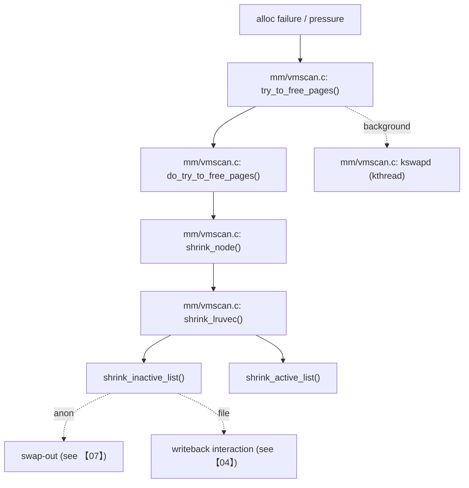

> 本文聚焦 vmscan 主线：当分配失败或压力升高时，内核如何在匿名页与文件页之间做权衡并回收；并解释 `vm.swappiness` 等参数如何影响决策。基线：Linux `v5.15.200`（arm64）。

## 0. 目标与边界

- 序号（1..N）：06
- 模块/主题：reclaim（direct reclaim + kswapd）、LRU、workingset/refault
- Kernel：`v5.15.200`，Arch：`arm64`
- 源码树：`/Volumes/CF/code/source-code/linux-5.15.200`
- 覆盖：
  - direct reclaim：`try_to_free_pages()` 主线与关键分支
  - kswapd：后台回收线程的唤醒/睡眠与核心循环
  - LRU 扫描：`shrink_node()` / `shrink_lruvec()` 栈
  - `vm.swappiness` 的生效点（映射到 vmscan 关键分支）
- 不覆盖：
  - swap 子系统实现细节（见【07】）
  - compaction/migration（见【08】）
  - memcg reclaim 的完整机制（与【11】交界，仅做标注）

## 1. 设计原理

### 1.1 reclaim 的目标函数

给定一个内存压力场景，reclaim 需要在这些目标之间平衡：

- 尽快释放可用页，满足分配（避免 OOM）
- 尽量少伤害工作集（避免回收热页造成 refault/抖动）
- 在匿名页与文件页之间做 IO 成本与未来代价的权衡（swappiness）
- 支持 direct reclaim（同步）与 kswapd（异步）两种模式

### 1.2 路线图（call-path route）

## 2. 关键数据结构详解

### 2.1 结构体清单

- `mm/vmscan.c: struct scan_control`
- `mm/vmscan.c` / `include/linux/mmzone.h`：`struct lruvec`
- `mm/workingset.c`：workingset/refault 相关结构与计数（按引用点追）

### 2.2 `struct scan_control`（一次回收尝试的“配置与状态”）

- 关键点：
  - 这次回收是 direct 还是后台（影响 aggressiveness 与唤醒策略）
  - reclaim 的目标页数、优先级（priority）、是否允许写回等
- 你在排障时需要把现象映射到 scan_control 的关键字段（例如 priority 降到很低意味着系统已经非常吃力）。

## 3. 核心流程源码走读

### 3.1 direct reclaim：`try_to_free_pages()` 主线

1. `mm/page_alloc.c` 分配失败进入 slowpath（见【05】边界）
2. `mm/vmscan.c: try_to_free_pages()`
3. `mm/vmscan.c: do_try_to_free_pages()`
4. `mm/vmscan.c: shrink_node()`：按 node 扫描
5. `mm/vmscan.c: shrink_lruvec()`：按 lruvec 扫描 active/inactive

### 3.2 kswapd：后台回收线程（概念主线）

- 创建点：`mm/vmscan.c` 内 `kthread_run(kswapd, ...)`（证据见 mm-evidence）
- 核心：按水位/压力唤醒，循环扫描并回收到目标水位附近，然后睡眠。

## 4. 慢速/异常路径详解

### 4.1 写回拥塞（file pages 回收受阻）

- 现象：reclaim 扫到大量脏页，必须等待 writeback（与【04】交界）
- 后果：direct reclaim 的同步等待直接映射为业务尾延迟
- 证据链：
  - `/proc/meminfo` Dirty/Writeback 高
  - tracepoints：vmscan/writeback 同时活跃

### 4.2 swap 相关的慢路径

- 当匿名页成为主要回收对象且允许 swap：会走到 swap-out（见【07】）
- swappiness 在这里扮演“匿名页 vs 文件页”的权衡参数（生效点见 §5）。

### 4.3 shrinker 交叉调用

- slab、inode/dcache 等 shrinker 会让问题跨子系统扩散（排障难度上升）
- 建议：先用 tracepoint/perf 把主要回收成本定位到具体 shrinker，再回到相应子系统。

## 5. 调优参数与观测指标（映射到源码）

### 5.1 `vm.swappiness`：匿名页 vs 文件页的权衡

- sysctl 注册：`/Volumes/CF/code/source-code/linux-5.15.200/kernel/sysctl.c`（`vm_table[]`）
- 数据：`/Volumes/CF/code/source-code/linux-5.15.200/mm/vmscan.c: vm_swappiness`
- 生效点（导航种子）：
  - `mm/vmscan.c` 中对 swappiness 的计算与使用（可从 `vm_swappiness` 引用处追）
  - memcg 场景下还有 `mem_cgroup_swappiness(memcg)` 分支（与【11】交界）

### 5.2 /proc & PSI

- `/proc/vmstat`：回收相关计数（pgscan/pgsteal 等，建议映射到更新点）
- `/proc/meminfo`：Active/Inactive、Dirty/Writeback 等宏观信号
- `/proc/pressure/memory`（PSI）：确认是否处于持续内存压力（对排障价值很高）

### 5.3 tracepoints

- vmscan：`/Volumes/CF/code/source-code/linux-5.15.200/include/trace/events/vmscan.h`
- workingset：`/Volumes/CF/code/source-code/linux-5.15.200/include/trace/events/workingset.h`（若存在，按源码枚举）

## 6. 常见问题与源码级解释

### 6.1 症状：系统抖动，kswapd 占用高

1. 证据：`top` 看到 kswapd；PSI 显示 memory pressure；/proc/vmstat scan/steal 很高
2. 路线：`kswapd` 循环 → `shrink_node`/`shrink_lruvec`
3. 根因分类：
   - 工作集过大（refault 高）：转 `mm/workingset.c` 相关指标与 trace
   - 脏页过多：转【04】检查 writeback/dirty 阈值
   - 匿名页主导：看 swappiness 与 swap 行为（转【07】）
   - compaction 频繁：转【08】

### 6.2 症状：业务尾延迟尖刺（direct reclaim）

1. 证据：perf 栈显示 `try_to_free_pages` 出现在业务线程栈上
2. 定位：是写回等待？是 swap？是 shrinker？把“等待点”钉在 trace/perf 上
3. 根因落点：`mm/vmscan.c` 对 scan_control 的策略分支

## 7. 分析工具箱

- **PSI：判断是否持续压力**
  - 命令：`cat /proc/pressure/memory`
  - 解读：some/full 持续升高 → reclaim 处于常态化
- **vmstat：快速判断扫描/偷取强度**
  - 命令：`vmstat 1`
  - 解读：si/so 与扫描相关字段配合使用（需结合 swap 配置）
- **perf：确认 direct reclaim 是否在前台线程**
  - 命令：`sudo perf top -g -p <pid>`
  - 关注：`try_to_free_pages`、`shrink_node`、`shrink_lruvec`
- **源码导航**
  - `K=/Volumes/CF/code/source-code/linux-5.15.200`
  - `rg -n "\\btry_to_free_pages\\b|\\bdo_try_to_free_pages\\b|\\bshrink_node\\b|\\bshrink_lruvec\\b" $K/mm/vmscan.c`
  - `rg -n "\\bvm_swappiness\\b" $K/mm/vmscan.c $K/kernel/sysctl.c`
  - `rg -n "TRACE_EVENT\\(mm_vmscan|TRACE_EVENT\\(vmscan" $K/include/trace/events/vmscan.h`

---

## 附录 I：讲解提纲包（Explain Pack）

### 30 秒定义

reclaim 是在内存压力下通过扫描 LRU（以及 shrinker）回收页面的机制；direct reclaim 在业务线程上同步执行、kswapd 在后台异步执行；`vm.swappiness` 等参数影响匿名页与文件页的回收比例与 IO 行为。

