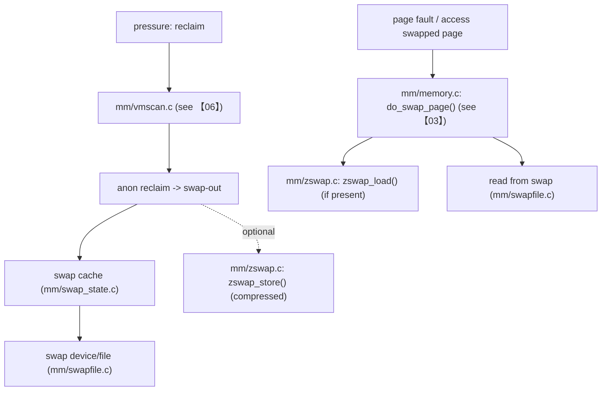

> 本文把 swap 的“接口 → 主路径 → 慢路径 → 观测/调参”串起来，并补充 zswap（压缩交换）的关键 module params 与生效点。基线：Linux `v5.15.200`（arm64）。

## 0. 目标与边界

- 序号（1..N）：07
- 模块/主题：swap（swapon/swapoff）+ swap cache + zswap（压缩交换）
- Kernel：`v5.15.200`，Arch：`arm64`
- 源码树：`/Volumes/CF/code/source-code/linux-5.15.200`
- 覆盖：
  - syscall：`swapon/swapoff`
  - swap cache 的存在意义与主要对象
  - zswap 的参数面与基本路径（与 reclaim 的交界）
- 不覆盖：
  - reclaim 的策略本体（见【06】）
  - writeback 与 file page 的完整路径（见【04】）

## 1. 设计原理

### 1.1 为什么需要 swap

- 在匿名页工作集超过物理内存时，swap 提供“把冷匿名页暂存到后备存储”的机制，避免直接 OOM。
- trade-off：
  - 好处：延长可用内存，提升系统在峰值内存压力下的存活能力
  - 代价：匿名页的 swap in/out 会引入显著 IO/延迟，且会与 page cache/writeback 争用资源

### 1.2 zswap 的定位（压缩交换）

- zswap 是 swap 的前端缓存：把将要 swap out 的匿名页先压缩存到内存池里，减少真实 swap IO。
- trade-off：
  - 好处：在某些工作负载下显著减少 swap IO 与尾延迟
  - 代价：占用 CPU（压缩/解压）、占用内存池（可能挤压其它工作集）

### 1.3 路线图（call-path route）

## 2. 关键数据结构详解

- `include/linux/swap.h` 相关：swap_entry、swap_info_struct（按实现引用点追）
- swap cache：`mm/swap_state.c`（缓存对象与查找/插入）
- zswap pool/entry：`mm/zswap.c`（压缩对象与元数据）

## 3. 核心流程源码走读

### 3.1 入口点：swapon/swapoff

- `mm/swapfile.c: SYSCALL_DEFINE2(swapon, ...)`
- `mm/swapfile.c: SYSCALL_DEFINE1(swapoff, ...)`
- `/proc/swaps` 的实现/注册：`mm/swapfile.c`（也可从 `proc_create("swaps"...` 追）

### 3.2 典型 swap-out（从 reclaim 交界切入）

1. reclaim 选择匿名页作为回收对象（见【06】）
2. 写出：
   - 若启用 zswap：尝试 `mm/zswap.c` 路线（压缩存入 zswap pool）
   - 否则或失败：走 swapfile 路线把页写到 swap
3. 更新 swap cache / PTE 状态（与【03】交界：swap entry）

### 3.3 典型 swap-in（缺页时读回）

1. `mm/memory.c: do_swap_page()`（从【03】进入）
2. 若 zswap 命中：`mm/zswap.c: zswap_load()` 解压回页
3. 否则：从 swap device/file 读取（`mm/swapfile.c` 等交界点）

## 4. 慢速/异常路径

### 4.1 swap thrash（抖动）

- 现象：频繁 swap in/out，业务延迟极不稳定；`vmstat` 里 si/so 高
- 根因框架：
  - 工作集大于可用内存太多（只能靠 swap 维持）
  - swappiness/回收策略导致匿名页与文件页权衡不合适（回到【06】）
  - IO 子系统拥塞（回到【04】看 writeback 与 IO 争用）

### 4.2 zswap “省 IO 但吃 CPU”

- 现象：swap IO 下降，但 CPU 明显上升；延迟仍可能尖刺（压缩/解压或 pool 管理开销）
- 证据链：
  - perf 栈出现 zswap 压缩/解压相关函数
  - zswap pool 逼近上限后 fallback 到真实 swap

## 5. 调优参数与观测指标（映射到源码）

### 5.1 sysctl：`vm.swappiness`（与 reclaim 强绑定）

- 注册：`/Volumes/CF/code/source-code/linux-5.15.200/kernel/sysctl.c`（`vm_table[]`）
- 数据：`/Volumes/CF/code/source-code/linux-5.15.200/mm/vmscan.c: vm_swappiness`（见【06】）
- 生效点：`mm/vmscan.c` 的匿名页 vs 文件页扫描比例决策

### 5.2 zswap module params（最常用几个）

（建议读者在文章中把每个参数写清：默认值、单位、影响、边界条件、fallback 行为。）

- `zswap.max_pool_percent`
  - 注册：`/Volumes/CF/code/source-code/linux-5.15.200/mm/zswap.c: module_param_named(max_pool_percent, ...)`
  - 生效：限制 zswap pool 上限（达到上限后 store 失败并回退到真实 swap）
- `zswap.accept_threshold_percent`
  - 注册：`mm/zswap.c: module_param_named(accept_threshold_percent, ...)`
  - 生效：影响是否接受某页进入 zswap（与压缩比/收益权衡相关）
- `zswap.same_filled_pages_enabled`
  - 注册：`mm/zswap.c: module_param_named(same_filled_pages_enabled, ...)`
  - 生效：对“同内容填充页”（如全零页）做特殊处理，减少存储开销

### 5.3 /proc：swap 观测

- `/proc/swaps`：启用的 swap 设备/文件列表（`mm/swapfile.c`）
- `vmstat 1`：`si/so` 观察 swap in/out

## 6. 常见问题与源码级解释

### 6.1 症状：swap IO 爆炸，系统卡顿

1. 证据：`vmstat 1` 的 si/so 长期高；PSI memory/full 上升（见【06】）
2. 路线：vmscan 选择匿名页 → swap-out → swap-in（缺页）循环
3. 根因定位：
   - 工作集问题 vs 回收策略问题（优先从【06】确认扫描/偷取与 refault）
   - zswap 是否启用、是否频繁 fallback

## 7. 分析工具箱

- **vmstat**
  - 命令：`vmstat 1`
  - 关注：`si/so`（swap in/out）与 `r/b`（就绪/阻塞）
- **/proc/swaps**
  - 命令：`cat /proc/swaps`
  - 解读：确认 swap 是否启用、优先级、设备类型
- **perf：确认热点是否在 swap/zswap**
  - 命令：`sudo perf top -g`
  - 关注：`do_swap_page`、zswap 相关栈
- **源码导航**
  - `K=/Volumes/CF/code/source-code/linux-5.15.200`
  - `rg -n \"SYSCALL_DEFINE\\d*\\(swapon\\b|SYSCALL_DEFINE\\d*\\(swapoff\\b\" $K/mm/swapfile.c`
  - `rg -n \"\\bzswap_\" $K/mm/zswap.c`
  - `rg -n \"module_param_named\\(max_pool_percent\\b|module_param_named\\(accept_threshold_percent\\b\" $K/mm/zswap.c`

---

## 附录 I：讲解提纲包（Explain Pack）

### 30 秒定义

swap 用后备存储承接匿名页的冷数据以避免 OOM；zswap 作为 swap 的压缩前端缓存，尝试用 CPU 换 IO，减轻 swap 读写对延迟的冲击。

