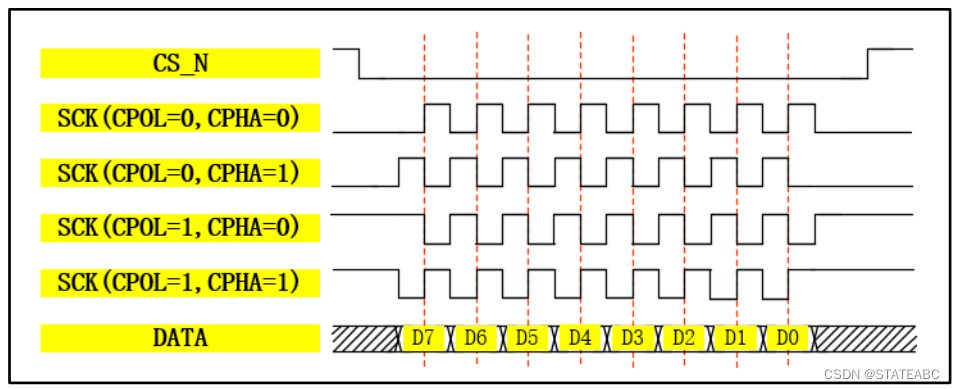

## SPI简介

**SPI (Serial Peripheral Interface)** 是由摩托罗拉公司开发的一种高速、全双工、同步的串行通信总线。SPI广泛应用于微控制器与各种外设之间的通信，如ADC、DAC、EEPROM、Flash存储器、LCD显示器、传感器等。

### SPI的主要特点

- **全双工通信**：能够同时进行数据的发送和接收
- **高速传输**：时钟频率可达几十MHz甚至更高
- **主从结构**：明确的主机(Master)和从机(Slave)角色
- **同步通信**：使用时钟信号同步数据传输
- **简单灵活**：硬件接口简单，软件控制灵活

---

## SPI基本原理

SPI采用主从架构，一个主机可以控制多个从机设备。通信过程中，主机负责产生时钟信号和控制通信的开始与结束，从机则根据主机的时钟信号进行数据收发。

### 工作原理

1. **主机初始化**：主机设置时钟频率、数据位宽、极性等参数
2. **片选信号**：主机通过片选信号选择要通信的从机
3. **数据传输**：在时钟信号的控制下，主机和从机同时发送和接收数据
4. **传输结束**：主机释放片选信号，结束本次通信

---

## SPI信号线详解

标准SPI接口包含四根信号线：

### 1. SCK (Serial Clock)

- **功能**：串行时钟信号
- **方向**：主机输出，从机输入
- **作用**：同步数据传输，控制数据采样时机

### 2. MOSI (Master Out Slave In)

- **功能**：主机输出数据线
- **方向**：主机输出，从机输入
- **别名**：SDO (Serial Data Out)、DO (Data Out)

### 3. MISO (Master In Slave Out)

- **功能**：主机输入数据线
- **方向**：从机输出，主机输入
- **别名**：SDI (Serial Data In)、DI (Data In)

### 4. CS/SS (Chip Select/Slave Select)

- **功能**：片选信号
- **方向**：主机输出，从机输入
- **特点**：低电平有效，用于选择特定的从机设备

### 多从机连接方式

#### 独立片选方式

``` c
Master          Slave1    Slave2    Slave3
SCK    ---------|SCK------|SCK------|SCK
MOSI   ---------|MOSI-----|MOSI-----|MOSI
MISO   ---------|MISO-----|MISO-----|MISO
CS1    ---------|CS       |         |
CS2    ---------|         |CS       |
CS3    ---------|         |         |CS
```

#### 菊花链方式

``` c
Master     Slave1      Slave2      Slave3
SCK   -----|SCK-------|SCK-------|SCK
MOSI  -----|MOSI      |          |
      |    |     MISO-|MOSI      |
MISO  |    |          |     MISO-|MOSI
      |____|MISO______|MISO______|MISO
CS    -----|CS--------|CS--------|CS
```

---

## SPI通信模式

SPI有四种工作模式，由时钟极性(CPOL)和时钟相位(CPHA)决定：

### 模式参数

| 模式 | CPOL | CPHA | 时钟极性 | 数据采样 |
|------|------|------|----------|----------|
| 0    | 0    | 0    | 空闲时低电平 | 第一个边沿采样 |
| 1    | 0    | 1    | 空闲时低电平 | 第二个边沿采样 |
| 2    | 1    | 0    | 空闲时高电平 | 第一个边沿采样 |
| 3    | 1    | 1    | 空闲时高电平 | 第二个边沿采样 |

### 详细说明

CPOL (Clock Polarity) - 时钟极性

- CPOL = 0：时钟信号空闲时为低电平
- CPOL = 1：时钟信号空闲时为高电平

CPHA (Clock Phase) - 时钟相位

- CPHA = 0：在第一个时钟边沿采样数据
- CPHA = 1：在第二个时钟边沿采样数据

---

## SPI时序分析



Mode0：CKP=0，CPHA =0：当空闲态时，SCK处于低电平，数据采样是在第1个边沿，即SCK由低电平到高电平的跳变，所以数据采样是在上升沿（准备数据），（发送数据）数据发送是在下降沿。

Mode1：CKP=0，CPHA=1：当空闲态时，SCK处于低电平，数据发送是在第2个边沿，即SCK由低电平到高电平的跳变，所以数据采样是在下降沿，数据发送是在上升沿。

Mode2：CKP=1，CPHA=0：当空闲态时，SCK处于高电平，数据采集是在第1个边沿，即SCK由高电平到低电平的跳变，所以数据采集是在下降沿，数据发送是在上升沿。

Mode3：CKP=1，CPHA=1：当空闲态时，SCK处于高电平，数据发送是在第2个边沿，即SCK由高电平到低电平的跳变，所以数据采集是在上升沿，数据发送是在下降沿。

---

## 数据传输特点

1. **CS信号**：传输开始前拉低，传输结束后拉高
2. **数据建立**：数据在时钟有效边沿前建立
3. **数据采样**：在时钟的上升沿或下降沿采样
4. **MSB优先**：通常高位在前传输

---

## SPI衍生协议

### 1. Microwire

**特点**：

- 由National Semiconductor开发
- 通常为8位数据传输
- 半双工通信
- 应用于EEPROM、ADC等设备

**信号线**：

- SK (Serial Clock)
- DI (Data In)
- DO (Data Out)
- CS (Chip Select)

### 2. QSPI (Quad SPI)

**特点**：

- 四线并行数据传输
- 传输速度提升4倍
- 广泛用于Flash存储器
- 支持多种指令模式

**信号线**：

- CLK：时钟信号
- CS：片选信号
- IO0-IO3：四根双向数据线

**传输模式**：

```c
Standard SPI: 1-1-1 (指令-地址-数据都是1线)
Dual SPI:     1-1-2 (数据阶段2线)
Quad SPI:     1-1-4 (数据阶段4线)
QPI Mode:     4-4-4 (全程4线)
```

### 3. I3C (Improved Inter-Integrated Circuit)

**特点**：

- MIPI联盟开发的新一代接口
- 向下兼容I2C
- 支持动态地址分配
- 具备中断和热插拔功能

### 4. DSPI (Dual SPI)

**特点**：

- 双线数据传输
- 速度比标准SPI快一倍
- 保持向下兼容

---

## STM32 SPI配置详解

### SPI控制器结构

STM32的SPI控制器主要包含：

- 数据寄存器 (DR)
- 控制寄存器 (CR1, CR2)
- 状态寄存器 (SR)
- 波特率预分频寄存器 (BR)

### 时钟配置

STM32 SPI时钟源通常来自APB总线：

```c
// 使能SPI时钟
RCC_APB2PeriphClockCmd(RCC_APB2Periph_SPI1, ENABLE);

// 时钟分频计算
// SPI频率 = APB频率 / 预分频值
// 预分频值：2, 4, 8, 16, 32, 64, 128, 256
```

### GPIO配置

```c
void SPI_GPIO_Config(void)
{
    GPIO_InitTypeDef GPIO_InitStructure;
    
    // 使能GPIO时钟
    RCC_APB2PeriphClockCmd(RCC_APB2Periph_GPIOA, ENABLE);
    
    // 配置SCK, MOSI为复用推挽输出
    GPIO_InitStructure.GPIO_Pin = GPIO_Pin_5 | GPIO_Pin_7;
    GPIO_InitStructure.GPIO_Mode = GPIO_Mode_AF_PP;
    GPIO_InitStructure.GPIO_Speed = GPIO_Speed_50MHz;
    GPIO_Init(GPIOA, &GPIO_InitStructure);
    
    // 配置MISO为浮空输入
    GPIO_InitStructure.GPIO_Pin = GPIO_Pin_6;
    GPIO_InitStructure.GPIO_Mode = GPIO_Mode_IN_FLOATING;
    GPIO_Init(GPIOA, &GPIO_InitStructure);
    
    // 配置CS为推挽输出
    GPIO_InitStructure.GPIO_Pin = GPIO_Pin_4;
    GPIO_InitStructure.GPIO_Mode = GPIO_Mode_Out_PP;
    GPIO_Init(GPIOA, &GPIO_InitStructure);
}
```

### SPI参数配置

```c
void SPI_Mode_Config(void)
{
    SPI_InitTypeDef SPI_InitStructure;
    
    // SPI基本配置
    SPI_InitStructure.SPI_Direction = SPI_Direction_2Lines_FullDuplex; // 双线全双工
    SPI_InitStructure.SPI_Mode = SPI_Mode_Master;                      // 主机模式
    SPI_InitStructure.SPI_DataSize = SPI_DataSize_8b;                  // 8位数据
    SPI_InitStructure.SPI_CPOL = SPI_CPOL_Low;                         // 时钟极性
    SPI_InitStructure.SPI_CPHA = SPI_CPHA_1Edge;                       // 时钟相位
    SPI_InitStructure.SPI_NSS = SPI_NSS_Soft;                          // 软件NSS
    SPI_InitStructure.SPI_BaudRatePrescaler = SPI_BaudRatePrescaler_8;  // 8分频
    SPI_InitStructure.SPI_FirstBit = SPI_FirstBit_MSB;                  // MSB先行
    SPI_InitStructure.SPI_CRCPolynomial = 7;                           // CRC多项式
    
    SPI_Init(SPI1, &SPI_InitStructure);
    
    // 使能SPI
    SPI_Cmd(SPI1, ENABLE);
}
```

---

## STM32 SPI编程实例

### 基础读写函数

```c
// SPI发送接收一个字节
uint8_t SPI_SendByte(uint8_t byte)
{
    // 等待发送缓冲区空
    while (SPI_I2S_GetFlagStatus(SPI1, SPI_I2S_FLAG_TXE) == RESET);
    
    // 发送数据
    SPI_I2S_SendData(SPI1, byte);
    
    // 等待接收缓冲区非空
    while (SPI_I2S_GetFlagStatus(SPI1, SPI_I2S_FLAG_RXNE) == RESET);
    
    // 返回接收到的数据
    return SPI_I2S_ReceiveData(SPI1);
}

// CS控制宏定义
#define SPI_CS_LOW()    GPIO_ResetBits(GPIOA, GPIO_Pin_4)
#define SPI_CS_HIGH()   GPIO_SetBits(GPIOA, GPIO_Pin_4)
```

### EEPROM读写实例

```c
// EEPROM写入函数
void EEPROM_Write(uint16_t addr, uint8_t data)
{
    SPI_CS_LOW();                        // 片选拉低
    
    SPI_SendByte(0x06);                  // 写使能指令
    
    SPI_CS_HIGH();                       // 片选拉高
    delay_us(10);
    SPI_CS_LOW();                        // 重新选中
    
    SPI_SendByte(0x02);                  // 写指令
    SPI_SendByte((addr >> 8) & 0xFF);    // 地址高8位
    SPI_SendByte(addr & 0xFF);           // 地址低8位
    SPI_SendByte(data);                  // 数据
    
    SPI_CS_HIGH();                       // 片选拉高
}

// EEPROM读取函数
uint8_t EEPROM_Read(uint16_t addr)
{
    uint8_t data;
    
    SPI_CS_LOW();                        // 片选拉低
    
    SPI_SendByte(0x03);                  // 读指令
    SPI_SendByte((addr >> 8) & 0xFF);    // 地址高8位
    SPI_SendByte(addr & 0xFF);           // 地址低8位
    data = SPI_SendByte(0xFF);           // 读取数据
    
    SPI_CS_HIGH();                       // 片选拉高
    
    return data;
}
```

### DMA模式传输

```c
void SPI_DMA_Config(void)
{
    DMA_InitTypeDef DMA_InitStructure;
    
    // 使能DMA时钟
    RCC_AHBPeriphClockCmd(RCC_AHBPeriph_DMA1, ENABLE);
    
    // DMA发送配置
    DMA_InitStructure.DMA_PeripheralBaseAddr = (uint32_t)&SPI1->DR;
    DMA_InitStructure.DMA_MemoryBaseAddr = (uint32_t)TxBuffer;
    DMA_InitStructure.DMA_DIR = DMA_DIR_PeripheralDST;
    DMA_InitStructure.DMA_BufferSize = BUFFER_SIZE;
    DMA_InitStructure.DMA_PeripheralInc = DMA_PeripheralInc_Disable;
    DMA_InitStructure.DMA_MemoryInc = DMA_MemoryInc_Enable;
    DMA_InitStructure.DMA_PeripheralDataSize = DMA_PeripheralDataSize_Byte;
    DMA_InitStructure.DMA_MemoryDataSize = DMA_MemoryDataSize_Byte;
    DMA_InitStructure.DMA_Mode = DMA_Mode_Normal;
    DMA_InitStructure.DMA_Priority = DMA_Priority_High;
    DMA_InitStructure.DMA_M2M = DMA_M2M_Disable;
    
    DMA_Init(DMA1_Channel3, &DMA_InitStructure);
    
    // 使能SPI DMA发送
    SPI_I2S_DMACmd(SPI1, SPI_I2S_DMAReq_Tx, ENABLE);
}
```

### 中断方式

```c
void SPI_NVIC_Config(void)
{
    NVIC_InitTypeDef NVIC_InitStructure;
    
    NVIC_InitStructure.NVIC_IRQChannel = SPI1_IRQn;
    NVIC_InitStructure.NVIC_IRQChannelPreemptionPriority = 0;
    NVIC_InitStructure.NVIC_IRQChannelSubPriority = 1;
    NVIC_InitStructure.NVIC_IRQChannelCmd = ENABLE;
    NVIC_Init(&NVIC_InitStructure);
    
    // 使能SPI中断
    SPI_I2S_ITConfig(SPI1, SPI_I2S_IT_RXNE, ENABLE);
}

// 中断服务函数
void SPI1_IRQHandler(void)
{
    uint8_t data;
    
    if (SPI_I2S_GetITStatus(SPI1, SPI_I2S_IT_RXNE) != RESET)
    {
        data = SPI_I2S_ReceiveData(SPI1);
        // 处理接收到的数据
        ProcessReceivedData(data);
        
        SPI_I2S_ClearITPendingBit(SPI1, SPI_I2S_IT_RXNE);
    }
}
```

参考链接

[SPI协议详解（图文并茂+超详细）](https://blog.csdn.net/u010632165/article/details/109460814)

[SPI通信协议](SPI通信协议)

[SPI原理超详细讲解---值得一看](https://blog.csdn.net/as480133937/article/details/105764119)

[QSPI与SPI大不同！通信协议区别与联系](https://zhuanlan.zhihu.com/p/16007322499)
