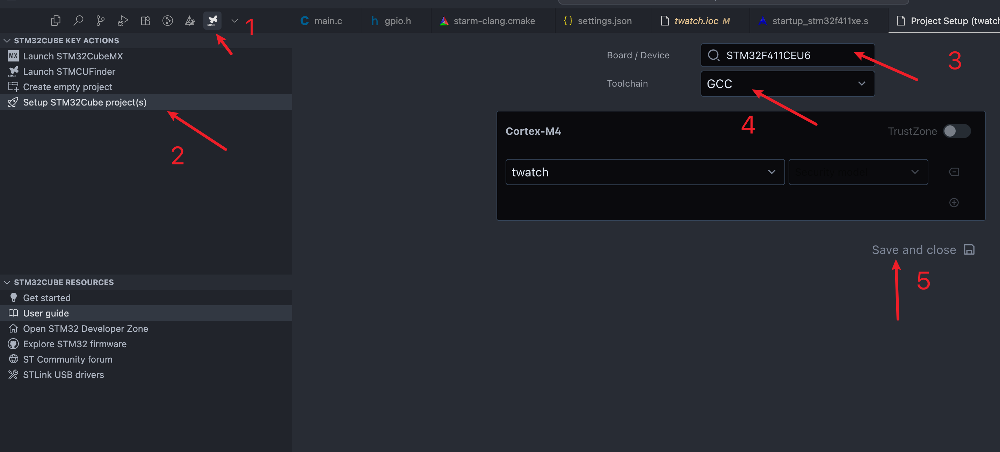
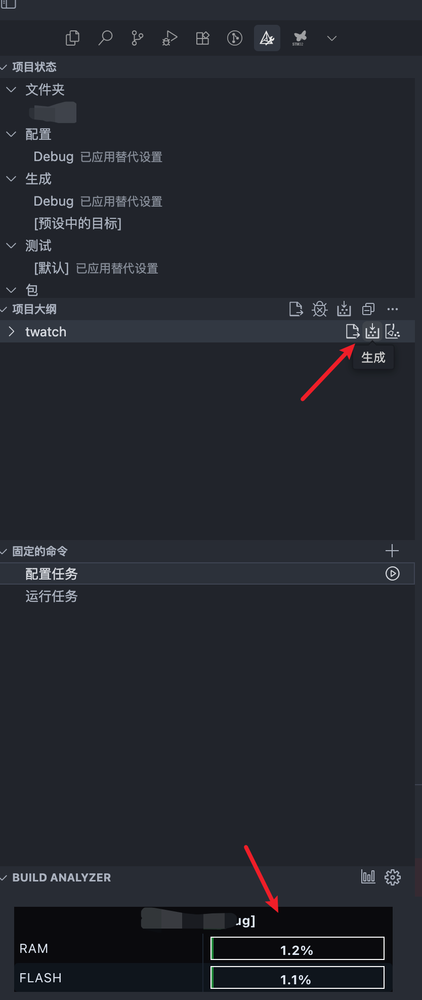

# 环境搭建

## 安装keil

## 安装stm32cubemx

## 安装vscode

## 安装STM32Cube for Visual Studio Code插件包

> c/c++和clangd插件可以卸载或者禁用了

# cubemx新建项目

在生成项目的时候使用cmake生成一遍,再使用MDK-ARM生成一遍!!!!

结束之后用vscode打开工程

重启vscode

编译cmake

同时生成了compile_commands.json,用于实现函数跳转,非常丝滑!!!

再次重启vscode,大功告成.
