## 透查本质

WiFi主要研究的是OSI网络模型的最下面两层：数据链路层(Data link layer)和物理层(Physical layer)。

## WLAN与WiFi

### WLAN（Wireless Local Area Network，无线局域网）

- WLAN是指利用射频(Radio Frequency , RF)技术，使用电磁波并利用无线信道作为传输介质的计算机网络。以此所构成的局域网络，在空中进行通信连接。
- WLAN技术的出现是为了弥补有线网络的不足，以达到网络延伸到目的，实现无网线、无距离限制的通常网络。目前常用的WLAN实现技术有蓝牙、zigbee、WiFi等等。
需要注意的是，目前使用较广的是WLAN技术是WIFI，但是WiFi并不等同于WLAN，它只是WLAN实现技术的一种。

### WiFi（Wireless Fidelity,无线保真）

- WiFi是一个国际无线局域网（WLAN）标准，全称为Wireless Fidelity。
- WiFi基于IEEE802.11协议族，IEEE802.11协议最初发表于1997年，定义了WLAN的MAC层和物理层标准。继802.11协议发表后，又相继推出了802.11a、8021.11b、802.11g、802.11n等。
- WiFi是一个无线网络通信技术的品牌，由WIFI联盟所持有，使用在符合IEEE802.11标准上，目标是改善基于IEEE802.11标准的无线产品之间的互通性。
- 所谓互通性也就是说，不同芯片厂商，产品商的WiFi产品可以基于IEEE802.11标准之下无障碍，流畅的进行通信交互。为了达到这个目的，WiFi联盟（WiFi Alliance，简称WFA）提出市面上流通的WiFi产品需要去他们指定的认证实验室进行认证测试。当然，这些都是收费的。那么是不是也可以不用去？也可以的，但是很多国家和地区会要求在本地售卖的WiFi产品过WFA认证。这也是为了更好的统一各个芯片厂商，使得大家生产出来的产品能够更好的互通互联，目前市场上的产品基本都有WIFI联盟的认证logo。不相信的话可以看看你的设备的，背面是否有如下logo:

### WiFi 发展史

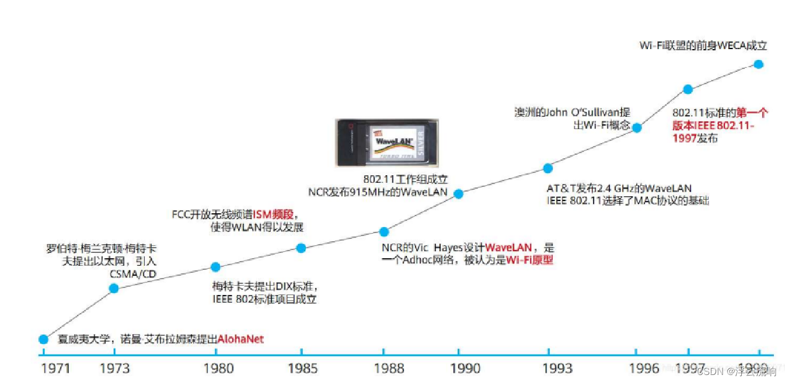

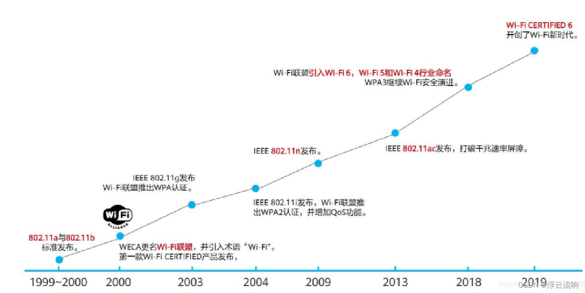

## IEEE 802协议族

IEEE802家族是由一些列局域网(Local area network，简称LAN)技术规范所组成的，802.11是其中之一。IEEE802规范的重心放在OSI模型的最下面两层，因为它们同时涵盖了物理层(physical，简称PHY)与数据链路层（data link）组件。

802系列中的个别规范是由点号后的一位数定义的。例如，802.3是载波监听多路访问/冲突检测（Carrier Multiple Access network with Collision Detection，简称CSMA/CD规范）通常和Ethernet有关。

802.11使用和802.2完全相同的LLC层和802协议中的48位MAC地址，这使得无线和有线之间的桥接非常方便。但是MAC地址只对无线局域网唯一。

只要是802网络，就必然同时具备MAC与PHY两种组件。MAC是一组用以决定如何访问媒介与传送数据的规则，至于传送与接收的细节则交由PHY负责。换而言之，WIFI技术主要研究的是物理层以及数据链路层的东西

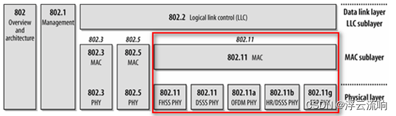

802.11的数据链路层由两个子层构成，逻辑链路层LLC(Logic Link Control)和媒体控制层MAC(Media Access Control)。PHY连接一个数据链路层的设备（MAC）到一个物理媒介，保证数据在物理媒介上传输。常见的物理媒介有：光纤、有线、无线、量子

WiFi技术主要研究数据链路层和物理层，如下图所示。一般情况下，LLC层及以上由软件实现，MAC子层和PHY主要由硬件实现。

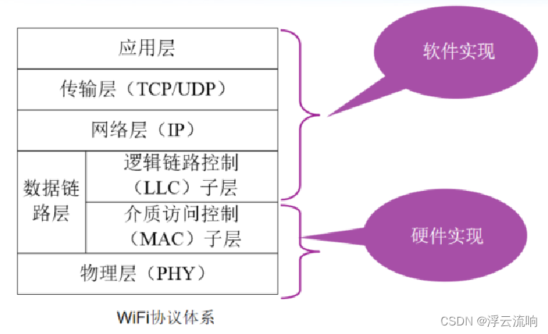

## IEEE 802.11协议族

第一版802.11协议标准在1997年发布后，陆续有很多802.11协议标准也发布出来了。

### 802.11协议族简介

IEEE 802.11协议族定义了无线局网的MAC和PHY层标准，下面总结常见的IEEE 802.11类协议。

IEEE802.11系列常见协议

- 11a: for 5GHz at up to 54 Mb/s
- 11b: for 2.4GHz at up to 11 Mb/s
- 11g: for 2.4GHz at up to 54 Mb/s
- 11n: for 5GHz and 2.4GHz using MIMO at up to 600Mb/s
- 11c: Bridge operation
- 11d: International roaming
- 11e: Quality of Service (QoS)
- 11f: Inter-Access Point Protocol (IAPP)
- 11h: spectrum protection for radar and satellites
- 11i: security
- 11j: for Japan
- 11k: radio resource measurement
- 11p: for vehicular environment
- 11r: fast roaming
- 11s: ESS mesh networking
- 11T: wireless performance prediction
- 11u: interworking with non-802 networks
- 11v: WLAN management
- 11w: protected management
- 11y: 3650-3700 MHz in US
- 11z: Direct Link Setup

将上面提到的协议，整理如下：

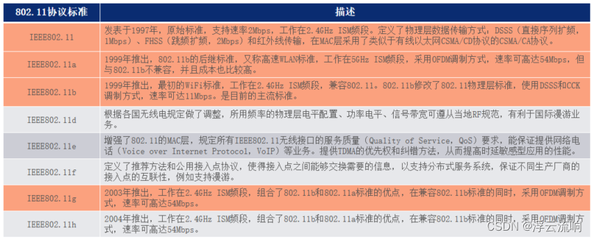

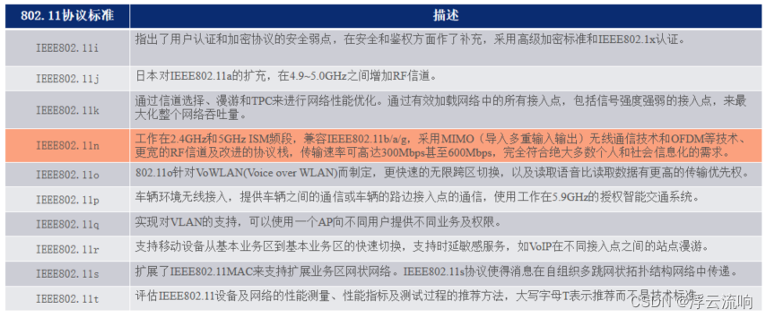

IEEE802.11无线工作组制定的802.11类规范分为两个部分：

1. 802.11 MAC层相关标准：只要是无线网络里面的一些功能的规范，或是具体协议的体现，如QOS、MESH、错误检测、数据帧校验、无线安全标准；

2. 802.11 物理层(PHY)相关标准：主要定义了无线协议的工作频段，调制编码方式及最高速度支持；

对上面提到的协议进一步分类如下：

MAC层(无线网络中的MAC层)：

对无线网络MAC层主要是用来对无线信道的通信媒介进行管理的协议。

- IEEE 802.11d
- IEEE 802.11e
- IEEE 802.11h
- IEEE 802.11i
- IEEE 802.11j
- IEEE 802.11k

物理层(PHY层)：

- IEEE 802.11a
- IEEE 802.11b
- IEEE 802.11g
- IEEE 802.11n

在WiFi技术中，物理层和PHY层用到的主要技术不同：

- 物理层：OFDM、OFDMA、MIMO等
- MAC层：CSMA/CA、RTS/CTS、信道绑定、帧聚合技术、块确认技术等

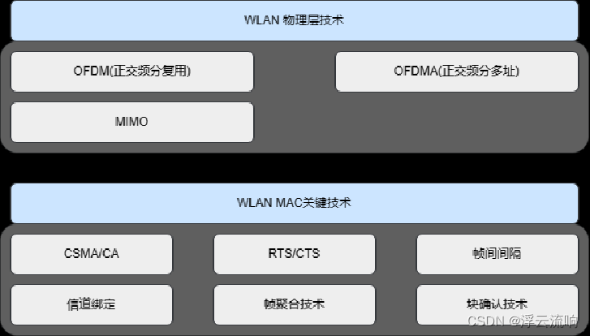

### WiFi 4/5/6

- 2018年，WiFi联盟对不同标准的WiFi协议指定了命名，802.11n被命名为WiFi 4，802.11ac被命名为WiFi 5，802.11ax被命名为WiFi 6,WiFi 4之前不做时代命名。
- 下图给出了不同WiFi标准的介绍，基本上所有的标准都是使用的OFDM技术，唯有WiFi 6差异比较大，它的编码方式、空间流数、信道带宽都异于WiFi 4，WiFi 4是4条空间流，WiFi 6可以做到12条空间流。

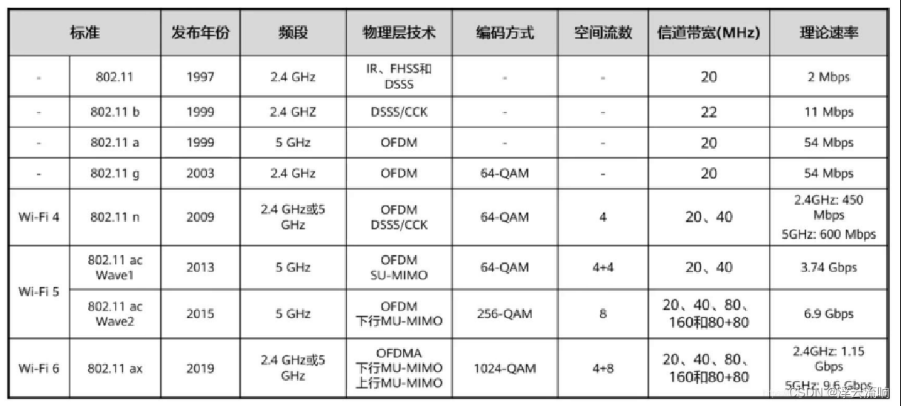

- 随着802.11协议标准的不断迭代，WiFi的传输速度也越来越快。可以看到从OFDM技术引入WiFi后，WiFi的传输速度得到质的提升。下面来简单看一下，OFDM到底是什么。
- OFDM（Orithogonal Frequency Division Multiplexing）即正交频分复用技术，实际上OFDM是MCM(Multi Carrier Modulation)，多载波调制的一种。通过频分复用实现高速串行数据的并行传输，它具有较好的抗多径衰弱能力，能够支持多用户接入。
- OFDM技术由MCM(Multi-Carrier Modulation，多载波调制)发展而来。OFDM技术是多载波传输方案的实现方式之一，它的调制和解调是分别基于IFFT和FFT来实现的，是实现复杂度最低、应用最广的一种多载波传输方案。
- OFDM是一种特殊的多载波技术，其主要思想是将信道分成若干正交子信道，将高速数据信号转换成并行的低速的子数据流，调制到在每个子信道上进行传输。各个子载波相互正交，扩频调制以后可以互相重叠，不但较少子载波间的干扰，还提高了频谱利用率。(即，当一个子载波到达波峰的时候，另一个子载波幅度为0，即两个子载波正交无干扰。)

#### 802.11n的关键技术

在802.11ax（WiFi 6）出来以前，802.11n标准对WiFi技术的推动起到了很大的作用，可以说是WiFi技术迭代中非常重要的一代协议。我们这里简单分析一下，802.11n中使用到的一些关键技术以及它们对WiFi技术的推动作用。

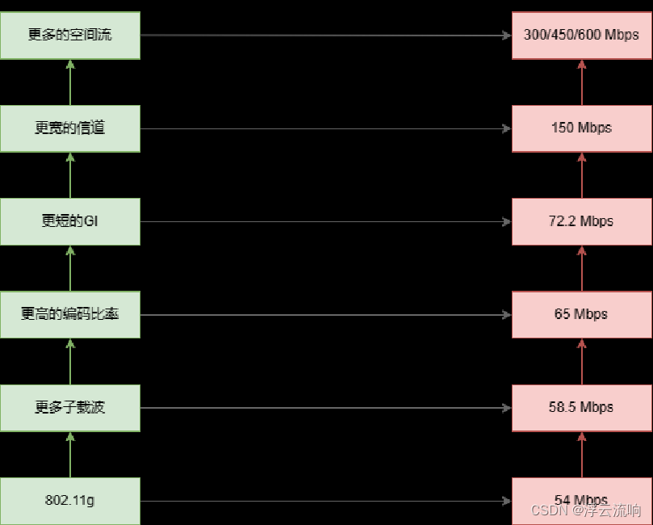

WiFi速率计算

### WiFi通信频率与信道划分

WIFI通信所采用的通信频率，一般是2.4GHZ/5GHZ 。不同信号的信道的频率的划分是不同的。

在2.4G频段，目前WiFi使用的通信频率为2.402GHZ ~ 2.483GHZ，在中国2.4G频段开放了1~13信道。每个信道之间的间隔均为5MHZ，每个信道的有效带宽是22MHZ。但是，实际使用中，有效的带宽是20MHz，其中有2MHz是隔离频带，起保护作用。

相邻信道间有重叠，尽量不要同时使用，以免造成干扰。三个不重叠的信道：1、6、11；2、7、12；3、8、13；

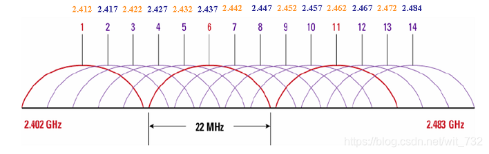

- 不同的标准需要的带宽不同占用的信道数目也不同，802.11b/g需要20MHZ的带宽，因此占用5个信道；80.11n需要40MHZ因此占用9个信道。

- 802.11n在MAC层上进行了一些重要的改进，所以导致网络性能有了很大的提升例如：
因为传输速率在很大的程度上取决于Channel（信道）的ChannelWidth有多宽，而802.11n中采用了一种技术，可以在传输数据的时候将两个信道合并为一个，再进行传输，极大地提高了传输速率（这又称HT-40，high through)

- 另外呢，无线路由器的载波频率是可以调整的，即使两个路由器都是用同一个信道，他们也不会使用相同载波频率，不过相比于不同信道下的设备，同一信道下的路由器相互之间的干扰会更大一些，因此在使用上还是建议错开信道，最好两个设备间隔5个信道使用。

不同国家的信道划分

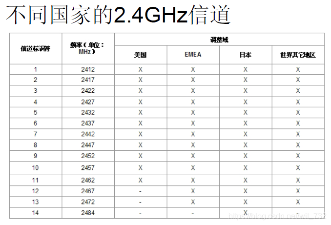

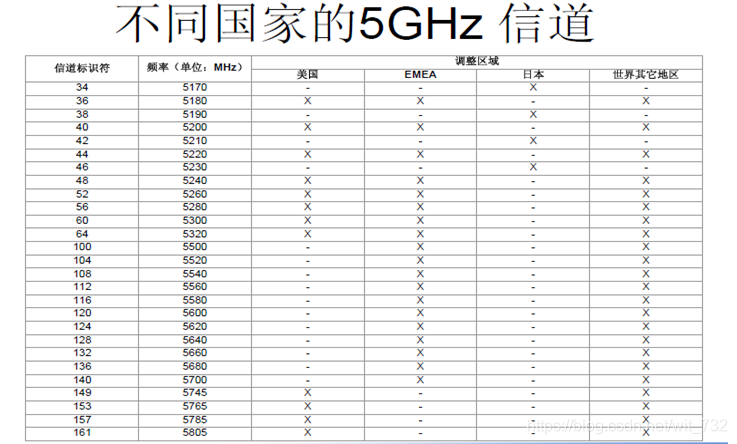

## WiFi基本概念

### 基本WiFi网络框架 - 网络拓扑结构

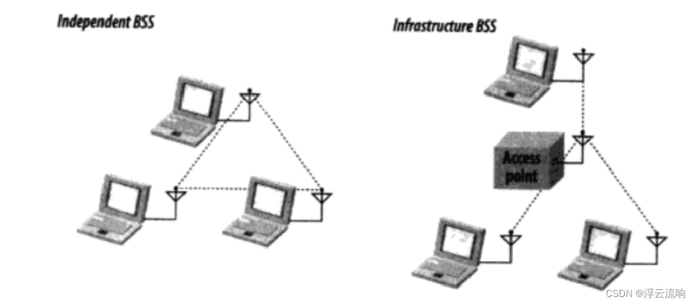

网络拓扑结构-独立网络(Ad-hoc)

- 仅由两个及以上STA组成，网络中不存在AP。
- 各设备自发组网，设备之间是对等的。
- 网络中所有的STA之间都可以直接通信，不需要转发。
- Ad-hoc模式也称为对等模式，允许一组具有无线功能的计算机或移动设备之间为数据共享而迅速建立起无线连接。

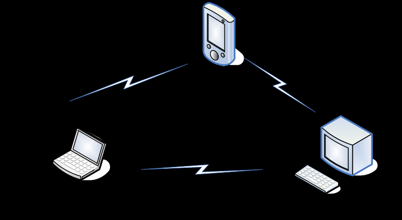

网络拓扑结构-基础网络(Infrastructure)

- 基于AP组建的基础无线网络
- 由AP创建，众多STA加入所组成
- AP是整个网络的中心
- 各STA间不能直接通信，需经AP转发

### 网络拓扑结构

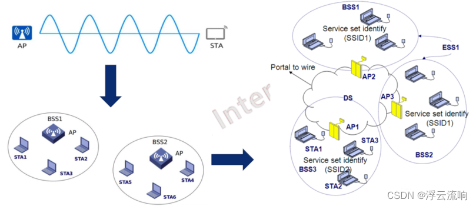

### WiFi常见术语

上面提到了一些我们在WiFi领域常用到的一些英文的缩写，初见肯定会很奇怪。所以这里对WiFi中常见的一下名词进行解释。

#### WM(Wireless Medium，无线媒介)

802.11标准通过无线媒介在STA之间传递帧，多种物理无线媒介中射频(RF , radio frequency)物理层应用最广泛。

#### BSS(Basic Service Set，基础服务集)

##### AP(Access point)

一种特殊的Station，将BSS连接到DS(Distribuition system，分布式系统)。AP位于BSS中心，AP在哪儿，BSS就在哪儿。

##### STA(Station)

无线工作站，任何wireless设备都可以叫STA。比如正在使用无线网络的平板、手机、电脑等。

#### DS(Distribuition system，分布式系统)

称为BSS的分布式网络，BSS解决了一个区域内多个无线终端通信，但终端通信往往分布在各个地方。它的作用是让不同区域的BSS连起来，让终端之间可以相互通信。

#### SSID(Service Set ID，服务集识别码)

相当于无线网络的名称，用于标识一个BSS。作用是便于用户辨识。

#### BSSID(Basic Service Set ID，基础服务集识别码)

唯一标识一个BSS，不同BSS下BSSID不同。BSSID本质是AP的MAC地址。

#### ESS(Extended Service Set，扩展服务集)

采用相同SSID的多个BSS形成的更大规模的虚拟BSS。要求两个BSS接入同一个DS，SSID相同，且BSS区域要有一定的重叠。

#### ESSID(Ectended Service Set ID，扩展服务集标识)

各BSS相同的SSID成了ESS的身份标识，用于对终端通告一个连续的WLAN。

## 802.11通信管理框架

和其他通信方式相似，在进行通信前，通信双方需要进行连接。在进行WiFi通信时也是一样，接下来我们仪器看下WiFi中的连接管理功能。
我将连接管理的流程进行了简化，目的是为了读者更好的理解这些流程。下面给出的一个标准化的WiFi连接管理流程。

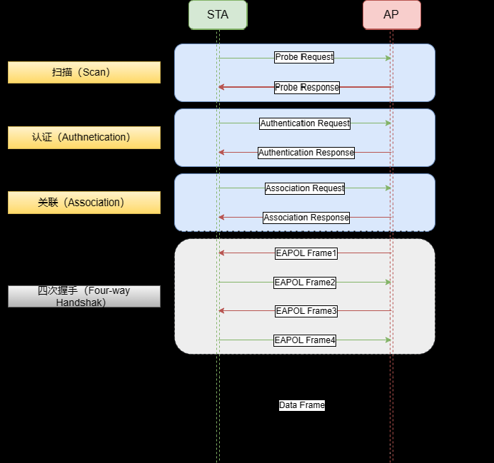

WiFi连接流程主要分为：扫描、认证、关联、四次握手四个步骤，其中四次握手并非必须的步骤。它根据系统的认证方式不同，决定是否进行四次握手这一步骤。一般，前面三步即扫描、认证、关联为WiFi建立连接所必须的步骤。

### 扫描(Scan)

802.11MAC通过使用Scanning功能来完成Discovery,其目的是：

- 寻找一个网络；
- 当STA漫游时寻找一个新的AP；

1. 主动扫描(active scan)
在每一个信道上针对特定的网络发送Probe request报文，从收到的Probe Response中获取BSS的基本信息以及AP的能力集，如BSSID、SSID、支持的速率、加密算法等 ，Probe Response包含的信息和Beacon帧类似的。
优点：速度快
缺点：耗电

2. 被动扫描(passive scan)
通过在每个信道上侦听AP定期发送的Beacon帧来发现网络，Beacon帧中包含的该AP所属的BSS的基本信息以及AP的基本能力级，包括：BSSID、SSID、支持的速率、支持的认证方式，加密算法、Beacon帧发送间隔等。STA在收到对应的Beacon帧后就会进行判断，此AP是否是我们要找的AP以及对应的能力是否匹配以支持连接。
优点：省电
缺点：耗时长

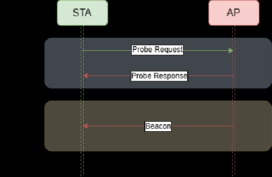

### 认证(Authentication)

在扫描成功完成后，需要进行无线网络的认证，目的是：

防止未授权的STA访问网络，在访问AP之前，需要先进行身份认证。
根据认证的网络类型的不同，又可以分为以下两种：

1. 开放系统认证(Open-System Authentication)
等同于不需要认证，没有任何安全防护能力。允许任何用户加入到无线网络中来。所有请求认证的STA都可以通过认证。类似于我们家里的路由器不设定密码的情况。

   1. STA发送包含station ID(typically the MAC address)的authentication request。
   2. AP回复包含成功或失败的authentication response。

   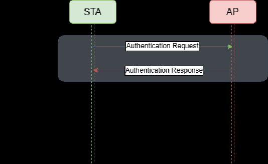

2. 共享密钥认证(Shared－Key Authentication)

AP随机产生一个challenge包（即一个字符串）发送给STA，STA将接收到的字符串拷贝到新的消息中，用密钥加密后再发送给AP。AP接收到该消息后，用密钥将该消息解密，然后对解密后的字符串和最初给STA的字符串进行比较。相同则通过认证，不相同则认证失败。

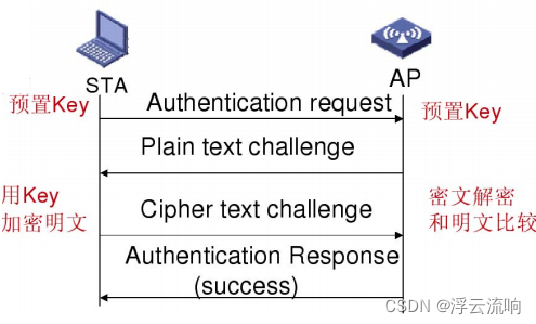

### 关联(Association)

当设备认证流程验证通过后，设备会再发起连接请求以关联AP设备。AP将用户信息添加到数据库，向用户回复关联响应，此过程也常被称为注册。

关联的具体步骤为：

- STA发送Association request帧给到AP，AP检查通过后会回复Association Response给到STA。STA在正确收到AP回复的Association Response后，两个设备就关联上了。

那么此时会根据安全方式的不同，有两种处理方式：

- 如果AP采用的Open-system方式，则到这里STA已经连上AP了。
- 如果AP采用的WPA-PSK/WPA2-PSK/WPA3等加密方式，那么此时设备还无法正常通信。设备还需要进行四次握手，以获取加密密钥。再正确获取加密密钥后，STA才能正常使用WiFi网络。

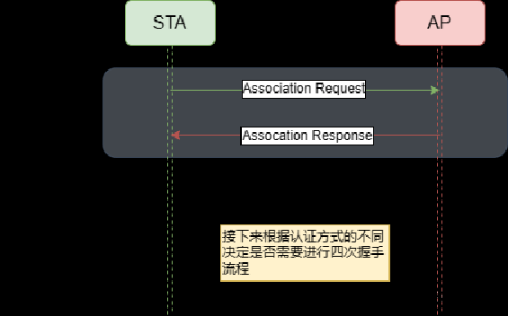

当AP采用WPA-PSK、WPA2-PSK、WPA3等加密方式的情况下，当STA在成功收到AP的Association Response后。会继续进行四次握手流程，以获取用于单播帧加密的PTK，基于组播/广播帧加密的GTK。

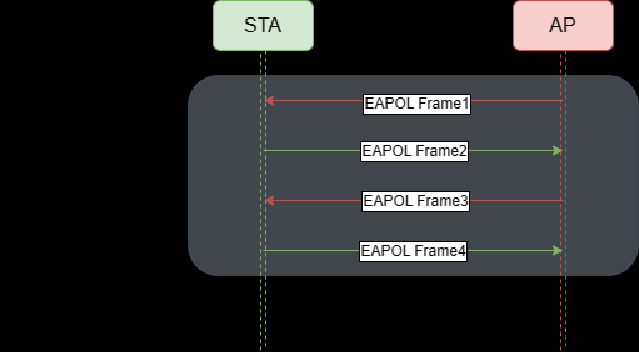

### 四次握手(Four-way handshake)

当AP采用WPA-PSK、WPA2-PSK、WPA3等加密方式的情况下，当STA在成功收到AP的Association Response后。会继续进行四次握手流程，以获取用于单播帧加密的PTK，基于组播/广播帧加密的GTK。

在了解四次握手的具体步骤之前，先介绍一些相关的关键术语：

- PMK（Pairwise Master Key）：由预共享密钥（PSK）和网络名称（SSID）通过哈希函数生成，是生成会话密钥的基础。
- PTK（Pairwise Transient Key）：由 PMK、随机数（ANonce 和 SNonce）以及双方的 MAC 地址通过伪随机函数生成，用于加密单播通信。
- GTK（Group Temporal Key）：用于加密广播和组播通信的密钥，由 AP 生成并分发给所有客户端。
- ANonce / SNonce：分别由 AP 和 STA 生成的随机数，用于生成 PTK，确保每次连接的密钥唯一。
- MIC（Message Integrity Code）：消息完整性校验码，用于验证消息在传输过程中未被篡改

> 四次握手是为了生成一个秘钥

> 小细节：大家有没有发现，重要的 PMK 和 PTK 是不会在数据包中体现的。

- 第一步（AP → STA）：AP 发送包含其生成的随机数 ANonce 的消息给 STA。
- 第二步（STA → AP）：STA 收到 ANonce 后，生成自己的随机数 SNonce，并与 ANonce、PMK、双方的 MAC 地址一起生成 PTK。然后，STA 发送包含 SNonce 和使用 PTK 计算的 MIC 的消息给 AP。
- 第三步（AP → STA）：AP 收到 STA 的响应后，也使用 SNonce、ANonce、PMK 和双方的 MAC 地址生成 PTK，并验证 MIC。如果验证通过，AP 使用 PTK 加密 GTK，并将其发送给 STA，同时指示 STA 安装 PTK 和 GTK。
- 第四步（STA → AP）：STA 收到 GTK 后，安装 PTK 和 GTK，并发送确认消息给 AP，表示密钥安装完成。

## 无线安全

- 与有线网络不同，理论上无线电波范围内的任何一个站点都可以监听并登录无线网络，所有发送或接收的数据、都有可能被截取。
- 为了使授权站点可以访问网络而非法用户无法截取网络通信，无线网络安全就显得至关重要。
- 安全性主要包括访问控制和加密两大部分
- 访问控制：保证只有授权用户才能访问敏感数据。
- 加密：保证只有正确的接收方才能理解数据。

下面是WiFi技术中常见的一些加密方式。

### Wired Equivalent Privacy (WEP)

- WEP是最早的，最常用的，也是最脆弱的安全保证；
- 使用共享秘钥RC4加密算法；
- 有64位密钥和128位密钥两种加密方式；
- 密钥长度最初为40位(5个字符)，后来增加到104位(13个字符)，有些设备可以支持152位加密。创建一个IV与秘钥共同加密数据包；

缺点：

- WEP Key 长度太小；
- WEP不提供自动修改密钥的方法；
- IV 空间太小并且IV 重复使用（平均大约每 5 小时重复一次）；
- 如果不是share认证，即使WEP密码错误，站点端显示的还是连接上，只是不能正常数据通信；

### WPA（Wi-Fi Protected Access，WiFi接入保护）

- 遵循802.11i的草案，在802.11i未完成之前的过渡方案，对WEP的改进；
- WPA 利用TKIP(Temporal Key Integrity Protocol，临时密钥完整性协议) 来代替WEP；
- TKIP 仍用RC4加密算法, 但是每个包的RC4 key是不同的；
- WPA 引入4个新算法；
- 48位初始化向量(IV)，IV顺序规则(IV Sequencing Rules)；
- 每包密钥构建(Per-Packet Key Construction)；
- Michael消息完整性代码Code,MIC以及密钥重获分发；

### WPA2（Wi-Fi Protected Access 2，WiFi接入保护2）

- 基于完整的802.11i标准。
- 采用AES(Advanced Encryption Standard,高级加密协议)加密算法。
- 采用CCMP（Counter Mode with Cipher-Block Chaining Message Authentication Code Protocol，加密块链消息验证码协议的计数器模式）密钥管理协议。
- 支持缓存密钥和预认证。

### WPA3（Wi-Fi Protected Access 3，WiFi接入保护3）

- 基于WPA2全面升级，目前最新也是WiFi最安全的加密方式
- 采用了更加安全的SAE（Simultaneous Authentication of Equals，对等实体同时验证）加密算法
- 使用192位的Suite-B安全套件，相较于WPA2采用的128位密钥长度，该模式将密钥长度增加至192位，进一步提升了密码防御强度。
- 密钥保护：使用更加安全的HMAC-SHA-384算法在四次握手阶段进行密钥导出和确认。

### WPS(Wi-Fi Protected Setup)

类似的称呼：QSS/SES/AOSS/EZ-SETUP。
为解决无线安全设置比较繁琐、专业性强的问题。
如果你足够细心的话应该可以在，应该可以在家里面main路由器上找到标有WPS这个按钮，当然你家的路由器要支持这个功能的haul才可以使用。是不是突然发现这么多年终于知道那个按钮是干嘛了的感觉。

WPS有两种模式：PCB和PIN模式。因为本博客定位于科普，只介绍简单的基本知识。同样的，后面如有时间会更新一篇详细介绍该功能的文章。

关联过程

站点通过WPS协商过程获得AP当前的无线安全设置(SSID，安全模式，密码)

正常接入到BSS。

2种常见的启动WPS协商的方式：

- PIN：在AP上输入站点的PIN码；
- PBC：2分钟内分别按下AP和站点上的按钮(你的STA上面也有该按钮才行)

## 参考链接

[WiFi基本知识总结](https://blog.csdn.net/wit_732/article/details/103772676)
