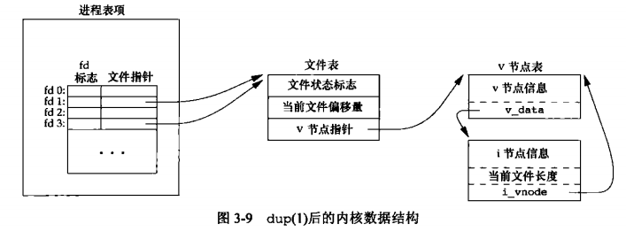

[目录](UNIX环境高级编程)

## 引言

## 文件描述符

## open和openat函数

openat比open多了一个文件描述符参数，主要有两个用途：

- 可以使用相对路径，相对于该描述符指向的目录
- 避免`TOCTTOU`（time-of-check-to-time-of-use）竞态条件，因为它可以保证操作的目录不变

举一个经典的例子：

```c
stat("/tmp/data", &st);      // check：确认 /tmp/data 是普通文件、可写等
fd = open("/tmp/data", O_RDWR);  // use：基于上面的判断进行打开操作
```

此时，如果攻击者在 stat() 和 open() 之间，将 /tmp/data 删除并创建一个同名的符号链接，指向 /etc/passwd，则：

- 程序 错误地认为 打开的仍是原文件
- 实际上做的是向敏感文件写入操作
- 这就导致了 权限提升 或 数据篡改 等安全风险

## creat函数

历史原因，现在open就可以实现了。

## close函数

## lseek函数

lseek可以超过文件大小。而形成空洞。od -c 可以查看。

## read函数

当从终端设备读时，通常一次最多读一行（第18章将介绍如何改变这一点）。

当一信号造成中断，而已经读了部分数据量是。我们将在10.5节进一步讨论此种情况。读操作从文件的当前偏移量出开始，在成功返回之前，该偏移量将增加实际读到的字节数。

## write函数

## I/O的效率

文件系统都有 read ahead 机制。所以buffer size 不需要和块大小一样。

## 文件共享


- 在完成每个write后,在文件表项中的当前文件偏移量即增加所写入的字节数。
如果这导致当前文件偏移量超出了当前文件长度，则将i节点表项中的当前文件长度设置为当前文件偏移量(也就是该文件加长了)。
- 如果用`O_APPEND`标志打开一个文件,则相应标志也被设置到文件表项的文件状态标志中。
每次对这种具有追加写标志的文件执行写操作时，文件表项中的当前文件偏移量首先会被设置为i节点表项中的文件长度。
这就使得每次写入的数据都追加到文件的当前尾端处。

## 原子操作

`O_APPEND` 可以保证偏移和写入是原子。防止出现 "先定位到文件尾端，然后写入" 的情况。

pread 和 pwrite 同理。

## dup和dup2函数

重定向标准 I/O、管理父子进程共享 I/O、构建管道时尤为常用。

复制FD。模型如下。



dup2 会先close fd2。

## sync、fsync和fdatasync函数

系统有缓存。大多数磁盘I/O都通过缓存进行。

sync 只是将所有修改过的快缓冲区排入写队列。然后就返回，他并不等待实际写裁判操作结束。

update 守护进程会周期性调用sync。

fsync 会等待实际写操作结束。对单个fd。

fdatasync 只同步文件数据。不同步文件属性。

## fcntl函数

改变已经打开文件的属性

修改的时候先读取，然后修改，然后写入。

## ioctl函数

## /dev/fd

在较新的linux内核中引入了devfs，即/dev，有点类似/proc，它是一种虚拟文件系统。只是在需要时才动态地生成需要的设备文件，不像以前不管用不用必须先建好一大堆设备文件。/dev/fd/下保存当前进程用到的文件句柄，对于不同的用户，不同的登录终端，不同的进程，使用的文件句柄的指向是不会一样的。

## 小结
