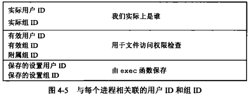
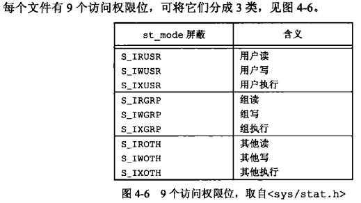
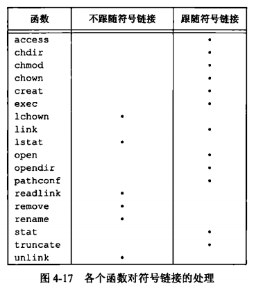
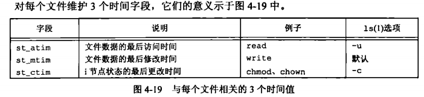

[目录](UNIX环境高级编程)

## 引言

更详细的说明UNIX文件系统的结构以及符号链接

> 很多函数f开头是可以传入fd的。at结尾的函数是传入路径的。

## stat、fstat、fstatat和lstat函数

获取文件信息的接口。

## 文件类型

- 普通文件
- 目录文件
- 字符特殊文件
- FIFO
- 套接字
- 符号链接

## 设置用户ID和设置组ID



通常，有效用户ID等于实际用户ID。有效组ID等于实际组ID。

## 文件访问权限



第一个规则是，我们用名字打开任-类型的文件时，对该名字中包含的每一个目录，包括它可能隐含的当前工作目录都应具有执行权限。这就是为什么对于目录其执行权限位常被称为搜索位的原因。

例如，为了打开文件/usr/include/stdio.h,需要对目录/、/usr和/usr/include具有执行权限。然后，需要具有对文件本身的适当权限，这取决于以何种模式打开它(只读、读-写等)。

如果当前目录是/usr/include,那么为了打开文件stdio.h,需要对当前目录有执行权限。这是隐含当前目录的一个示例。打开stdio.h文件与打开./stdio.h作用相同。

注意，对于目录的读权限和执行权限的意义是不相同的。读权限允许我们读目录，获得在该目录中所有文件名的列表。当-一个目录是我们要访问文件的路径名的一个组成部分时,对该目录的执行权限使我们可通过该目录(也就是搜索该目录，寻找一个特定的文件名)。引用隐含目录的另-一个例子是，如果PATH环境变量(8.10节将对其进行说明)指定了一个我们不具有执行权限的目录，那么shell绝不会在该目录下找到可执行文件。

## 新文件和目录的所有权

新文件的用户ID设置为进程的有限用户ID。

组ID:

- 新文件的组ID可以是进程的有效组ID。
- 新文件的组ID可以是他所在目录的组ID

## access和faccessat函数

## umask函数

用于控制新创建的文件或目录，哪些权限位不会被设置。

例如，umask 为 0022，那么文件权限：0666 & ~0022 = 0644，

## chmod、fchmod和fchmodat函数

## 黏着位

粘滞位在目录上的行为改为以下安全功能：

仅允许下列用户删除或重命名目录中的文件：

- 文件的所有者
- 目录的所有者
- 具有超级用户权限（root）的用户

此机制防止其他用户（即便对目录具有写权限）随意篡改文件

常见 /tmp 权限

## chown、fchown、fchownat和lchown函数

改变文件的用户ID和组ID。

## 文件长度

现今，大多数现代的UNIX系统提供字段st_blksize 和st_blocks.其中，第一个是对文件I/O较合适的块长度，第二个是所分配的实际512字节块块数。到了当我们将st_blksize 用于读操作时，读一个文件所需的时间量最少。为了提高效率，标准IO库也试图一次读、写st_blksize 个字节。

如果存在空洞则，`ls -l`输出的大小会比`du -s`的大很多。因为`ls -l`会统计空洞。

## 文件截断

`truncate` 和 `ftruncate` 函数。

如果文件长度大于文件长度，则文件长度会被截断。如果文件长度小于文件长度，则文件长度将增加。后面填0。

## 文件系统

在不夸文件系统的情况下，mv 只是改变了目录项。

删除文件本质是`unlink`，将目录项的链接数减1。和硬链接的操作是一样的。

新创建的目录，目录项的链接数大于等于2。

1. 有当前目录的 `.`
2. 有父目录指向的 `xx`
3. 还有子目录的 `..`

## link、linkat、unlink、unlinkat和remove函数

```c
// AT_FDCWD 表示当前工作目录
linkat(AT_FDCWD, "file.txt", dfd, "dir/file_link2.txt", AT_SYMLINK_FOLLOW);
```

## rename和renameat函数

如若`newname`已经存在，则调用进程对它需要有写权限(如同删除情况一样)。另外，调用进程将删除`oldname`目录项，并可能要创建`newname`目录项，所以它需要对包含`oldname`及包含`newname`的目录具有写和执行权限。

## 符号链接

引入符号链接的原因是避开硬链接的限制。

- 硬链接通常要求链接和文件位于同一文件系统中。
- 只有超级用户才能创建硬链接。



## 创建和读取符号链接

`symlink` 和 `symlinkat` 函数。

因为`open`跟随符号链接，所以需要有一种方法打开该链接本身。

`readlink` 和 `readlinkat` 函数。这两个函数组合了`open`和`read`,`close`。

## 文件的时间



## futimens、utimensat和utimes函数

修改文件的访问时间（atime）和修改时间（mtime）。

## mkdir、mkdirat和rmdir函数

## 读目录

| 函数            | 功能                   |
| ------------- | -------------------- |
| `opendir()`   | 打开目录，返回 `DIR *`      |
| `fdopendir()` | 用 fd 创建目录流           |
| `readdir()`   | 读取下一个目录项             |
| `rewinddir()` | 重置目录流到开头             |
| `closedir()`  | 关闭目录流                |
| `telldir()`   | 获取当前位置标记             |
| `seekdir()`   | 移动到某个 `telldir()` 位置 |

## chdir、fchdir和getcwd函数

操作当前工作目录

| 函数       | 功能             |
| -------- | -------------- |
| `chdir`  | 切换当前工作目录（通过路径） |
| `fchdir` | 切换当前工作目录（通过fd） |
| `getcwd` | 获取当前工作目录的绝对路径  |

## 设备特殊文件

## 文件访问权限位小结

## 小结
