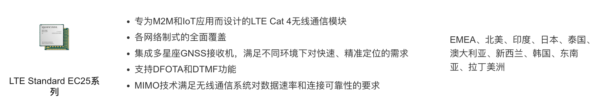
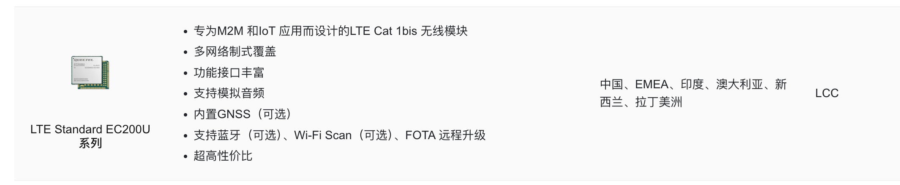

## 两个主要模块

EC25

- 多星座GNSS接收机



EC200U(降本款)


## 名词解释

DFOTA：Device Firmware Over-The-Air，用于远程升级终端设备的固件。

DTMF：Dual Tone Multi Frequency，双音多频信号，用于电话按键音的信令传输。

## USB接口说明

| 接口号 | 接口名称 | 描述 |
| ------ | -------- | ---- |
| 0      | 移动诊断接口 | 诊断端口 |
| 1      | NMEA 接口 | 用于输出 GPS NMEA 语句 |
| 2      | AT 接口 | 用于 AT 命令传输 |
| 3      | Modem 接口 | 用于 PPP 连接和 AT 命令传输 |
| 4      | USB 网络接口 | 用于网络驱动 |
| 5      | ADB 接口 | 安卓调试桥 |
| 6      | Audio 控制接口 | 用于控制语音 |
| 7      | 麦克风接口 | 用于麦克风 |
| 8      | 扬声器接口 | 用于扬声器 |

> 接口 6、7、8 默认不显示，可通过 AT+QCFG="usbcfg"打开。

## EC25

### 查看设备

2c7c是移远通信的厂商ID

0125是EC25的设备ID

```bash
lsusb 
Bus 001 Device 001: ID 1d6b:0002
Bus 001 Device 004: ID 2c7c:0125 # EC25
```

```bash
ls -la /dev/ttyUSB*
crw-rw----    1 0        root      188,   0 Aug  5 12:37 /dev/ttyUSB0
crw-rw----    1 0        root      188,   1 Aug  5 07:59 /dev/ttyUSB1
crw-rw----    1 0        root      188,   2 Aug  5 12:37 /dev/ttyUSB2
crw-rw----    1 0        root      188,   3 Aug  5 07:59 /dev/ttyUSB3
```

## 链接

[移远4G模块调试笔记](https://blog.csdn.net/hebbely/article/details/126545172)

[移远4G产品列表](https://www.quectel.com.cn/product-category/4g-modules-cn)
