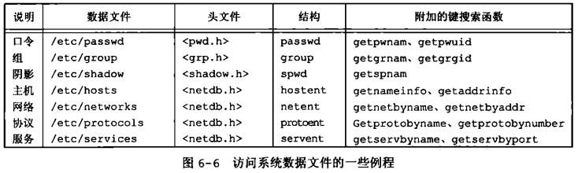
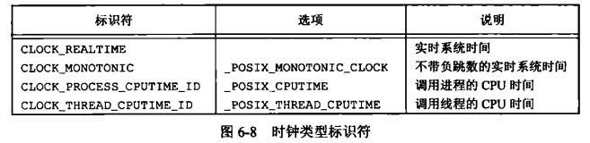
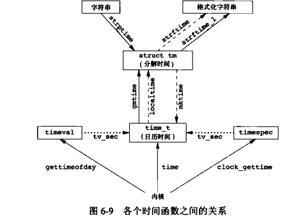

[目录](UNIX环境高级编程)

## 引言

## 口令文件

提供了一些函数

## 阴影口令

其实就是加密口令

## 组文件

提供了一些函数

## 附属组ID

提供了一些函数

## 实现区别

## 其他数据文件



## 登录账户记录

## 系统标识

`uname` `gethostname`

## 时间和日期例程

都用 `clock_gettime` `clock_settime`

`clock_getres` 获取时钟的分辨率





```c
struct tm *gmtime(const time_t *timep); // 格林威治时间
struct tm *localtime(const time_t *timep); // 本地时间
time_t mktime(struct tm *tm); // 将tm结构体转换为时间戳

```

格式化时间

```c
char *strftime(char *s, size_t max, const char *format, const struct tm *tm);
char *strftime_l(char *s, size_t max, const char *format, const struct tm *tm, locale_t locale);
```

字符串时间分解

```c
struct tm *strptime(const char *s, const char *fmt, struct tm *tm);
```

## 小结
