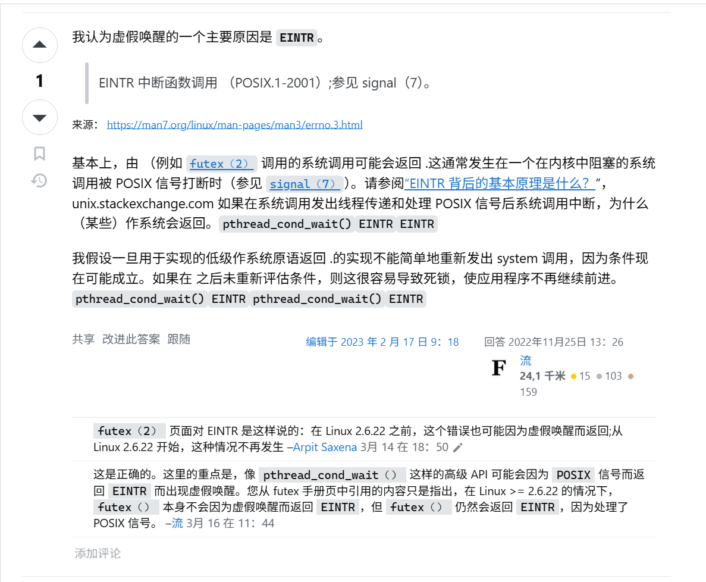

## 为什么会出现虚假唤醒

> pthread_cond_broadcast 是全部唤醒，pthread_cond_signal 是随机唤醒一个。

In computing, a spurious wakeup occurs when a thread wakes up from waiting on a condition variable and finds that the condition is still unsatisfied. It is referred to as spurious because the thread has seemingly been awoken for no reason. Spurious wakeups usually happen because in between the time when the condition variable was signaled and when the awakened thread was finally able to run, another thread ran first and changed the condition again. In general, if multiple threads are awakened, the first one to run will find the condition satisfied, but the others may find the condition unsatisfied. In this way, there is a race condition between all the awakened threads. The first thread to run will win the race and find the condition satisfied, while the other threads will lose the race, and experience a spurious wakeup.

译文

在计算中，当线程从等待条件变量中唤醒并发现条件仍然未满足时，就会发生虚假唤醒。它被称为虚假的，因为线程似乎无缘无故地被唤醒了。虚假唤醒的发生通常是因为在条件变量发出信号和被唤醒线程最终能够运行之间，另一个线程先运行并再次更改了条件。通常，如果唤醒多个线程，第一个运行的线程会发现条件满足，但其他线程可能会发现条件不满足。

维基百科的这句话描述的很清楚。应该算是一种同步语义所引起的问题。

## 如何避免虚假唤醒

你的判断条件从if改成while就可以避免了。

## 一些思考

在 kernel <= 2.6.22，还会因为`EINTR`错误返回，导致虚假唤醒。

## 参考链接

[为什么条件锁会产生虚假唤醒现象](https://www.zhihu.com/question/271521213)

[为什么pthread_cond_wait会有虚假唤醒现象](https://stackoverflow.com/questions/8594591/why-does-pthread-cond-wait-have-spurious-wakeups)

[什么是虚假唤醒？为什么会产生虚假唤醒？](https://blog.csdn.net/weixin_45668482/article/details/117373700)

[为什么虚假唤醒是bug？](https://softwareengineering.stackexchange.com/questions/186842/spurious-wakeups-explanation-sounds-like-a-bug-that-just-isnt-worth-fixing-is)

[维基百科解释](https://en.m.wikipedia.org/wiki/Spurious_wakeup)
