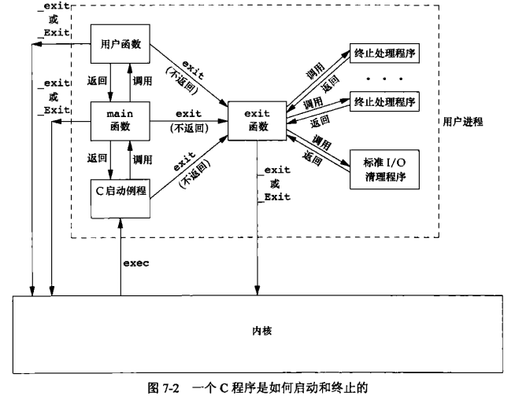
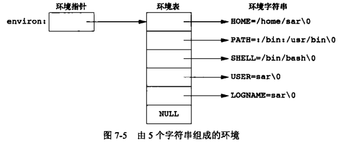
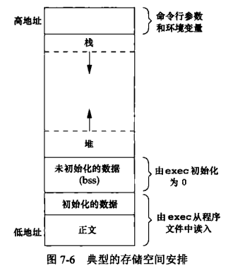

[目录](UNIX环境高级编程)

## 引言

## main函数

在调用main函数之前，会调用一个特殊的启动例程。启动例程从内核取得命令行参数和环境变量值。

## 进程终止

一共8种方式，5种正常终止，三种异常终止。

1. 从main函数返回
2. 调用exit函数
3. 调用_exit或_Exit函数
4. 最后一个线程从启动例程返回
5. 从最后一个线程调用pthread_exit
异常终止
6. 调用abort函数
7. 接到一个信号
8. 最后一个线程对取消请求作出响应

### 退出函数

```c
#include <stdlib.h>

void exit(int status);
void _Exit(int status);

#include <unistd.h>
void _exit(int status);

```

| 函数              | 调用 atexit() | 刷新 I/O 缓冲 | 调用 `_exit()` | 退出快速 | 适用情况                |
| --------------- | ----------- | --------- | ------------ | ---- | ------------------- |
| `exit(status)`  | ✅           | ✅         | ✅            | ✖    | 程序正常退出，需清理资源        |
| `_exit(status)` | ❌           | ❌         | —            | ✅    | child 回收路径，紧急退出     |
| `_Exit(status)` | ❌           | ❌         | —            | ✅    | 等同 `_exit()`，C 标准推荐 |

### 函数atexit

一个进程可以登记最多32个函数，这些函数将在进程终止时由`exit`调用。

```c
#include <stdlib.h>

int atexit(void (*function)(void));
```

**exit调用这些函数时，会以登记的相反顺序调用它们。同一函数被登记多次，也会被调用多次。**

如若程序调用`exec`函数族中的任一函数。则将清除所有已安装的终止处理程序。



## 命令行参数

当执行一个程序时，调用`exec`的进程可将命令行参数传递给新程序。

## 环境表



> **程序运行后修改全局环境不影响当前运行的进程**,**当前程序修改环境也不会影响全局或其父进程环境**

## C程序的存储空间布局

C程序构成（由低地址到高地址）

- 正文段
- 初始化数据段
- 未初始化数据段（BSS）
- 堆
- 栈
- 命令行参数和环境变量
- 内核



bss段如何使用的

``` css
源代码 int a[100];  
  ↓  
编译 → 添加 400 字节 “未初始化” 信息到 .bss 节  
  ↓  
链接 → .bss 被定义为 SHT_NOBITS，文件里不会写入数据  
  ↓  
加载 → loader 分配 400 字节内存，并置零  
```

> 一个a.out中还有若干其他类型的段，如包含符号表的段、包含调试信息的段以及包含动态共享库链接表的段等。这些部分并不装载到进程执行的程序映像中。

## 共享库

共享库会在程序运行的时候加载进来。如果已经用了，则不会加载。

## 存储空间分配

这部分比较熟了。先不写

## 环境变量

```c
#include <stdlib.h>

char *getenv(const char *name);
int putenv(const char *string);
int setenv(const char *name, const char *value, int overwrite);
int unsetenv(const char *name);

```

- `putenv`取形式为name=value的字符串，将其放到环境表中。如果name已经存在，则先删除其原来的定义。
- `setenv`将name设置为value。如果在环境中name已经存在，那么(a) 若rewrite非0,则首先删除其现有的定义;(b) 若rewrite为0,则不删除其现有定义(name不设置为新的value,而且也不出错)。
- `unsetenv`删除name的定义。

> 注意，`putenv`和`setenv`之间的差别。`setenv`必须分配存储空间，以便依据其参数创建name=value字符串。`putenv`可以自由地将传递给它的参数字符串直接放到环境中。确实,许多实现就是这么做的，因此，将存放在栈中的字符串作为参数传递给`putenv`就会发生错误，其原因是，从当前函数返回时，其栈帧占用的存储区可能将被重用。

1. 如果修改一个现有的name:
   1. 如果新value的长度少于或等于现有value的长度，则只要将新字符串复制到原字符串所用的空间中:
   2. 如果新value的长度大于原长度，则必须调用malloc为新字符串分配空间，然后将新字符串复制到该空间中，接着使环境表中针对name的指针指向新分配区。
2. 如果要增加一个新的name,则操作就更加复杂。首先，必须调用malloc为name=value字符串分配空间，然后将该字符串复制到此空间中。
   1. 如果这是第一次增加一个新name,则必须调用malloc为新的指针表分配空间。接着将原来的环境表复制到新分配区，并将指向新name=value字符串的指针存放在该指针表的表尾，然后又将一个空指针存放在其后。最后使environ指向新指针表。再看一下图,如果原来的环境表位于栈顶之上(这是-种常见情况),那么必须将此表移至堆中。但是，此表中的大多数指针仍指向栈顶之上的各name=value字符串。
   2. 如果这不是第一次增加一个新name,则可知以前已调用malloc在堆中为环境表分配了空间，所以只要调用realloc,以分配比原空间多存放一个指针的空间。然后将指向新name=value字符串的指针存放在该表表尾，后面跟着一个空指针。

## setjmp和longjmp函数

`goto` 不能跨越函数。而`setjmp`和`longjmp`可以跨越函数。

## getrlimit和setrlimit函数

```c
#include <sys/resource.h>

int getrlimit(int resource, struct rlimit *rlim);
int setrlimit(int resource, const struct rlimit *rlim);

```

遵循三条规则：

1. 任何一个进程都可将一个软限制值更改为小于或等于其硬限制值。
2. 任何一个进程都可将一个硬限制值更改为大于或等于其软限制值。
3. 只有超级用户可以提高任何资源的硬限制值。

``` txt
#ulimit -a
core file size          (blocks, -c) 0
data seg size           (kbytes, -d) unlimited
scheduling priority             (-e) 0
file size               (blocks, -f) unlimited
pending signals                 (-i) 126784
max locked memory       (kbytes, -l) 65536
max memory size         (kbytes, -m) unlimited
open files                      (-n) 1048576
pipe size            (512 bytes, -p) 8
POSIX message queues     (bytes, -q) 819200
real-time priority              (-r) 0
stack size              (kbytes, -s) 8192
cpu time               (seconds, -t) unlimited
max user processes              (-u) 126784
virtual memory          (kbytes, -v) unlimited
file locks                      (-x) unlimited
```

## 小结
